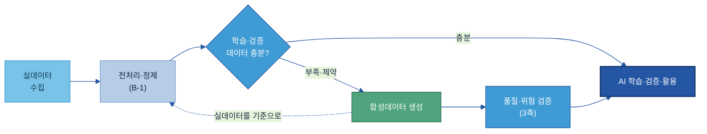
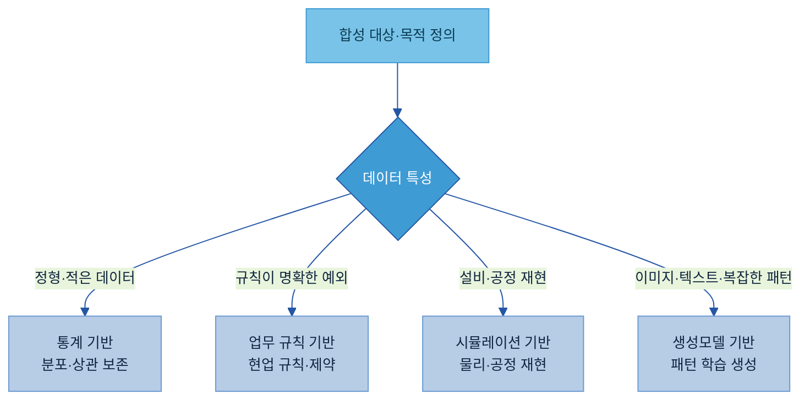
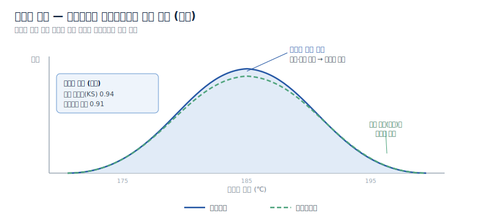
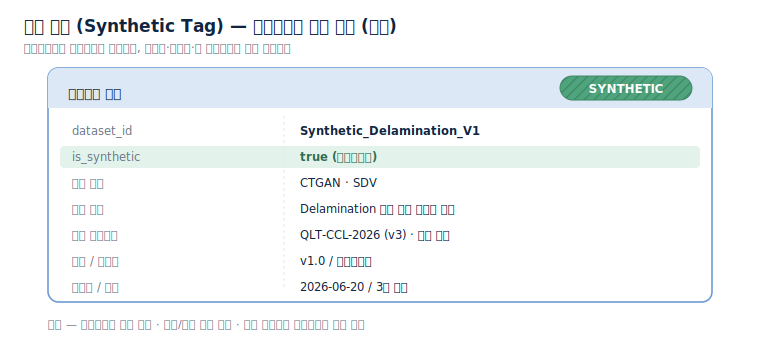
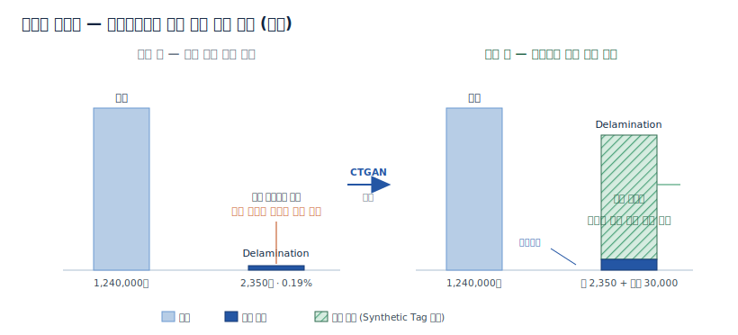
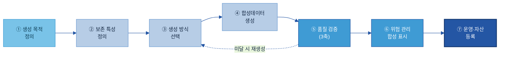
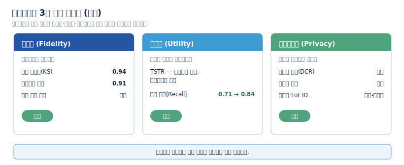
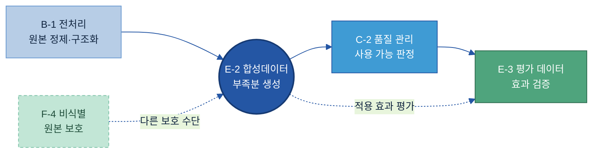

# E-2. 합성데이터(Synthetic Data) 매뉴얼

> 정의: 합성데이터란 실데이터가 부족하거나 보안으로 활용하기 어려울 때, 실데이터의 분포·관계·업무 규칙을 반영하여 AI 학습·검증용으로 인공 생성한 데이터다.

---

## 목차

1. [Why — 왜, 언제 합성하나 (적용 판단)](#why)
    - [1.1 데이터 부족의 구조적 유형](#s11)
    - [1.2 보안·규제 맥락](#s12)
    - [1.3 기대 효과](#s13)
    - [1.4 적용 판단 — 부족·제약이 있을 때만](#kq1)
    - [1.5 비교 기준이 될 실데이터 먼저 확보](#s15)
2. [What — 무엇인가·무엇을 갖추나](#what)
    - [2.1 합성데이터란 + 체계 내 위치](#s21)
    - [2.2 무엇을 합성하나](#kq2)
    - [2.3 어떻게 만드나 — 생성 방식 네 가지](#kq3)
    - [2.4 검증 항목과 합성 표시](#kq4)
3. [예시 시나리오 (한눈에)](#ex)
    - [3.1 적용 전 / 후](#s31)
    - [3.2 흐름 미리보기](#s32)
4. [Tech Stack — 솔루션 검토](#tech)
    - [4.1 솔루션 유형 및 기능 비교](#s41)
    - [4.2 선정 기준과 생성 방식 선택](#s42)
5. [How — 어떻게 만들고 운영하나](#how)
    - [5.1 만드는 절차 — 합성데이터 구축 7단계](#s51)
    - [5.2 End-to-End 사례 (CCL Delamination)](#s52)
    - [5.3 운영과 위험 관리](#kq5)
6. [Where — 다른 주제와의 관계](#where)
    - [6.1 경계](#s61)

- [별첨 (Appendix)](#별첨-appendix) · [참고자료 (References)](#참고자료-references) · [변경 이력 / 피드백 반영](#변경-이력--피드백-반영)

---

> **예시 표기 안내:** 본 가이드의 표·다이어그램·그림에 나오는 구체 값(불량률·건수·온도·Recall·Lot 번호 등)은 이해를 돕기 위한 가상 예시이며 실제 데이터가 아니다. 실제 값은 PoC·프로젝트에서 확정한다. 계열사명도 적용 맥락 설명용이다.

> **관련 가이드:** [B-1 데이터 전처리](../B-1%20데이터%20전처리/B-1%20데이터%20전처리.md) · [B-2 데이터 해설·주석](../B-2%20데이터%20해설·주석/B-2%20데이터%20해설·주석.md) · [A-2 메타데이터](../A-2%20메타데이터/A-2%20메타데이터.md) · C-2 데이터 품질 관리 · E-3 AI 평가 데이터 · F-4 AI 데이터 권한·비식별

이 가이드는 합성데이터를 언제 만들고(1장), 무엇을 어떻게 갖추며(2장), 적용하면 무엇이 달라지고(3장), 어떤 솔루션으로(4장), 실제로 어떻게 만들어 운영하는지(5장), 인접 주제와 어떻게 구분되는지(6장)를 다룬다. 본 가이드가 일관되게 강조하는 내용은 다음과 같다. 합성데이터는 실데이터를 보완하는 수단이며, 생성 자체보다 실데이터와의 유사성을 검증하고 합성 여부를 표시하여 관리하는 과정이 핵심에 해당한다.

---

<a id="why"></a>

## 1. Why — 왜, 언제 합성하나 (적용 판단)

실데이터는 AI 학습과 검증에서 가장 중요한 자산이다. 그러나 제조 현장에서는 필요한 데이터를 충분히 확보하지 못하거나, 확보하더라도 보안·규제로 활용에 제약이 발생하는 경우가 자주 있다. 합성데이터는 실데이터만으로 확보하기 어려운 영역을 보완하여 AI 활용 범위를 확장한다.

합성데이터는 모든 AI 과제에 적용하는 기법이 아니라, 실데이터가 부족하거나 원본을 쓰기 어려운 경우에만 검토한다. 이 장은 먼저 데이터 부족이 어떤 형태로 나타나는지(1.1·1.2)와 그것을 보완했을 때 얻는 효과(1.3)를 살펴보고, 적용 여부 판단(1.4)과 생성 전 전제(1.5)로 이어진다.

<a id="s11"></a>

### 1.1 데이터 부족의 구조적 유형

AI 과제에서 데이터 부족은 전체 규모가 작은 경우만을 뜻하지 않는다. 총량은 충분하지만 특정 사례나 특정 조건의 데이터만 비어 있는 경우가 더 많다. 제조 현장에서 반복되는 부족 유형은 다음과 같다.

| 부족 유형 | 상세 | 예시 |
|---|---|---|
| 희귀 이벤트 | 발생 빈도가 매우 낮아 사례가 거의 없음 | Delamination, 설비 장애 |
| 데이터 불균형 | 특정 클래스 비중이 극단적으로 낮음 | 정상 99.8% / 불량 0.2% |
| 신규 제품 | 운영 이력이 짧아 데이터가 쌓이지 않음 | 신규 소재, 신규 제품 |
| 신규 설비 | 과거 데이터 자체가 없음 | 신규 생산라인 |
| 극한 상황 | 실제로 재현하기 어렵거나 위험함 | 비상 정지, 안전사고 |

예를 들어 두산전자 CCL(동박적층판) 라인의 Delamination(층간 박리성 결함)이 전체 생산량의 0.1~0.3% 수준이라면, 수십만 건의 생산 이력이 있어도 학습에 활용할 불량 사례는 매우 제한된다. 전체 데이터는 존재하지만 학습에 필요한 사례가 부족한 상태이며, 합성데이터는 이러한 부족 영역을 보완한다.

<a id="s12"></a>

### 1.2 보안·규제 맥락

실데이터에는 개인정보, 고객 정보, 계약 정보, 설비 운영 정보 같은 민감정보가 섞여 있다. 이런 데이터는 개인정보 보호 규정이나 기업 보안 정책 때문에 외부 활용이 제한되거나 공유 자체가 어렵다. 합성데이터는 원본의 통계적 특성을 유지하면서 개인정보·기밀정보 노출 위험을 낮춘 형태로 데이터를 제공해, 다음과 같은 상황에서 활용한다.

- 외부 협력사·연구기관과의 공동 개발 및 데이터 공유
- 개발·테스트 환경 구축용 데이터 확보
- 사외 반출이 제한된 데이터의 분석 검토

다만 합성데이터가 재식별 위험을 완전히 없애지는 못한다. 원본과 지나치게 닮으면 민감정보가 역추론될 수 있으므로, 보안 목적의 합성에는 별도의 재식별 위험 평가가 따라야 한다(위험 관리는 [5.3](#kq5)).

<a id="s13"></a>

### 1.3 기대 효과

합성데이터를 적용하면 실데이터만으로 풀기 어려운 데이터 확보 문제를 보완할 수 있다. 대표적인 효과는 다음과 같다.

| 기대 효과 | 상세 |
|---|---|
| 희소 사례 확보 | 부족한 불량·장애 사례를 보완해 학습 가능 수준으로 |
| 데이터 불균형 개선 | 정상에 치우친 학습을 균형 있게 교정 |
| 검증 범위 확대 | 실제로 만들기 어려운 예외·극한 시나리오까지 검증 |
| 안전한 데이터 활용 | 개인정보·기밀정보 노출 위험을 낮춰 공유·개발에 활용 |
| 데이터 확보 기간 단축 | 추가 수집을 기다리지 않고 검증용 데이터를 빠르게 확보 |

효과는 생성 규모가 아니라 실제 활용 결과로 평가한다. 합성데이터를 얼마나 많이 만들었는지보다, 모델 성능이 개선되었는지와 검증이 충분해졌는지가 판단 기준이다.

<a id="kq1"></a>

### 1.4 적용 판단 — 부족·제약이 있을 때만

합성데이터 적용은 생성 기술이 아니라 데이터 확보 관점에서 판단한다. 다음 상황 중 하나 이상에 해당하면 적용을 검토한다.

| 적용을 검토하는 상황 | 상세 | 예시 |
|---|---|---|
| 희귀 이벤트 | 발생 빈도가 매우 낮음 | Delamination, 설비 장애 |
| 데이터 불균형 | 특정 클래스가 부족함 | 정상 99.8% / 불량 0.2% |
| 신규 제품·설비 | 운영 이력·과거 데이터 부족 | 신규 소재, 신규 라인 |
| 보안 제약 | 원본 활용이 제한됨 | 고객·인사·계약 데이터 |
| 테스트 데이터 부족 | 실제 재현이 어려움 | 비상 정지, 안전사고 |

반대로 다음 조건을 대부분 만족하면 합성데이터가 필요하지 않다. 실데이터를 우선 쓰는 것이 원칙이다.

| 합성이 불필요한 조건 | 상세 |
|---|---|
| 충분한 실데이터 | 학습·검증에 필요한 데이터를 이미 확보 |
| 보안 제약 없음 | 개인정보·기밀정보 문제가 없음 |
| 추가 수집 가능 | 데이터 확보 비용이 크지 않음 |
| 검증 환경 확보 | 실제 운영 환경에서 테스트 가능 |

<a id="s15"></a>

### 1.5 비교 기준이 될 실데이터 먼저 확보

합성데이터는 항상 실데이터를 기준으로 생성된다. 따라서 생성 전에 비교 기준이 될 실데이터를 먼저 확보해야 한다. 기준 실데이터가 부족하거나 품질이 낮으면 합성데이터도 같은 문제를 그대로 반영한다. 합성데이터의 품질은 생성 방식보다 기준 데이터의 품질에 더 크게 좌우되므로, 실데이터 품질 확보가 선행되어야 한다. 생성 전에 최소한 다음을 점검한다.

| 점검 항목 | 확인 내용 |
|---|---|
| 데이터 규모 | 분포를 학습할 최소 데이터를 확보했는가 |
| 품질 수준 | 결측치·오류·중복이 정리됐는가 |
| 대표성 | 실제 운영 환경을 반영하는가 |
| 최신성 | 현재 운영 조건과 일치하는가 |

원본 데이터를 AI가 읽을 수 있는 형태로 정제·구조화하는 일은 [B-1 데이터 전처리](../B-1%20데이터%20전처리/B-1%20데이터%20전처리.md)가, 그 데이터가 사용 가능한 품질인지 판정하는 일은 C-2 데이터 품질 관리가 맡는다.

---

<a id="what"></a>

## 2. What — 무엇인가·무엇을 갖추나

합성데이터 체계는 세 가지 구성요소로 이루어진다. 무엇을 합성할지, 어떤 방식으로 생성할지, 생성 결과를 어떻게 검증하고 표시할지다. 생성 도구 하나만으로는 충분하지 않으며, 이 세 가지를 함께 정의해야 실제 AI 활용으로 이어진다.

```text
무엇을 합성하나   →   어떻게 만드나   →   어떻게 검증·표시하나
(대상·목적)          (생성 방식 4가지)     (3축 검증 + Synthetic Tag)
```

각 구성요소의 설계 절차와 실제 수행은 [5장 How](#how)에서 다루고, 이 장은 무엇으로 이루어지는지와 각 요소의 역할을 정의한다.

<a id="s21"></a>

### 2.1 합성데이터란 + 체계 내 위치

합성데이터는 실데이터를 직접 복제하지 않고, 원본의 통계적 분포·변수 간 관계·업무 규칙·시계열 패턴을 반영하여 인공적으로 생성한 데이터다. 목적은 실데이터의 부족분을 보완하는 데 있다. 실데이터가 충분하고 활용에 제약이 없으면 실데이터를 우선 활용하고, 데이터 부족·불균형·보안 제약이 있을 때 해당 영역을 합성데이터로 보완한다.

AI-ready Data 체계에서 합성데이터는 데이터 확보 영역에 위치한다. 실데이터를 수집·전처리·품질 검증한 뒤에도 학습·검증 데이터가 부족하면, 합성데이터로 부족한 영역을 보완하여 AI 활용 단계로 전달한다. 합성데이터 역시 생성 이후 품질 검증과 위험 평가를 거쳐야 활용 여부가 결정된다.



이 가이드는 부족한 데이터를 새로 만드는 일까지를 책임 범위로 둔다. 원본 정제(B-1), 사용 가능 여부 판정(C-2), 학습용 정답 라벨 부여([B-2 데이터 해설·주석](../B-2%20데이터%20해설·주석/B-2%20데이터%20해설·주석.md)), 모델 성능 평가(E-3) 같은 인접 활동과의 경계는 [6장](#where)에서 정리한다.

<a id="kq2"></a>

### 2.2 무엇을 합성하나

합성데이터는 모든 데이터를 대상으로 만들지 않는다. 실데이터 확보가 어렵거나, 발생 빈도가 매우 낮거나, 보안상 활용에 제약이 있는 데이터를 우선 대상으로 한다. 적용 대상은 데이터 유형보다 "왜 부족한가"를 기준으로 고른다.

| 합성 대상 | 상세 | 예시 |
|---|---|---|
| 희귀 불량 | 발생 빈도가 매우 낮은 품질 문제 | Delamination, Wicking |
| 설비 장애 | 실제 발생 사례가 적은 장애 | 베어링 파손, 과열 |
| 예외 상황 | 정상 운영 중 거의 발생하지 않음 | 비상 정지, 안전사고 |
| 신규 제품·설비 | 운영 이력·데이터 축적 부족 | 신규 소재, 신규 라인 |
| 민감정보 | 직접 활용이 제한됨 | 고객·인사·계약 데이터 |

<a id="kq3"></a>

### 2.3 어떻게 만드나 — 생성 방식 네 가지

생성 방식은 네 가지 범주로 구분한다. 데이터 특성과 활용 목적에 맞춰 선택하며, 최신 기술이나 유행하는 모델을 기준으로 고르지 않는다.

| 생성 방식 | 상세 | 대표 기술 | 대표 활용 |
|---|---|---|---|
| 통계 기반 | 실데이터의 분포·상관관계를 직접 모델링해 생성 | Copula, Bayesian Network | ERP·MES·품질 정형 데이터 |
| 업무 규칙 기반 | 현업 규칙·제약 조건으로 사례를 구성 | 규칙 엔진, 시나리오 정의 | 안전사고·설비 보호 로직 |
| 시뮬레이션 기반 | 물리 환경·공정을 가상으로 재현해 생성 | Digital Twin, 도메인 랜덤화 | 신규 설비, 극한 운전 조건 |
| 생성모델 기반 | 데이터 패턴을 학습해 새 데이터를 생성 | CTGAN·TVAE, TimeGAN, Diffusion, LLM | 불량 이미지, VOC, 정형·시계열 |

용어를 풀면 다음과 같다. Copula는 변수 각각의 분포와 변수 간 상관관계를 분리해 보존하는 통계 기법이다. CTGAN(Conditional Tabular GAN)은 범주형이 섞인 정형 데이터 생성에 특화된 생성모델이고, TVAE는 같은 목적의 오토인코더 기반 생성모델이다. Digital Twin은 실제 설비·공정을 가상 환경에 구현한 모형으로, 실제로 재현하기 어려운 운전 조건을 가상 환경에서 재현하여 데이터를 확보한다.



실무에서는 하나의 생성 방식만 적용하기보다 여러 방식을 조합하는 경우가 많다. 예를 들어 통계 기반 방식으로 정상 데이터의 분포를 재현하고, 업무 규칙 기반 방식으로 희귀 불량 시나리오를 보완할 수 있다.

<a id="kq4"></a>

### 2.4 검증 항목과 합성 표시

합성데이터는 생성 과정보다 검증 과정이 중요하다. 생성한 데이터가 실데이터의 특성을 유지하는지, 학습에 실제로 기여하는지, 원본이 노출되지 않는지를 세 축으로 검증한 뒤 활용 여부를 결정한다.

| 검증 축 | 무엇을 보나 | 대표 지표 |
|---|---|---|
| 충실도 (Fidelity) | 실데이터와 통계적으로 유사한가 | 분포 유사도, 상관관계 보존, 희소 패턴 재현 |
| 유용성 (Utility) | 학습에 실제로 기여하는가 | TSTR(합성 학습 → 실데이터 시험), 모델 성능 비교 |
| 프라이버시 (Privacy) | 원본이 노출되지 않는가 | 최근접 거리(DCR), 재식별 위험 |
| 업무 타당성 | 물리·업무 규칙을 위배하지 않는가 | 도메인 제약 위반 여부(SME 검토) |

충실도는 합성데이터가 실데이터의 통계적 특성을 얼마나 유사하게 재현하는지 확인하는 과정이다. 아래 예시는 열압착 공정의 온도 분포를 실데이터와 합성데이터로 비교한 것으로, 두 분포가 유사할수록 실데이터 특성이 잘 보존된 것으로 해석할 수 있다.



유용성은 TSTR(Train on Synthetic, Test on Real)로 본다. 합성데이터로 모델을 학습시킨 뒤 실데이터로 시험해, 실데이터만으로 학습했을 때보다 성능이 오르는지 비교한다. 프라이버시는 합성 레코드가 특정 실제 레코드와 지나치게 가깝지 않은지(최근접 거리)와 외부 데이터와 결합해 개인을 특정할 수 있는지를 점검한다.

생성된 데이터는 실데이터와 구분해 관리해야 한다. 이를 위해 합성 표시(Synthetic Tag)를 함께 붙인다. 합성 표시는 합성데이터 여부와 생성 내력을 담아, 실데이터와의 혼동을 막고 학습·검증 이력을 추적하게 한다.



합성 표시의 대표 항목은 다음과 같다. 현업이 합성데이터를 만들 때 최소한 이 항목을 채운다.

| 항목 | 쉬운 의미 | 예시값 | 필수/선택 | 작성 주체 |
|---|---|---|---|---|
| dataset_id | 합성 데이터셋 이름 | Synthetic_Delamination_V1 | 필수 | 데이터 조직 |
| is_synthetic | 합성 여부 표시 | true | 필수 | 자동 부여 |
| 생성 방식 | 어떤 방식으로 만들었나 | CTGAN · SDV | 필수 | 데이터 조직 |
| 생성 목적 | 무엇에 쓰려고 만들었나 | Delamination 예측 학습 보강 | 필수 | 현업 + 데이터 조직 |
| 기준 실데이터 | 무엇을 기준으로 했나 | QLT-CCL-2026 (v3) | 필수 | 데이터 조직 |
| 버전 / 소유자 | 데이터 버전과 관리 책임 | v1.0 / 품질혁신팀 | 필수 | 데이터 조직 |
| 생성일 / 검증 | 생성 시점과 검증 통과 여부 | 2026-06-20 / 3축 통과 | 권장 | 데이터 조직 |

전체 항목 사전과 빈 템플릿은 [별첨](#별첨-appendix)에 있다.

---

<a id="ex"></a>

## 3. 예시 시나리오 (한눈에)

두산전자 품질혁신팀의 Delamination 예측 모델 사례를 통해 합성데이터가 어떤 상황에서 활용되는지 살펴본다. 동일한 사례를 [5.2](#s52)에서 구축 절차에 따라 단계별로 설명한다.

품질혁신팀은 Delamination 발생 가능성을 예측하는 AI 모델을 구축하고자 하였으나, 생산 데이터 분석 결과 전체 생산 이력 대비 Delamination 사례 비율이 매우 낮아 학습 데이터 확보에 어려움이 있었다.

| 구분 | 건수 | 비중 |
|---|---|---|
| 정상 | 1,240,000 | 99.81% |
| Delamination | 2,350 | 0.19% |

전체 생산 데이터는 충분했지만, 학습에 쓸 불량 사례는 매우 제한적이었다.

<a id="s31"></a>

### 3.1 적용 전 / 후

| 적용 전 | 적용 후 |
|---|---|
| Delamination 학습 사례 부족 | 부족한 사례를 합성으로 보강 |
| 정상 데이터에 편향된 학습 | 다양한 불량 패턴 학습 |
| 희귀 불량 검증 한계 | 예외 시나리오까지 검증 |
| 실데이터 추가 확보에 장기간 소요 | 검증용 데이터를 빠르게 확보 |



Delamination 사례가 전체의 0.19%에 불과하면 모델은 정상 데이터에 과도하게 편향된다. 합성데이터로 부족한 불량 사례를 보강하면 다양한 패턴을 학습하고, 운영 환경에서 발생 가능한 예외 상황도 함께 검증할 수 있다.

<a id="s32"></a>

### 3.2 흐름 미리보기

합성데이터 구축은 단순 생성 작업을 넘어, 무엇을 보완할지 정의하고 생성 방식을 선택해 생성한 뒤 검증과 합성 표시를 거쳐 활용 가능한 자산으로 등록하는 과정이다.

```text
부족한 데이터 확인  →  생성 방식 선택  →  합성데이터 생성
→  3축 검증(충실도·유용성·프라이버시)  →  합성 표시(Synthetic Tag)  →  AI 학습·검증 활용
```

이 사례에서는 부족한 Delamination 사례를 CTGAN으로 합성하고, 3축 검증을 통과한 뒤 학습 데이터로 활용했다. 각 단계의 활동과 산출물은 [5장](#how)에서 단계별로 설명한다.

---

<a id="tech"></a>

## 4. Tech Stack — 솔루션 검토

> 2층 연결: 솔루션을 주제 가로질러 묶어 평가·선정하려면 → [Tech Stack 비교 정본](../../전체%20목차/01%20Tech%20Stack%20비교%20(솔루션×주제).md)

합성데이터 솔루션은 데이터 유형과 활용 목적에 따라 달라진다. 정형 데이터 생성에 강한 솔루션과 이미지 생성에 강한 솔루션이 다르고, 시뮬레이션 기반 생성은 별도의 Digital Twin·공정 시뮬레이션 환경을 요구한다. 따라서 한 제품을 표준으로 정하기보다 데이터 특성·보안 요구·활용 목적에 맞는 솔루션을 고른다.

<a id="s41"></a>

### 4.1 솔루션 유형 및 기능 비교

본 절은 합성데이터 관점에서 솔루션의 기능을 비교한다. 제조 환경에서는 데이터 사외 반출이 제한되는 경우가 많아 온프레미스(내부 환경) 운영 가능 여부를 우선 기준으로 본다.

| 유형 | 대표 솔루션 | 주요 기능 | 대표 활용 |
|---|---|---|---|
| 정형 데이터 합성 | [SDV](https://sdv.dev), [Gretel](https://gretel.ai), [MOSTLY AI](https://mostly.ai), [YData](https://ydata.ai) | 분포·변수 관계 보존, 불균형 보완, 프라이버시 보호 | ERP·MES·품질 이력 |
| 시계열 데이터 합성 | [YData](https://ydata.ai), [Gretel](https://gretel.ai), [MOSTLY AI](https://mostly.ai) | 시계열 패턴·계절성 재현, 이상 구간 생성 | 설비 센서·공정 데이터 |
| 이미지·비전 합성 | [NVIDIA Omniverse Replicator](https://developer.nvidia.com/omniverse), [Unity Perception](https://github.com/Unity-Technologies/com.unity.perception), Diffusion 기반 | 이미지 생성·증강, 희귀 불량 생성 | 불량·검사 이미지 |
| 시뮬레이션 기반 | [AnyLogic](https://www.anylogic.com), [Siemens Plant Simulation](https://plm.sw.siemens.com/en-US/tecnomatix/), Digital Twin 플랫폼 | 가상 환경 기반 데이터 생성 | 설비·공정 검증 |
| 검증·품질 | [SDMetrics](https://docs.sdv.dev/sdmetrics), [Great Expectations](https://greatexpectations.io) | 충실도·유용성 검증, 품질 규칙 검사 | 합성 품질 평가 |

정형 데이터 합성 분야에서 가장 널리 활용되는 오픈소스 중 하나는 SDV(Synthetic Data Vault)다. Gaussian Copula, CTGAN, TVAE 등 다양한 생성 방식을 하나의 프레임워크에서 제공해 온프레미스 환경의 PoC 수행에 활용할 수 있다. 상용 플랫폼은 프라이버시 평가·운영 기능을 함께 제공하지만, 제품 구성과 인수·합병이 자주 바뀌므로 도입 전에 공식 문서와 PoC로 현황을 확인한다.

<a id="s42"></a>

### 4.2 선정 기준과 생성 방식 선택

솔루션은 기능 수가 아니라 활용 목적 적합성으로 평가한다. 합성데이터는 유용성(Utility)과 프라이버시(Privacy)를 동시에 봐야 한다. 원본과 지나치게 유사하면 노출 위험이 커지고, 보안성을 과도하게 높이면 활용 가치가 떨어진다.

| 평가 항목 | 확인 내용 |
|---|---|
| 유용성 | 실데이터 특성을 충분히 유지하는가 |
| 프라이버시 | 재식별 위험을 관리할 수 있는가 |
| 데이터 유형 적합성 | 정형·시계열·이미지·텍스트 중 무엇에 강한가 |
| 온프레미스 지원 | 내부 환경에서 운영 가능한가 |
| 운영 편의성 | 반복 생성·버전 관리가 되는가 |
| PoC 용이성 | 단기간 검증이 가능한가 |

생성 방식은 데이터 특성과 활용 목적에 따라 고른다. 상황별 우선 방식은 다음과 같다.

| 상황 | 우선 고려 방식 |
|---|---|
| 정형 데이터 생성·개인정보 보호 | 통계 기반 |
| 희귀 이벤트·설비 이상 시나리오 | 업무 규칙 기반 |
| 신규 설비 검증·Digital Twin 활용 | 시뮬레이션 기반 |
| 이미지·텍스트·복잡한 패턴 | 생성모델 기반 |

> 기능·가격·라이선스는 자주 바뀐다. 도입 시에는 공식 문서와 PoC로 확인하고, 변동 수치를 가이드에 단정하지 않는다.

---

<a id="how"></a>

## 5. How — 어떻게 만들고 운영하나

합성데이터 구축은 무엇을 보완할지 정의하고, 어떤 특성을 유지할지 정한 뒤, 생성 방식을 골라 만들고, 3축 검증과 위험 평가를 거쳐 활용 가능한 자산으로 관리하는 과정이다.

<a id="s51"></a>

### 5.1 만드는 절차 — 합성데이터 구축 7단계

합성데이터 구축은 일반적으로 다음 7단계 절차에 따라 수행한다.

```text
① 생성 목적 정의  →  ② 보존 특성 정의  →  ③ 생성 방식 선택  →  ④ 합성데이터 생성
→  ⑤ 품질 검증(3축)  →  ⑥ 위험 관리(합성 표시)  →  ⑦ 운영·자산 등록
```



| 단계 | 주요 활동 | 산출물 |
|---|---|---|
| ① 생성 목적 정의 | 활용 목적과 기대 효과를 측정 가능하게 정의 | 활용 계획서 |
| ② 보존 특성 정의 | 유지할 분포·관계와 제외할 정보 결정 | 보존 특성 정의서 |
| ③ 생성 방식 선택 | 데이터 유형·목적에 맞는 방식 선정 | 생성 전략 |
| ④ 합성데이터 생성 | 데이터 생성과 버전 관리 | 합성 데이터셋 |
| ⑤ 품질 검증 | 충실도·유용성·프라이버시 3축 검증 | 검증 결과 |
| ⑥ 위험 관리 | 재식별 위험 평가, 합성 표시 부여 | 위험 평가 결과 |
| ⑦ 운영·자산 등록 | Registry 등록과 재사용 관리 | Synthetic Registry |

⑤ 품질 검증 결과가 기준에 미달하면 ③ 생성 방식 선택 또는 ④ 데이터 생성 단계로 돌아가 재수행한다. 합성데이터는 검증과 개선 과정을 반복하며 완성도를 높인다.

<a id="s52"></a>

### 5.2 End-to-End 사례 (CCL Delamination)

[3장](#ex)의 Delamination 케이스를 7단계로 상세히 살펴본다.

#### ① 생성 목적 정의

막연히 "데이터를 늘린다"가 아니라, 측정 가능한 목적으로 정의한다.

```text
목적 — Delamination 예측 모델의 불량 검출(Recall)을 0.71에서 0.80 이상으로 올리기 위해,
       학습용 Delamination 사례를 보강한다.
```

#### ② 보존 특성 정의

실데이터에서 유지할 특성과 제외할 정보를 정한다.

| 항목 | 처리 |
|---|---|
| 온도·압력·수분 함량 분포 | 유지 |
| 변수 간 상관관계 / Lot 패턴 | 유지 |
| Delamination 발생 비율 | 보강(상향) |
| 작업자 정보 | 제외 |

#### ③ 생성 방식 선택

대상이 범주형이 섞인 정형 생산·품질 데이터이므로 생성모델 기반인 CTGAN을 선택한다(정형 데이터에 특화).

#### ④ 합성데이터 생성

```text
Delamination 사례 30,000건 생성 · 생성 즉시 Synthetic Tag 부여로 실데이터와 분리
```

#### ⑤ 품질 검증

세 축으로 검증한다. 검증 결과는 리포트로 남겨 활용 여부 판단의 근거로 삼는다.



| 검증 축 | 결과 |
|---|---|
| 충실도 | 분포 유사도 0.94 · 상관 보존 0.91 — 통과 |
| 유용성 | TSTR 기준 불량 검출(Recall) 0.71 → 0.84 — 개선 |
| 프라이버시 | 최근접 거리 통과 · 재식별 위험 낮음 — 통과 |
| 업무 타당성 | 물리 제약(온도-수분 관계) 위배 없음 — 통과(SME 검토) |

#### ⑥ 위험 관리

재식별 위험을 낮추고 합성 표시를 부여한다.

- Lot 번호 일반화, 설비 ID 마스킹
- 재식별 위험 평가 수행(특정·결합·역추론 점검)
- Synthetic Tag 부여로 실데이터와 영구 구분

#### ⑦ 운영·자산 등록

```text
dataset_id : Synthetic_Delamination_V1 · v1.0 · Owner 품질혁신팀 · 방식 CTGAN · 3축 통과
```

Synthetic Registry에 등록해 향후 품질 예측·이상 탐지·품질 Agent 과제에서 재사용한다.

<a id="kq5"></a>

### 5.3 운영과 위험 관리

합성데이터는 생성 이후에도 지속적으로 관리한다. 실데이터와 구분해 운영하고, 품질 수준과 재식별 위험을 정기적으로 점검하며, 조직 차원의 데이터 자산으로 관리한다.

생성 목적은 측정 가능하게 적어야 위험 관리와 효과 판단이 가능하다.

| 구분 | 막연한 목적 | 측정 가능한 목적 |
|---|---|---|
| 작성 예 | "Delamination 데이터를 늘린다" | "불량 검출(Recall) 0.80 이상을 위해 Delamination 사례 3만 건을 보강한다" |

합성데이터의 대표 위험은 재식별이다. 합성데이터도 원본과 지나치게 닮으면 민감정보가 드러날 수 있어 다음 세 유형을 점검한다.

| 위험 유형 | 상세 |
|---|---|
| 특정 (Singling Out) | 합성 레코드 하나로 특정 개체를 식별 |
| 결합 (Linkability) | 외부 데이터와 결합해 개체를 연결 |
| 역추론 (Inference) | 합성데이터에서 민감정보를 역으로 추정 |

이 밖에 편향, 과적합, 현실 왜곡 위험을 점검한다. 합성으로 만든 패턴이 실제와 다르면 모델이 잘못된 규칙을 학습할 수 있으므로, 생성 비율과 업무 타당성을 SME가 함께 검토한다.

생성된 합성데이터는 Registry에 등록해 조직 차원의 자산으로 관리한다. 등록 항목은 데이터셋 정보, 생성 방식, 검증 결과, 버전, 활용 이력이다. 합성데이터의 목적은 일회성 활용에 그치지 않고, 검증된 데이터를 반복 활용 가능한 형태로 관리하는 데 있다.

```text
합성데이터 생성  →  Registry 등록  →  AI 과제 활용  →  신규 과제 재사용  →  계열사 확산
```

---

<a id="where"></a>

## 6. Where — 다른 주제와의 관계

합성데이터는 데이터 확보, 품질 검증, 보안, AI 평가 체계와 연계되어 운영된다. 실데이터를 기준으로 생성되고, 생성 이후 품질 검증과 위험 평가를 거쳐 활용되므로 AI-ready Data 체계 안 여러 주제와 연결된다.



<a id="s61"></a>

### 6.1 경계

합성데이터는 부족한 데이터를 생성하는 역할을 담당한다. 생성 이후의 활용 판정, 효과 평가, 원본 보호는 각각 인접 주제의 책임 범위에 속한다.

| 인접 주제 | 합성데이터(E-2)가 하는 일 | 인접 주제가 하는 일 |
|---|---|---|
| C-2 데이터 품질 관리 | 부족한 데이터를 생성 | 생성된 데이터의 활용 가능 여부 판정 |
| E-3 AI 평가 데이터 | 학습·검증 데이터를 보완 | 모델 성능·활용 효과 검증 |
| F-4 AI 데이터 권한·비식별 | 새 데이터를 생성해 노출 위험을 낮춤 | 원본 데이터 자체를 변환해 보호 |
| [B-1 데이터 전처리](../B-1%20데이터%20전처리/B-1%20데이터%20전처리.md) | 부족분을 보완 | 원본 데이터 정제·구조화 |
| [B-2 데이터 해설·주석](../B-2%20데이터%20해설·주석/B-2%20데이터%20해설·주석.md) | 부족한 사례를 생성 | 사례에 정답 라벨 부여 |

비식별과 합성데이터는 모두 노출 위험을 낮추지만 방향이 다르다. 비식별(F-4)은 원본 데이터를 변환해 보호하면서 그대로 활용하고, 합성데이터(E-2)는 원본을 기반으로 새 데이터를 생성한다. 합성데이터를 적용한 뒤에는 E-3 평가 데이터로 모델 성능이 실제로 개선되었는지 확인하고, 사용 가능 여부는 C-2 품질 관리가 최종 판정한다.

---

## 별첨 (Appendix)

### A. 주요 용어

| 용어 | 뜻 |
|---|---|
| Delamination | CCL 등 적층 소재에서 층 사이 접착이 떨어지는 박리성 결함 |
| CCL | 동박적층판(Copper Clad Laminate), 인쇄회로기판의 기초 소재 |
| Synthetic Tag | 합성데이터 여부와 생성 내력을 담아 실데이터와 구분하는 표시 정보 |
| 충실도 (Fidelity) | 합성데이터가 실데이터의 분포·관계를 통계적으로 닮은 정도 |
| 유용성 (Utility) | 합성데이터가 실제 학습·활용에 도움되는 정도 |
| TSTR | Train on Synthetic, Test on Real. 합성으로 학습하고 실데이터로 시험해 유용성을 보는 방법 |
| DCR | 최근접 거리(Distance to Closest Record). 합성 레코드가 실제 레코드와 얼마나 가까운지로 프라이버시를 보는 지표 |
| Copula | 변수별 분포와 변수 간 상관관계를 분리해 보존하는 통계 기반 생성 기법 |
| Bayesian Network | 변수 간 조건부·인과 관계로 데이터를 생성하는 통계 기반 기법 |
| CTGAN | 범주형이 섞인 정형 데이터 생성에 특화된 생성모델(SDV 제공) |
| TVAE | 정형 데이터 생성용 오토인코더 기반 생성모델 |
| Diffusion | 이미지 생성에 강한 생성모델. 불량 이미지 생성·증강에 활용 |
| Digital Twin | 실제 설비·공정을 가상으로 구현한 모형. 재현하기 어려운 운전 조건을 가상 환경에서 재현해 데이터를 확보 |
| SDV | Synthetic Data Vault. 여러 정형 합성 방식을 제공하는 오픈소스 프레임워크 |

### B. 합성 표시(Synthetic Tag) 전체 항목 사전 + 빈 템플릿

현업이 합성데이터를 등록할 때 채우는 전체 항목이다. 본문 [2.4](#kq4)의 대표 항목에 운영·검증 항목을 더한 것이다.

| 항목 | 쉬운 의미 | 예시값 | 필수/선택 | 작성 주체 |
|---|---|---|---|---|
| dataset_id | 합성 데이터셋 이름 | Synthetic_Delamination_V1 | 필수 | 데이터 조직 |
| is_synthetic | 합성 여부 | true | 필수 | 자동 부여 |
| 생성 방식 | 생성에 쓴 방식·도구 | CTGAN · SDV | 필수 | 데이터 조직 |
| 생성 목적 | 무엇에 쓰려고 만들었나 | Delamination 예측 학습 보강 | 필수 | 현업 + 데이터 조직 |
| 기준 실데이터 | 기준이 된 원본 데이터·버전 | QLT-CCL-2026 (v3) | 필수 | 데이터 조직 |
| 보존 특성 | 유지한 분포·관계 | 온도·압력·수분 분포 | 필수 | 데이터 조직 |
| 제외 정보 | 일부러 뺀 항목 | 작업자 정보 | 권장 | 데이터 조직 |
| 생성 건수 | 만든 데이터 양 | 30,000건 | 권장 | 자동 부여 |
| 검증 결과 | 3축 검증 통과 여부 | 충실도·유용성·프라이버시 통과 | 권장 | 데이터 조직 |
| 버전 | 데이터 버전 | v1.0 | 필수 | 데이터 조직 |
| 소유자 | 관리 책임 조직 | 품질혁신팀 | 필수 | 데이터 조직 |
| 생성일 | 생성 시점 | 2026-06-20 | 권장 | 자동 부여 |

빈 템플릿(그대로 복사해 채운다):

```text
dataset_id    :
is_synthetic  : true
생성 방식      :
생성 목적      :
기준 실데이터   :
보존 특성      :
제외 정보      :
생성 건수      :
검증 결과      : 충실도(   ) / 유용성(   ) / 프라이버시(   )
버전          :
소유자         :
생성일         :
```

---

## 참고자료 (References)

솔루션·도구는 공식 페이지 기준이며, 기능·가격·라이선스·인수합병 현황은 변동되므로 도입 전 공식 문서와 PoC로 확인한다. (접속일: 2026-06-24)

- [SDV (Synthetic Data Vault)](https://sdv.dev) — 정형·시계열 합성 오픈소스 프레임워크(공식 페이지)
- [Gretel](https://gretel.ai) — 합성데이터 플랫폼(공식 페이지)
- [MOSTLY AI](https://mostly.ai) — 정형·시계열 합성 플랫폼(공식 페이지)
- [YData](https://ydata.ai) — 정형·시계열 합성·데이터 품질(공식 페이지)
- [NVIDIA Omniverse Replicator](https://developer.nvidia.com/omniverse) — 합성 비전 데이터 생성(공식 페이지)
- [Unity Perception](https://github.com/Unity-Technologies/com.unity.perception) — 합성 비전 데이터 생성 도구(공식 저장소)
- [AnyLogic](https://www.anylogic.com) — 시뮬레이션 기반 데이터 생성(공식 페이지)
- [Siemens Tecnomatix Plant Simulation](https://plm.sw.siemens.com/en-US/tecnomatix/) — 공정 시뮬레이션(공식 페이지)
- [SDMetrics](https://docs.sdv.dev/sdmetrics) — 합성데이터 충실도·유용성 검증(공식 문서)
- [Great Expectations](https://greatexpectations.io) — 데이터 품질 규칙 검증(공식 페이지)

---

## 변경 이력 / 피드백 반영

| 일자 | 버전 | 피드백(누가/무엇) | 반영 내용 | 반영 위치 |
|---|---|---|---|---|
| 2026-06-22 | 0.1 | 초안 작성 | B-3 문체·9섹션·4클러스터 리서치(멀티 에이전트) | 전체 |
| 2026-06-22 | 0.2 | de-AI 문체 표준화 + 출처 검증 보정 | 0622 작업지시 적용, TVAE/SmartNoise/Unity 출처 완화 | 전체 |
| 2026-06-24 | 0.3 | 00 전체 목차 준수 + 다이어그램·SVG 보강 요청 | 6섹션 신구조 재편(개요 흡수·Why/When 통합·로드맵 제거), Mermaid 5개 02 표준 컬러 적용, B-1 스타일 SVG 4개 추가(불균형 증강·충실도 분포·검증 3축·합성 표시), 상단 핵심 질문 박스·절머리 안내·앵커 목차·현업 실행 키트·References 정비 | 전체 |
| 2026-06-24 | 0.4 | 0624 작업가이드(B-1 0624 교정 방향) 적용 | 비유·구어·과장 표현을 객관 보고서체로 정비(닿지 못하는→확보하기 어려운, 채운다→보완한다, 본떠→반영하여, 본론이다→중요하다, 막혔다→어려움, 맞물려 돌아간다→연계되어 운영, 새지 않나→노출되지 않는가), 부정문("~것이 아니라") 축소, 검증 표 머리글·SVG 부제 정비 | 문장 전반 |
| 2026-06-24 | 0.5 | 고객 0624 작업노트 반영 | 절머리 핵심 질문 안내 7곳 삭제, §1.4 적용 판단 다이어그램 삭제(텍스트로 충분), 문장 10건 정밀 교정(§1·2.3·2.4·3·4.1·5.1·5.3·6.1), SVG 제목·문구 정비(합성 표시=식별 정보 / 검증=3축 검증 리포트·활용 여부 판단 기준). 상단 '다섯 가지 핵심 질문' 박스는 사용자 확정에 따라 삭제(절 앵커·KQ 커버리지는 본문에서 유지) | 전체 |
