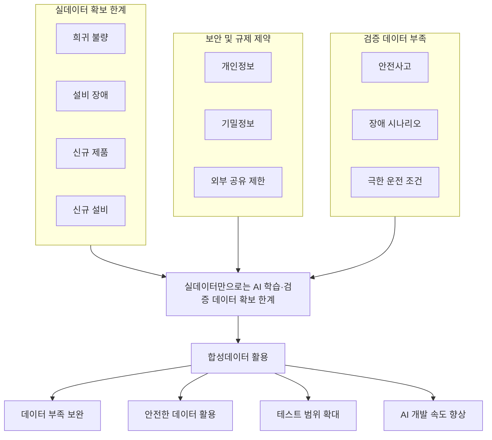
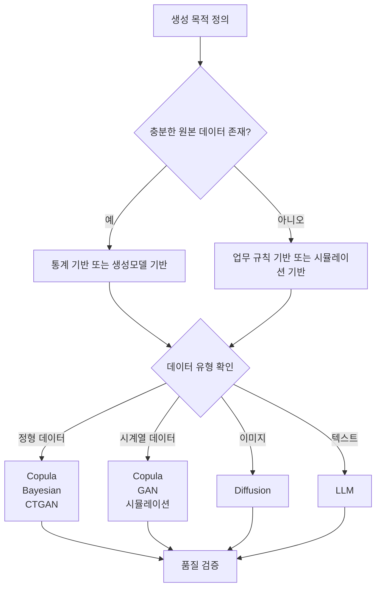

# E-2. 합성데이터 (Synthetic) 매뉴얼

> 합성데이터는 실데이터만으로 확보하기 어려운 학습·검증 데이터를 보완하기 위해 생성한 인공 데이터이며, AI 학습·검증·운영에 필요한 데이터 확보 범위를 확장하는 데이터 확보 체계이다.

---

# 목차

1. 개요
2. 왜 필요한가 (Why)
3. 무엇을 갖추나 (What)
4. 어디부터 적용하나 (Where)
5. 어떻게 구축·운영하나 (How)
6. 다른 주제와의 관계
7. KPI 및 Roadmap
8. Appendix

---

# 1. 개요

합성데이터(Synthetic Data)는 실제 데이터를 직접 복제하는 것이 아니라, 원본 데이터의 통계적 특성, 관계 구조, 업무 규칙, 시계열 패턴 등을 보존하면서 AI 학습·검증·운영에 활용할 수 있도록 생성한 인공 데이터이다.

많은 기업이 AI 도입 과정에서 데이터 부족 문제를 경험한다. 특히 제조업에서는 희귀 불량, 설비 장애, 신규 제품, 신규 설비, 안전 사고와 같이 실제 발생 빈도가 낮거나 확보 자체가 어려운 데이터가 많으며, 개인정보·고객정보·계약정보와 같이 보안 및 규제로 인해 활용이 제한되는 데이터도 존재한다.

합성데이터는 이러한 한계를 보완하여 AI 모델 학습, 테스트, 검증, 외부 협업에 필요한 데이터를 확보할 수 있도록 지원하며, 실데이터만으로 확보하기 어려운 데이터 영역까지 AI 활용 범위를 확장하는 데이터 확보 체계의 역할을 수행한다.

AI-ready Data 관점에서 합성데이터는 실데이터를 대체하기 위한 기술이 아니라, 실데이터만으로는 해결하기 어려운 데이터 부족 문제를 보완하고 AI 활용 가능 범위를 확장하기 위한 전략적 데이터 자산 확보 수단이다.

---

# 2. 왜 필요한가 (Why)

실데이터는 가장 중요한 데이터 자산이며 합성데이터 역시 실데이터를 기반으로 구축된다. 그러나 모든 AI 과제가 충분한 실데이터를 확보할 수 있는 것은 아니며, 실제 프로젝트에서는 데이터 부족, 보안 규제, 검증 환경 제약 등의 문제로 인해 AI 활용이 제한되는 경우가 많다.

합성데이터는 이러한 제약을 해결하기 위해 활용되며, 단순히 데이터를 생성하는 기술이 아니라 실데이터만으로 해결하기 어려운 데이터 확보 문제를 보완하는 수단으로 이해해야 한다.

## 2.1 데이터 부족 문제

제조업 AI 과제는 대부분 데이터 부족 문제를 가지고 있으며, 특히 희귀 불량, 저빈도 장애, 예외 이벤트, 신규 제품, 신규 설비와 같이 발생 빈도가 낮은 데이터는 충분한 학습 데이터를 확보하기 어렵다.

예를 들어 Delamination 불량이 전체 생산량의 0.1% 수준이라면 수십만 건의 생산 데이터가 존재하더라도 실제 학습에 활용 가능한 불량 데이터는 매우 제한적일 수 있다. 이러한 경우 합성데이터를 활용하여 부족한 사례를 보완함으로써 모델이 다양한 패턴을 학습할 수 있도록 지원할 수 있다.

대표적인 활용 사례는 다음과 같다.

- 희귀 불량 데이터 확보
- 설비 장애 데이터 확보
- 안전사고 시나리오 확보
- 신규 제품 초기 데이터 확보

---

## 2.2 보안 및 규제 문제

실제 데이터에는 개인정보, 고객 정보, 계약 정보, 설비 운영 정보 등 다양한 민감정보가 포함되어 있으며, 이러한 데이터는 개인정보 보호 규정이나 기업 보안 정책으로 인해 활용에 제약이 발생하는 경우가 많다.

합성데이터는 원본 데이터의 통계적 특성과 업무 패턴을 유지하면서도 개인정보와 기밀정보 노출 위험을 줄일 수 있기 때문에, 외부 연구기관·협력사·솔루션 기업과의 협업이나 테스트 환경 구축에도 활용할 수 있다.

대표적인 적용 대상은 다음과 같다.

- 인사 데이터
- 급여 데이터
- 고객 데이터
- 계약 데이터
- 설비 운영 데이터

---

## 2.3 테스트 및 검증 데이터 부족

AI 모델은 학습뿐 아니라 검증에도 충분한 데이터가 필요하지만, 실제 운영 환경에서는 극한 운전 조건, 설비 고장 시나리오, 신규 설비 이상 상황, 비상 정지 상황과 같은 데이터를 반복적으로 확보하기 어렵다.

특히 제조 현장에서 이러한 상황을 의도적으로 재현하는 것은 위험하거나 비용이 많이 소요되므로, 실제 데이터만으로 검증 범위를 확대하는 데 한계가 존재한다.

합성데이터는 다양한 운영 조건과 시나리오를 생성하여 AI 모델과 시스템의 신뢰성을 검증할 수 있도록 지원한다.

---

## 2.4 비용과 시간 문제

데이터 확보에는 상당한 비용과 시간이 소요된다. 실제 프로젝트에서는 데이터 수집, 정제, 검증, 라벨링 등의 작업이 반복적으로 발생하며, 이러한 과정은 프로젝트 기간과 비용 증가의 주요 원인이 된다.

합성데이터를 활용하면 일부 데이터를 반복적으로 생성할 수 있기 때문에 데이터 확보 리드타임을 줄일 수 있으며, 특히 테스트 데이터와 검증 데이터 확보 과정에서 높은 효과를 기대할 수 있다.

---

## 2.5 AI-ready Data 관점의 의미

합성데이터는 실데이터를 대체하기 위한 기술이 아니다.

합성데이터의 목적은 데이터 부족 문제를 해결하고, AI 학습과 검증 범위를 확대하며, 보안 문제로 인해 활용이 어려운 데이터를 안전하게 활용할 수 있도록 지원하는 데 있다.

특히 AI-ready Data 체계는 단순히 데이터를 생성하는 것을 목표로 하지 않는다. 장기적으로는 다양한 AI 과제에서 반복적으로 활용할 수 있는 데이터 확보 체계를 구축하고, 신규 AI 과제를 수행할 때마다 데이터를 처음부터 수집하는 것이 아니라 기존 자산을 재활용할 수 있도록 만드는 것을 목표로 한다.

따라서 합성데이터는 생성 기술이 아니라 실데이터만으로 확보하기 어려운 데이터를 지속적으로 확보하고 활용하기 위한 데이터 확보 전략으로 이해해야 한다.

---

### 합성데이터 필요성 Framework



---

# 3. 무엇을 갖추나 (What)

합성데이터는 단순히 데이터를 생성하는 기술이 아니다. 실제 제조업 환경에서 합성데이터를 안정적으로 활용하기 위해서는 어떤 데이터를 대상으로 할 것인지, 어떤 방식으로 생성할 것인지, 생성 결과를 어떻게 검증할 것인지, 생성 이후에는 어떻게 운영할 것인지를 함께 정의해야 한다.

합성데이터 체계는 크게 다음 다섯 가지 구성 요소로 구성된다.

```text
합성 대상 데이터 정의
→ 생성 전략 수립
→ 품질 검증 체계
→ 위험 관리 체계
→ 운영 및 자산화 체계
```

---

## 3.1 합성 대상 데이터

모든 데이터를 합성해야 하는 것은 아니다. 합성데이터는 실데이터 확보가 어렵거나 활용에 제약이 있는 데이터를 대상으로 적용하는 것이 일반적이다.

대표적인 적용 대상은 다음과 같다.

| 유형 | 설명 | 예시 |
|--------|--------|--------|
| 구조화 데이터 | 테이블 형태 데이터 | ERP, MES, 품질 이력 |
| 시계열 데이터 | 시간 순서 데이터 | 온도, 압력, 진동 |
| 이미지·영상 | 시각 데이터 | 불량 이미지, CCTV |
| 텍스트 | 자연어 데이터 | VOC, 작업일지 |
| 그래프 데이터 | 관계 기반 데이터 | 공급망, 조직 구조 |

합성데이터는 데이터 유형보다도 데이터 확보 목적을 기준으로 적용 여부를 판단하는 것이 중요하다.

| 목적 | 설명 | 예시 |
|--------|--------|--------|
| 민감정보 보호 | 개인정보 활용 제한 대응 | 인사 데이터 |
| 희귀 이벤트 확보 | 저빈도 데이터 확보 | 설비 장애 |
| 데이터 불균형 해소 | 특정 클래스 부족 보완 | 희귀 불량 |
| 신규 제품 개발 | 초기 데이터 부족 보완 | 신규 제품 |
| 테스트 및 검증 | 시나리오 생성 | 안전사고 |
| 데이터 공유 | 외부 협업 지원 | 연구 데이터 |

---

## 3.2 생성 전략

합성데이터의 품질은 어떤 생성모델을 사용하는지보다 어떤 데이터를 어떤 목적으로 확보하려는지에 의해 결정된다. 따라서 생성 방식 선택 이전에 확보하려는 데이터의 특성과 활용 목적을 먼저 정의해야 한다.

실제 프로젝트에서는 아래와 같은 관점으로 생성 전략을 결정한다.

| 상황 | 우선 고려 방식 | 대표 활용 사례 |
|--------|--------|--------|
| 희귀 불량 부족 | 생성모델 기반, 업무 규칙 기반 | Delamination |
| 개인정보 포함 | 통계 기반 | 인사 데이터 |
| 신규 설비 | 시뮬레이션 기반 | Digital Twin |
| 테스트 시나리오 부족 | 업무 규칙 기반, 시뮬레이션 기반 | 안전사고 |
| 외부 공유 | 통계 기반 | 연구 데이터 |
| 이미지 데이터 부족 | 생성모델 기반 | 불량 이미지 |

합성데이터 생성 방식은 크게 네 가지 범주로 구분할 수 있다.

| 생성 방식 | 특징 | 적합한 데이터 |
|--------|--------|--------|
| 통계 기반 | 분포와 상관관계 보존 | ERP, MES, 품질 데이터 |
| 업무 규칙 기반 | 도메인 규칙 반영 | 안전사고, 설비 이상 |
| 시뮬레이션 기반 | 물리 환경 재현 | Digital Twin |
| 생성모델 기반 | 복잡한 패턴 생성 | 이미지, 텍스트 |

실제 프로젝트에서는 하나의 방식만 사용하는 경우보다 여러 방식을 조합하여 사용하는 경우가 많다.

---

### 통계 기반 생성

통계 기반 생성은 실제 데이터의 분포와 변수 간 관계를 유지하면서 새로운 데이터를 생성하는 방식이다.

대표적으로 Copula와 Bayesian Network가 활용되며, ERP·MES·품질 이력과 같은 정형 데이터 생성에 적합하다.

장점

- 설명 가능성 우수
- 통계 특성 보존
- 구현 난이도 상대적으로 낮음

한계

- 복잡한 패턴 표현 제한
- 고차원 데이터 처리 한계

---

### 업무 규칙 기반 생성

업무 규칙 기반 생성은 현업의 업무 규칙과 제약 조건을 활용하여 데이터를 생성하는 방식이다.

예를 들어 설비 보호 로직이나 안전사고 발생 조건과 같이 실제 발생 빈도는 낮지만 반드시 검증해야 하는 시나리오를 생성할 수 있다.

장점

- 도메인 지식 반영 가능
- 희귀 이벤트 생성 가능
- 설명 가능성 우수

한계

- SME 참여 필요
- 새로운 패턴 생성 어려움

---

### 시뮬레이션 기반 생성

시뮬레이션 기반 생성은 실제 설비와 공정을 가상 환경에 구현하여 데이터를 생성하는 방식이다.

대표적으로 Digital Twin 기반 환경이 활용되며, 실제 환경에서는 발생시키기 어려운 상황을 반복적으로 생성할 수 있다는 장점이 있다.

장점

- 현실성 높음
- 극한 상황 생성 가능
- 반복 실험 가능

한계

- 구축 비용 높음
- 물리 모델 필요

---

### 생성모델 기반 생성

생성모델 기반 생성은 실제 데이터의 패턴을 학습하여 새로운 데이터를 생성하는 방식이다.

대표적으로 CTGAN, TVAE, Diffusion, LLM 등이 활용되며 이미지·텍스트·고차원 데이터 생성에 적합하다.

장점

- 복잡한 패턴 생성 가능
- 다양한 데이터 유형 지원
- 대규모 데이터 생성 가능

한계

- 설명 가능성 제한
- 학습 데이터 품질 영향 큼

---


## 3.3 Utility와 Security

합성데이터의 목적은 원본 데이터를 그대로 복제하는 것이 아니다. 합성데이터는 실제 AI 활용 가능성을 의미하는 Utility와 개인정보·기밀정보 보호 수준을 의미하는 Security 사이의 균형점을 찾는 것이 핵심이다.

합성데이터가 원본 데이터와 지나치게 유사하면 보안 위험이 증가하고, 반대로 보안성을 지나치게 높이면 실제 AI 활용 가치가 떨어질 수 있다. 따라서 합성데이터 구축 과정에서는 두 요소를 동시에 고려해야 한다.

### Utility

Utility는 합성데이터가 실제 AI 활용에 얼마나 도움이 되는지를 의미한다.

대표적인 평가 항목은 다음과 같다.

- 분포 유사성
- 변수 관계 유지
- 모델 성능 유지
- 업무 규칙 유지

예를 들어 합성데이터를 활용하여 학습한 모델이 실데이터 기반 모델과 유사한 성능을 유지한다면 Utility가 높다고 판단할 수 있다.

### Security

Security는 합성데이터가 원본 데이터의 개인정보나 기밀정보를 얼마나 안전하게 보호하는지를 의미한다.

대표적인 평가 항목은 다음과 같다.

- 개인정보 보호 수준
- 기밀정보 보호 수준
- 재식별 위험 수준

합성데이터가 실제 데이터와 지나치게 유사할 경우 특정 개인이나 기업 정보를 추론할 수 있는 위험이 발생할 수 있다.

### 재식별 위험

합성데이터 운영 시 가장 대표적으로 관리해야 하는 위험은 재식별 위험이다.

| 유형 | 설명 |
|--------|--------|
| Singling Out | 특정 데이터가 유일하게 식별되는 경우 |
| Linkability | 다른 데이터와 결합하여 식별되는 경우 |
| Inference | 민감정보를 역추론할 수 있는 경우 |

합성데이터의 목적은 Utility를 최대화하면서도 Security 위험을 허용 가능한 수준으로 관리하는 데 있으며, 실제 프로젝트에서는 두 요소 간 균형을 지속적으로 검증해야 한다.

---

## 3.4 품질 검증 체계

합성데이터는 생성 자체보다 생성 이후 검증 과정이 더 중요하다. 실제 데이터와 충분히 유사하지 않거나 업무 규칙을 만족하지 못한다면 AI 학습과 검증에 활용하기 어렵기 때문이다.

합성데이터 품질 검증은 크게 네 가지 관점에서 수행한다.

| 검증 영역 | 목적 | 대표 검증 항목 |
|--------|--------|--------|
| 통계적 특성 검증 | 원본 데이터 특성 유지 여부 확인 | 평균, 분산, 분위수, 분포 |
| 변수 관계 검증 | 변수 간 관계 유지 여부 확인 | 상관계수, 공분산, 조건부 분포 |
| 업무 규칙 검증 | 도메인 규칙 만족 여부 확인 | 물리 제약, 업무 규칙 |
| 활용 적합성 검증 | 실제 AI 활용 가능 여부 확인 | Accuracy, Precision, Recall, F1 |

### 통계적 특성 검증

원본 데이터와 합성데이터의 통계적 특성이 유사한지 확인한다.

대표 검증 항목

- 평균
- 중앙값
- 분산
- 표준편차
- 분위수

### 변수 관계 검증

합성데이터가 개별 변수뿐 아니라 변수 간 관계도 유지하는지 확인한다.

대표 검증 항목

- 상관관계
- 공분산
- 조건부 분포

### 업무 규칙 검증

현업 규칙과 물리적 제약 조건을 만족하는지 검증한다.

예시

```text
나이 >= 0

주문금액 >= 0

퇴사일 >= 입사일
```

### 활용 적합성 검증

최종적으로는 실제 AI 모델에 적용하여 활용 가능성을 검증해야 한다.

예시

| 지표 | 원본 데이터 | 합성데이터 |
|--------|--------|--------|
| Accuracy | 0.92 | 0.91 |
| Precision | 0.89 | 0.91 |
| F1 Score | 0.90 | 0.89 |

합성데이터 품질은 통계적 유사성만으로 판단할 수 없으며, 실제 AI 활용 결과까지 함께 검증해야 한다.

---

## 3.5 운영 및 자산화 체계

합성데이터는 생성 이후에도 지속적인 관리가 필요하며, 프로젝트 종료와 함께 폐기되는 결과물이 아니라 반복적으로 활용 가능한 데이터 자산으로 운영되어야 한다.

이를 위해 생성 체계뿐 아니라 운영 체계와 자산화 체계를 함께 구축해야 한다.

### Synthetic Tag

합성데이터 여부를 식별하기 위한 관리 정보이다.

대표 관리 항목은 다음과 같다.

- 생성일
- 생성 목적
- 생성 방식
- 버전
- 소유자

합성데이터는 실데이터와 구분하여 관리해야 하며, 생성 이력을 추적할 수 있어야 한다.

### 접근 권한 관리

원본 데이터와 합성데이터에 대한 접근 권한은 분리하여 관리하는 것이 바람직하다.

대표 원칙

- 최소 권한 원칙
- 역할 기반 접근 통제
- 정기 점검 수행

### 활용 이력 관리

합성데이터가 어떤 AI 과제에서 활용되었는지 지속적으로 관리해야 한다.

대표 관리 항목

- 접근 이력
- 활용 이력
- 배포 이력

이를 통해 데이터 자산의 활용 현황을 파악하고 재사용 가능성을 높일 수 있다.

### Registry 등록

생성된 합성데이터는 Registry에 등록하여 조직 차원의 데이터 자산으로 관리한다.

대표 등록 항목

- Dataset 정보
- 생성 방식
- 품질 검증 결과
- 버전 정보
- 활용 이력

Registry에 등록된 합성데이터는 향후 신규 AI 과제 수행 시 재사용할 수 있으며, 동일한 데이터를 반복 생성하는 비용을 줄일 수 있다.

### 데이터 Product화

장기적으로는 합성데이터를 특정 프로젝트 산출물이 아니라 반복 활용 가능한 데이터 Product 형태로 운영하는 것이 바람직하다.

예를 들어 품질 데이터, 설비 데이터, VOC 데이터와 같은 합성데이터는 여러 AI 과제에서 공통으로 활용될 수 있으며, 지속적으로 축적·관리되는 데이터 자산으로 발전할 수 있다.

따라서 합성데이터의 최종 목표는 데이터를 생성하는 것이 아니라 실데이터만으로 확보하기 어려운 데이터를 지속적으로 축적하고 재사용 가능한 데이터 자산 체계로 운영하는 데 있다.

---

# 4. 어디부터 적용하나 (Where)

합성데이터는 모든 AI 과제에 필요한 것은 아니다. 실데이터가 충분하고 활용에 제약이 없다면 합성데이터를 생성할 필요가 없다.

반대로 실데이터만으로는 해결하기 어려운 데이터 부족, 보안, 검증 문제를 가진 경우에는 합성데이터를 우선적으로 검토해야 한다.

따라서 합성데이터는 기술 관점이 아니라 데이터 확보 관점에서 적용 여부를 판단해야 하며, 먼저 데이터 확보의 문제를 정의한 뒤 적절한 생성 전략을 선택하는 것이 중요하다.

---

## 4.1 적용 판단 기준

다음 상황 중 하나 이상에 해당한다면 합성데이터 적용을 검토할 수 있다.

### 희귀 이벤트

실제 발생 빈도가 매우 낮아 충분한 학습 데이터를 확보하기 어려운 경우

예시

- Delamination
- Wicking
- 설비 고장
- 안전사고

이러한 데이터는 실제 수집 자체가 어렵기 때문에 합성데이터를 활용하여 부족한 사례를 보완할 수 있다.

---

### 데이터 불균형

특정 클래스가 지나치게 적은 경우

예시

| 구분 | 비율 |
|--------|--------|
| 정상 | 99.8% |
| 불량 | 0.2% |

실제 제조 데이터는 대부분 정상 데이터 비중이 매우 높기 때문에 합성데이터를 활용하여 학습 데이터 균형을 개선할 수 있다.

---

### 신규 제품 및 신규 설비

신규 제품이나 신규 설비는 운영 이력이 부족하여 충분한 데이터를 확보하기 어렵다.

예시

- 신규 제품
- 신규 소재
- 신규 고객사
- 신규 생산라인
- 신규 검사설비

초기 단계에서는 합성데이터를 활용하여 AI 모델 검증과 시뮬레이션을 수행할 수 있다.

---

### 개인정보 및 기밀정보

실제 데이터를 직접 활용하기 어려운 경우

예시

- 인사 데이터
- 급여 데이터
- 고객 데이터
- 계약 데이터

합성데이터를 활용하면 데이터 활용 범위를 확대하면서도 보안 위험을 줄일 수 있다.

---

### 테스트 및 검증

실제 환경에서 반복 검증이 어려운 경우

예시

- 비상 정지
- 설비 과열
- 극한 운전 조건
- 안전사고

합성데이터를 활용하여 다양한 시나리오를 반복 검증할 수 있다.

---

## 4.2 적용하지 않아도 되는 경우

다음 조건을 대부분 만족하는 경우에는 합성데이터가 반드시 필요하지 않을 수 있다.

| 판단 기준 | 설명 |
|--------|--------|
| 충분한 실데이터 존재 | 학습과 검증에 필요한 데이터 확보 완료 |
| 보안 제약 없음 | 개인정보 및 기밀정보 문제 없음 |
| 데이터 확보 비용 낮음 | 추가 수집이 어렵지 않음 |
| 테스트 데이터 확보 가능 | 실제 운영 환경에서 검증 가능 |

예를 들어 수년간 축적된 생산 이력 데이터가 존재하고 추가 수집도 용이하다면, 합성데이터보다 실데이터를 우선 활용하는 것이 바람직하다.

합성데이터는 실데이터를 대체하기 위한 기술이 아니라 실데이터만으로 해결하기 어려운 문제를 보완하기 위한 수단이라는 점을 명확히 이해해야 한다.

---

## 4.3 생성 방식 선택 기준

합성데이터 생성 방식에는 정답이 없다.

중요한 것은 최신 기술을 사용하는 것이 아니라 데이터 특성과 활용 목적에 가장 적합한 방식을 선택하는 것이다.

실제 프로젝트에서는 아래 절차에 따라 생성 방식을 결정하는 것을 권장한다.



### 1단계. 생성 목적 정의

먼저 왜 합성데이터를 생성하려는지 정의한다.

대표 목적

- 개인정보 보호
- 데이터 불균형 해소
- 희귀 이벤트 확보
- 신규 제품 검증
- 신규 설비 검증
- 테스트 데이터 확보

동일한 데이터라도 목적에 따라 적합한 생성 방식이 달라질 수 있다.

---

### 2단계. 원본 데이터 확보 수준 확인

충분한 원본 데이터가 존재하는지 확인한다.

| 상황 | 권장 방식 |
|--------|--------|
| 원본 데이터 충분 | 통계 기반, 생성모델 기반 |
| 원본 데이터 부족 | 업무 규칙 기반, 시뮬레이션 기반 |

원본 데이터가 충분하다면 실제 패턴을 학습하는 방식이 유리하며, 부족하다면 도메인 지식과 시뮬레이션을 활용하는 것이 효과적이다.

---

### 3단계. 데이터 유형 확인

데이터 유형에 따라 적합한 생성 방식이 달라진다.

| 데이터 유형 | 대표 예시 | 권장 방식 |
|--------|--------|--------|
| 정형 데이터 | ERP, MES, 품질 데이터 | Copula, Bayesian, CTGAN |
| 시계열 데이터 | 온도, 압력, 진동 | Copula, GAN, 시뮬레이션 |
| 이미지 | 불량 이미지 | Diffusion |
| 텍스트 | VOC, 작업일지 | LLM |

---

### 4단계. 도메인 지식 활용 가능 여부 확인

현업 규칙을 명확하게 정의할 수 있는지 확인한다.

예를 들어

```text
온도 > 90℃

AND

압력 < 10 bar

→ 과열 위험
```

과 같은 규칙을 정의할 수 있다면 업무 규칙 기반 생성이 효과적일 수 있다.

반대로 규칙 정의가 어렵고 복잡한 패턴을 학습해야 하는 경우에는 생성모델 기반 방식을 우선 고려한다.

---

### 생성 방식 선택 가이드

| 상황 | 우선 고려 방식 |
|--------|--------|
| 정형 데이터 생성 | 통계 기반 |
| 개인정보 보호 | 통계 기반 |
| 희귀 이벤트 생성 | 업무 규칙 기반 |
| 설비 이상 시나리오 | 업무 규칙 기반 |
| 신규 설비 검증 | 시뮬레이션 기반 |
| Digital Twin 활용 | 시뮬레이션 기반 |
| 이미지 생성 | 생성모델 기반 |
| 텍스트 생성 | 생성모델 기반 |

실제 프로젝트에서는 하나의 방식만 사용하는 경우보다 여러 방식을 조합하여 사용하는 경우가 많으며, 생성 이후에는 반드시 품질 검증과 위험 평가를 함께 수행해야 한다.

---

# 5. 어떻게 구축·운영하나 (How)

합성데이터 구축은 단순히 데이터를 생성하는 작업이 아니다. 실제 프로젝트에서는 생성 목적을 정의하고, 보존해야 할 특성을 결정한 뒤, 적절한 생성 방식을 선택하고, 검증과 위험 관리를 거쳐 운영 체계까지 구축해야 한다.

합성데이터의 품질은 생성 모델 자체보다 이러한 절차를 얼마나 체계적으로 수행했는지에 의해 결정된다.


---

## 5.1 정본 모델

본 가이드는 아래 7단계 정본 모델을 기준으로 작성한다.

```text
생성 목적 정의
→ 보존 특성 정의
→ 생성 방식 선택
→ 합성데이터 생성
→ 품질 검증
→ 위험 관리
→ 운영 및 자산화
```

합성데이터 구축은 단순히 데이터를 생성하는 활동이 아니라 위 7개 단계를 통해 AI 활용에 적합한 데이터를 확보하고 재사용 가능한 데이터 자산으로 운영하는 과정이다.

본 정본 모델은 다양한 데이터 유형과 생성 방식에 관계없이 동일하게 적용할 수 있으며, 이후 KPI와 Roadmap에서도 동일한 구조를 활용한다.

---

## 5.2 End-to-End 사례

본 장에서는 Delamination 불량 예측 모델 구축 사례를 기준으로 합성데이터 구축 과정을 설명한다.

품질혁신팀은 Delamination 발생 가능성을 예측하는 AI 모델을 구축하고자 하였으나, 실제 생산 데이터 분석 결과 전체 124만 건의 생산 이력 중 Delamination 사례는 2,350건으로 약 0.19% 수준에 불과하였다.

| 구분 | 건수 |
|--------|--------|
| 정상 | 1,240,000 |
| Delamination | 2,350 |

실제 데이터만 활용할 경우 모델이 정상 데이터에 과도하게 편향될 가능성이 높았으며, 품질혁신팀은 부족한 불량 데이터를 보완하기 위해 합성데이터 활용을 검토하였다.

---

## 5.3 생성 목적 정의

### 목적

합성데이터 구축의 첫 단계는 생성 목적을 정의하는 것이다. 동일한 데이터라도 활용 목적에 따라 보존해야 하는 특성과 생성 방식이 달라질 수 있기 때문이다.

### 주요 수행 작업

- 활용 목적 정의
- 기대 효과 정의
- 활용 범위 정의
- 허용 위험 수준 정의

### Delamination 사례

프로젝트 목적

```text
Delamination 예측 모델 학습용 데이터 확보
```

기대 효과

```text
희귀 불량 데이터 확보

모델 Recall 향상

불량 조기 탐지
```

### 산출물

- 합성데이터 활용 계획서
- 활용 목적 정의서

### 완료 기준

합성데이터를 왜 생성하는지 명확하게 설명할 수 있다.

---

## 5.4 보존 특성 정의

### 목적

합성데이터가 실제 데이터의 어떤 특성을 유지해야 하는지 정의한다.

합성데이터는 모든 특성을 동일하게 보존하는 것이 아니라 AI 활용 목적에 필요한 특성을 우선적으로 보존해야 한다.

### 주요 수행 작업

- 보존 대상 정의
- 제외 대상 정의
- 품질 기준 정의

### Delamination 사례

| 항목 | 보존 여부 |
|--------|--------|
| 온도 분포 | 유지 |
| 압력 분포 | 유지 |
| 수분 함량 분포 | 유지 |
| Lot 패턴 | 유지 |
| Delamination 비율 | 보강 |
| 작업자 정보 | 제외 |

### 산출물

- 보존 특성 정의서
- 데이터 딕셔너리

### 완료 기준

생성 이후 어떤 특성이 유지되어야 하는지 정의되어 있다.

---

## 5.5 생성 방식 선택

### 목적

생성 방식 선택 단계에서는 데이터 특성과 활용 목적에 가장 적합한 생성 방식을 결정한다. 합성데이터 품질은 최신 생성모델을 사용하는 것보다 데이터 특성과 활용 목적에 적합한 방식을 선택하는 것에 더 큰 영향을 받는다.

### 주요 수행 작업

- 데이터 유형 분석
- 데이터 규모 분석
- 설명 가능성 검토
- 구현 난이도 검토
- 개인정보 포함 여부 검토

### Delamination 사례

대상 데이터

```text
정형 생산 데이터

품질 이력 데이터

범주형 변수 포함
```

선택 방식

```text
CTGAN
```

선택 이유

- 정형 데이터 중심
- 범주형 변수 존재
- 변수 간 복잡한 상관관계 존재

### 산출물

- 생성 방식 검토서
- 기술 검토 결과

### 완료 기준

선택한 생성 방식의 근거를 설명할 수 있다.

---

## 5.6 합성데이터 생성

### 목적

선택한 생성 방식을 활용하여 실제 합성데이터를 생성한다.

합성데이터 생성 과정에서는 단순히 데이터를 생성하는 것에 그치지 않고, 생성 이력과 버전 정보를 함께 관리할 수 있어야 한다.

### 주요 수행 작업

- 입력 데이터 준비
- 모델 학습
- 합성데이터 생성
- Synthetic Tag 부여
- 생성 이력 기록

### Delamination 사례

입력 데이터

```text
생산 이력

공정 데이터

품질 데이터
```

생성 결과

```text
Delamination 데이터

30,000건 생성
```

생성 이후 모든 데이터에는 Synthetic Tag를 부여하여 실데이터와 구분하였다.

### 산출물

- 합성데이터셋
- 생성 로그
- Synthetic Tag

### 완료 기준

목표 규모의 합성데이터 생성 완료

---

## 5.7 품질 검증

### 목적

생성된 합성데이터가 실제 활용 가능한 수준인지 검증한다.

합성데이터는 생성 자체보다 생성 이후 검증 과정이 중요하며, 통계적 유사성뿐 아니라 실제 AI 활용 가능성까지 함께 검증해야 한다.

### 주요 수행 작업

- 통계적 특성 검증
- 변수 관계 검증
- 업무 규칙 검증
- 활용 적합성 검증

### Delamination 사례

원본 데이터 기반 모델

```text
Recall = 0.71
```

합성데이터 포함 모델

```text
Recall = 0.84
```

합성데이터를 추가한 이후 불량 탐지 성능이 개선된 것을 확인하였다.

### 검증 항목 예시

| 검증 영역 | 주요 항목 |
|--------|--------|
| 통계 검증 | 평균, 분산, 분위수 |
| 관계 검증 | 상관관계, 의존성 |
| 업무 검증 | 물리 규칙, 업무 규칙 |
| 활용 검증 | Accuracy, Recall, F1 |

### 산출물

- 품질 검증 보고서
- 활용 적합성 평가 결과

### 완료 기준

합성데이터가 활용 목적을 만족한다.

---

## 5.8 위험 관리 및 자산화

### 목적

합성데이터는 생성 이후에도 지속적인 관리가 필요하며, 프로젝트 단위 산출물이 아니라 반복적으로 활용 가능한 데이터 자산으로 운영되어야 한다.

따라서 재식별 위험을 관리하는 동시에 Registry 등록과 재사용 체계를 함께 구축해야 한다.

### 주요 수행 작업

- 재식별 위험 평가
- 접근 권한 관리
- Synthetic Registry 구축
- 버전 관리
- 활용 이력 관리
- 재사용 체계 구축

### Delamination 사례

품질혁신팀은 생성된 합성데이터를 품질 예측 모델에 활용한 이후 Registry에 등록하여 향후 다른 AI 과제에서도 활용할 수 있도록 관리하였다.

등록 정보 예시

```text
Synthetic_Delamination_V1

Version 1.0

Owner : 품질혁신팀

생성 방식 : CTGAN
```

---

### 재식별 위험 관리

합성데이터는 개인정보와 기밀정보를 보호하기 위해 활용되지만, 원본 데이터와 지나치게 유사할 경우 재식별 위험이 발생할 수 있다.

대표 위험 유형

| 유형 | 설명 |
|--------|--------|
| Singling Out | 특정 데이터 식별 가능 |
| Linkability | 외부 데이터와 결합 가능 |
| Inference | 민감정보 역추론 가능 |

Delamination 사례에서는 재식별 위험을 낮추기 위해 Lot 번호 일반화와 설비 ID 마스킹을 적용하였다.

---

### Synthetic Registry 구축

생성된 합성데이터는 Registry에 등록하여 조직 차원의 데이터 자산으로 관리한다.

| 자산 | 관리 대상 |
|--------|--------|
| Synthetic Dataset | 합성데이터셋 |
| 생성 방식 | CTGAN, Diffusion 등 |
| 품질 검증 결과 | Utility 및 Security 평가 |
| Synthetic Tag | 생성 이력 정보 |
| 활용 이력 | 적용 AI 과제 |

Registry를 구축하면 향후 동일한 데이터를 반복 생성하지 않고 기존 자산을 재사용할 수 있다.

---

### 데이터 재사용 체계

합성데이터의 궁극적인 목적은 데이터를 한 번 생성하고 폐기하는 것이 아니라 반복적으로 활용 가능한 데이터 자산을 구축하는 것이다.

```text
합성데이터 생성
→ Registry 등록
→ AI 모델 활용
→ 신규 과제 재사용
→ 계열사 확산
```

예를 들어 Delamination 데이터셋은 품질 예측 모델뿐 아니라 이상 탐지, 품질 Agent, 신규 제품 검증 과제에도 활용할 수 있다.

장기적으로는 새로운 AI 과제를 수행할 때마다 데이터를 처음부터 생성하는 것이 아니라 기존에 축적된 합성데이터 자산을 우선 활용하는 체계로 발전해야 한다.

### 산출물

- Synthetic Registry
- 품질 검증 결과
- 버전 이력
- 활용 이력

### 완료 기준

- Registry 등록 완료
- 재식별 위험 평가 완료
- 재사용 가능 상태 확보
- 활용 이력 관리 체계 수립

---

# 6. 다른 주제와의 관계

합성데이터는 독립적으로 존재하는 데이터 주제가 아니다.

실데이터를 기반으로 생성되고, 생성 이후에는 검증·보안·운영 체계를 통해 관리되어야 하므로 AI-ready Data 체계 내 다양한 주제와 연계되어야 한다.

특히 합성데이터는 데이터를 새롭게 생성하는 기술이 아니라 실데이터만으로 확보하기 어려운 데이터를 보완하는 데이터 확보 체계라는 관점에서 이해할 필요가 있다.

---

## 6.1 데이터 전처리와의 관계

합성데이터 품질은 원본 데이터 품질에 직접적인 영향을 받는다.

원본 데이터에 오류, 중복, 결측치가 존재하면 합성데이터 역시 동일한 문제를 학습하게 되므로, 합성데이터 생성 이전에 데이터 전처리를 통해 데이터 품질을 확보해야 한다.

| 구분 | 데이터 전처리 | 합성데이터 |
|--------|--------|--------|
| 목적 | 데이터 정제 및 구조화 | 데이터 생성 |
| 입력 | 원본 데이터 | 전처리 완료 데이터 |
| 산출물 | 학습 가능 데이터 | 합성데이터셋 |

예시

```text
MES 생산 이력

→ 데이터 전처리

→ CTGAN 학습

→ 합성데이터 생성
```

---

## 6.2 데이터 해설·주석과의 관계

이미지, 텍스트, 품질 데이터와 같은 비정형 데이터는 주석 정보가 존재해야 의미 있는 합성데이터를 생성할 수 있다.

예를 들어 불량 이미지를 생성하는 경우 단순히 이미지를 생성하는 것이 아니라 결함 유형, 결함 위치, 결함 등급과 같은 의미 정보도 함께 유지되어야 한다.

| 구분 | 데이터 해설·주석 | 합성데이터 |
|--------|--------|--------|
| 목적 | 의미 정보 부여 | 데이터 확보 |
| 활용 | 결함 유형 정의 | 희귀 사례 생성 |
| 결과 | 주석 데이터셋 | 합성 데이터셋 |

예시

```text
Delamination

Wicking

Void
```

주석 데이터 기반 희귀 불량 데이터 생성

---

## 6.3 AI 평가 데이터와의 관계

합성데이터는 생성 이후 반드시 활용 효과를 검증해야 한다.

이를 위해 AI 평가 데이터를 활용하여 합성데이터가 실제 모델 성능 향상에 기여하는지를 확인해야 한다.

| 구분 | 합성데이터 | AI 평가 데이터 |
|--------|--------|--------|
| 목적 | 데이터 확보 | 성능 검증 |
| 활용 시점 | 학습 전 | 학습 후 |
| 역할 | 학습 데이터 보완 | 효과 검증 |

예시

```text
원본 데이터 Recall

0.71

합성데이터 적용 후 Recall

0.84
```

---

## 6.4 데이터 보안과의 관계

합성데이터는 개인정보 및 기밀정보 보호를 위해 활용되는 경우가 많다.

그러나 원본 데이터와 지나치게 유사한 경우에는 재식별 위험이 발생할 수 있으므로 데이터 보안 체계와 연계하여 지속적으로 관리해야 한다.

| 구분 | 데이터 보안 | 합성데이터 |
|--------|--------|--------|
| 목적 | 정보 보호 | 안전한 데이터 활용 |
| 관리 대상 | 개인정보·기밀정보 | 재식별 위험 |
| 주요 이슈 | 접근 통제 | Singling Out, Linkability |

합성데이터는 보안 체계를 대체하는 기술이 아니라 데이터 활용 범위를 확대하기 위한 보완 수단이다.

---

## 6.5 Physical 데이터 및 Digital Twin과의 관계

시뮬레이션 기반 합성데이터는 실제 설비와 공정에 대한 이해가 필요하다.

Physical 데이터와 Digital Twin 체계는 실제 환경을 가상 환경으로 재현하여 합성데이터 생성에 활용될 수 있다.

| 구분 | Physical 데이터 | 합성데이터 |
|--------|--------|--------|
| 역할 | 실제 데이터 제공 | 가상 데이터 생성 |
| 활용 | 센서·설비 데이터 | 시뮬레이션 데이터 |
| 대표 사례 | 생산설비 | Digital Twin |

예시

```text
냉각수 감소

압력 증가

과열 발생

비상 정지
```

시나리오 생성

---

## 6.6 데이터 Product화와의 관계

합성데이터는 단일 프로젝트 결과물로 끝나서는 안 된다.

생성된 합성데이터는 Registry에 등록하고 반복적으로 활용 가능한 데이터 Product 형태로 관리해야 한다.

| 구분 | 데이터 Product화 | 합성데이터 |
|--------|--------|--------|
| 목적 | 재사용 자산 구축 | 데이터 확보 |
| 관리 대상 | 데이터 Product | Synthetic Dataset |
| 결과 | 재사용 체계 | 데이터 자산 |

예를 들어 품질 데이터, 설비 데이터, VOC 데이터와 같은 합성데이터는 여러 AI 과제에서 공통으로 활용될 수 있으며, 지속적으로 축적되는 데이터 자산으로 발전할 수 있다.

합성데이터의 최종 목표는 데이터를 생성하는 것이 아니라 실데이터만으로 확보하기 어려운 데이터를 반복적으로 활용 가능한 데이터 자산으로 운영하는 데 있다.

---

# 7. KPI 및 Roadmap

합성데이터의 성과는 단순히 생성된 데이터의 양으로 평가할 수 없다.

합성데이터는 실제 AI 활용 가치를 창출해야 하며, 동시에 재식별 위험을 관리하고, 반복적으로 재사용 가능한 데이터 자산으로 운영되어야 한다.

따라서 KPI는 활용성(Utility), 품질(Fidelity), 보안성(Security)뿐 아니라 자산화와 재사용 수준까지 함께 관리하는 것이 중요하다.

---

## 7.1 KPI

### 품질 KPI

품질 KPI는 합성데이터가 실제 데이터의 특성을 얼마나 적절하게 반영하고 있는지를 측정한다.

| KPI | 정의 | 측정 방식 |
|--------|--------|--------|
| 통계적 유사도 | 원본 데이터와의 분포 유사성 | KS-Test, PSI |
| 변수 관계 보존율 | 변수 간 관계 유지 수준 | Correlation Similarity |
| 업무 규칙 적합률 | 업무 규칙 만족 비율 | 적합 데이터 / 전체 데이터 |
| Utility Score | AI 활용 가능 수준 | 합성데이터 모델 성능 / 원본 데이터 모델 성능 |

---

### 보안 KPI

보안 KPI는 개인정보 및 기밀정보 보호 수준을 측정한다.

| KPI | 정의 | 측정 방식 |
|--------|--------|--------|
| Singling Out 위험도 | 특정 데이터 식별 가능성 | 위험 평가 |
| Linkability 위험도 | 외부 데이터 결합 가능성 | 위험 평가 |
| Inference 위험도 | 민감정보 추론 가능성 | 위험 평가 |
| Security Score | 종합 보안 수준 | 내부 평가 기준 |

---

### 운영 KPI

운영 KPI는 합성데이터 체계가 안정적으로 운영되는지를 측정한다.

| KPI | 정의 | 측정 방식 |
|--------|--------|--------|
| 생성 리드타임 | 데이터 생성 기간 | 종료일 - 시작일 |
| 품질 검증 통과율 | 검증 기준 충족 비율 | 통과 Dataset / 전체 Dataset |
| 버전 관리율 | 버전 관리 적용 비율 | 관리 Dataset / 전체 Dataset |
| Registry 등록률 | Registry 등록 비율 | 등록 Dataset / 전체 Dataset |

---

### 자산화 KPI

자산화 KPI는 합성데이터가 실제 조직 자산으로 축적되고 있는지를 측정한다.

| KPI | 정의 | 측정 방식 |
|--------|--------|--------|
| Synthetic Registry 등록률 | 등록 자산 비율 | 등록 Dataset / 전체 Dataset |
| 합성데이터 누적 규모 | 누적 자산 규모 | Dataset 수 |
| 재사용률 | 재사용 비율 | 재사용 Dataset / 전체 Dataset |
| Synthetic Product 수 | 운영 중인 데이터 Product 수 | Product 수 |

---

### 활용 KPI

활용 KPI는 생성된 합성데이터가 실제 AI 과제에서 얼마나 활용되고 있는지를 측정한다.

| KPI | 정의 | 측정 방식 |
|--------|--------|--------|
| 활용 AI 과제 수 | 활용 과제 수 | 누적 과제 수 |
| 활용 모델 수 | 활용 AI 모델 수 | 모델 수 |
| 신규 구축 절감률 | 데이터 확보 공수 절감 수준 | 절감 공수 기준 |
| 계열사 활용률 | 활용 계열사 비율 | 활용 계열사 수 |

---

## 7.2 Roadmap

### Phase 1. Preparation

#### 목표

합성데이터 적용 기준 수립

#### 주요 활동

- 적용 대상 정의
- 생성 방식 기준 정의
- 검증 기준 정의
- Synthetic Tag 설계

#### 산출물

- 적용 기준
- 생성 전략 가이드
- 검증 기준

#### 전환 기준

- 생성 기준 승인
- 검증 기준 승인

---

### Phase 2. AI Ready

#### 목표

합성데이터 생성 체계 구축

#### 주요 활동

- 생성 체계 구축
- 품질 검증 체계 구축
- Synthetic Registry 구축
- 활용 기준 정의

#### 산출물

- 합성데이터셋
- 품질 검증 결과
- Synthetic Registry

#### 전환 기준

- Utility 기준 충족
- Registry 등록 완료

---

### Phase 3. Automation

#### 목표

합성데이터 운영 자동화

#### 주요 활동

- 생성 자동화
- 품질 검증 자동화
- 위험 평가 자동화
- 운영 모니터링 구축

#### 산출물

- 자동화 파이프라인
- 자동 검증 체계
- 운영 대시보드

#### 전환 기준

- 자동화 KPI 달성
- 운영 체계 안정화

---

### Phase 4. Assetization & Expansion

#### 목표

합성데이터 자산화 및 확산

#### 주요 활동

- Synthetic Product 구축
- 계열사 확산
- Digital Twin 연계
- Feedback Loop 구축

#### 산출물

- Synthetic Product
- 전사 Registry
- 재사용 가이드

#### 전환 기준

- 다수 AI 과제 재사용 달성
- 계열사 확산 완료
- 재사용 체계 정착

---
# 8. Appendix

## Appendix A. 주요 용어

### 합성데이터

실제 데이터를 직접 복제하지 않고, 원본 데이터의 통계적 특성, 관계 구조, 패턴을 학습하여 생성한 인공 데이터이다.

합성데이터의 목적은 원본 데이터를 대체하는 것이 아니라 AI 학습·검증·운영에 필요한 데이터를 보완하는 것이다.

---

### Utility

합성데이터가 실제 AI 활용에 기여할 수 있는 정도를 의미한다.

대표 평가 항목

- 통계적 유사성
- 관계 보존
- 모델 성능 유지

---

### Security

합성데이터가 개인정보와 기밀정보를 안전하게 보호하는 수준을 의미한다.

대표 평가 항목

- 재식별 위험
- 개인정보 노출 가능성
- 기밀정보 추론 가능성

---

### Synthetic Tag

합성데이터 여부를 식별하기 위한 관리 정보이다.

Synthetic Tag에는 다음 정보를 포함한다.

- 생성 목적
- 생성 방식
- 생성 일자
- 데이터 소유자
- 버전 정보

---

### 재식별 (Re-identification)

합성데이터를 활용하여 원본 데이터의 특정 개인 또는 기밀정보를 역추적하는 행위를 의미한다.

대표 위험 유형

- Singling Out
- Linkability
- Inference

---

### Digital Twin

실제 설비와 공정을 가상 환경에 구현한 디지털 복제 모델이다.

합성데이터 생성 시 시뮬레이션 기반 데이터 생성에 활용할 수 있다.

---

### Copula

데이터의 분포와 변수 간 상관관계를 유지하며 합성데이터를 생성하는 통계 기법이다.

주로 정형 데이터 생성에 활용된다.

---

### Bayesian Network

변수 간 인과관계와 조건부 확률을 활용하여 데이터를 생성하는 통계 기법이다.

품질 원인 분석과 장애 시나리오 생성에 활용된다.

---

### CTGAN

범주형 데이터에 특화된 생성형 AI 기반 합성데이터 생성 모델이다.

정형 데이터 생성에 널리 활용된다.

---

### TVAE

정형 데이터 생성에 활용되는 VAE 기반 생성 모델이다.

복잡한 패턴을 학습하여 새로운 데이터를 생성할 수 있다.

---

### SDV

Synthetic Data Vault의 약자이다.

정형 데이터 합성데이터 생성에 널리 활용되는 오픈소스 프레임워크이다.

대표 지원 모델

- Gaussian Copula
- CTGAN
- TVAE

---

### Diffusion Model

고품질 이미지 생성에 강점을 가진 생성모델이다.

불량 이미지, 검사 이미지와 같은 시각 데이터 생성에 활용할 수 있다.

---

### LLM

대규모 언어 모델(Large Language Model) 기반 생성 방식이다.

VOC, 작업일지, 정비 보고서와 같은 자연어 데이터 생성에 활용할 수 있다.

---

### Synthetic Registry

생성된 합성데이터를 등록·관리하는 저장소이다.

생성 방식, 품질 검증 결과, 버전, 활용 이력 등을 함께 관리하여 재사용 가능한 데이터 자산으로 운영한다.

---
