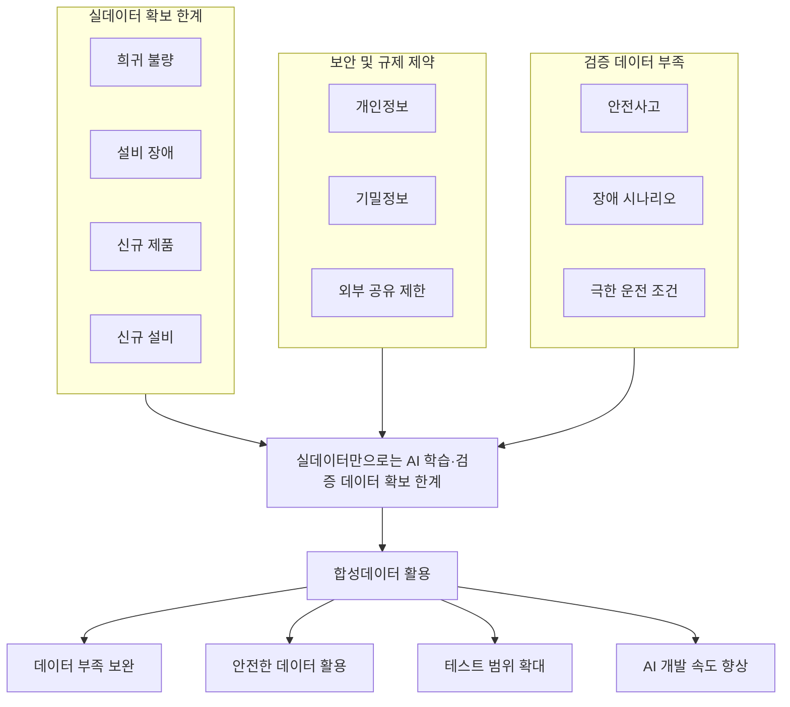
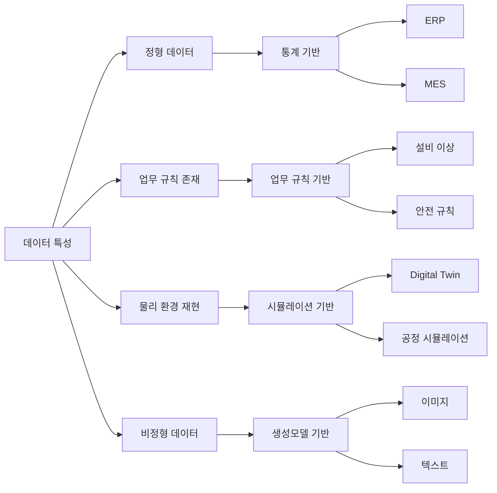

# E-2. 합성데이터 (Synthetic) 매뉴얼

> 합성데이터는 실데이터만으로 확보하기 어려운 학습·검증 데이터를 보완하기 위해 생성한 인공 데이터이며, AI 학습·검증·운영에 필요한 데이터 확보 범위를 확장하는 데이터 확보 체계이다.

---

# 목차

1. 개요
2. 왜 필요한가 (Why)
3. 무엇을 갖추나 (What)
4. 어디부터 적용하나 (Where)
5. 어떻게 구축·운영하나 (How)
6. 다른 주제와의 관계
7. KPI 및 Roadmap
8. Appendix

---

# 1. 개요

합성데이터는 실데이터를 그대로 복제한 데이터가 아니다.

실제 데이터의 통계적 특성, 관계 구조, 업무 규칙, 시계열 패턴 등을 보존하면서 AI 학습과 검증에 활용할 수 있도록 생성한 인공 데이터이다.

많은 기업이 AI 도입 과정에서 데이터 부족 문제를 경험한다.

특히 제조업에서는 다음과 같은 데이터 확보가 어렵다.

- 희귀 불량 데이터
- 설비 장애 데이터
- 신규 제품 데이터
- 신규 설비 데이터
- 안전 사고 데이터

또한 개인정보, 고객 정보, 계약 정보 등 민감정보가 포함된 데이터는 활용 자체가 제한되는 경우가 많다.

합성데이터는 이러한 한계를 보완하여 AI 모델 학습, 테스트, 검증, 외부 협업에 활용할 수 있는 데이터 확보 수단을 제공한다.

AI-ready Data 관점에서 합성데이터는 부족한 데이터를 보완하여 AI 활용 가능 범위를 확장하는 데이터 확보 체계이다.

---

# 2. 왜 필요한가 (Why)

실데이터는 가장 중요한 데이터 자산이다.

그러나 모든 AI 과제가 충분한 실데이터를 확보할 수 있는 것은 아니다.

합성데이터는 실데이터만으로 해결하기 어려운 문제를 보완하기 위해 활용한다.

## 2.1 데이터 부족 문제

제조업 AI 과제는 대부분 데이터 부족 문제를 가진다.

특히 다음 데이터는 확보가 어렵다.

- 희귀 불량
- 저빈도 장애
- 예외 이벤트
- 신규 제품
- 신규 설비

예를 들어 Delamination 불량이 전체 생산량의 0.1% 수준이라면 수십만 건의 생산 데이터가 존재하더라도 실제 학습에 활용 가능한 불량 데이터는 매우 제한적일 수 있다.

이 경우 합성데이터를 활용하여 부족한 사례를 보완할 수 있다.

### 대표 사례

- 희귀 불량 데이터 확보
- 설비 장애 데이터 확보
- 안전사고 시나리오 확보
- 신규 제품 초기 데이터 확보

---

## 2.2 보안 및 규제 문제

실제 데이터에는 다양한 민감정보가 포함된다.

대표 사례는 다음과 같다.

- 인사 데이터
- 급여 데이터
- 고객 데이터
- 계약 데이터
- 설비 운영 데이터

이러한 데이터는 개인정보 보호 또는 기업 보안 정책으로 인해 활용에 제약이 발생한다.

합성데이터는 원본 데이터의 통계적 특성을 유지하면서도 개인정보 및 기밀정보 노출 위험을 줄일 수 있다.

이를 통해 외부 연구기관, 협력사, 솔루션 기업과의 데이터 협업도 가능해진다.

---

## 2.3 테스트 및 검증 데이터 부족

AI 모델은 학습뿐 아니라 검증에도 데이터가 필요하다.

그러나 실제 운영 환경에서는 다음과 같은 데이터를 확보하기 어렵다.

- 극한 운전 조건
- 비상 정지 상황
- 설비 고장 시나리오
- 신규 설비 이상 상황

실제 생산 환경에서 이러한 상황을 반복적으로 발생시키는 것은 현실적으로 불가능하거나 위험하다.

합성데이터는 다양한 조건과 시나리오를 생성하여 AI 모델과 시스템의 신뢰성을 검증할 수 있도록 지원한다.

---

## 2.4 비용과 시간 문제

데이터 확보는 많은 비용과 시간이 필요하다.

실제 프로젝트에서는 다음 작업이 반복적으로 발생한다.

- 데이터 수집
- 데이터 정제
- 데이터 라벨링
- 데이터 검증

합성데이터를 활용하면 일부 데이터를 반복 생성할 수 있어 데이터 확보 리드타임을 단축할 수 있다.

특히 테스트 데이터와 검증 데이터 확보 과정에서 효과가 크다.

---

## 2.5 AI-ready Data 관점

합성데이터는 실데이터를 대체하기 위한 기술이 아니다.

합성데이터의 목적은 다음과 같다.

- 데이터 부족 문제 해결
- AI 학습 성능 향상
- AI 검증 범위 확대
- 안전한 데이터 활용
- 외부 협업 지원

즉 합성데이터는 실데이터만으로 확보하기 어려운 데이터를 보완하여 AI 활용 범위를 확장하는 데이터 확보 체계이다.

---

### 합성데이터 필요성 Framework



---

# 3. 무엇을 갖추나 (What)

합성데이터는 단순히 데이터를 생성하는 기술이 아니다.

실제 제조업 환경에서 합성데이터를 안정적으로 활용하기 위해서는 합성 대상 데이터, 생성 방식, 검증 체계, 위험 관리 체계를 함께 구축해야 한다.

합성데이터 체계는 크게 다음 네 가지 구성 요소로 구성된다.

```text
합성 대상 데이터 정의
→ 생성 방식 정의
→ 품질 검증 체계
→ 위험 관리 및 운영 체계
```

---

## 3.1 합성 대상 데이터

모든 데이터를 합성해야 하는 것은 아니다.

합성데이터는 실데이터 확보가 어렵거나 활용에 제약이 있는 데이터를 대상으로 적용한다.

### 데이터 유형 기준

| 유형 | 설명 | 예시 |
|--------|--------|--------|
| 구조화 데이터 | 테이블 형태의 데이터 | ERP, MES, 품질 이력 |
| 시계열 데이터 | 시간 순서로 기록된 데이터 | 온도, 압력, 진동 |
| 이미지·영상 | 시각 데이터 | 불량 이미지, CCTV |
| 텍스트 | 문서 및 자연어 데이터 | VOC, 작업일지 |
| 그래프 데이터 | 관계 기반 데이터 | 공급망, 조직 구조 |

---

### 활용 목적 기준

| 목적 | 설명 | 예시 |
|--------|--------|--------|
| 민감정보 보호 | 개인정보 활용 제한 대응 | 인사 데이터 |
| 희귀 이벤트 확보 | 저빈도 데이터 확보 | 설비 장애 |
| 데이터 불균형 해소 | 특정 클래스 부족 보완 | 희귀 불량 |
| 신규 제품 개발 | 실데이터 부족 보완 | 신규 제품 |
| 테스트 및 검증 | 시나리오 생성 | 안전사고 |
| 데이터 공유 | 외부 협업 지원 | 연구 데이터 |

---

### 제조업 주요 적용 사례

#### 품질 데이터

- Delamination
- Wicking
- Void
- Crack

희귀 불량 사례 확보를 위한 데이터 증강

---

#### 설비 데이터

- 설비 장애
- 이상 진동
- 과열
- 압력 이상

설비 이상 탐지 모델 학습

---

#### 생산 데이터

- 생산 이력
- 작업 이력
- 공정 로그

신규 제품 및 신규 설비 검증

---

#### 문서 데이터

- VOC
- 작업일지
- 점검 보고서
- 정비 기록

AI Agent 학습 데이터 확보

---

## 3.2 합성데이터 생성 방식

합성데이터 생성 방식은 데이터 특성과 활용 목적에 따라 선택한다.

실제 프로젝트에서는 하나의 방식만 사용하는 경우보다 여러 방식을 조합하여 사용하는 경우가 많다.

---


---

### 통계 기반 생성

통계 기반 생성은 실제 데이터의 분포와 변수 간 관계를 학습하여 데이터를 생성하는 방식이다.

정형 데이터에 가장 많이 사용된다.

대표 기법

- Copula
- Bayesian Network

---

#### Copula

Copula는 변수별 분포와 변수 간 상관관계를 분리하여 학습하는 통계 기법이다.

예를 들어

- 온도
- 압력
- 수분 함량

간 관계를 유지하면서 새로운 데이터를 생성할 수 있다.

주요 활용

- 품질 데이터
- 생산 데이터
- ERP 데이터

장점

- 설명 가능성이 높음
- 통계 특성 보존 우수
- 구현이 비교적 단순함

한계

- 고차원 데이터에 한계
- 복잡한 패턴 표현 제한

---

#### Bayesian Network

Bayesian Network는 변수 간 인과관계를 학습하는 확률 그래프 모델이다.

예를 들어

```text
프리프레그 흡습
→ 수지 미경화
→ Delamination
```

과 같은 관계를 모델링할 수 있다.

주요 활용

- 품질 이상 분석
- 장애 시나리오 생성
- What-if 분석

장점

- 설명 가능성 우수
- 원인 분석 가능

한계

- 변수 수 증가 시 복잡도 증가
- 그래프 설계 필요

---

### 업무 규칙 기반 생성

업무 규칙 기반 생성은 현업의 업무 규칙과 제약 조건을 활용하여 데이터를 생성하는 방식이다.

대표 사례

```text
온도 > 90℃
AND
압력 < 10 bar

→ 설비 과열 위험
```

---

주요 활용

- 설비 이상 탐지
- 안전사고 시나리오
- 보호 로직 검증

장점

- 도메인 지식 반영 가능
- 희귀 이벤트 생성 가능
- 설명 가능성 우수

한계

- SME 참여 필수
- 새로운 패턴 생성 어려움

---

### 시뮬레이션 기반 생성

시뮬레이션 기반 생성은 실제 공정과 설비를 가상 환경에 구현하여 데이터를 생성하는 방식이다.

대표 사례

- Digital Twin
- 생산 시뮬레이션
- 공정 모델

---

예를 들어

냉각수 공급량을 감소시키며 설비 상태 변화를 반복적으로 생성할 수 있다.

실제 생산 환경에서는 발생시키기 어려운 상황을 안전하게 생성할 수 있다는 장점이 있다.

주요 활용

- 설비 고장
- 안전사고
- 공정 최적화
- 신규 설비 검증

장점

- 현실성 높음
- 반복 실험 가능
- 극한 상황 생성 가능

한계

- 구축 비용 높음
- 물리 모델 필요

---

### 생성모델 기반 생성

생성모델은 실제 데이터의 패턴을 학습하여 새로운 데이터를 생성한다.

대표 모델

- CTGAN
- TVAE
- Diffusion
- LLM

---

#### CTGAN

범주형 데이터와 정형 데이터 생성에 특화된 생성모델이다.

주요 활용

- 생산 이력
- 품질 데이터
- ERP 데이터

---

#### TVAE

잠재 공간 기반 생성모델이다.

주요 활용

- 정형 데이터 생성
- 희귀 데이터 증강

---

#### Diffusion

고품질 이미지 생성에 강점이 있는 생성모델이다.

주요 활용

- 불량 이미지
- 검사 이미지

---

#### LLM

문맥 기반 텍스트 생성 모델이다.

주요 활용

- VOC
- 작업일지
- 정비 보고서

---

## 3.3 Utility와 Security

합성데이터의 목적은 원본 데이터를 복제하는 것이 아니다.

합성데이터는 활용성(Utility)과 보안성(Security)의 균형점을 찾는 것이 핵심이다.

---

### Utility

합성데이터가 실제 AI 활용에 도움이 되는 정도

주요 평가 항목

- 분포 유사성
- 변수 관계 유지
- 모델 성능 유지
- 업무 규칙 유지

---

### Security

원본 데이터가 노출될 위험을 줄이는 정도

주요 평가 항목

- 개인정보 보호
- 기밀정보 보호
- 재식별 위험

---

### 재식별 위험

합성데이터가 원본과 지나치게 유사할 경우 특정 개인이나 기업 정보를 추론할 수 있는 위험이 발생한다.

대표 위험 유형

#### Singling Out

특정 데이터가 유일하게 식별되는 경우

#### Linkability

다른 데이터와 결합하여 식별되는 경우

#### Inference

민감정보를 역추론할 수 있는 경우

---

합성데이터의 목적은 Utility를 최대화하면서 Security 위험을 최소화하는 것이다.

---

## 3.4 품질 검증 체계

합성데이터는 생성 이후 반드시 품질 검증을 수행해야 한다.

품질 검증은 크게 네 가지 관점으로 수행한다.

### 통계적 특성 검증

원본 데이터와 합성데이터의 분포를 비교한다.

검증 예시

- 평균
- 중앙값
- 분산
- 표준편차

---

### 변수 관계 검증

변수 간 관계가 유지되는지 검증한다.

검증 예시

- 상관계수
- 공분산
- 조건부 분포

---

### 업무 규칙 검증

현업 규칙을 만족하는지 검증한다.

예시

```text
나이 >= 0

주문금액 >= 0

퇴사일 >= 입사일
```

---

### 활용 적합성 검증

실제 AI 모델 학습 결과를 비교한다.

예시

| 지표 | 원본 데이터 | 합성데이터 |
|--------|--------|--------|
| Accuracy | 0.92 | 0.91 |
| Precision | 0.89 | 0.91 |
| F1 Score | 0.90 | 0.89 |

---

## 3.5 위험 관리 및 운영 체계

합성데이터는 생성 이후에도 지속적인 관리가 필요하다.

주요 운영 체계는 다음과 같다.

### Synthetic Tag

합성데이터 여부를 식별하기 위한 표식

관리 항목

- 생성일
- 생성 목적
- 생성 방식
- 버전
- 소유자

---

### 접근 권한 관리

원본 데이터와 합성데이터에 대한 접근 권한을 분리 관리한다.

주요 원칙

- 최소 권한
- 역할 기반 접근
- 정기 점검

---

### 모니터링

합성데이터 사용 이력을 추적한다.

관리 항목

- 접근 이력
- 활용 이력
- 배포 이력

---

### 폐기 관리

보존기간이 종료된 데이터는 폐기한다.

관리 항목

- 보존 기간
- 삭제 이력
- 폐기 승인 기록

---

합성데이터는 생성 자체보다 생성 이후의 검증과 관리가 더 중요하다.

따라서 생성 체계뿐 아니라 검증 체계와 운영 체계를 함께 구축해야 한다.

---

# 4. 어디부터 적용하나 (Where)

합성데이터는 모든 AI 과제에 필요한 것은 아니다.

실제 데이터가 충분하고 활용에 제약이 없다면 합성데이터를 생성할 필요가 없다.

반대로 실데이터만으로는 해결하기 어려운 데이터 부족, 보안, 검증 문제를 가진 경우 합성데이터를 우선 검토해야 한다.

따라서 합성데이터는 기술 관점이 아니라 데이터 확보 관점에서 적용 여부를 판단해야 한다.

---

## 4.1 적용 판단 기준

다음 상황 중 하나 이상에 해당한다면 합성데이터 적용을 검토한다.

### 희귀 이벤트

실제 발생 빈도가 매우 낮은 데이터

예시

- Delamination
- Wicking
- 설비 고장
- 안전사고

이러한 데이터는 수집 자체가 어렵고 충분한 학습 데이터를 확보하기 어렵다.

---

### 데이터 불균형

특정 클래스가 지나치게 적은 경우

예시

| 구분 | 비율 |
|--------|--------|
| 정상 | 99.8% |
| 불량 | 0.2% |

실제 제조 데이터는 대부분 정상 데이터 비중이 압도적으로 높다.

합성데이터를 활용하여 부족한 데이터를 보강할 수 있다.

---

### 신규 제품

신제품은 충분한 생산 이력이 존재하지 않는다.

예시

- 신규 제품
- 신규 소재
- 신규 고객사

초기에는 실데이터 확보가 어려우므로 합성데이터를 활용한 사전 검증이 가능하다.

---

### 신규 설비

신규 설비는 이상 상황이나 장애 이력이 부족하다.

예시

- 신규 생산라인
- 신규 검사설비
- 신규 공정

설비 이상 탐지 모델 구축 시 합성데이터를 활용할 수 있다.

---

### 개인정보 및 기밀정보

실제 데이터를 직접 활용하기 어려운 경우

예시

- 인사 데이터
- 급여 데이터
- 고객 데이터
- 계약 데이터

합성데이터를 활용하여 보안 위험을 줄일 수 있다.

---

### 외부 공유

외부 기관과 데이터 협업이 필요한 경우

예시

- 연구기관
- 협력사
- 솔루션 기업

원본 데이터 대신 합성데이터를 제공할 수 있다.

---

### 테스트 및 검증

실제 환경에서 검증이 어려운 경우

예시

- 비상 정지
- 설비 과열
- 극한 운전 조건
- 안전사고

합성데이터를 활용하여 다양한 시나리오를 반복 검증할 수 있다.

---

## 4.2 적용하지 않아도 되는 경우

다음 조건을 모두 만족하는 경우에는 합성데이터가 반드시 필요하지 않을 수 있다.

### 충분한 실데이터 존재

이미 충분한 데이터가 확보된 경우

예시

- 수년간 누적된 생산 데이터
- 대규모 품질 데이터

---

### 보안 제약 없음

실제 데이터 활용에 제한이 없는 경우

예시

- 내부 분석 전용 데이터
- 개인정보 미포함 데이터

---

### 데이터 확보 비용이 낮음

데이터를 쉽게 수집할 수 있는 경우

예시

- 자동 수집 데이터
- 센서 데이터

---

### 검증 데이터 확보 가능

테스트를 위한 실제 데이터를 확보할 수 있는 경우

예시

- 충분한 운영 이력
- 충분한 장애 사례

---

## 4.3 생성 방식 선택 기준

합성데이터 생성 방식은 데이터 유형과 활용 목적에 따라 선택한다.

### 1단계. 목적 정의

먼저 합성데이터를 왜 생성하는지 정의한다.

대표 목적

- 개인정보 보호
- 데이터 보완
- 희귀 이벤트 확보
- AI 학습 데이터 확보
- 테스트 데이터 확보

---

### 2단계. 데이터 존재 여부 확인

충분한 원본 데이터가 존재하는지 확인한다.

#### 원본 데이터 충분

추천 방식

- 통계 기반
- 생성모델 기반

---

#### 원본 데이터 부족

추천 방식

- 업무 규칙 기반
- 시뮬레이션 기반

---

### 3단계. 데이터 유형 확인

#### 구조화 데이터

예시

- ERP
- MES
- 품질 데이터

추천 방식

- Copula
- Bayesian Network
- CTGAN
- TVAE

---

#### 시계열 데이터

예시

- 온도
- 압력
- 진동

추천 방식

- Copula
- GAN
- 시뮬레이션

---

#### 이미지

예시

- 불량 이미지
- 검사 이미지

추천 방식

- Diffusion
- GAN

---

#### 텍스트

예시

- VOC
- 작업일지

추천 방식

- LLM

---

### 4단계. 도메인 지식 존재 여부

현업 규칙을 정의할 수 있는지 확인한다.

#### 규칙 정의 가능

추천 방식

- 업무 규칙 기반

예시

```text
온도 > 90℃
AND 압력 < 10 bar

→ 과열 위험
```

---

#### 규칙 정의 어려움

추천 방식

- 생성모델 기반

---

### 생성 방식 선택 가이드

| 상황 | 권장 방식 |
|--------|--------|
| 정형 데이터 | Copula, Bayesian |
| 희귀 이벤트 | 업무 규칙 |
| 설비 시뮬레이션 | Digital Twin |
| 이미지 | Diffusion |
| 텍스트 | LLM |
| 개인정보 보호 | 통계 기반 |
| 신규 설비 | 시뮬레이션 |
| 테스트 데이터 | 업무 규칙 |

---

합성데이터 생성 방식에는 정답이 없다.

중요한 것은 최신 기술을 사용하는 것이 아니라 데이터 특성과 활용 목적에 가장 적합한 방식을 선택하는 것이다.

실제 프로젝트에서는 통계 기반, 업무 규칙 기반, 생성모델 기반을 함께 사용하는 경우가 많다.

---

# 5. 어떻게 구축·운영하나 (How)

합성데이터 구축은 단순히 데이터를 생성하는 작업이 아니다.

실제 프로젝트에서는 생성 목적을 정의하고, 보존해야 할 특성을 결정한 뒤, 적절한 생성 방식을 선택하고, 검증과 위험 관리를 거쳐 운영 체계까지 구축해야 한다.

합성데이터 품질은 생성 모델 자체보다 이러한 절차를 얼마나 체계적으로 수행했는지에 의해 결정된다.

---

---

## 5.1 정본 모델

합성데이터 구축은 다음 7단계 프로세스를 기준으로 수행한다.

```text
목적 정의
→ 보존 특성 정의
→ 생성 방식 선택
→ 합성데이터 생성
→ 품질 검증
→ 위험 관리
→ 운영 및 자산화
```

이 프로세스는 데이터 유형과 생성 방식이 달라지더라도 동일하게 적용된다.

---

## 5.2 End-to-End 사례

본 장에서는 Delamination 불량 예측 모델 구축 사례를 기준으로 합성데이터 구축 과정을 설명한다.

### 프로젝트 배경

품질혁신팀은 Delamination 발생 가능성을 예측하는 AI 모델을 구축하고자 하였다.

그러나 실제 생산 데이터 분석 결과 다음 문제가 확인되었다.

| 구분 | 건수 |
|--------|--------|
| 정상 | 1,240,000 |
| Delamination | 2,350 |

Delamination 비율은 약 0.19% 수준이었다.

실제 데이터만 활용할 경우 모델이 정상 데이터에 과도하게 편향될 가능성이 높았다.

따라서 품질혁신팀은 합성데이터를 활용하여 Delamination 데이터를 보강하기로 결정하였다.

---

## 단계 1. 목적 정의

### 목적

합성데이터 구축의 첫 단계는 생성 목적을 정의하는 것이다.

동일한 데이터라도 목적에 따라 보존해야 하는 특성과 생성 방식이 달라진다.

### 주요 수행 작업

다음 항목을 정의한다.

- 활용 목적
- 기대 성과
- 허용 위험 수준
- 활용 범위

### Delamination 사례

프로젝트 목적

```text
Delamination 예측 모델 학습용 데이터 확보
```

기대 효과

```text
희귀 불량 데이터 확보

모델 Recall 향상

불량 조기 탐지
```

### 산출물

- 합성데이터 활용 계획서
- 활용 목적 정의서

### 완료 기준

합성데이터를 왜 생성하는지 명확히 설명할 수 있다.

---

## 단계 2. 보존 특성 정의

### 목적

합성데이터가 실제 데이터의 어떤 특성을 유지해야 하는지 정의한다.

합성데이터는 모든 특성을 보존하는 것이 아니라 AI 활용에 필요한 특성을 우선 보존한다.

### 주요 수행 작업

보존 대상 정의

- 분포
- 상관관계
- 시계열 패턴
- 업무 규칙
- 희귀 이벤트

### Delamination 사례

보존 특성

| 항목 | 보존 여부 |
|--------|--------|
| 온도 분포 | 유지 |
| 압력 분포 | 유지 |
| 수분 함량 분포 | 유지 |
| Lot 패턴 | 유지 |
| Delamination 비율 | 보강 |
| 작업자 정보 | 제외 |

### 산출물

- 보존 특성 정의서
- 데이터 딕셔너리

### 완료 기준

생성 이후 어떤 특성이 유지되어야 하는지 정의되어 있다.

---

## 단계 3. 생성 방식 선택

### 목적

데이터 특성과 활용 목적에 가장 적합한 생성 방식을 선택한다.

### 주요 수행 작업

다음 항목을 검토한다.

- 데이터 유형
- 데이터 규모
- 설명 가능성
- 구현 난이도
- 개인정보 포함 여부

### Delamination 사례

대상 데이터

```text
정형 생산 데이터
```

선택 방식

```text
CTGAN
```

선택 이유

- 범주형 변수 존재
- 정형 데이터 중심
- 복잡한 상관관계 존재

### 산출물

- 생성 방식 검토서
- 기술 검토 결과

### 완료 기준

생성 방식 선택 근거가 정의되어 있다.

---

## 단계 4. 합성데이터 생성

### 목적

선택한 생성 방식을 활용하여 합성데이터를 생성한다.

### 주요 수행 작업

- 데이터 정제
- 모델 학습
- 합성데이터 생성
- Synthetic Tag 부여

### Delamination 사례

입력 데이터

```text
생산 이력

공정 데이터

품질 데이터
```

생성 결과

```text
Delamination 데이터 30,000건 생성
```

### 산출물

- 합성데이터셋
- 생성 로그

### 완료 기준

목표 규모의 합성데이터 생성 완료

---

## 단계 5. 품질 검증

### 목적

합성데이터가 실제 활용 가능한 수준인지 검증한다.

### 주요 수행 작업

#### 통계 검증

- 평균
- 분산
- 분위수
- 분포

#### 관계 검증

- 상관관계
- 의존성

#### 업무 규칙 검증

- 물리 제약
- 업무 규칙

#### 활용 검증

- AI 모델 성능 비교

### Delamination 사례

원본 데이터 기반 모델

```text
Recall = 0.71
```

합성데이터 포함 모델

```text
Recall = 0.84
```

성능 개선 확인

### 산출물

- 품질 검증 보고서

### 완료 기준

합성데이터가 활용 목적을 만족한다.

---

## 단계 6. 위험 관리

### 목적

재식별 위험과 기밀정보 노출 위험을 관리한다.

### 주요 수행 작업

#### Singling Out

특정 데이터 식별 가능성 평가

#### Linkability

외부 데이터와 결합 가능성 평가

#### Inference

민감정보 추론 가능성 평가

### Delamination 사례

평가 결과

```text
재식별 위험 낮음
```

추가 조치

```text
Lot 번호 일반화

설비 ID 마스킹
```

### 산출물

- 위험 평가 보고서

### 완료 기준

허용 위험 수준 이내

---

## 단계 7. 운영 및 자산화

### 목적

합성데이터를 일회성 결과물이 아닌 재사용 가능한 데이터 자산으로 운영한다.

### 주요 수행 작업

#### 데이터 카탈로그 등록

생성 데이터 등록

#### 메타데이터 등록

생성 정보 관리

#### 버전 관리

버전 이력 관리

#### 활용 이력 관리

활용 과제 추적

### Delamination 사례

등록 정보

```text
Synthetic Dataset

Version 1.0

Owner : 품질혁신팀

생성 방식 : CTGAN
```

### 산출물

- Synthetic Registry
- 메타데이터
- 버전 이력

### 완료 기준

다른 AI 과제에서도 재사용 가능하다.

---

## 5.3 생성 방식별 적용 시나리오

합성데이터 생성 방식은 데이터 특성에 따라 달라진다.

### 통계 기반

적합 사례

- 생산 이력
- ERP
- 품질 이력

대표 기술

- Copula
- Bayesian Network

---

### 업무 규칙 기반

적합 사례

- 보호 로직
- 설비 이상
- 안전 시나리오

대표 기술

- Rule Engine
- Decision Table

---

### 시뮬레이션 기반

적합 사례

- Digital Twin
- 신규 설비
- 신규 공정

대표 기술

- AnyLogic
- Plant Simulation
- Omniverse

---

### 생성모델 기반

적합 사례

- 이미지
- 텍스트
- 고차원 데이터

대표 기술

- CTGAN
- TVAE
- Diffusion
- LLM

---

합성데이터 구축의 핵심은 최신 생성모델을 사용하는 것이 아니다.

실제 데이터의 특성과 활용 목적을 이해하고 가장 적절한 생성 방식을 선택하는 것이 중요하다.

---

# 6. 다른 주제와의 관계

합성데이터는 독립적으로 존재하는 데이터 주제가 아니다.

합성데이터는 AI-ready Data 체계 내 다양한 데이터 주제와 연계되어야 실제 활용 가치를 만들 수 있다.

특히 합성데이터는 실데이터를 기반으로 생성되고, 생성 이후에는 검증·보안·운영 체계를 통해 관리되어야 하므로 여러 데이터 주제와 밀접하게 연결된다.

---

## 6.1 데이터 전처리 (B-1)

### 관계

합성데이터 생성 이전 단계

### 설명

합성데이터 품질은 원본 데이터 품질에 직접적인 영향을 받는다.

원본 데이터에 오류, 중복, 누락이 존재하면 합성데이터 역시 동일한 문제를 학습하게 된다.

따라서 합성데이터 생성 전에는 데이터 전처리를 통해 데이터 품질을 확보해야 한다.

---

### 주요 연계 항목

- 이상치 제거
- 데이터 정제
- 결측치 처리
- 데이터 구조화

---

### 예시

```text
MES 생산 이력

→ 데이터 전처리

→ CTGAN 학습

→ 합성데이터 생성
```

---

## 6.2 데이터 해설·주석 (B-2)

### 관계

합성데이터 학습 대상 정의

### 설명

이미지, 텍스트, 품질 데이터와 같은 데이터는 주석 정보가 존재해야 의미 있는 합성데이터를 생성할 수 있다.

예를 들어 불량 이미지를 생성하는 경우 단순 이미지 생성이 아니라 결함 유형 정보가 함께 존재해야 한다.

---

### 주요 연계 항목

- 결함 유형
- 원인 분류
- 작업 유형
- 품질 등급

---

### 예시

```text
Delamination

Wicking

Void
```

주석 데이터 기반으로 희귀 불량 이미지 생성

---

## 6.3 데이터 카탈로그 (A-1)

### 관계

합성데이터 자산 등록

### 설명

합성데이터는 생성 이후 재사용 가능한 데이터 자산으로 관리되어야 한다.

따라서 생성된 데이터는 데이터 카탈로그에 등록하여 다른 조직에서도 활용할 수 있도록 해야 한다.

---

### 주요 연계 항목

- 데이터 위치
- 데이터 설명
- 생성 방식
- 생성일
- 데이터 소유자

---

### 예시

```text
Synthetic_Delamination_V1

Synthetic_VOC_V2

Synthetic_Plant_Data_V3
```

---

## 6.4 메타데이터 (A-2)

### 관계

생성 이력 관리

### 설명

합성데이터는 실데이터와 다르게 생성 방식과 품질 검증 결과가 중요하다.

따라서 생성 과정의 메타데이터를 함께 관리해야 한다.

---

### 주요 연계 항목

- 생성 모델
- 생성 일자
- 생성 목적
- 버전
- 품질 검증 결과

---

### 예시

```text
생성 방식 : CTGAN

생성일 : 2026-06-01

버전 : V1.0
```

---

## 6.5 AI 평가 데이터 (E-3)

### 관계

합성데이터 품질 검증

### 설명

합성데이터는 실제 AI 모델 성능을 향상시킬 수 있어야 한다.

따라서 AI 평가 데이터를 활용하여 합성데이터의 효과를 검증해야 한다.

---

### 주요 연계 항목

- Accuracy
- Precision
- Recall
- F1 Score

---

### 예시

```text
원본 데이터 Recall

0.71

합성데이터 적용 후 Recall

0.84
```

---

## 6.6 데이터 보안 (F-4)

### 관계

재식별 위험 관리

### 설명

합성데이터는 개인정보와 기밀정보를 보호하기 위해 활용되는 경우가 많다.

그러나 원본 데이터와 지나치게 유사할 경우 재식별 위험이 발생할 수 있다.

따라서 데이터 보안 체계와 연계하여 위험을 지속적으로 관리해야 한다.

---

### 주요 연계 항목

- 개인정보 보호
- 기밀정보 보호
- 재식별 위험
- 접근 권한

---

### 예시

```text
Singling Out

Linkability

Inference
```

---

## 6.7 Digital Twin 및 Physical 데이터 (D-1)

### 관계

시뮬레이션 기반 합성데이터 생성

### 설명

시뮬레이션 기반 합성데이터는 실제 설비와 공정에 대한 이해가 필요하다.

Physical 데이터와 Digital Twin 체계는 실제 환경을 가상 환경으로 재현하여 합성데이터 생성에 활용될 수 있다.

---

### 주요 연계 항목

- 설비 데이터
- 센서 데이터
- 공정 데이터
- Digital Twin

---

### 예시

```text
냉각수 감소

압력 증가

과열 발생

비상 정지
```

시나리오 생성

---

## 6.8 데이터 Product화 (E-1)

### 관계

합성데이터 재사용 체계

### 설명

합성데이터는 단일 프로젝트 결과물로 끝나서는 안 된다.

생성된 합성데이터는 반복적으로 재사용 가능한 데이터 Product 형태로 관리되어야 한다.

---

### 주요 연계 항목

- Synthetic Registry
- 데이터 버전
- 품질 기준
- 활용 이력

---

### 예시

```text
품질 데이터 Product

설비 데이터 Product

VOC 데이터 Product
```

---

합성데이터는 단순 생성 기술이 아니라 AI-ready Data 체계 전체와 연결되는 데이터 확보 체계이다.

따라서 합성데이터 구축 시 생성 기술뿐 아니라 전처리, 평가, 보안, 운영 체계를 함께 고려해야 한다.

---

# 7. KPI 및 Roadmap

합성데이터의 성과는 단순히 생성된 데이터 양으로 평가할 수 없다.

합성데이터는 실제 AI 활용 가치를 창출해야 하며, 동시에 재식별 위험을 최소화해야 한다.

따라서 KPI는 활용성(Utility), 충실도(Fidelity), 보안성(Security)을 중심으로 관리한다.

## 7.1 KPI

### 통계적 유사도

원본 데이터와 합성데이터의 분포 유사성

#### 측정 항목

- KS-Test
- PSI
- Wasserstein Distance

#### 목적

원본 데이터 특성 보존 여부 확인

---

### 변수 관계 보존율

변수 간 관계 유지 수준

#### 측정 항목

- Correlation Similarity

#### 목적

온도, 압력, 품질 간 관계 보존 여부 확인

---

### 모델 성능 유지율

합성데이터 활용 시 AI 모델 성능 유지 수준

#### 측정 항목

```text
Utility Score

=

합성데이터 모델 성능
/
원본 데이터 모델 성능
```

#### 목적

실제 AI 활용 가능성 평가

---

### 재식별 위험도

원본 데이터 추론 가능성

#### 측정 항목

- Singling Out
- Linkability
- Inference

#### 목적

개인정보 및 기밀정보 보호

---

### 합성데이터 활용률

생성된 데이터의 실제 활용 수준

#### 측정 항목

```text
활용 과제 수
/
생성 데이터셋 수
```

#### 목적

데이터 자산 활용성 평가

---

## 7.2 Roadmap

### Phase 1. Preparation

#### 목표

합성데이터 적용 기준 수립

#### 주요 활동

- 적용 대상 정의
- 생성 방식 기준 정의
- 검증 기준 정의
- Synthetic Tag 설계

#### 주요 기술

- Python
- Pandas
- Copula
- Bayesian Network

---

### Phase 2. AI Ready

#### 목표

합성데이터 생성 체계 구축

#### 주요 활동

- 생성 자동화
- 품질 검증 체계 구축
- Registry 구축
- 재사용 체계 구축

#### 주요 기술

- CTGAN
- TVAE
- SDV
- Great Expectations

---

### Phase 3. Automation

#### 목표

합성데이터 운영 자동화

#### 주요 활동

- 데이터 파이프라인 구축
- 검증 자동화
- 위험 평가 자동화
- 품질 모니터링

#### 주요 기술

- Airflow
- dbt
- MLflow

---

### Phase 4. Assetization

#### 목표

전사 합성데이터 자산화

#### 주요 활동

- Digital Twin 연계
- 전사 Registry 구축
- 계열사 확산
- Feedback Loop 구축

#### 주요 기술

- Digital Twin
- Diffusion
- LLM
- MLOps

---

합성데이터의 최종 목표는 데이터를 생성하는 것이 아니다.

실데이터만으로 확보하기 어려운 데이터를 지속적으로 확보하고, 이를 반복적으로 활용 가능한 데이터 자산으로 전환하는 것이다.

---

# 8. Appendix

---

## Appendix A. 주요 용어

### 합성데이터

실제 데이터를 직접 복제하지 않고, 원본 데이터의 통계적 특성, 관계 구조, 패턴을 학습하여 생성한 인공 데이터이다.

합성데이터의 목적은 원본 데이터를 대체하는 것이 아니라 AI 학습·검증·운영에 필요한 데이터를 보완하는 것이다.

---

### Utility

합성데이터가 실제 AI 활용에 기여할 수 있는 정도를 의미한다.

대표 평가 항목

- 통계적 유사성
- 관계 보존
- 모델 성능 유지

---

### Security

합성데이터가 개인정보와 기밀정보를 안전하게 보호하는 수준을 의미한다.

대표 평가 항목

- 재식별 위험
- 개인정보 노출 가능성
- 기밀정보 추론 가능성

---

### Synthetic Tag

합성데이터 여부를 식별하기 위한 관리 정보이다.

Synthetic Tag에는 다음 정보를 포함한다.

- 생성 목적
- 생성 방식
- 생성 일자
- 데이터 소유자
- 버전 정보

---

### 재식별 (Re-identification)

합성데이터를 활용하여 원본 데이터의 특정 개인 또는 기밀정보를 역추적하는 행위를 의미한다.

대표 위험 유형

- Singling Out
- Linkability
- Inference

---

### Digital Twin

실제 설비와 공정을 가상 환경에 구현한 디지털 복제 모델이다.

합성데이터 생성 시 시뮬레이션 기반 데이터 생성에 활용할 수 있다.

---

### Copula

데이터의 분포와 변수 간 상관관계를 유지하며 합성데이터를 생성하는 통계 기법이다.

주로 정형 데이터 생성에 활용된다.

---

### Bayesian Network

변수 간 인과관계와 조건부 확률을 활용하여 데이터를 생성하는 통계 기법이다.

품질 원인 분석과 장애 시나리오 생성에 활용된다.

---

### CTGAN

범주형 데이터에 특화된 생성형 AI 기반 합성데이터 생성 모델이다.

정형 데이터 생성에 가장 널리 활용되는 오픈소스 모델 중 하나이다.

---

### TVAE

정형 데이터 생성에 활용되는 VAE 기반 생성 모델이다.

복잡한 패턴을 학습하여 새로운 데이터를 생성할 수 있다.

---

### SDV

Synthetic Data Vault의 약자이다.

정형 데이터 합성데이터 생성에 가장 널리 활용되는 오픈소스 프레임워크 중 하나이다.

대표 지원 모델

- Gaussian Copula
- CTGAN
- TVAE

---

### Great Expectations

데이터 품질 검증 도구이다.

합성데이터 생성 이후 품질 검증 및 규칙 검증에 활용할 수 있다.

---

## Appendix B. 생성 방식 비교표

| 구분 | 통계 기반 | 업무 규칙 기반 | 시뮬레이션 기반 | 생성모델 기반 |
|--------|--------|--------|--------|--------|
| 설명 가능성 | 높음 | 매우 높음 | 높음 | 낮음 |
| 현실성 | 중간 | 중간 | 높음 | 매우 높음 |
| 구현 난이도 | 낮음 | 중간 | 높음 | 높음 |
| 데이터 요구량 | 중간 | 낮음 | 낮음 | 높음 |
| 희귀 이벤트 생성 | 가능 | 매우 우수 | 매우 우수 | 가능 |
| 비정형 데이터 | 어려움 | 어려움 | 제한적 | 우수 |

---

## Appendix C. 합성데이터 검증 체크리스트

### 통계적 특성 검증

- 평균이 유사한가
- 분산이 유사한가
- 분위수가 유사한가
- 분포 형태가 유사한가

---

### 변수 관계 검증

- 상관관계가 유지되는가
- 조건부 분포가 유지되는가
- 업무 규칙을 만족하는가

---

### 활용 적합성 검증

- AI 모델 성능이 유지되는가
- Accuracy가 유지되는가
- Recall이 유지되는가
- F1 Score가 유지되는가

---

### 위험 검증

- Singling Out 위험이 존재하는가
- Linkability 위험이 존재하는가
- Inference 위험이 존재하는가

---

## Appendix D. Synthetic Tag 예시

| 항목 | 예시 |
|--------|--------|
| Dataset Name | Synthetic_Delamination_V1 |
| 생성 목적 | Delamination 예측 모델 학습 |
| 생성 방식 | CTGAN |
| 생성일 | 2026-06-01 |
| 버전 | V1.0 |
| 데이터 오너 | 품질혁신팀 |
| 검증 상태 | 승인 |
| 활용 가능 범위 | 내부 AI 학습 |
| 보존 기간 | 3년 |

---

## Appendix E. 제조업 활용 사례

### 사례 1. Delamination 불량 예측

문제

- Delamination 발생률 0.2%
- 학습 데이터 부족

적용

- CTGAN 활용
- Delamination 데이터 증강

효과

- Recall 향상
- 불량 탐지 성능 향상

---

### 사례 2. 설비 이상 탐지

문제

- 설비 고장 사례 부족

적용

- 업무 규칙 기반 시나리오 생성
- 시뮬레이션 기반 데이터 생성

효과

- 이상 탐지 모델 학습 가능
- 신규 설비 검증 가능

---

### 사례 3. VOC 분석

문제

- 개인정보 포함
- 외부 공유 어려움

적용

- LLM 기반 텍스트 생성

효과

- 개인정보 보호
- 외부 협업 가능

---

## Appendix F. 도입 시 자주 발생하는 실패 사례

### 실패 사례 1

원본 데이터를 그대로 복제

문제

- 재식별 위험 증가

개선 방향

- Utility와 Security 균형 유지

---

### 실패 사례 2

생성만 수행하고 검증 미수행

문제

- 활용 불가능한 데이터 생성

개선 방향

- 통계 검증
- 활용 검증 의무화

---

### 실패 사례 3

합성데이터를 실데이터 대체 수단으로 사용

문제

- 데이터 품질 저하

개선 방향

- 실데이터 보완 수단으로 활용

---

### 실패 사례 4

프로젝트 종료 후 데이터 폐기

문제

- 재사용 불가

개선 방향

- Registry 등록
- 데이터 Product화

---

합성데이터의 핵심은 데이터를 생성하는 기술이 아니다.

실데이터만으로 해결하기 어려운 데이터 확보 문제를 해결하고, 이를 지속적으로 재사용 가능한 데이터 자산으로 운영하는 것이다.

---
