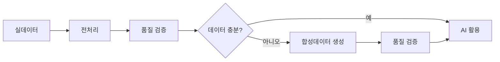
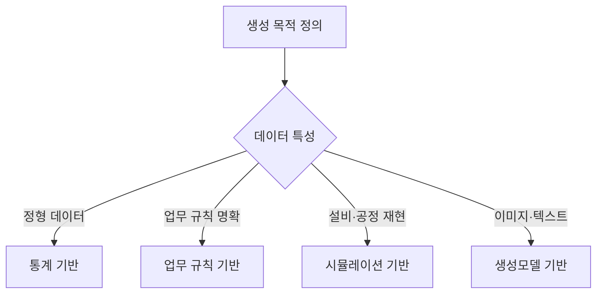

# E-2. 합성데이터 (Synthetic) 가이드

> 합성데이터는 실데이터만으로 확보하기 어려운 학습·검증 데이터를 보완하기 위해 생성한 인공 데이터이며, AI 학습·검증·운영에 필요한 데이터 확보 범위를 확장하는 데이터 확보 체계이다.

---

# 목차

1. [개요](#1-개요)
2. [왜 필요한가 (Why)](#2-왜-필요한가-why)
3. [무엇을 갖추나 (What)](#3-무엇을-갖추나-what)
4. [어디부터 적용하나 (Where)](#4-어디부터-적용하나-where)
5. [어떻게 구축·운영하나 (How)](#5-어떻게-구축운영하나-how)
6. [다른 주제와의 관계](#6-다른-주제와의-관계)
7. [KPI 및 Roadmap](#7-kpi-및-roadmap)
8. [Appendix](#8-appendix)

---

# 1. 개요

## 1.1 합성데이터란

합성데이터(Synthetic Data)는 실제 데이터를 직접 복제하는 것이 아니라, 원본 데이터의 통계적 특성, 관계 구조, 업무 규칙, 시계열 패턴 등을 반영하여 인공적으로 생성한 데이터이다.

합성데이터의 목적은 실데이터를 대체하는 것이 아니다. 실데이터만으로 확보하기 어려운 데이터를 보완하여 AI 학습, 검증, 테스트에 활용할 수 있는 데이터 범위를 확장하는 데 있다.

예를 들어 제조업에서는 Delamination과 같은 희귀 불량, 설비 장애, 안전사고와 같이 실제 발생 빈도가 매우 낮은 사례가 존재한다. 이러한 데이터는 실제 생산 이력이 많더라도 충분한 학습 데이터를 확보하기 어려운 경우가 많다.

합성데이터는 이러한 부족한 사례를 보완하여 AI가 다양한 패턴을 학습할 수 있도록 지원한다.

또한 개인정보, 고객 정보, 계약 정보와 같이 보안 및 규제로 인해 활용이 제한되는 데이터에 대해서도 원본 노출 위험을 낮춘 형태의 데이터를 제공할 수 있다.

따라서 합성데이터는 데이터를 생성하는 기술이 아니라, AI 활용을 위해 부족한 데이터를 보완하는 데이터 확보 수단으로 이해해야 한다.

---

## 1.2 적용 범위와 체계 내 위치

합성데이터는 실데이터를 대신하기 위해 사용하는 기술이 아니다.

실데이터가 충분하고 활용에도 제약이 없다면 실데이터를 우선 사용하는 것이 원칙이다. 합성데이터는 실데이터만으로 해결하기 어려운 데이터 부족, 데이터 불균형, 보안 제약과 같은 문제를 보완하기 위한 목적으로 활용한다.

AI-ready Data 체계에서 합성데이터는 데이터 확보 영역에 위치한다.

실데이터를 수집·정제한 이후에도 학습과 검증에 필요한 데이터가 부족한 경우, 합성데이터를 활용하여 부족한 영역을 보완한다.



합성데이터는 항상 실데이터를 기준으로 생성되며, 생성 이후에도 품질 검증과 위험 평가를 거쳐 활용 여부를 결정해야 한다.

따라서 합성데이터는 원본 데이터를 대체하는 체계가 아니라, 실데이터만으로 확보하기 어려운 영역을 보완하는 체계로 이해해야 한다.

---

# 2. 왜 필요한가 (Why)

실데이터는 AI 학습과 검증에 가장 중요한 자산이다. 그러나 실제 프로젝트에서는 필요한 데이터를 충분히 확보하지 못하거나, 확보하더라도 활용에 제약이 발생하는 경우가 많다.

특히 제조업에서는 희귀 불량, 설비 장애, 신규 제품과 같이 발생 빈도가 낮은 데이터가 많으며, 개인정보와 기밀정보를 포함한 데이터는 활용 범위가 제한되기도 한다.

합성데이터는 이러한 한계를 보완하여 실데이터만으로 확보하기 어려운 영역까지 AI 활용 범위를 확장할 수 있도록 지원한다.

---

## 2.1 데이터 부족의 구조적 유형

AI 프로젝트에서 데이터 부족은 전체 데이터 규모가 작은 경우만 의미하지 않는다.

실제 현장에서는 데이터 총량은 충분하지만 특정 사례나 특정 조건의 데이터만 부족한 경우가 더 많이 발생한다.

대표적인 유형은 다음과 같다.

| 유형 | 설명 | 예시 |
|--------|--------|--------|
| 희귀 이벤트 | 발생 빈도가 매우 낮음 | Delamination, 설비 장애 |
| 데이터 불균형 | 특정 클래스 비중이 극단적으로 낮음 | 정상 99.8%, 불량 0.2% |
| 신규 제품 | 운영 이력이 부족함 | 신규 소재, 신규 제품 |
| 신규 설비 | 과거 데이터가 없음 | 신규 생산라인 |
| 극한 상황 | 실제로 재현하기 어려움 | 비상 정지, 안전사고 |

예를 들어 특정 불량 유형이 전체 생산량의 0.1% 수준이라면 수십만 건의 생산 이력이 존재하더라도 실제 학습에 활용 가능한 불량 데이터는 매우 제한적일 수 있다.

이러한 경우 합성데이터를 활용하여 부족한 사례를 보완할 수 있다.

---

## 2.2 보안·규제 맥락

실제 데이터에는 개인정보, 고객 정보, 계약 정보, 설비 운영 정보 등 다양한 민감정보가 포함되어 있다.

이러한 데이터는 개인정보 보호 규정이나 기업 보안 정책으로 인해 외부 활용이 제한되거나 공유 자체가 어려운 경우가 많다.

합성데이터는 원본 데이터의 특성을 유지하면서도 개인정보와 기밀정보 노출 위험을 줄일 수 있기 때문에 다음과 같은 상황에서 활용할 수 있다.

- 외부 협력사와의 공동 개발
- 연구기관과의 데이터 공유
- 테스트 환경 구축
- 개발 및 검증용 데이터 확보

다만 합성데이터 역시 재식별 위험을 완전히 제거하는 것은 아니므로 별도의 위험 평가와 검증이 필요하다.

---

## 2.3 기대 효과

합성데이터를 활용하면 실데이터만으로 해결하기 어려운 데이터 확보 문제를 보완할 수 있다.

대표적인 기대 효과는 다음과 같다.

| 기대 효과 | 설명 |
|--------|--------|
| 희귀 사례 확보 | 부족한 불량·장애 데이터를 보완 |
| 데이터 불균형 개선 | 학습 데이터 균형 확보 |
| 테스트 범위 확대 | 다양한 운영 시나리오 검증 |
| 안전한 데이터 활용 | 개인정보·기밀정보 노출 위험 완화 |
| AI 개발 가속화 | 데이터 확보 기간 단축 |

합성데이터의 목적은 실데이터를 대체하는 것이 아니라, 실데이터만으로 확보하기 어려운 영역을 보완하여 AI 활용 범위를 확대하는 데 있다.

---

# 3. 무엇을 갖추나 (What)

합성데이터는 단순히 데이터를 생성하는 기술이 아니다.

어떤 데이터를 대상으로 할 것인지, 어떤 방식으로 생성할 것인지, 생성 결과를 어떻게 검증할 것인지를 함께 정의해야 실제 AI 활용에 적용할 수 있다.

합성데이터 체계는 크게 세 가지 요소로 구성된다.

```text
무엇을 합성할 것인가
→ 어떻게 생성할 것인가
→ 어떻게 검증하고 관리할 것인가
```

---

## 3.1 무엇을 합성하나

합성데이터는 모든 데이터를 대상으로 생성하는 것이 아니다.

실데이터 확보가 어렵거나, 발생 빈도가 매우 낮거나, 보안상 활용에 제약이 있는 데이터를 우선 대상으로 한다.

대표적인 대상은 다음과 같다.

| 유형 | 설명 | 예시 |
|--------|--------|--------|
| 희귀 불량 | 발생 빈도가 매우 낮은 품질 문제 | Delamination, Wicking |
| 설비 장애 | 실제 발생 사례가 적은 장애 | 베어링 파손, 과열 |
| 예외 상황 | 정상 운영 중 거의 발생하지 않음 | 비상 정지, 안전사고 |
| 신규 제품 | 운영 이력이 부족함 | 신규 소재, 신규 제품 |
| 신규 설비 | 데이터 축적이 부족함 | 신규 생산라인 |
| 민감정보 | 직접 활용이 어려움 | 고객, 인사, 계약 데이터 |

합성데이터의 적용 여부는 데이터 유형보다도 "왜 부족한가"를 기준으로 판단하는 것이 중요하다.

---

## 3.2 어떻게 만드나

합성데이터 생성 방식은 크게 네 가지 범주로 구분할 수 있다.

| 생성 방식 | 특징 | 대표 활용 사례 |
|--------|--------|--------|
| 통계 기반 | 분포와 상관관계 보존 | ERP, MES, 품질 데이터 |
| 업무 규칙 기반 | 현업 규칙과 조건 반영 | 설비 이상, 안전사고 |
| 시뮬레이션 기반 | 물리 환경 재현 | Digital Twin |
| 생성모델 기반 | 복잡한 패턴 생성 | 이미지, 텍스트 |

생성 방식은 최신 기술을 사용하는 것이 아니라 데이터 특성과 활용 목적에 따라 선택해야 한다.


---

### 통계 기반 생성

실제 데이터의 분포와 상관관계를 유지하면서 새로운 데이터를 생성하는 방식이다.

대표 기술

- Copula
- Bayesian Network

주요 적용 대상

- ERP
- MES
- 품질 데이터

---

### 업무 규칙 기반 생성

현업의 업무 규칙과 제약 조건을 활용하여 데이터를 생성하는 방식이다.

대표 적용 사례

- 안전사고 시나리오
- 설비 보호 로직
- 이상 상황 검증

---

### 시뮬레이션 기반 생성

실제 설비와 공정을 가상 환경에 구현하여 데이터를 생성하는 방식이다.

대표 적용 사례

- Digital Twin
- 신규 설비 검증
- 극한 운전 조건 검증

---

### 생성모델 기반 생성

실제 데이터 패턴을 학습하여 새로운 데이터를 생성하는 방식이다.

대표 기술

- CTGAN
- TVAE
- Diffusion
- LLM

주요 적용 대상

- 불량 이미지
- VOC
- 작업일지
- 정형 데이터

---

## 3.3 검증 항목과 합성 표시

합성데이터는 생성 자체보다 검증이 중요하다.

생성된 데이터가 실제 데이터의 특성을 유지하는지, 실제 AI 활용에 적합한지 확인해야 한다.

대표 검증 항목은 다음과 같다.

| 검증 영역 | 목적 | 대표 검증 항목 |
|--------|--------|--------|
| 통계 특성 | 분포 유지 여부 | 평균, 분산, 분위수 |
| 변수 관계 | 상관관계 유지 여부 | Correlation, Covariance |
| 업무 규칙 | 도메인 규칙 만족 여부 | 물리 제약, 업무 규칙 |
| 활용 적합성 | 실제 활용 가능 여부 | Accuracy, Recall, F1 |

또한 생성된 데이터는 실데이터와 구분하여 관리해야 한다.

이를 위해 Synthetic Tag를 함께 관리한다.

대표 관리 항목은 다음과 같다.

| 항목 | 설명 |
|--------|--------|
| 생성일 | 생성 시점 |
| 생성 방식 | Copula, CTGAN 등 |
| 생성 목적 | 학습, 검증, 테스트 |
| 버전 | 데이터 버전 |
| 소유자 | 관리 책임 조직 |

합성데이터는 실데이터를 대체하는 데이터가 아니라 별도로 관리되는 데이터 자산이라는 점을 명확히 해야 한다.

---

# 4. 언제 합성하나 (적용 판단)

합성데이터는 모든 AI 과제에 적용해야 하는 기술이 아니다.

실데이터가 충분하고 활용에도 제약이 없다면 실데이터를 사용하는 것이 원칙이다. 합성데이터는 실데이터만으로 해결하기 어려운 데이터 부족, 데이터 불균형, 보안 제약 문제를 보완하기 위한 수단으로 활용한다.

따라서 합성데이터 적용 여부는 생성 기술이 아니라 데이터 확보 관점에서 먼저 판단해야 한다.

---

## 4.1 적용 판단

다음 상황 중 하나 이상에 해당한다면 합성데이터 적용을 검토할 수 있다.

| 상황 | 설명 | 예시 |
|--------|--------|--------|
| 희귀 이벤트 | 발생 빈도가 매우 낮음 | Delamination, 설비 장애 |
| 데이터 불균형 | 특정 클래스가 부족함 | 정상 99.8%, 불량 0.2% |
| 신규 제품 | 운영 이력이 부족함 | 신규 소재, 신규 제품 |
| 신규 설비 | 과거 데이터가 부족함 | 신규 생산라인 |
| 보안 제약 | 원본 데이터 활용 제한 | 고객, 인사, 계약 데이터 |
| 테스트 데이터 부족 | 실제 재현이 어려움 | 비상 정지, 안전사고 |

반대로 다음 조건을 대부분 만족한다면 합성데이터가 반드시 필요하지 않을 수 있다.

| 판단 기준 | 설명 |
|--------|--------|
| 충분한 실데이터 존재 | 학습과 검증에 필요한 데이터 확보 완료 |
| 보안 제약 없음 | 개인정보 및 기밀정보 문제 없음 |
| 추가 수집 가능 | 데이터 확보 비용이 크지 않음 |
| 검증 환경 확보 | 실제 운영 환경에서 테스트 가능 |

합성데이터는 실데이터를 대체하기 위한 기술이 아니라 실데이터만으로 해결하기 어려운 문제를 보완하기 위한 수단이라는 점을 명확히 해야 한다.

---

## 4.2 비교 기준이 될 실데이터 확보

합성데이터는 실데이터를 기준으로 생성된다.

따라서 합성데이터를 생성하기 전에 비교 기준이 될 실데이터를 먼저 확보해야 한다.

실데이터가 충분하지 않거나 품질이 낮은 경우에는 합성데이터 역시 동일한 문제를 그대로 반영할 가능성이 높다.

생성 전에 최소한 다음 항목을 확인하는 것이 바람직하다.

| 점검 항목 | 확인 내용 |
|--------|--------|
| 데이터 규모 | 학습 가능한 최소 데이터 확보 여부 |
| 품질 수준 | 결측치, 오류, 중복 여부 |
| 대표성 | 실제 운영 환경을 반영하는지 |
| 최신성 | 현재 운영 조건과 일치하는지 |

합성데이터의 품질은 생성모델보다 기준 데이터의 품질에 더 큰 영향을 받는다.

따라서 실데이터 품질 확보가 선행되어야 한다.

---

## 4.3 생성 방식 선택 기준

생성 방식은 최신 기술이나 유행하는 모델을 기준으로 결정하지 않는다.

데이터 특성과 활용 목적에 따라 적절한 방식을 선택하는 것이 중요하다.



대표적인 선택 기준은 다음과 같다.

| 상황 | 우선 고려 방식 |
|--------|--------|
| 정형 데이터 생성 | 통계 기반 |
| 개인정보 보호 | 통계 기반 |
| 희귀 이벤트 생성 | 업무 규칙 기반 |
| 설비 이상 시나리오 | 업무 규칙 기반 |
| 신규 설비 검증 | 시뮬레이션 기반 |
| Digital Twin 활용 | 시뮬레이션 기반 |
| 이미지 생성 | 생성모델 기반 |
| 텍스트 생성 | 생성모델 기반 |

실제 프로젝트에서는 하나의 방식만 사용하는 경우보다 여러 방식을 조합하여 사용하는 경우가 많으며, 생성 이후에는 반드시 품질 검증과 위험 평가를 함께 수행해야 한다.

---

# 5. 예시 시나리오 (한눈에)

본 장에서는 Delamination 불량 예측 모델 구축 사례를 통해 합성데이터가 어떤 상황에서 활용되는지 간략히 살펴본다.

품질혁신팀은 Delamination 발생 가능성을 예측하는 AI 모델을 구축하고자 하였으나, 실제 생산 데이터 분석 결과 전체 생산 이력 대비 Delamination 사례 비율이 매우 낮아 학습 데이터 확보에 어려움을 겪고 있었다.

| 구분 | 건수 |
|--------|--------|
| 정상 | 1,240,000 |
| Delamination | 2,350 |

전체 생산 데이터는 충분했지만 실제로 학습에 활용 가능한 불량 사례는 매우 제한적이었다.

---

## 5.1 적용 전 / 후

| 적용 전 | 적용 후 |
|--------|--------|
| Delamination 학습 사례 부족 | 부족한 사례를 합성데이터로 보완 |
| 정상 데이터에 편향된 학습 | 다양한 불량 패턴 학습 가능 |
| 희귀 불량 검증 한계 | 다양한 시나리오 검증 가능 |
| 실데이터 추가 확보에 장기간 소요 | 검증용 데이터 확보 기간 단축 |

예를 들어 Delamination 사례가 전체 생산 데이터의 0.19% 수준에 불과한 경우, 모델은 정상 데이터에 과도하게 편향될 수 있다.

합성데이터를 활용하면 부족한 불량 사례를 보완하여 다양한 패턴을 학습할 수 있으며, 실제 운영 환경에서 발생 가능한 예외 상황도 함께 검증할 수 있다.

---

## 5.2 흐름 미리보기

합성데이터 구축은 단순히 데이터를 생성하는 작업이 아니다.

어떤 데이터를 보완할 것인지 정의하고, 적절한 생성 방식을 선택한 뒤, 품질 검증과 위험 평가를 거쳐 활용 가능한 데이터로 등록하는 과정을 포함한다.


Delamination 사례에서는 부족한 불량 데이터를 보완하기 위해 CTGAN 기반 합성데이터를 생성하였으며, 품질 검증을 거쳐 AI 모델 학습 데이터로 활용하였다.

이후 장에서는 어떤 생성 방식을 선택하는지, 어떤 절차로 구축하는지, 그리고 어떤 위험을 관리해야 하는지를 단계별로 설명한다.

---

## 6. 솔루션·도구 검토

합성데이터는 데이터 유형과 활용 목적에 따라 적합한 도구가 달라진다.

정형 데이터 생성에 적합한 도구와 이미지 생성에 적합한 도구는 서로 다르며, 시뮬레이션 기반 생성은 별도의 Digital Twin 또는 공정 시뮬레이션 환경이 필요할 수 있다.

따라서 특정 제품을 표준으로 정하기보다는 데이터 특성, 보안 요구사항, 활용 목적에 맞는 도구를 선택하는 것이 중요하다.

---

### 6.1 도구 유형 및 기능 비교

| 유형 | 대표 솔루션 | 주요 기능 | 대표 활용 사례 |
|--------|--------|--------|--------|
| 정형 데이터 합성 | SDV, Gretel, Mostly AI, YData | 테이블 데이터 생성 | ERP, MES, 품질 데이터 |
| 시계열 데이터 합성 | YData, Gretel, Hazy | 시계열 패턴 생성 | 설비 센서, 공정 데이터 |
| 이미지·비전 데이터 합성 | NVIDIA Omniverse, Unity, Diffusion 기반 플랫폼 | 이미지 생성 및 증강 | 불량 이미지 |
| 시뮬레이션 기반 | AnyLogic, Siemens Plant Simulation, Digital Twin 플랫폼 | 가상 환경 기반 데이터 생성 | 설비·공정 검증 |
| 품질 검증 | SDMetrics, Great Expectations | Utility 및 품질 검증 | 품질 평가 |

---

#### 정형 데이터 합성

정형 데이터 합성 도구는 ERP, MES, 품질 이력과 같은 테이블 형태 데이터를 생성하는 데 활용한다.

대표 기능

- 변수 분포 보존
- 변수 간 관계 유지
- 개인정보 보호
- 데이터 불균형 보완

대표 솔루션

- SDV
- Gretel
- Mostly AI
- YData

---

#### 시계열 데이터 합성

센서 데이터, 설비 로그, 생산 공정 데이터와 같이 시간 순서를 갖는 데이터를 생성하는 데 활용한다.

대표 기능

- 시계열 패턴 생성
- 계절성 및 주기성 반영
- 이상 상황 시뮬레이션

대표 활용 사례

- 진동 데이터
- 압력 데이터
- 온도 데이터

---

#### 이미지·비전 데이터 합성

불량 이미지, 검사 이미지, 객체 인식용 이미지를 생성하는 데 활용한다.

대표 기능

- 이미지 생성
- 데이터 증강
- 희귀 불량 생성

대표 솔루션

- NVIDIA Omniverse
- Stable Diffusion 기반 플랫폼
- Unity 기반 시뮬레이션 환경

---

#### 시뮬레이션 기반 생성

실제 설비와 공정을 가상 환경으로 재현하여 데이터를 생성한다.

대표 기능

- 설비 동작 재현
- 극한 조건 생성
- 반복 검증 환경 제공

대표 활용 사례

- Digital Twin
- 생산 공정 검증
- 설비 장애 시나리오

---

### 6.2 도구 선정 기준

합성데이터 도구는 기능 수보다 활용 목적에 얼마나 적합한지를 기준으로 평가해야 한다.

대표적인 검토 항목은 다음과 같다.

| 평가 항목 | 확인 내용 |
|--------|--------|
| Utility | 실제 데이터 특성을 충분히 유지하는가 |
| Security | 재식별 위험을 관리할 수 있는가 |
| 데이터 유형 적합성 | 정형·시계열·이미지·텍스트 중 어떤 데이터에 적합한가 |
| 설명 가능성 | 생성 결과를 설명할 수 있는가 |
| 온프레미스 지원 | 내부 환경에서 운영 가능한가 |
| 운영 편의성 | 반복 생성 및 버전 관리가 가능한가 |
| PoC 수행 용이성 | 단기간 검증이 가능한가 |

합성데이터는 Utility와 Security를 동시에 고려해야 한다.

원본 데이터와 지나치게 유사하면 개인정보 및 기밀정보 노출 위험이 증가하고, 반대로 보안성을 과도하게 높이면 실제 AI 활용 가치가 낮아질 수 있다.

따라서 도구 선정은 생성 성능뿐 아니라 활용 목적, 보안 요구사항, 운영 환경을 종합적으로 고려하여 결정하는 것이 바람직하다.

> 기능과 가격은 지속적으로 변경되므로 실제 도입 시에는 공식 문서와 PoC를 통해 검증하는 것을 권장한다.

---

# 7. 어떻게 만들고 운영하나 (How)

합성데이터 구축은 단순히 데이터를 생성하는 작업이 아니다.

어떤 데이터를 보완할 것인지 정의하고, 어떤 특성을 유지할 것인지 결정한 뒤, 적절한 생성 방식을 선택하고, 품질 검증과 위험 평가를 거쳐 활용 가능한 데이터 자산으로 관리해야 한다.

---

## 7.1 만드는 절차 — 합성데이터 구축 7단계

본 가이드는 아래 7단계 절차를 기준으로 합성데이터를 구축한다.

```text
① 생성 목적 정의
→ ② 보존 특성 정의
→ ③ 생성 방식 선택
→ ④ 합성데이터 생성
→ ⑤ 품질 검증
→ ⑥ 위험 관리
→ ⑦ 운영 및 자산 등록
```


| 단계 | 주요 활동 | 주요 산출물 |
|--------|--------|--------|
| 생성 목적 정의 | 활용 목적과 기대 효과 정의 | 활용 계획서 |
| 보존 특성 정의 | 유지할 특성 결정 | 보존 특성 정의서 |
| 생성 방식 선택 | 데이터 유형과 목적에 맞는 방식 선정 | 생성 전략 |
| 합성데이터 생성 | 데이터 생성 및 버전 관리 | 합성데이터셋 |
| 품질 검증 | Utility 및 품질 검증 | 검증 결과 |
| 위험 관리 | 재식별 위험 평가 | 위험 평가 결과 |
| 운영 및 자산 등록 | Registry 등록 및 활용 관리 | Synthetic Registry |

---

## 7.2 End-to-End 사례 (CCL Delamination)

품질혁신팀은 Delamination 예측 모델 구축을 추진하였으나, 실제 생산 데이터 분석 결과 전체 생산 이력 대비 Delamination 사례 비율이 매우 낮았다.

| 구분 | 건수 |
|--------|--------|
| 정상 | 1,240,000 |
| Delamination | 2,350 |

### ① 생성 목적 정의

```text
Delamination 예측 모델 학습용 데이터 확보
```

### ② 보존 특성 정의

| 항목 | 보존 여부 |
|--------|--------|
| 온도 분포 | 유지 |
| 압력 분포 | 유지 |
| 수분 함량 분포 | 유지 |
| Lot 패턴 | 유지 |
| Delamination 비율 | 보강 |
| 작업자 정보 | 제외 |

### ③ 생성 방식 선택

대상 데이터

```text
정형 생산 데이터
품질 이력 데이터
범주형 변수 포함
```

선택 방식

```text
CTGAN
```

### ④ 합성데이터 생성

```text
Delamination 사례 30,000건 생성
```

생성된 데이터에는 Synthetic Tag를 부여하여 실데이터와 구분하였다.

### ⑤ 품질 검증

| 항목 | 결과 |
|--------|--------|
| 통계 특성 | 유지 |
| 변수 관계 | 유지 |
| 업무 규칙 | 충족 |
| 활용 적합성 | 충족 |

모델 성능 비교

| 구분 | Recall |
|--------|--------|
| 원본 데이터 | 0.71 |
| 합성데이터 포함 | 0.84 |

### ⑥ 위험 관리

- Lot 번호 일반화
- 설비 ID 마스킹
- 재식별 위험 평가 수행

### ⑦ 운영 및 등록

```text
Synthetic_Delamination_V1

Version 1.0

Owner : 품질혁신팀

생성 방식 : CTGAN
```

Synthetic Registry에 등록하여 향후 품질 예측, 이상 탐지, 품질 Agent 과제에 재사용할 수 있도록 관리하였다.

---

## 7.3 운영과 위험 관리

합성데이터는 생성 이후에도 지속적으로 관리해야 한다.

생성된 데이터는 실데이터와 구분하여 관리하고, 품질 수준과 재식별 위험을 정기적으로 점검해야 한다.

### Synthetic Tag 관리

합성데이터 여부를 식별하기 위한 관리 정보이다.

대표 관리 항목

- 생성일
- 생성 목적
- 생성 방식
- 버전
- 소유자

---

### 재식별 위험 관리

대표 위험 유형은 다음과 같다.

| 유형 | 설명 |
|--------|--------|
| Singling Out | 특정 데이터 식별 가능 |
| Linkability | 외부 데이터와 결합 가능 |
| Inference | 민감정보 역추론 가능 |

합성데이터는 원본 데이터와 충분히 구분되면서도 활용 가치를 유지할 수 있도록 지속적으로 위험 수준을 점검해야 한다.

---

### Registry 등록 및 재사용

생성된 합성데이터는 Registry에 등록하여 조직 차원의 데이터 자산으로 관리한다.

대표 등록 항목

- Dataset 정보
- 생성 방식
- 품질 검증 결과
- 버전 정보
- 활용 이력

```text
합성데이터 생성
→ Registry 등록
→ AI 과제 활용
→ 신규 과제 재사용
→ 계열사 확산
```

합성데이터의 최종 목표는 데이터를 한 번 생성하고 폐기하는 것이 아니라, 반복적으로 활용 가능한 데이터 자산으로 운영하는 데 있다.

---

# 8. 다른 주제와의 관계

합성데이터는 독립적으로 운영되는 주제가 아니라 데이터 확보, 품질 검증, 보안, AI 평가 체계와 함께 활용된다.

실데이터를 기반으로 생성되고, 생성 이후에는 품질 검증과 위험 평가를 거쳐 활용되므로 AI-ready Data 체계 내 여러 주제와 긴밀하게 연결된다.

---

## 8.1 경계

| 인접 주제 | 합성데이터(E-2)가 하는 일 | 인접 주제가 하는 일 |
|--------|--------|--------|
| E-3 AI 평가 데이터 | 부족한 학습·검증 데이터를 생성 | 모델 성능과 활용 효과 검증 |
| F-4 비식별화 | 활용 가능한 데이터를 생성 | 개인정보 및 민감정보 보호 |
| C-2 데이터 품질 관리 | 합성데이터 생성 | 생성된 데이터의 활용 가능 여부 판정 |
| B-1 데이터 전처리 | 부족한 데이터 보완 | 원본 데이터 정제 및 구조화 |
| B-2 데이터 해설·주석 | 부족한 사례 생성 | 의미 정보와 정답(Label) 부여 |

---

### E-3 AI 평가 데이터와의 관계

합성데이터는 학습 데이터와 검증 데이터를 보완하는 역할을 수행한다.

그러나 합성데이터의 효과를 판단하기 위해서는 별도의 평가 데이터가 필요하다.

| 구분 | 합성데이터 | AI 평가 데이터 |
|--------|--------|--------|
| 목적 | 데이터 확보 | 모델 성능 검증 |
| 활용 시점 | 학습 및 검증 전 | 학습 및 검증 후 |
| 역할 | 부족한 데이터 보완 | 실제 효과 검증 |

합성데이터를 적용한 이후에는 반드시 평가 데이터를 활용하여 모델 성능 개선 여부를 확인해야 한다.

---

### F-4 비식별화와의 관계

비식별화와 합성데이터는 모두 개인정보와 기밀정보 보호를 지원하지만 목적이 다르다.

| 구분 | 비식별화 | 합성데이터 |
|--------|--------|--------|
| 목적 | 개인정보 보호 | 데이터 확보 |
| 결과 | 원본 데이터 변환 | 새로운 데이터 생성 |
| 활용 | 원본 활용 범위 확대 | 부족한 데이터 보완 |

비식별화는 원본 데이터를 보호하면서 활용하는 방식이고, 합성데이터는 새로운 데이터를 생성하는 방식이라는 차이가 있다.

---

### C-2 데이터 품질 관리와의 관계

합성데이터는 생성 자체보다 품질 검증이 중요하다.

생성된 데이터가 실제 AI 활용에 적합한지는 C-2 데이터 품질 관리 체계를 통해 최종 판단한다.

| 구분 | 합성데이터 | 데이터 품질 관리 |
|--------|--------|--------|
| 목적 | 데이터 생성 | 활용 가능 여부 판정 |
| 주요 관심사 | Utility, Security | 품질 기준 충족 여부 |
| 결과 | 합성데이터셋 | 품질 승인 결과 |

---

### 핵심 경계

합성데이터는 데이터를 생성하는 주제이다.

- E-3는 생성된 데이터의 효과를 평가한다.
- F-4는 원본 데이터를 보호한다.
- C-2는 생성된 데이터의 활용 가능 여부를 판정한다.

따라서 합성데이터는 실데이터만으로 확보하기 어려운 데이터를 보완하는 역할에 집중하며, 생성 이후의 품질 검증과 활용 판단은 다른 주제와 연계하여 수행한다.

---

# Appendix

## Appendix A. 주요 용어

### 합성데이터 (Synthetic Data)

원본 데이터를 직접 복제하지 않고, 실제 데이터의 특성과 패턴을 반영하여 생성한 인공 데이터이다.

합성데이터의 목적은 실데이터를 대체하는 것이 아니라, 실데이터만으로 확보하기 어려운 데이터를 보완하는 데 있다.

---

### Utility

합성데이터가 실제 AI 활용에 얼마나 도움이 되는지를 의미한다.

대표 평가 항목

- 통계적 유사성
- 변수 관계 유지
- 모델 성능 유지

---

### Security

합성데이터가 개인정보와 기밀정보를 얼마나 안전하게 보호하는지를 의미한다.

대표 평가 항목

- 재식별 위험
- 개인정보 노출 가능성
- 기밀정보 추론 가능성

---

### Synthetic Tag

합성데이터 여부를 식별하기 위한 관리 정보이다.

대표 관리 항목

- 생성일
- 생성 목적
- 생성 방식
- 버전
- 소유자

---

### 재식별 (Re-identification)

합성데이터를 활용하여 특정 개인이나 민감정보를 역으로 추론할 수 있는 위험을 의미한다.

대표 유형

- Singling Out
- Linkability
- Inference

---

### Copula

실제 데이터의 분포와 변수 간 상관관계를 유지하면서 데이터를 생성하는 통계 기반 기법이다.

주로 ERP, MES, 품질 데이터와 같은 정형 데이터 생성에 활용한다.

---

### Bayesian Network

변수 간 조건부 관계와 인과관계를 활용하여 데이터를 생성하는 통계 기반 기법이다.

품질 원인 분석, 장애 시나리오 생성 등에 활용할 수 있다.

---

### CTGAN

범주형 데이터를 포함한 정형 데이터 생성에 특화된 생성모델이다.

생산 이력, 품질 이력, MES 데이터 생성에 널리 활용된다.

---

### TVAE

정형 데이터 생성을 위해 활용되는 Variational Auto Encoder 기반 생성모델이다.

복잡한 데이터 패턴을 학습하여 새로운 데이터를 생성할 수 있다.

---

### SDV (Synthetic Data Vault)

정형 데이터 합성데이터 생성을 위한 대표적인 오픈소스 프레임워크이다.

Copula, CTGAN, TVAE 등 다양한 생성 방식을 지원한다.

---

### Diffusion Model

이미지 생성에 특화된 생성모델이다.

불량 이미지 생성, 검사 이미지 증강 등에 활용할 수 있다.

---

### LLM (Large Language Model)

텍스트 데이터를 생성하는 대규모 언어모델이다.

VOC, 작업일지, 정비 보고서와 같은 자연어 데이터 생성에 활용할 수 있다.

---


