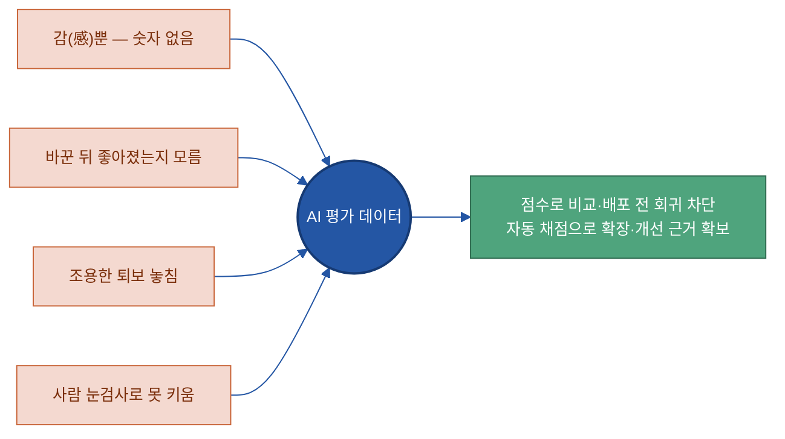
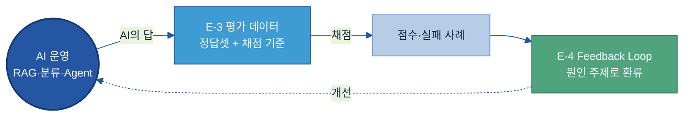
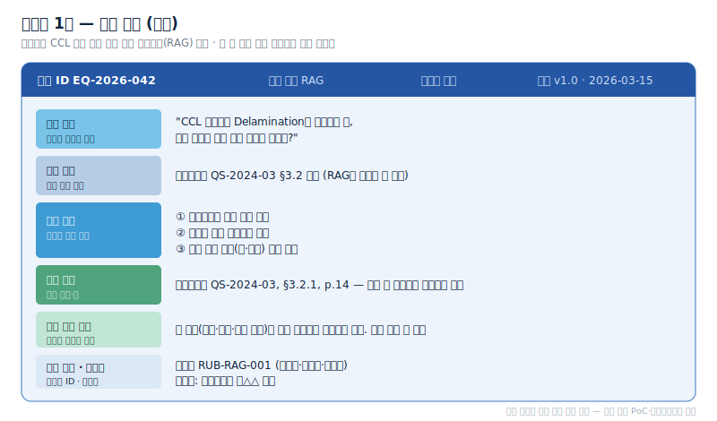
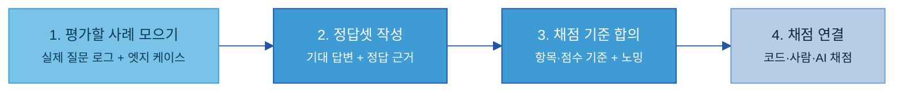
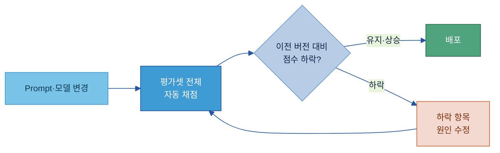
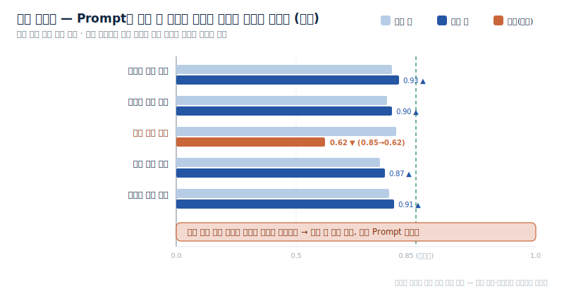

# E-3. AI 평가 데이터(AI Evaluation Data) 매뉴얼

---

## 목차

1. [Why — 왜, 언제 평가 데이터가 필요한가](#why)
    - [1.1 평가 데이터 없이 AI를 운영할 때의 문제](#s11)
    - [1.2 적용 판단 — 어떤 과제에 평가 데이터가 필요한가](#s12)
    - [1.3 어디부터 — 평가셋 구축 우선순위](#s13)
2. [What — 무엇인가 (무엇을 갖추나)](#what)
    - [2.1 정의 — AI 답을 채점하는 정답셋·기준](#s21)
    - [2.2 정답셋(Gold Set)](#s22)
    - [2.3 채점 기준(Rubric)](#s23)
    - [2.4 전문가 코멘트·오류 유형](#s24)
    - [2.5 과제 유형별 평가 데이터 차이](#s25)
3. [How — 어떻게 준비·운영하나](#how)
    - [3.1 평가 데이터 만드는 절차](#s31)
    - [3.2 채점 방법 — 코드·사람·AI](#s32)
    - [3.3 운영 — 회귀 테스트·실패 사례·버전 관리](#s33)
4. [Tech Stack — 솔루션 검토](#tech-stack)
    - [4.1 솔루션 유형](#s41)
    - [4.2 대표 솔루션과 온프레미스](#s42)
    - [4.3 선정 기준](#s43)
5. [Where — 다른 주제와의 관계](#where)

- [별첨 (Appendix)](#별첨-appendix)
- [참고자료 (References)](#참고자료-references) · [변경 이력 / 피드백 반영](#변경-이력--피드백-반영)

---

> **예시 표기 안내:** 본 가이드의 표·다이어그램·예시에 나오는 구체 값(점수·합격선·점검 주기·문서 번호·결함명 등)은 이해를 돕기 위한 가상 예시이며 실제 데이터가 아니다. 실제 값은 PoC·프로젝트에서 확정한다. 계열사명도 적용 맥락 설명용이다.

> **관련 가이드:** [B-2 데이터 해설·주석](../B-2%20데이터%20해설·주석/B-2%20데이터%20해설·주석.md) · [E-2 합성데이터](../E-2%20합성데이터/E-2%20합성데이터.md) · [D-3 Prompt·Harness 자산화](../D-3%20Prompt_Harness%20자산화/D-3%20Prompt_Harness%20자산화.md) · [E-4 데이터 Feedback Loop](../E-4%20데이터%20Feedback%20Loop/E-4%20데이터%20Feedback%20Loop.md) · [C-2 데이터 품질 관리](../C-2%20데이터%20품질%20관리/C-2%20데이터%20품질%20관리.md)

이 가이드는 AI 평가 데이터가 왜·언제 필요한지(1장), 무엇을 갖추는 것인지(2장), 실제로 어떻게 만들고 운영하는지(3장), 어떤 솔루션을 검토하는지(4장)를 다룬다. 끝까지 강조하는 메시지는 하나다. AI가 "잘 되는 것 같다"는 감(感)은 운영 근거가 되지 못한다. AI의 답이 맞았는지 채점하려면, 사람이 먼저 **무엇이 정답이고 무엇을 보고 맞다고 할지**를 데이터로 만들어 두어야 한다.

---

<a id="why"></a>

## 1. Why — 왜, 언제 평가 데이터가 필요한가

AI 평가 데이터는 모든 데이터에 다 만드는 것이 아니라 **과제를 골라서** 만든다. 먼저 평가 데이터가 없을 때 무엇이 막히는지 보고(1.1), 그 과제가 평가 데이터를 정식으로 갖춰야 하는 과제인지 판단한 다음(1.2), 어디부터 만들지 우선순위를 정한다(1.3).

<a id="s11"></a>

### 1.1 평가 데이터 없이 AI를 운영할 때의 문제

평가 데이터(정답셋·채점 기준)가 없으면 AI 성능을 숫자로 말할 방법이 없다. 담당자가 질문 몇 개를 던져 보고 "대체로 괜찮은 것 같다"는 인상으로 판단하게 되는데, 이 방식은 사람마다·날마다 결과가 달라지고 확장되지 않는다[\[3\]](#ref3). AI 과제를 운영하면서 반복적으로 부딪히는 문제는 다음과 같다.

- **성능을 숫자로 말하지 못한다.** "느낌이 더 좋다"로는 배포 결정의 근거가 서지 않는다. 경영진·현업에 "이번 개선으로 좋아졌다"고 설명할 비교 수치가 없다.
- **바꾼 뒤 더 나빠졌는지 모른다.** Prompt를 다듬거나 모델을 올렸을 때, 비교 기준점이 없으면 개선인지 퇴보인지 알 수 없다.
- **조용한 퇴보(회귀)를 놓친다.** 한 번 잘 답하던 항목이 모델·데이터·Prompt 변화로 조용히 나빠져도, 현장 민원이 들어오기 전까지 아무도 모른다[\[6\]](#ref6).
- **사람 눈검사에 묶여 못 키운다.** 산출물을 매번 사람이 눈으로 확인하면, AI 과제가 늘수록 검수 비용이 같이 늘어 병목이 된다.

> **제조 예시(가상):** 두산전자 CCL 라인의 품질 결함 원인 질의응답(RAG) 시스템에서 Prompt를 한 줄 수정한 뒤, 특정 결함 유형(Delamination)에 대한 답변 품질이 조용히 나빠졌다. 평가셋이 없어 배포 전에 잡지 못했고, 한참 뒤 현장 민원으로 발견했다. 평가셋이 있었다면 배포 직전 자동 채점에서 점수 하락으로 걸렸을 일이다.

평가 데이터를 갖추면 이 문제들이 다음처럼 바뀐다.

| 평가 데이터가 없을 때 | 평가 데이터를 갖췄을 때 |
|---|---|
| 감(感)으로 성능을 판단 | 정확도 등 점수로 비교 |
| 바꿨는데 더 나빠졌는지 모름 | 변경 전후 점수를 자동 비교해 퇴보를 즉시 확인 |
| 회귀를 사용자 민원 뒤에 발견 | 배포 전 자동 회귀 테스트로 차단 |
| 사람이 매번 눈검사 → 확장 불가 | 자동 채점으로 과제 수를 늘려도 검수 비용 고정 |
| "더 나은 것 같다"는 구두 보고 | 수치 근거로 보고·투자 정당화 |



<a id="s12"></a>

### 1.2 적용 판단 — 어떤 과제에 평가 데이터가 필요한가

모든 AI 과제에 정식 평가셋을 만들 필요는 없다. **틀렸을 때 손해가 큰가**와 **답의 옳고 그름을 분명히 판별할 수 있는가**, 두 가지로 판단한다. 둘 다 해당하면 정식 평가셋을 만들고, 그렇지 않으면 약식 점검으로 시작한다.

| 구분 | 어떤 과제인가 | 평가 데이터 |
|---|---|---|
| **정식 평가셋 필요** | 틀리면 품질·안전·비용에 직접 영향 + 답의 옳고 그름이 명확히 판별됨 | 정답셋·채점 기준을 갖춰 정기 채점 |
| **약식 점검으로 시작** | 참고용이고 사람이 최종 판단 + 틀려도 재시도·교정으로 복구 가능 | 출력 일부를 주기적으로 사람이 표본 점검 |

정식 평가셋이 필요한 과제는 다음 특성 중 하나라도 뚜렷할 때다.

- **정답이 존재한다** — 분류·검색·사실 질의응답처럼 맞다/틀리다를 분명히 가를 수 있다.
- **틀린 답이 현업 판단에 직접 들어간다** — 결함 판정, 원인 분석, 안전 관련 판단.
- **Prompt·모델·데이터가 자주 바뀐다** — 바뀔 때마다 성능을 다시 검증해야 한다.
- **규정·기준을 벗어나면 안 된다** — 품질 규격, 안전 기준, 법적 요건.

> **제조 예시(가상) — 우선도 판단:** 품질 결함 원인 질의응답(RAG)·검사 기준 검색·설비 이상 원인 추천은 틀리면 손해가 크고 정답이 분명해 **정식 평가셋**이 필요하다. C/S Report 분류는 오라우팅 정도의 영향이라 **중간**, 회의록 요약·초안 도우미는 사람이 검토 후 쓰므로 **약식 점검**으로 충분하다.

<a id="s13"></a>

### 1.3 어디부터 — 평가셋 구축 우선순위

정식 평가셋이 필요한 과제가 여러 개면 **사용량·손해 크기·변경 빈도** 세 가지가 모두 높은 과제부터 만든다.

| 축 | 판단 질문 |
|---|---|
| 사용량 | 하루에 몇 건을 처리하나 — 많을수록 오류의 영향 범위가 넓다 |
| 손해 크기 | 틀렸을 때 품질·안전·비용에 얼마나 직접 연결되나 |
| 변경 빈도 | Prompt·모델·데이터가 얼마나 자주 바뀌나 — 잦을수록 회귀 위험이 크다 |

> **권장:** 첫 평가셋은 실제 운영 데이터에서 대표 사례 100~300건 규모로 시작한다(과제 난이도·다양성에 따라 조정). 일반 공개 벤치마크는 제조 도메인 과제에 맞지 않으므로 자체 사례로 구성한다[\[7\]](#ref7). 우선도가 낮은 과제는 전수 평가셋 대신 출력 표본을 주기적으로 사람이 점검하다가, 사용량·중요도가 올라가면 그때 정식 평가셋으로 승격한다.

---

<a id="what"></a>

## 2. What — 무엇인가 (무엇을 갖추나)

AI 평가 데이터란 AI의 답을 채점하기 위한 **정답셋과 채점 기준 데이터**다.

<a id="s21"></a>

### 2.1 정의 — AI 답을 채점하는 정답셋·기준

AI 평가 데이터는 두 가지를 묶은 것이다. 하나는 **AI가 맞혀야 할 정답셋**(기준 질문과 그에 대한 올바른 답), 다른 하나는 **무엇을 보고 맞다고 할지의 채점 기준**이다. 이 둘이 있어야 AI의 답을 점수로 매기고, 모델 A와 B를 비교하고, 바꾼 뒤 좋아졌는지를 객관적으로 증명할 수 있다. 정답셋이 없으면 자동화 테스트의 합격·불합격 기준 자체가 서지 않는다.

평가 데이터는 학습 데이터와 다르다. **학습용 라벨은 AI에게 가르치는 데이터**([B-2 데이터 해설·주석](../B-2%20데이터%20해설·주석/B-2%20데이터%20해설·주석.md))이고, **평가용 정답셋은 AI를 채점하는 데이터**다. 같은 결함 사례라도 학습에 쓴 것과 채점에 쓰는 것은 섞이지 않게 분리한다 — 시험 문제를 미리 가르치면 시험이 무의미한 것과 같다. (경계는 [5장](#where).)

체계 내 위치를 보면, 평가 데이터는 AI를 운영하는 단계에서 그 답을 **채점하는 자리**에 있다. 채점 결과(점수와 실패 사례)는 [E-4 데이터 Feedback Loop](../E-4%20데이터%20Feedback%20Loop/E-4%20데이터%20Feedback%20Loop.md)가 원인 주제로 되돌려 개선으로 잇는다.



평가 데이터는 세 가지로 이루어진다. 정답셋(2.2)·채점 기준(2.3)·전문가 코멘트(2.4)다.

<a id="s22"></a>

### 2.2 정답셋(Gold Set)

정답셋(Gold Set)이란 AI에게 던질 **기준 질문**과 전문가가 승인한 **올바른 답**을 짝지어 둔 데이터다. 한 건(레코드)은 다음 항목으로 구성된다. 본문에는 대표 항목만 두고, 전체 항목 사전과 빈 템플릿은 [별첨](#별첨-appendix)에 둔다.

| 항목 | 쉬운 의미 | 예시값(가상) | 필수/선택 | 작성 주체 |
|---|---|---|---|---|
| 기준 질문 | AI에 던지는 실제 질문·요청 | "CCL 기판 Delamination 발생 시 먼저 확인할 항목은?" | 필수 | 현업 엔지니어 |
| 입력 맥락 | 질문과 함께 주는 배경 문서 | 공정표준서 QS-2024-03 §3.2 원문 | RAG형 필수 | 현업 엔지니어 |
| 기대 답변 | 전문가가 승인한 올바른 답 | "수분 함량·열압착 온도 프로파일·보관 환경 이력" | 필수 | 품질기술팀 선임 |
| 정답 근거 | 기대 답변의 출처 문서·절 | QS-2024-03, §3.2.1, p.14 | RAG형 필수 | 현업 엔지니어 |
| 허용 답변 범위 | 표현이 달라도 인정할 답 | 세 항목을 모두 언급하면 인정 | 선택 | 품질기술팀 선임 |
| 검수자·버전 | 최종 승인자·작성 시점 | 김△△ 책임 / v1.0, 2026-03 | 필수 | — |

각 항목의 쓰임은 분명하다. **정답 근거**는 답이 실제 문서에 기반했는지(지어내지 않았는지) 채점하게 해 준다 — 근거가 없으면 채점자가 임의로 판단하게 된다. **허용 답변 범위**는 AI가 표현만 다르게 정답을 말했는데 틀렸다고 처리하는 오류를 막는다. 정답셋 한 건을 실제로 채운 모습은 아래와 같다.



<a id="s23"></a>

### 2.3 채점 기준(Rubric)

채점 기준(Rubric)이란 "답변의 어떤 측면을, 어떤 기준으로 몇 점 줄 것인가"를 정의한 표다. 점수마다 **어떤 답이면 그 점수인지** 구체적으로 적어야 채점자가 누구든 같은 결과가 나온다. 업무에 맞춰 고르는 대표 채점 항목은 다음과 같다(정해진 표준 목록이 아니라 과제에 맞춰 고르는 예시다).

| 채점 항목 | 쉬운 의미 |
|---|---|
| 정확성 | 답이 사실과 맞는가 |
| 근거성 | 제공된 문서에서 나온 내용인가(지어내지 않았는가) |
| 완전성 | 질문의 모든 요소에 답했는가 |
| 일관성 | 여러 번 물어도 같은 답이 나오는가 |
| 안전성 | 위험하거나 규정에 어긋난 내용이 없는가 |
| 실행 가능성 | 현업이 바로 쓸 만큼 구체적인가 |

> **점수 기준은 행동으로 적는다(예시):** "1~5점으로 채점"이 아니라 "4점=문서 근거 있고 세 항목 모두 언급 / 2점=근거 있으나 한 항목 누락 / 0점=문서 근거 없거나 두 항목 이상 누락"처럼 적는다. 그래야 채점자 간 편차가 줄어든다.

문서를 검색해 답하는 RAG 과제는 검색과 생성 두 단계를 각각 채점한다. 이때 자주 쓰는 지표를 쉬운 말로 정리하면 다음과 같다(RAGAS 등 평가 프레임워크가 제공[\[1\]](#ref1)).

| 지표 | 쉬운 의미 |
|---|---|
| 충실성(Faithfulness) | 답이 검색된 문서 내용에만 근거하는가(문서에 없는 말을 지어내지 않는가) |
| 답변 관련성(Answer Relevancy) | 답이 질문에 정확히 대응하는가 |
| 맥락 정밀도(Context Precision) | 검색해 온 문서 중 실제로 쓸모 있는 것의 비율 |
| 맥락 재현율(Context Recall) | 정답에 필요한 정보가 검색 결과에 빠짐없이 들어왔는가 |

<a id="s24"></a>

### 2.4 전문가 코멘트·오류 유형

정답셋과 채점 기준만으로 점수는 나오지만, **왜 맞고 틀렸는지**까지 기록해야 평가 데이터가 개선의 재료가 된다. 단순 O/X를 넘어 전문가가 오답의 원인을 짧게 남기고, 자주 나오는 오답을 **오류 유형**으로 분류해 둔다.

| 오류 유형 | 쉬운 설명 | 예시(가상) |
|---|---|---|
| 환각 | 문서에 없는 내용을 지어냄 | Delamination 원인을 "전압 불안정"이라 답(문서에 없음) |
| 불완전 | 질문 일부만 답하고 누락 | 원인은 맞췄으나 대처 방법 누락 |
| 무관 | 질문과 관계없는 답 | "불량률 통계"를 물었는데 "검사 절차"를 답 |
| 오래된 정보 | 개정 전 기준으로 답 | 구버전 공정표준서 기준 적용 |

이 오류 유형 태그는 [3.3절](#s33)에서 실패 사례를 평가셋에 추가할 때, 어떤 종류의 오답이 많은지 패턴을 보는 데 쓰인다.

> **전문가 판단이 갈릴 때:** 같은 답을 두 전문가가 다르게 채점하면 채점 기준이 모호하다는 신호다. 이럴 때는 두 사람이 함께 몇 건을 채점해 보며 해석을 맞추고(노밍), 그래도 남는 불일치는 기준서에 사례로 적어 둔다. 평가자 간 의견이 얼마나 일치하는지를 수치로 보는 지표(예: Cohen's κ)도 있지만, 현업에서는 "기준이 모호하면 다시 맞춘다"는 원칙으로 충분하다.

<a id="s25"></a>

### 2.5 과제 유형별 평가 데이터 차이

평가 데이터의 구성은 같지만, AI 과제 유형마다 무엇을 채점하고 정답셋이 어떤 모양인지가 다르다.

| 과제 유형 | 무엇을 채점하나 | 정답셋의 특징 | 제조 예시(가상) |
|---|---|---|---|
| RAG(문서 검색·답변) | 충실성·맥락 정밀도·답변 관련성 | 질문 + 참조 문서 + 기대 답변 + 출처 | 결함 원인 질의응답, 검사 기준 검색 |
| 분류·예측 | 예측값이 정답 레이블과 맞는가 | 입력 + 정답 레이블 | C/S Report 불량 유형 분류 |
| 보고서 생성 | 완전성·정확성·형식 준수 | 입력 + 들어가야 할 항목 목록 + 루브릭 | 설비 이상 분석 보고서 생성 |
| Agent(다단계 행동) | 도구 선택·단계 순서·최종 완료 | 목표 + 기대 행동 경로 + 중간 점검점 | 이상 원인 추천 → 작업지시 생성 Agent |

Agent 과제는 단일 입출력이 아니라 **행동 경로 전체**가 정답이라는 점이 특징이다. 같은 입력이라도 실행 경로가 매번 달라질 수 있어, 최종 결과뿐 아니라 도구를 옳게 골랐는지·순서가 맞는지도 함께 본다.

---

<a id="how"></a>

## 3. How — 어떻게 준비·운영하나

평가 데이터는 한 번 만들고 끝이 아니라, 만든 뒤 변경 때마다 다시 채점하며 키워 간다. 만드는 절차(3.1)·채점 방법(3.2)·운영(3.3) 순으로 본다.

<a id="s31"></a>

### 3.1 평가 데이터 만드는 절차

평가 데이터는 네 단계로 만든다. 산출물 양식을 베끼는 것이 아니라, 실제 업무 사례에서 정답을 확인해 작게 시작하고 운영하며 키우는 것이 핵심이다.



1. **평가할 사례 모으기** — 운영 중인 AI의 실제 질문 로그에서 대표 사례를 뽑는다(개인정보는 마스킹). 자주 들어오는 질문뿐 아니라, 드물지만 틀리면 심각한 **엣지 케이스**(예외 결함, 애매한 질문, "해당 없음"이 정답인 경우)도 의도적으로 포함한다.
2. **정답셋 작성** — 각 질문에 해당 분야 전문가가 기대 답변을 작성하고, 참조 문서에서 근거 구절을 발췌해 정답 근거에 적는다. 표현이 다른 허용 답변 범위도 함께 정의한다.
3. **채점 기준 합의** — 채점 항목과 점수 기준을 팀이 함께 정한 뒤, 샘플 5~10건을 같이 채점해 보며 점수 해석을 맞춘다(노밍). 해석이 크게 갈리면 기준을 다시 손본다.
4. **채점 연결** — 각 항목을 어떤 방법으로 채점할지 연결한다(코드·사람·AI — [3.2](#s32)).

> **예시로 따라가기(가상) — CCL Delamination 질의응답 RAG:** ① 챗봇에 실제로 들어온 Delamination 관련 질의 100건을 모아 증상·공정별로 다양하게 대표 30건을 추린다 → ② 품질기술팀 선임이 각 질문의 기대 답변과 공정표준서 근거 절을 단다 → ③ 정확성·근거성·완전성 3항목을 0·2·4점 기준으로 합의하고 5건을 함께 채점해 해석을 맞춘다 → ④ 근거 일치 여부는 코드로, 답변 완전성은 AI 채점 + 저신뢰 건만 사람이 검수하도록 연결한다.

평가 문항의 품질이 평가 전체의 품질을 좌우한다. 같은 과제라도 문항을 어떻게 적느냐에 따라 채점 가능 여부가 갈린다.

| 구분 | 막연한 문항 | 채점 가능한 문항 |
|---|---|---|
| 질문 | "불량에 대해 설명해줘" | "CCL 기판 Delamination 발생 시 원인 파악을 위해 확인할 3가지 항목을 우선순위로 설명하라" |
| 채점 기준 | "1~5점으로 채점" | "4점=근거 있고 3항목 모두 / 2점=한 항목 누락 / 0점=근거 없음" |
| 결과 | 무엇이 정답인지 정의 불가 | 누가 채점해도 같은 점수 |

<a id="s32"></a>

### 3.2 채점 방법 — 코드·사람·AI

채점은 세 가지 방법으로 한다. 한 평가셋 안에서도 항목 성격에 따라 섞어 쓴다.

| 채점 방법 | 무엇을 채점하나 | 장점·한계 |
|---|---|---|
| **코드 자동 매칭** | 숫자·코드·정답 레이블처럼 정확히 비교 가능한 항목 | 빠르고 일관적 / 표현이 다른 정답을 못 잡음 |
| **사람 채점** | 전문 판단이 필요한 항목, 애매한 구간 | 가장 정확 / 느리고 비용이 큼 |
| **AI 채점(LLM 평가)** | 완전성·근거성 같은 텍스트 품질을 다른 AI가 채점 | 규모 있게 자동화 / 편향이 있어 사람 검수 병행 필요 |

AI가 AI를 채점하는 방법(LLM 평가, LLM-as-a-judge)은 규모를 키우는 데 유용하지만 한계가 분명하다[\[2\]](#ref2). 짧고 정확한 답보다 긴 답을 높게 주거나, 비교 시 먼저 나온 답을 선호하거나, 같은 답에도 실행할 때마다 점수가 흔들리는 경향이 있다. 특히 반도체·화학·기계처럼 전문 도메인에서는 사람과의 일치율이 떨어진다. 그래서 AI 채점은 **전문가 검수를 병행**하고, 신뢰도가 낮은 구간만 사람이 확인하는 구조로 운영한다.

<a id="s33"></a>

### 3.3 운영 — 회귀 테스트·실패 사례·버전 관리

평가 데이터를 갖추는 가장 큰 실익은 **바꿀 때마다 자동으로 다시 채점**하는 데서 나온다.

**회귀 테스트** — 모델·Prompt를 바꿨을 때 이전에 맞던 항목이 다시 틀리지 않는지 확인하는 절차다. 소프트웨어 개발에서 코드를 고칠 때마다 "기존 기능이 안 망가졌나" 테스트하는 것과 같다[\[6\]](#ref6). 전체 평가셋을 자동 채점해 이전 버전과 점수를 비교하고, 떨어진 항목을 찾아 고친 뒤 다시 돌린다.





**실패 사례 추가** — 운영 중 나온 오답을 정기적으로 모아 오류 유형을 달고 정답을 붙여 평가셋에 더한다. "AI가 한 번 틀린 것은 다음엔 안 틀린다"가 목표다. 이렇게 평가셋은 운영하면서 점점 커지고 촘촘해진다.

> **제조 예시(가상):** C/S Report 분류 AI가 "원인 미상" 건을 "기타"로 잘못 분류했다. 이 케이스를 정답("원인미상")과 함께 평가셋에 추가하면, 다음 모델 업데이트 때 회귀 테스트에서 같은 오류가 자동으로 걸린다.

**버전 관리** — 평가셋 자체를 코드처럼 버전으로 관리한다(v1.0, v1.1…). 어떤 평가셋 버전으로, 어떤 모델·Prompt 버전을 채점했을 때 점수가 얼마였는지를 함께 기록해야 "무엇을 바꿔서 좋아졌는지"를 추적할 수 있다. 항목을 추가·수정한 이력도 남겨 비교 가능성을 유지한다.

> **평가셋·채점 로직·실행을 묶은 틀(Evaluation Harness):** 정답셋·채점 기준·자동 채점 실행을 하나로 묶어 언제든 반복 실행하는 틀을 평가 하네스라 부른다. 공장 품질 검사 지그(Jig)처럼, AI 출력을 자동으로 통과시켜 여러 항목을 한 번에 측정한다. 솔루션이 이 틀을 제공한다([4장](#tech-stack)).

---

<a id="tech-stack"></a>

## 4. Tech Stack — 솔루션 검토

> **2층 연결:** 솔루션을 묶어서 평가·선정하려면 → [Tech Stack 비교 정본](../../Tech%20Player/01%20Tech%20Stack%20비교%20(솔루션×주제).md). 이 절은 E-3 관점에서 솔루션의 기능을 비교한다.

<a id="s41"></a>

### 4.1 솔루션 유형

평가 솔루션은 [3.2절](#s32)의 세 가지 채점 방법에 대응해 네 유형으로 나뉜다. 앞의 셋이 채점 방법이고, 넷째는 RAG·Agent 과제에 특화된 묶음이다.

| 유형 | 무엇을 하나 | 대표 솔루션 |
|---|---|---|
| **① 정답 매칭·정량 지표** | 기대 답변과 출력을 자동 비교(정답 일치·정량 점수) | RAGAS, MLflow |
| **② 사람 평가** | 전문가가 직접 채점하는 화면·과제 배정·이견 관리 | Langfuse, Braintrust, LangSmith |
| **③ AI 채점(LLM 평가)** | 다른 AI가 채점, 사람 평가를 자동화·확장 | DeepEval, RAGAS, Phoenix |
| **④ RAG·Agent 전용** | 검색·생성 단계별, 에이전트 행동 경로 품질 측정 | RAGAS, DeepEval, TruLens, Phoenix |

실무에서는 이 유형들을 섞는다. 정량 지표로 1차 거르고, AI 채점으로 2차로 점수 내고, 사람이 저신뢰 구간만 최종 확인하는 식이다.

<a id="s42"></a>

### 4.2 대표 솔루션과 온프레미스

제조 폐쇄망에서는 평가 데이터(정답셋·출력)가 외부로 나가지 않는 **온프레미스/셀프호스트** 가능 여부가 1차 기준이다. 대표 솔루션을 그 기준으로 정리한다.

| 솔루션 | 유형 | 한 줄 설명 | 오픈소스/상용 | 셀프호스트 |
|---|---|---|---|---|
| RAGAS [\[8\]](#ref8) | ①③④ | RAG 평가 지표가 사실상 표준 | 오픈소스 | 가능(로컬 실행) |
| DeepEval [\[9\]](#ref9) | ①②③④ | 코드(pytest)로 평가 작성·CI 연동 | 오픈소스(플랫폼 상용) | 가능(프레임워크) |
| Promptfoo [\[10\]](#ref10) | ①③ | CLI로 Prompt·모델 비교 | 오픈소스 | 가능 |
| OpenAI Evals [\[11\]](#ref11) | ①③ | 평가 프레임워크·벤치마크 | 오픈소스 | 가능(채점 시 LLM 필요) |
| MLflow [\[12\]](#ref12) | ①③ | 실험 추적에 평가·버전 관리 내장 | 오픈소스 | 가능(온프레미스 서버) |
| Langfuse [\[13\]](#ref13) | ①②③④ | 추적·평가·사람 어노테이션 통합 | 오픈소스 | 가능(Docker/K8s) |
| Arize Phoenix [\[14\]](#ref14) | ①②③④ | 관찰·평가, Docker 배포 | 오픈소스 | 가능 |
| LangSmith [\[15\]](#ref15) | ①②③④ | 추적·평가·데이터셋 관리 | 상용(무료 티어) | 엔터프라이즈 옵션 |
| Braintrust [\[16\]](#ref16) | ①②③④ | 평가 중심 품질 관리·CI 연동 | 상용(무료 티어) | 엔터프라이즈 옵션 |

> **주의:** 가격·버전·라이선스·온프레미스 지원 범위는 빠르게 바뀐다. 단정하지 말고 **도입 전 공식 문서·PoC로 확인**한다. AI 채점(LLM 평가)을 쓸 때는 채점용 AI 모델을 사내에 배포한 모델이나 사내 게이트웨이에 연결해야 데이터가 외부로 나가지 않는다.

<a id="s43"></a>

### 4.3 선정 기준

제조 현업에서 솔루션을 고를 때의 기준이다.

- **온프레미스/셀프호스트** — 사내 망에서 전체 평가가 돌고, 정답셋·출력이 외부로 나가지 않는가(최우선).
- **정답셋·실험 버전 관리** — 평가셋·모델·Prompt 버전을 연결해 회귀를 추적할 수 있는가.
- **채점 기준 커스텀** — 제조 도메인 전용 채점 기준과 AI 채점 프롬프트를 자유롭게 정의할 수 있는가.
- **CI 연동** — 사내 배포 파이프라인에 평가 단계를 넣어 기준 미달 시 배포를 막을 수 있는가.
- **한국어·도메인 적합성** — 한국어 채점이 제대로 되는가. 어떤 도구도 공식 보장하지 않으므로 PoC에서 직접 확인한다.

---

<a id="where"></a>

## 5. Where — 다른 주제와의 관계

| 인접 주제 | 그 주제의 역할 | E-3와의 경계 |
|---|---|---|
| [B-2 데이터 해설·주석](../B-2%20데이터%20해설·주석/B-2%20데이터%20해설·주석.md) | AI에게 가르치는 학습용 라벨 | **B-2는 학습용 정답, E-3는 채점용 정답.** 학습에 쓴 데이터와 평가에 쓰는 데이터는 분리 |
| [E-2 합성데이터](../E-2%20합성데이터/E-2%20합성데이터.md) | 부족한 데이터를 인공 생성 | **평가 사례가 부족하면 E-2로 후보를 만들고, 전문가가 검수해 E-3 정답셋으로 승급** |
| [D-3 Prompt·Harness 자산화](../D-3%20Prompt_Harness%20자산화/D-3%20Prompt_Harness%20자산화.md) | 업무 절차·판단을 Prompt로 자산화 | **D-3는 평가받는 대상(Prompt), E-3는 그 Prompt를 채점하는 기준.** 평가 점수가 D-3 개선의 근거 |
| [E-4 데이터 Feedback Loop](../E-4%20데이터%20Feedback%20Loop/E-4%20데이터%20Feedback%20Loop.md) | 운영 결과·오류를 원인 주제로 환류 | **E-3는 채점(무엇이 틀렸나), E-4는 그 결과를 원인별로 되돌림(어디를 고치나)** |
| [C-2 데이터 품질 관리](../C-2%20데이터%20품질%20관리/C-2%20데이터%20품질%20관리.md) | 데이터가 쓸 만한지 판정 | **C-2는 입력 데이터 품질, E-3는 AI 출력의 성능.** 채점 대상이 다름 |

---

## 별첨 (Appendix)

### 별첨 A — 정답셋 항목 사전 (전체)

본문 [2.2절](#s22)의 대표 항목을 포함한 정답셋 한 건의 전체 항목이다. 과제 유형(RAG·분류·생성·Agent)에 따라 필수 항목이 달라진다.

| 항목 | 쉬운 의미 | 예시값(가상) | 필수/선택 | 작성 주체 |
|---|---|---|---|---|
| 질문 ID | 항목 고유 번호 | EQ-2026-042 | 필수 | 시스템 자동 |
| 기준 질문 | 실제 질문·요청 | "CCL 기판 Delamination 발생 시 먼저 확인할 항목은?" | 필수 | 현업 엔지니어 |
| 과제 유형 | RAG·분류·생성·Agent | RAG | 필수 | 평가 설계자 |
| 입력 맥락 | 함께 주는 배경 문서 | QS-2024-03 §3.2 원문 | RAG형 필수 | 현업 엔지니어 |
| 기대 답변 | 전문가 승인 정답 | "수분 함량·온도 프로파일·보관 이력 점검" | 필수 | 품질기술팀 선임 |
| 정답 근거 | 출처 문서·절·페이지 | QS-2024-03, §3.2.1, p.14 | RAG형 필수 | 현업 엔지니어 |
| 허용 답변 범위 | 인정 가능한 다른 표현 | 세 항목 모두 언급 시 인정, 단위 누락 감점 | 선택 | 품질기술팀 선임 |
| 채점 기준 ID | 적용 루브릭 | RUB-RAG-001 | 필수 | 평가 설계자 |
| 오류 유형 태그 | 잡으려는 오류 유형 | 환각, 불완전 | 선택 | 평가 설계자 |
| 난이도 | 쉬움·보통·어려움 | 보통 | 선택 | 현업 엔지니어 |
| 검수자 | 최종 승인자 | 품질기술팀 김△△ 책임 | 필수 | — |
| 버전·생성일 | 버전·작성 시점 | v1.0 / 2026-03-15 | 필수 | 시스템 자동 |

### 별첨 B — 빈 템플릿 + 완성 1건

```
질문 ID: [자동 생성]
기준 질문:
과제 유형: [RAG / 분류 / 생성 / Agent]
입력 맥락: [참조 문서 원문 또는 N/A]
기대 답변:
정답 근거: [출처 문서명·절·페이지]
허용 답변 범위:
채점 기준 ID:
오류 유형 태그:
난이도: [쉬움 / 보통 / 어려움]
검수자:
버전·생성일: v1.0 /
```

완성 예시(가상 — 분류 과제):

```
질문 ID: EQ-2026-087
기준 질문: [C/S Report 원문] "기판 표면 하얀 반점 + 레이어 간 분리 징후, 리플로우 후 발생"
과제 유형: 분류
입력 맥락: N/A (분류 모델은 문서 참조 없이 판정)
기대 답변: Delamination
허용 답변 범위: "Delamination" 또는 "층간 분리"
채점 기준 ID: RUB-CLS-002
오류 유형 태그: 오분류
난이도: 어려움 (Blister와 혼동 가능)
검수자: PCB 품질기술팀 박△△ 선임
버전·생성일: v1.0 / 2026-04-02
```

## 참고자료 (References)

본문 곳곳의 **[N]** 표시를 누르면 아래 해당 항목으로 이동한다.

**개념·방법**
- <a id="ref1"></a>**[1]** RAGAS — Metrics (RAG 평가 지표) — <https://docs.ragas.io/en/stable/concepts/metrics/>
- <a id="ref2"></a>**[2]** LLM-as-a-Judge 가이드 — Confident AI — <https://www.confident-ai.com/blog/why-llm-as-a-judge-is-the-best-llm-evaluation-method>
- <a id="ref3"></a>**[3]** LLM Evaluation Metrics and Methods, Explained Simply — Evidently AI — <https://www.evidentlyai.com/llm-guide/llm-evaluation-metrics>
- <a id="ref4"></a>**[4]** Building a Golden Dataset for AI Evaluation — Maxim AI — <https://www.getmaxim.ai/articles/building-a-golden-dataset-for-ai-evaluation-a-step-by-step-guide/>
- <a id="ref5"></a>**[5]** RAG Evaluation — Hugging Face Cookbook — <https://huggingface.co/learn/cookbook/en/rag_evaluation>
- <a id="ref6"></a>**[6]** LLM Regression Testing Pipeline — TestQuality — <https://testquality.com/llm-regression-testing-pipeline/>
- <a id="ref7"></a>**[7]** LLM Benchmarking for Enterprise Production — TrueFoundry — <https://www.truefoundry.com/blog/llm-benchmarking-enterprise-production>

**솔루션**
- <a id="ref8"></a>**[8]** RAGAS — <https://ragas.io>
- <a id="ref9"></a>**[9]** DeepEval (Confident AI) — <https://deepeval.com>
- <a id="ref10"></a>**[10]** Promptfoo — <https://www.promptfoo.dev>
- <a id="ref11"></a>**[11]** OpenAI Evals — <https://github.com/openai/evals>
- <a id="ref12"></a>**[12]** MLflow LLM Evaluate — <https://mlflow.org/docs/latest/genai/eval-monitor/>
- <a id="ref13"></a>**[13]** Langfuse — <https://langfuse.com>
- <a id="ref14"></a>**[14]** Arize Phoenix — <https://phoenix.arize.com>
- <a id="ref15"></a>**[15]** LangSmith (LangChain) — <https://smith.langchain.com>
- <a id="ref16"></a>**[16]** Braintrust — <https://www.braintrust.dev>

---

## 변경 이력 / 피드백 반영

| 일자 | 버전 | 피드백 (누가/무엇) | 반영 내용 | 반영 위치 |
|------|------|-------------------|-----------|-----------|
| 2026-06-26 | 0.1 | 초안 — 00 전체 목차 E-3 블록 기반, B-1·B-3 형식 본보기 | 멀티 에이전트 리서치(Why/When·What/How·Tech Stack 3클러스터) → 5섹션 작성. 정본 모델: 구성 3요소(정답셋·채점 기준·전문가 코멘트)·만드는 절차 4단계·채점 방법 3가지·솔루션 유형 4가지. 다이어그램 5개(02 컬러)·SVG 2개(정답셋 카드·회귀 스코어카드). KQ 6개 전부 커버. | 전체 |
