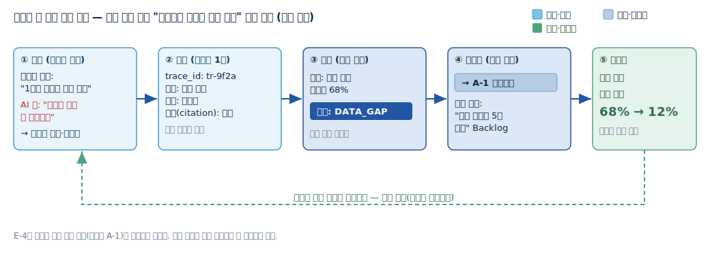
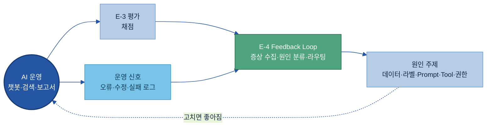
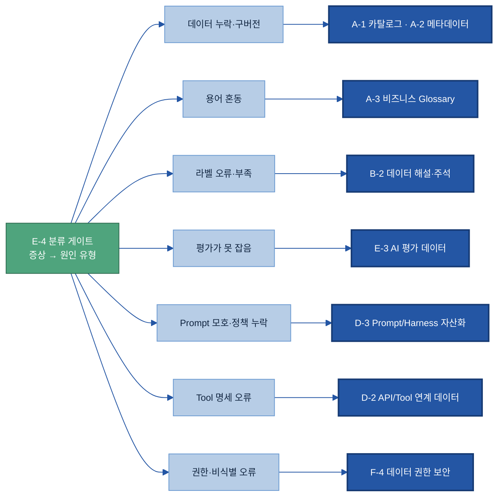
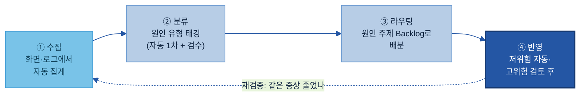
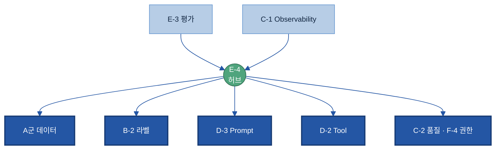

# E-4. 데이터 Feedback Loop(피드백 환류) 매뉴얼

---

## 목차

- [이 가이드가 답하는 4가지 질문](#key-questions)

1. [Why — 왜 필요한가](#s1)
    - [1.1 현업 Pain Point](#s11)
    - [1.2 기대 효과](#s12)
2. [What — 무엇인가·무엇을 갖추나](#s2)
    - [2.1 데이터 Feedback Loop란 + 체계 내 위치](#s21)
    - [2.2 피드백 수집 항목](#s22)
    - [2.3 오류 유형 분류](#s23)
    - [2.4 개선 과제 연결판 — 라우팅 지도](#s24)
3. [When — 어디서 피드백을 모으나](#s3)
    - [3.1 기본 수집 지점](#s31)
    - [3.2 어디부터 — 우선순위](#s32)
4. [How — 어떻게 준비·운영하나](#s4)
    - [4.1 수집 → 분류 → 라우팅 → 반영 4단계](#s41)
    - [4.2 피드백 1건의 기록 항목](#s42)
    - [4.3 원인 주제로 라우팅하는 운영 규칙](#s43)
    - [4.4 운영 — 자동·수동 반영 게이트와 역할](#s44)
5. [Tech Stack — 솔루션 검토](#s5)
    - [5.1 솔루션 세 갈래](#s51)
    - [5.2 선정 기준](#s52)
6. [Where — 다른 주제와의 관계](#s6)

- [별첨 (Appendix)](#별첨-appendix) · [참고자료 (References)](#참고자료-references) · [변경 이력 / 피드백 반영](#변경-이력--피드백-반영)

---

> **예시 표기 안내:** 본 가이드의 표·예시에 나오는 구체 값(질문·수치·실패율·설비/부품명·태그·날짜 등)은 이해를 돕기 위한 가상 예시이며 실제 데이터가 아니다. 실제 값·임계값은 PoC·프로젝트에서 확정한다. 계열사명도 적용 맥락 설명용이다.

> **관련 가이드:** [A-1 데이터 카탈로그](../A-1%20데이터%20카탈로그/A-1%20데이터%20카탈로그.md) · [B-2 데이터 해설·주석](../B-2%20데이터%20해설·주석/B-2%20데이터%20해설·주석.md) · [C-1 Observability](../C-1%20Observability/C-1%20Observability.md) · [C-2 데이터 품질 관리](../C-2%20데이터%20품질%20관리/C-2%20데이터%20품질%20관리.md) · [D-2 API/Tool 연계 데이터](../D-2%20API_Tool%20연계%20데이터/D-2%20API_Tool%20연계%20데이터.md) · [D-3 Prompt/Harness 자산화](../D-3%20Prompt_Harness%20자산화/D-3%20Prompt_Harness%20자산화.md) · [E-3 AI 평가 데이터](../E-3%20AI%20평가%20데이터/E-3%20AI%20평가%20데이터.md) · [F-4 AI 데이터 권한 보안](../F-4%20AI%20데이터%20권한%20보안/F-4%20AI%20데이터%20권한%20보안.md)

이 가이드는 피드백 환류가 왜 필요한지(1장), 무엇이고 무엇을 갖추는지(2장), 어디서 피드백을 모으고 어디부터 시작할지(3장), 실제로 어떻게 수집·분류·라우팅하고 운영하는지(4장)를 다룬다. 끝까지 강조하는 메시지는 하나다. E-4는 고장을 직접 고치는 주제가 아니라, AI를 쓰다 나온 문제(증상)를 모아 "어디를 고쳐야 하는지"를 가려내 원인 주제로 되돌려 보내는 허브다. 실제 수리는 라우팅된 그 주제에서 한다.

## 이 가이드가 답하는 4가지 질문

| 질문 | 한 줄 답 | 본문 |
|---|---|---|
| AI 운영 중 무엇을 피드백으로 모으나 | 틀린 답·사용자 수정·근거 누락·Tool 호출 실패·사람 승인/거절 등 운영에서 나온 신호를 모은다 | [2.2](#s22) · [3.1](#s31) |
| 모은 피드백을 어떻게 분류하나 | 데이터·라벨·Prompt·Tool·권한·업무 정책 중 어느 원인인지 유형으로 태깅한다 | [2.3](#s23) |
| 그 피드백을 어떤 개선으로 연결하나 | 원인 유형마다 정해진 주제로 보낸다 — 데이터 누락은 A군, 라벨은 B-2, Prompt는 D-3, Tool은 D-2, 권한은 F-4 | [2.4](#s24) · [4.3](#s43) |
| 무엇은 자동 반영하고 무엇은 사람이 보나 | 영향이 좁고 명확한 저위험은 자동 반영 후보, 고객·안전·보안에 닿는 고위험은 전문가 검토 후 반영 | [4.4](#s44) |

---

## 1. Why — 왜 필요한가

AI는 한 번 만들어 끝나는 시스템이 아니라 쓰면서 계속 다듬어야 하는 시스템이다. 그런데 운영 중에 나온 오류·불만·실패가 데이터로 남지 않으면, 무엇이 약한지도 모른 채 같은 실수가 반복된다. 피드백 환류는 이 운영 신호를 모아 "어디를 고쳐야 하는가"로 바꿔 주는 체계다.

### 1.1 현업 Pain Point

피드백을 모아 되돌리는 체계가 없으면 제조 현장에서 다음 문제가 반복된다.

| 문제 | 무슨 일이 벌어지나 |
|---|---|
| 같은 오류가 반복되는데 어디를 고칠지 모른다 | 정비 챗봇이 특정 부품 질문에 계속 틀린 답을 내도, 그 원인이 근거 문서 누락인지·라벨 오류인지·지시문(Prompt) 문제인지 가려지지 않아 방치된다. |
| 사용자 불만이 흩어져 사라진다 | 사용자가 답을 고쳐 쓰거나 "도움이 안 됐다"를 눌러도 대화가 끝나면 흔적 없이 사라져, 어느 기능이 약한지 알 수 없다. |
| 일회성 수정에 그쳐 개선이 쌓이지 않는다 | 오류를 그때그때 담당자가 손으로 보완할 뿐 개선 이력이 공유되지 않아, 같은 패턴이 다른 과제에서도 또 터진다. |
| "AI가 점점 좋아진다"는 약속이 안 지켜진다 | 환류 없이는 AI가 출시 수준에 멈추거나, 시간이 지나며 데이터가 달라져(데이터 드리프트(Data Drift)) 오히려 나빠진다. |

이들의 공통점은 데이터·모델이 없는 것이 아니라, 운영 중 나온 신호를 모아 원인을 가리고 책임 주제로 되돌리는 과정이 빠져 있다는 점이다.

### 1.2 기대 효과

피드백을 체계적으로 수집 → 분류 → 원인 주제로 연결 → 개선 → 재검증하는 고리가 돌면, 운영할수록 AI가 좋아지는 선순환(데이터 플라이휠(Data Flywheel)[\[1\]](#ref1))이 작동한다. 더 많이 쓸수록 더 나은 데이터가 쌓이고, 그 데이터가 다시 더 나은 AI를 만드는 구조다. 효과는 세 가지로 정리된다.

- **반복 실수가 점점 줄어든다.** 같은 유형의 오류 빈도가 개선 주기마다 내려간다.
- **개선 우선순위가 데이터로 정해진다.** "어느 질문 유형에서 오류가 많고 손해가 큰가"를 빈도×영향도로 줄 세워, 직관이 아니라 수치로 무엇부터 고칠지 정한다.
- **원인이 추적되어 책임 주제가 분명해진다.** 증상을 분류하면 고칠 곳(원인 주제)이 드러나, "누가 무엇을 고치는가"가 명확해진다.

아래는 피드백 루프가 없을 때와 있을 때의 차이다.

| 구분 | 피드백 루프 없음 (Before) | 피드백 루프 있음 (After) |
|---|---|---|
| 오류 인식 | 사용자가 직접 말하거나 그냥 넘어감 | 오류 발생 시 자동 로그·수집 |
| 원인 파악 | 감으로 추정, 원인 불명 | 오류 유형 분류 → 원인 주제 매핑 |
| 개선 과제 | 발생 건별 임시 처리 | 빈도×영향 기준으로 Backlog 우선순위화 |
| 개선 반영 | 담당자 개인 지식, 다음 버전에 미반영 | 개선 이력 공유·버전 기록 |
| 품질 추이 | 점검 기준 없음, 퇴보를 못 알아챔 | 주기별 오류율 감소 추이 측정 |

이 흐름이 한 건의 피드백에서 어떻게 도는지는 아래 예시가 보여준다([4.1](#s41)에서 절차로 다시 따라간다).

## 2. What — 무엇인가·무엇을 갖추나

이 장은 데이터 Feedback Loop가 무엇이고 무엇으로 이루어지는지를 정의한다. 실제 수집·운영 절차는 [4장](#s4)에서 다루고, 여기서는 정의와 구성 요소 — 무엇을 모으고(수집 항목), 무엇으로 가르고(오류 유형), 어디로 보내는가(라우팅 지도) — 를 정한다.

### 2.1 데이터 Feedback Loop란 + 체계 내 위치

데이터 Feedback Loop는 AI 운영 결과·오류·사용자 피드백을 모아 다시 데이터·라벨·Prompt·Tool 개선으로 되돌리는 환류 체계다. 핵심 성격은 두 가지다. 첫째, 이 주제는 **증상을 모아 원인 주제로 라우팅하는 허브**다 — 직접 데이터를 고치거나 라벨을 다시 달거나 Prompt를 바꾸지 않는다. 그 일은 각 원인 주제(A군·B-2·D-2·D-3·E-3·F-4)에서 한다. 둘째, 이 주제는 **AI를 만드는 일이 아니라 AI가 쓸 데이터를 정비하는 일**이다 — 모델 재학습 알고리즘이 아니라, 운영 신호를 "다음에 무슨 데이터를 정비할지"로 바꾸는 데이터 준비 활동이다.

체계 내 위치로 보면, E-4는 평가(E-3)가 채점한 결과와 운영에서 나온 신호를 받아 원인 주제로 되돌리는 닫힌 고리의 회송 지점이다.

피드백 루프가 갖춰야 할 것은 세 가지다 — 무엇을 모을지(수집 항목, [2.2](#s22)), 무엇으로 가를지(오류 유형, [2.3](#s23)), 어디로 보낼지(라우팅 지도, [2.4](#s24)).

### 2.2 피드백 수집 항목

피드백 데이터는 한 종류가 아니다. 운영 중 모을 수 있는 신호는 사용자가 직접 남기는 것, 사용자 행동에서 읽히는 것, 시스템이 자동으로 남기는 것 세 갈래다. 한 신호만 믿으면 노이즈가 되므로, 둘 이상을 함께 보고 판단한다[\[10\]](#ref10).

| 갈래 | 수집 항목 | 무엇이고 어떻게 생기나 |
|---|---|---|
| 사용자가 직접 남김 | 좋아요/싫어요 | 응답에 대한 만족 여부를 화면에서 누름 |
| | 직접 수정(고쳐 씀) | 사용자가 AI 답을 고쳐 저장 — "내가 고쳤다 = 틀렸다"는 가장 강한 신호 |
| | 자유 의견·코멘트 | 불만·이유·개선 요청을 글로 남김 |
| 행동에서 읽힘 | 재질문 | "다시 설명해줘"처럼 같은 요청을 다시 함 |
| | 응답 무시·우회 | AI 답을 안 쓰고 사람이 직접 자료를 찾음 |
| | 세션 중단 | 답을 받다 도중에 떠남 |
| 시스템이 자동 기록 | Tool 호출 실패 | 에이전트가 부른 기능이 오류·시간초과·파라미터 불일치로 실패 |
| | 근거 누락 | 출처(citation) 없이 답을 생성 |
| | 사람 승인/거절 | 사람 승인 단계에서 반려된 결과와 반려 사유 |
| | 낮은 평가 점수 | 자동 평가기가 임계값 미달로 판정 |

> **권장 — 자동부터.** 다섯 갈래 중 시스템이 자동으로 남기는 것(실패 로그·Tool 호출 실패)이 별도 화면 작업 없이 바로 모이므로 먼저 켠다. 화면 버튼·수정 수집은 사용자 경험(UX) 설계가 필요해 그다음에 붙인다.

### 2.3 오류 유형 분류

모은 피드백은 그대로 두면 증상 더미일 뿐이다. 각 건이 어느 원인에서 비롯됐는지 유형으로 갈라야 고칠 곳이 정해진다. 제조 AI 운영에서 만나는 원인은 여섯 가지로 모인다.

| 오류 유형 | 정의 | 증상 예시 (가상) |
|---|---|---|
| 데이터 문제 | 학습·검색 데이터 자체가 없거나·틀리거나·옛 버전 | "현재 재고 없음"이라 답했지만 실제로는 있음 — 데이터가 갱신 안 됨 |
| 라벨 문제 | 학습 데이터의 라벨·주석이 틀렸거나 부족 | 외관 검사 AI가 정상 제품을 불량으로 분류 — 라벨 기준 불일치 |
| Prompt 문제 | 지시문(Prompt)이 모호·불완전하거나 업무 기준과 안 맞음 | "점검 보고서 요약"에 핵심 지표(마모율) 기준이 없어 빠뜨림 |
| Tool 문제 | 에이전트가 부르는 기능의 명세 오류·파라미터 불일치·변경 | 부품 발주 기능 호출 시 수량 항목 이름이 바뀌어 실패 |
| 권한 문제 | 접근 권한이 모자라거나 민감정보 가림 설정이 잘못됨 | 협력사 단가를 못 읽어 견적 산출 실패 |
| 업무 정책 문제 | 답은 기술적으로 맞지만 업무 규칙·기준과 충돌 | "최소 발주량 50개" 규칙이 빠져 1개 발주를 지시 |

> **용어 — 증상과 원인.** 같은 증상("AI가 베어링 교체 주기를 못 답한다")이라도 원인은 데이터 누락일 수도, Prompt 누락일 수도 있다. 분류란 증상에서 원인 유형을 가려내는 일이다. 한 건이 두 원인에 걸치면 둘 다 태깅하고 주된 원인을 함께 표시한다.

### 2.4 개선 과제 연결판 — 라우팅 지도

오류 유형이 정해지면 가야 할 곳이 정해진다. 아래가 E-4 허브의 핵심 산출물인 라우팅 지도다. E-4는 분류까지만 하고, 실제 수리는 화살표가 가리키는 주제에서 한다.

| 오류 유형 | 라우팅 대상 | 그 주제가 하는 일 |
|---|---|---|
| 데이터 문제 | [A-1 카탈로그](../A-1%20데이터%20카탈로그/A-1%20데이터%20카탈로그.md) · A-2 메타데이터 | 빠진 데이터를 등록·갱신, 속성 보완 |
| 용어 혼동 | [A-3 비즈니스 Glossary](../A-3%20비즈니스%20Glossary/A-3%20비즈니스%20Glossary.md) | 엇갈린 용어를 표준 정의로 통일 |
| 라벨 문제 | [B-2 데이터 해설·주석](../B-2%20데이터%20해설·주석/B-2%20데이터%20해설·주석.md) | 라벨·주석을 다시 달거나 기준 보완 |
| 평가가 못 잡음 | [E-3 AI 평가 데이터](../E-3%20AI%20평가%20데이터/E-3%20AI%20평가%20데이터.md) | 놓친 실패 유형을 평가셋에 추가 |
| Prompt 문제 | [D-3 Prompt/Harness 자산화](../D-3%20Prompt_Harness%20자산화/D-3%20Prompt_Harness%20자산화.md) | 지시문을 수정·버전 관리 |
| Tool 문제 | [D-2 API/Tool 연계 데이터](../D-2%20API_Tool%20연계%20데이터/D-2%20API_Tool%20연계%20데이터.md) | Tool 명세·파라미터를 갱신 |
| 권한 문제 | [F-4 데이터 권한 보안](../F-4%20AI%20데이터%20권한%20보안/F-4%20AI%20데이터%20권한%20보안.md) | 접근 권한·비식별 규칙 보정 |

## 3. When — 어디서 피드백을 모으나

데이터 Feedback Loop는 AI를 쓰는 이상 모든 과제에 필요한 기본형 주제다. 따라서 "할지 말지"가 아니라 "어디서 모으고, 어디부터 시작하나"가 문제다.

### 3.1 기본 수집 지점

피드백은 AI가 일하는 길목 다섯 곳에서 나온다.

| 수집 지점 | 모이는 신호 | 비고 |
|---|---|---|
| 사용자 상호작용 화면 (챗봇·검색·보고서 생성) | 좋아요/싫어요, 재질문, 직접 수정, 세션 중단 | 가장 직접적 |
| 사람 승인·거절 단계 | 승인/반려 여부, 반려 사유, 수정 전·후 | 고위험 업무의 필수 수집 지점 |
| AI 실패 로그 | 오류 코드, 시간초과, 빈 응답, 예외 | 자동 수집 가능 |
| Tool 호출 실패 이력 | 호출 기능, 실패 사유, 재시도 횟수 | [D-2](../D-2%20API_Tool%20연계%20데이터/D-2%20API_Tool%20연계%20데이터.md)와 연결 |
| 사용자 우회 행동 | AI 답을 안 쓰고 직접 조회·수동 보완 | 수집은 어렵지만 강한 신호 |

### 3.2 어디부터 — 우선순위

모든 지점에서 한꺼번에 루프를 켜기는 어렵다. 세 기준으로 순서를 정한다.

첫째, **사용량 × 오류 영향도**로 과제를 줄 세운다. 자주 쓰이고 틀리면 손해가 큰 과제가 최우선이다.

| | 사용량 많음 | 사용량 적음 |
|---|---|---|
| 오류 시 손해 큼 | 최우선 — 즉시 루프 | 선별 검토 후 결정 |
| 오류 시 손해 작음 | 2순위 — 자동화 후보 | 후순위 |

예를 들어 납기 일정을 답하는 챗봇은 틀리면 고객 클레임으로 이어지므로 최우선이고, 사내 FAQ 보조 챗봇은 틀려도 담당자가 곧 확인하므로 후순위다.

둘째, **수집이 쉬운 지점부터** 켠다. 자동으로 쌓이는 실패 로그·Tool 호출 실패가 먼저고, UX 설계가 필요한 화면 버튼·우회 행동 수집은 나중이다.

셋째, **개선 효과를 빨리 확인할 수 있는 과제부터** 한다. 수집 → 분류 → 개선 → 재측정 주기가 짧아 몇 주 안에 오류율 감소를 수치로 보일 수 있는 과제가 좋은 출발점이다.

## 4. How — 어떻게 준비·운영하나

피드백 루프는 다음 순서로 돌린다 — 수집·분류·라우팅·반영의 네 단계를 잡고([4.1](#s41)), 피드백 한 건을 어떤 항목으로 남길지 정하고([4.2](#s42)), 원인 유형을 어느 주제로 보낼지 규칙으로 운영하며([4.3](#s43)), 무엇을 자동 반영하고 무엇을 사람이 볼지 게이트와 역할을 둔다([4.4](#s44)). 어떤 솔루션을 쓸지는 [5장](#s5)에서 비교한다.

### 4.1 수집 → 분류 → 라우팅 → 반영 4단계

피드백 루프의 표준 흐름은 네 단계다[\[8\]](#ref8). 마지막 반영 결과는 다시 운영으로 돌아가 같은 증상이 줄었는지 재검증된다.

- **① 수집.** AI 응답 화면(버튼·수정)과 시스템 로그(Tool 호출·오류·지연)에서 피드백을 자동으로 모아 한곳에 적재한다.
- **② 분류.** 모인 건을 원인 유형([2.3](#s23))으로 태깅한다. 1차는 규칙이나 LLM 판정기(LLM-as-a-Judge, AI가 응답 품질을 자동 채점하는 방식)로 자동 분류하고, 확신이 낮은 건만 사람이 검수한다.
- **③ 라우팅.** 태그를 보고 [라우팅 지도](#s24)에 따라 해당 주제의 개선 Backlog(개선 과제 목록)로 보낸다.
- **④ 반영.** 영향이 좁고 명확한 저위험 건은 자동 반영 후보로, 고객·안전·보안에 닿는 고위험 건은 전문가 검토 후 반영한다([4.4](#s44)).

> **예시로 따라가기 — 설비 정비 챗봇([1.2](#s12) 그림과 같은 건).** ① 정비팀이 "가스터빈 1호기 베어링 교체 주기"를 물을 때마다 챗봇이 "정보를 찾을 수 없습니다"를 반환하고, 사용자는 싫어요를 누른 뒤 재질문한다 → 자동 수집. ② 집계하니 같은 유형 질문 실패율 68%, 근거(citation)가 비어 있음 → 원인 유형 `데이터 문제`로 태깅. ③ [라우팅 지도](#s24)에 따라 A-1 카탈로그 담당에게 "정비 매뉴얼 5종 등록" 과제로 배분. ④ 등록은 데이터 정비라 저위험 → 반영 후 다음 주기 재검증에서 같은 질문 실패율 12%로 감소 확인.

### 4.2 피드백 1건의 기록 항목

피드백을 개선으로 잇기 위해 한 건마다 남기는 항목이다. 핵심은 추적 ID(trace_id) — 이 한 줄이 그 답을 만든 전체 맥락(질문·검색한 문서·Tool 호출·버전)을 묶어 주어, 나중에 "왜 틀렸나"를 되짚을 수 있게 한다[\[9\]](#ref9).

| 항목 | 쉬운 의미 | 예시값 | 필수/선택 | 누가 채우나 |
|---|---|---|---|---|
| 피드백 ID | 이 피드백 한 건의 고유 번호 | `fb-20260626-001` | 필수 | 시스템(자동) |
| 추적 ID(trace_id) | 그 답을 만든 실행 전체를 묶는 열쇠 | `tr-9f2a` | 필수 | 시스템(자동) |
| 발생 시각 | 언제 생긴 피드백인가 | `2026-06-26T09:32:00` | 필수 | 시스템(자동) |
| AI 과제 | 어느 과제에서 나왔나 | 설비 정비 챗봇 | 필수 | 시스템(자동) |
| 입력 | 사용자가 무엇을 물었나 (민감정보는 가림) | "1호기 베어링 교체 주기" | 필수 | 시스템(자동) |
| AI 출력 | AI가 무엇을 답했나 | "정보를 찾을 수 없습니다" | 필수 | 시스템(자동) |
| 평가/수정 | 좋아요·싫어요 또는 고쳐 쓴 내용 | 싫어요 | 필수 | 사용자 |
| 근거(citation) | 답이 참조한 출처 | (없음) | 선택 | 시스템(자동) |
| Tool 호출 로그 | 부른 기능·입력·오류 | — | 선택 | 시스템(자동) |
| 원인 유형 태그 | 분류 후 붙는 원인 | 데이터 문제 | 선택 | 분류 담당(또는 자동) |
| 라우팅 대상 | 어느 주제로 보냈나 | A-1 | 선택 | 라우팅 담당 |
| 상태 | 처리 단계 | 접수 → 분류 → 라우팅 → 처리중 → 완료 | 필수 | 운영(갱신) |

### 4.3 원인 주제로 라우팅하는 운영 규칙

라우팅은 [2.4 라우팅 지도](#s24)를 운영 규칙으로 고정한 것이다. 원인 유형 태그마다 가야 할 주제와 담당을 표로 명시해 두고, 새 오류 유형이 생기면 표에 한 줄을 더한다. 표를 두는 이유는, 같은 증상이라도 사람마다 다른 곳으로 보내면 개선이 흩어지기 때문이다.

| 원인 유형 태그 | 라우팅 대상 주제 | 담당(예시) |
|---|---|---|
| 데이터 문제 | A-1 카탈로그 · A-2 메타데이터 | 데이터 오너 |
| 용어 혼동 | A-3 Glossary | 데이터 거버넌스 |
| 라벨 문제 | B-2 데이터 해설·주석 | 데이터 오너 + 현업 전문가 |
| 평가 누락 | E-3 AI 평가 데이터 | AI 서비스 운영자 |
| Prompt 문제 | D-3 Prompt/Harness 자산화 | AI 서비스 운영자 |
| Tool 문제 | D-2 API/Tool 연계 데이터 | 개발·DataOps |
| 권한 문제 | F-4 데이터 권한 보안 | 정보보안 |

> **주의 — 데이터 품질 문제의 경계.** 답이 틀린 원인이 "데이터가 더럽다(결측·중복·불일치)"이면 [C-2 데이터 품질 관리](../C-2%20데이터%20품질%20관리/C-2%20데이터%20품질%20관리.md)로 보낸다. 반면 "데이터가 아예 없다·안 올라왔다"이면 A군(등록·갱신)이다. 둘을 가르는 기준은 "있는데 나쁜가"(C-2)와 "없는가"(A군)다.

### 4.4 운영 — 자동·수동 반영 게이트와 역할

모든 피드백을 즉시 자동 반영하면 위험하다. 위험 수준에 따라 처리 경로를 나눈다[\[7\]](#ref7).

| 경로 | 어떤 건인가 | 처리 |
|---|---|---|
| 자동 반영 후보 (저위험) | 영향이 좁고 명확·반복된 패턴 — 안내 문구 오탈자, 신규 주석 추가, 명백한 데이터 등록 누락 | 자동 반영하되, 일부만 먼저 적용해(부분 적용) 일정 기간 지켜본 뒤 전체 반영 |
| 전문가 검토 후 반영 (고위험) | 고객·현업·안전·보안에 닿는 건 — 품질 판정 기준 변경, 권한·비식별 규칙(F-4), 학습 데이터셋 변경, 처음 보는 상황 | 검토 큐에 넣어 담당 전문가 승인 후 반영, 거절 시 재분류·보류 |

> **권장 — 처음 보는 건은 사람에게.** 반복 확인된 패턴은 자동 반영 후보로 두되, 분포가 달라졌거나 처음 보는 시나리오·자동 판정기의 확신이 낮은 건은 사람 검토로 보낸다. 안전·품질에 닿는 제조 AI는 사람이 결과를 번복할 수 있는 길을 남겨 둔다.

역할은 네 손이 나눠 잡는다.

| 단계 | 주로 하는 사람 | 함께 보는 사람 |
|---|---|---|
| 수집 | AI 서비스 운영자 | DataOps |
| 분류·태깅 | DataOps(자동 1차) | 현업 전문가(검수) |
| 라우팅 | AI 서비스 운영자 | 데이터 오너 |
| 반영 승인 | 데이터 오너 + 현업 전문가 | 고위험 시 보안·법무 |

## 5. Tech Stack — 솔루션 검토

> 솔루션을 묶어 비교·선정하는 일은 2층 정본 [Tech Stack 비교 (솔루션×주제)](../../Tech%20Player/01%20Tech%20Stack%20비교%20(솔루션×주제).md)가 전담한다. 여기서는 E-4 관점(피드백을 모아 분류·라우팅·추적) 기능만 본다. 제품·가격·버전은 변동이 크므로 공식 문서·PoC로 확인한다.

### 5.1 솔루션 세 갈래

피드백 루프 도구는 역할이 셋으로 나뉜다 — 피드백을 모으는 도구, 실행을 추적해 실패·저평가 건을 잡아 주는 관측 도구, 라우팅된 개선 과제를 추적하는 협업 도구다. 한 제품이 둘을 겸하기도 한다(예: Langfuse는 수집과 관측을 함께).

| 갈래 | 무엇을 하나 | 대표 솔루션 (E-4 관점 기능) |
|---|---|---|
| 응답 피드백 수집 | AI 응답 화면에서 좋아요/싫어요·수정·코멘트를 받아 실행 ID에 묶음 | LangSmith[\[2\]](#ref2) (검토 대기열·run_id 연결, 온프렘 가능) · Langfuse[\[3\]](#ref3) (오픈소스·자체 호스팅, 폐쇄망 적합) |
| 로그·관측(Observability) 연계 | 실행을 단계별로 추적해 실패·저평가 건을 필터링해 피드백으로 보냄 | Arize Phoenix[\[4\]](#ref4) (오픈소스·Docker/K8s) · Datadog LLM Observability[\[5\]](#ref5) (기존 IT 인프라 통합) · Helicone[\[6\]](#ref6) (프록시 방식·임계값 알림) |
| 개선 Backlog 관리 | 라우팅된 과제를 접수→처리중→완료로 추적 | Jira · Azure DevOps · Linear — 커스텀 필드·Webhook으로 자동 이슈 생성·라우팅 |

> **경계 — 두 가지 Observability.** [C-1 Observability](../C-1%20Observability/C-1%20Observability.md)는 데이터 파이프라인의 이상(지연·결측·분포 변화)을 보는 것이고, 위의 LLM Observability는 AI 실행(응답 품질·Tool 호출·지연)을 보는 것이다. 관찰 대상이 다르므로 보통 도구가 다르지만, 둘 다 E-4에는 피드백 공급원이 된다.

### 5.2 선정 기준

| 기준 | 확인할 점 |
|---|---|
| 수집 지점 자동 연동 | AI 응답 화면(앞단)과 시스템 로그(뒷단)를 함께 모으는가 |
| 원인 유형 태깅 | 자동 분류(LLM 판정기)와 사람 검수를 함께 지원하는가 |
| 라우팅 규칙 운영 | 태그→담당 주제 자동 배분, Backlog 도구와 연동되는가 |
| 개선 효과 추적 | 반영 전·후 품질 지표를 비교해 보여 주는가 |
| 기존 협업 도구 연계 | Jira·Azure DevOps·Linear와 연결되는가 |
| 온프렘·폐쇄망 | 자체 호스팅이 가능한가(보안망 환경 고려) |

## 6. Where — 다른 주제와의 관계

E-4는 다른 주제를 고치는 주제가 아니라, 운영에서 나온 증상을 모아 어느 주제가 고쳐야 하는지를 가려 되돌리는 **허브**다. 그래서 거의 모든 주제와 닿되 관계는 한 방향이다 — 평가·관측에서 **신호를 받아**, 원인 주제로 **개선 과제를 보낸다**. 보내는 쪽(어느 유형을 어디로)은 [2.4 라우팅 지도](#s24)가 정본이고, 여기서는 경계만 정리한다.

| 방향 | 인접 주제 | 경계 — E-4와 무엇이 다른가 |
|---|---|---|
| 받음 | [E-3 AI 평가 데이터](../E-3%20AI%20평가%20데이터/E-3%20AI%20평가%20데이터.md) | E-3은 정답셋·기준으로 AI를 채점한다. E-4는 그 채점에서 드러난 실패를 모아 원인으로 되돌릴 뿐, 채점 기준 자체는 만들지 않는다 |
| 받음 | [C-1 Observability](../C-1%20Observability/C-1%20Observability.md) | C-1은 데이터 흐름의 이상을 실시간 감지한다. E-4는 그 신호를 피드백 소스로 받아 원인 분류·라우팅한다 |
| 보냄 | A·B-2·D-2·D-3·F-4 ([2.4](#s24) 참조) | E-4는 "어디를 고칠지" 분류·전달까지만 한다. 실제 등록·라벨링·Prompt 수정·Tool 갱신·권한 보정은 받는 주제가 한다 |
| 경계 구분 | [C-2 데이터 품질 관리](../C-2%20데이터%20품질%20관리/C-2%20데이터%20품질%20관리.md) · [F-4 데이터 권한 보안](../F-4%20AI%20데이터%20권한%20보안/F-4%20AI%20데이터%20권한%20보안.md) | "있는데 나쁜" 데이터 판정은 C-2, "없는" 데이터는 A군([4.3](#s43) 주의). 접근·비식별 보정은 F-4 |

---

## 별첨 (Appendix)

### 주요 용어

| 용어 | 풀이 |
|---|---|
| 데이터 플라이휠(Data Flywheel) | 더 많이 쓸수록 더 나은 데이터가 쌓이고, 그것이 더 나은 AI를 만드는 선순환 |
| 닫힌 고리(Closed Loop) | 결과를 다시 입력으로 되돌려 스스로 개선하는 구조 |
| 데이터 드리프트(Data Drift) | 시간이 지나며 데이터 패턴이 변해 AI 성능이 떨어지는 현상 |
| 추적 ID(trace_id) | 한 답을 만든 실행 전체(질문·검색·Tool·버전)를 묶는 식별자 |
| LLM 판정기(LLM-as-a-Judge) | AI가 다른 AI의 응답 품질을 자동 채점하는 방식 |
| 사람 개입(Human-in-the-Loop) | 고위험 결정에 사람이 끼어 승인·번복하는 구조 |
| Backlog | 처리할 개선 과제를 우선순위로 쌓아 둔 목록 |

---

## 참고자료 (References)

본문의 **[N]** 표시를 누르면 아래 해당 항목으로 이동한다. 접속일 2026-06. 가격·버전·기능 범위 등 변동 정보는 각 공식 문서·PoC로 확인한다.

**개념 — 피드백 루프·데이터 플라이휠**
- **[1]** NVIDIA Glossary — Data Flywheel — <https://www.nvidia.com/en-us/glossary/data-flywheel/>
- **[7]** Human in the Loop: Production Oversight Patterns (Redis) — <https://redis.io/blog/ai-human-in-the-loop/>
- **[8]** AWS Prescriptive Guidance — GenAI Lifecycle, Production Monitoring & Feedback — <https://docs.aws.amazon.com/prescriptive-guidance/latest/gen-ai-lifecycle-operational-excellence/prod-monitoring-feedback.html>
- **[9]** Langfuse — Data Model (Traces·Sessions) — <https://langfuse.com/docs/observability/data-model>
- **[10]** Incorporating Human-in-the-Loop Feedback (Maxim AI) — <https://www.getmaxim.ai/articles/incorporating-human-in-the-loop-feedback-for-continuous-improvement-of-ai-agents/>

**솔루션 — 수집·관측**
- **[2]** LangSmith (LangChain) — 제품 <https://www.langchain.com/langsmith> · 검토 대기열·trace 주석 <https://docs.smith.langchain.com/evaluation/how_to_guides/annotate_traces_in_application>
- **[3]** Langfuse — <https://langfuse.com/docs>
- **[4]** Arize Phoenix — <https://arize.com/phoenix/>
- **[5]** Datadog LLM / Agent Observability — <https://www.datadoghq.com/products/ai/agent-observability/>
- **[6]** Helicone — <https://www.helicone.ai/>

---

## 변경 이력 / 피드백 반영

| 일자 | 버전 | 피드백 (누가/무엇) | 반영 내용 | 반영 위치 |
|------|------|--------------------|-----------|-----------|
| 2026-06-26 | 0.1 | 신규 작성 (00 전체 목차 기반, B-1·B-3 형식) | E-4 가이드 초안 작성 — Why·What·When·How·Tech Stack·Where 6개 섹션. 라우팅 지도·4단계 파이프라인·허브 관계 mermaid 3종, 피드백 여정 SVG 1종. 4개 질문 박스. | 전체 |
