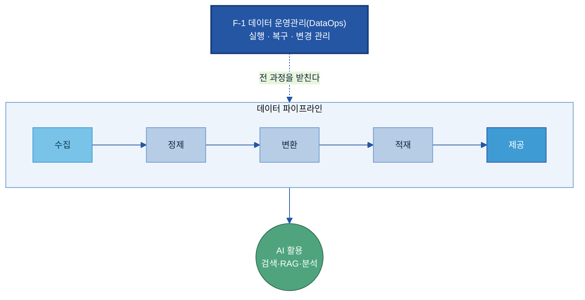
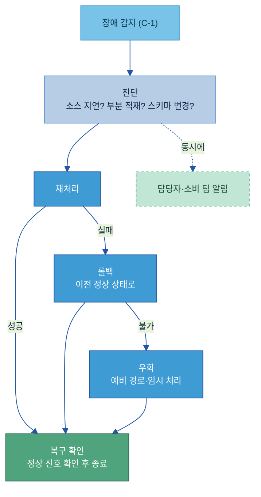
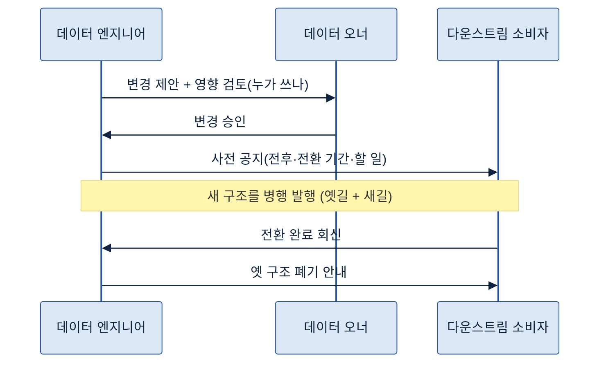
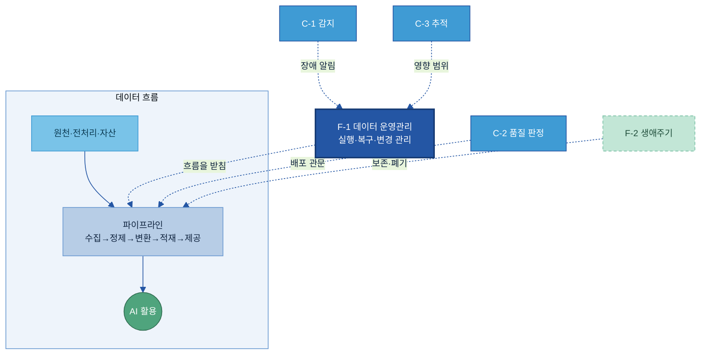

# F-1. 데이터 운영관리(DataOps) 매뉴얼

> 정의: 데이터 수집·정제·변환·제공 파이프라인을 안정적으로 실행·복구·변경 관리하는 운영 체계(DataOps).

---

## 목차

- [이 가이드가 답하는 4가지 질문](#key-questions)

1. [Why — 왜 필요한가](#why)
    - [1.1 현업 Pain Point](#s11)
    - [1.2 기대 효과](#s12)
2. [What — 무엇을 갖추나](#what)
    - [2.1 데이터 운영관리(DataOps)란 + 체계 내 위치](#s21)
    - [2.2 실행·배포 표준](#s22)
    - [2.3 장애 대응 절차(Runbook)](#s23)
    - [2.4 변경 관리](#s24)
3. [When — 어디부터 / 얼마나 하나](#when)
    - [3.1 운영 대상 고르기](#s31)
    - [3.2 중요도 차등과 운영 대상 등록표](#s32)
4. [How — 어떻게 구축·운영하나](#how)
    - [4.1 구축 절차](#s41)
    - [4.2 변경 작성 규칙 — 깨는 변경 줄이기](#s42)
    - [4.3 운영과 역할](#s43)
    - [4.4 실제로 어디서 하나 — 플랫폼 매핑](#s44)
5. [Tech Stack — 솔루션 검토](#tech)
6. [Where — 다른 주제와의 관계](#where)

- [별첨 (Appendix)](#별첨-appendix)
- [참고자료 (References)](#참고자료-references) · [변경 이력 / 피드백 반영](#변경-이력--피드백-반영)

---

> 예시 표기 안내: 본 가이드의 표·예시에 나오는 구체 값(파이프라인명·시각·설비/라인 번호·날짜 등)은 이해를 돕기 위한 가상 예시이며 실제 데이터가 아니다. 실제 값은 PoC·프로젝트에서 확정한다. 계열사명도 적용 맥락 설명용이다.

> 관련 가이드: [C-1 Observability](../C-1%20Observability/C-1%20Observability.md) · [C-2 데이터 품질 관리](../C-2%20데이터%20품질%20관리/C-2%20데이터%20품질%20관리.md) · [C-3 데이터 계통 Lineage](../C-3%20데이터%20계통%20Lineage/C-3%20데이터%20계통%20Lineage.md) · [F-2 데이터 생애주기 관리](../F-2%20데이터%20생애주기%20관리/F-2%20데이터%20생애주기%20관리.md) · [B-1 데이터 전처리](../B-1%20데이터%20전처리/B-1%20데이터%20전처리.md) · [A-1 데이터 카탈로그](../A-1%20데이터%20카탈로그/A-1%20데이터%20카탈로그.md)

이 가이드는 데이터 운영관리가 왜 필요한지(1장), 무엇을 갖춰야 하는지(2장), 어떤 파이프라인부터 얼마나 엄격하게 운영할지(3장), 실제로 어떻게 구축·운영하는지(4장)를 다룬다. 데이터를 찾고·읽고·믿게 만드는 다른 주제가 모두 갖춰져도, 그 데이터가 흐르는 길이 밤사이 조용히 멈추면 AI는 어제 데이터로 답한다. 데이터 운영관리는 이 흐르는 길을 멈추지 않게 돌리고, 멈추면 빨리 되살리며, 길을 바꿀 때 뒷공정이 깨지지 않게 통제하는 일이다.

## 이 가이드가 답하는 4가지 질문

| 질문 | 한 줄 답 | 본문 |
|---|---|---|
| 어떤 파이프라인을 어디까지 운영해야 하나 | 모든 흐름을 똑같이 보지 않고, AI·핵심 보고가 쓰는 흐름을 중요도 등급으로 나눠 등급이 높을수록 엄격하게 운영한다 | [3장](#when) |
| 파이프라인 실행·배포를 어떻게 표준화하나 | 정해진 순서·시각에 자동 실행하고, 고친 것은 자동 테스트를 통과한 것만 운영에 반영한다 | [2.2](#s22) · [4장](#how) |
| 멈추면 어떻게 되살리나 | 재처리·롤백·우회를 적어 둔 대응 절차서(Runbook)로, 누가 무엇을 할지 미리 정해 둔다 | [2.3](#s23) · [4장](#how) |
| 구조를 바꿀 때 어떻게 사고를 막나 | 쓰는 쪽을 먼저 확인해 사전 공지하고, 옛 구조를 바로 막지 않고 새 구조로 옮긴 뒤 닫는다 | [2.4](#s24) · [4장](#how) |

---

## 1. Why — 왜 필요한가

데이터를 잘 찾고(A군)·읽게 만들고(B군)·믿게 만들어도(C군), 그 데이터가 매일 제때 흐르지 않으면 AI는 멈춘다. 운영관리는 이 흐름을 안정적으로 유지해, 한 번 갖춘 데이터 체계가 매일 실제로 작동하게 만든다.

### 1.1 현업 Pain Point

제조 현장의 데이터는 여러 시스템을 거쳐 매일·매시 자동으로 흐른다. 이 흐름은 사람 눈에 잘 띄지 않는 곳에서 끊기고, 끊겨도 한참 뒤에야 드러난다. 자주 만나는 상황은 다음과 같다.

| 상황 | 실제 문제 |
|---|---|
| 야간 수집이 조용히 실패함 | MES에서 분석 웨어하우스로 가는 새벽 적재가 실패했는데 알림이 없어, 다음 날 AI와 대시보드가 어제치 옛 데이터로 답한다. |
| 일부만 들어왔는데 성공으로 표시됨 | 설비 센서 집계가 절반만 적재됐는데 작업 로그는 "성공"이라, 예지정비 모델이 반쪽 데이터로 잘못 판단한다. |
| 소스 구조가 말없이 바뀜 | 협력사 납품 데이터의 컬럼명·단위가 통보 없이 바뀌어, 이를 받아 쓰던 품질 리포트와 RAG 인덱스가 한꺼번에 깨진다. |
| 고치면 다른 데가 터짐 | 한 사람이 파이프라인을 손으로 고쳐 운영에 바로 올렸다가, 그 데이터를 쓰던 다른 팀의 산출물이 예고 없이 어긋난다. |

이들의 공통점은 데이터나 모델이 잘못된 것이 아니라, 데이터가 흐르는 파이프라인을 안정적으로 실행·복구·변경 관리하는 운영 체계가 없다는 점이다. 끊겨도 늦게 알고, 되살리는 절차가 사람 머릿속에만 있으며, 바꿀 때 누가 영향을 받는지 모른 채 고친다.

### 1.2 기대 효과

데이터 운영관리를 갖추면 같은 사고가 다르게 흘러간다. 멈추면 즉시 알림이 가고, 정해진 절차로 빠르게 되살리며, 구조를 바꿀 때는 쓰는 쪽에 미리 알려 사고를 예방한다. 영웅적인 야근이 아니라 표준 절차로 굴러가므로 담당자가 바뀌어도 운영이 유지된다.

| 구분 | 운영 체계가 없을 때 (As-Is) | 운영 체계를 갖춘 뒤 (To-Be) |
|---|---|---|
| 장애 인지 | 다음 날 현업이 이상을 느껴야 안다 | 실패 즉시 담당자·소비 팀에 알림 |
| 복구 | 담당자가 기억으로 손수 처리, 사람마다 다름 | 대응 절차서(Runbook)대로 재처리·롤백 |
| 변경 | 고치고 나서 터지면 그때 수습 | 영향 검토·사전 공지 후 안전하게 반영 |
| 신뢰 | "오늘 데이터 최신 맞나" 매번 확인 | "매일 08시까지 최신" 약속이 지켜짐 |

> 제조 예시: 설비 센서 집계 파이프라인에 자동 재시도와 알림을 붙이면, 새벽에 한 번 끊겨도 스스로 두세 번 다시 시도해 대부분 복구되고, 그래도 안 되면 당직자에게 즉시 알림이 가 예지정비 모델이 옛 데이터로 도는 일을 막는다.

## 2. What — 무엇을 갖추나

데이터 운영관리는 세 가지 기둥으로 이루어진다. 파이프라인을 정해진 대로 돌리는 실행·배포 표준, 멈췄을 때 되살리는 장애 대응 절차(Runbook), 구조를 바꿀 때 사고를 막는 변경 관리다. 이 장은 각 기둥이 무엇인지 정의하고, 4장에서 실제 구축·운영 순서를 다룬다.

### 2.1 데이터 운영관리(DataOps)란 + 체계 내 위치

데이터 운영관리(DataOps)는 데이터가 수집·정제·변환·적재·제공으로 흐르는 파이프라인을 안정적으로 실행하고, 멈추면 복구하며, 구조를 바꿀 때 통제하는 운영 체계다. 소프트웨어 배포를 자동화·안정화한 데브옵스(DevOps)의 방식을 데이터 파이프라인에 옮긴 것으로[\[1\]](#ref1), "코드를 잘 내보내는 기술"을 "데이터를 잘 흘려보내는 기술"로 바꿔 놓았다.

데이터 운영관리는 특정 데이터 영역이 아니라 전 과정을 가로질러 받치는 기반(基盤)이다. A~E군의 모든 주제가 만들어 낸 데이터 자산은 결국 파이프라인을 타고 AI 활용 환경으로 흐르며, 그 흐름이 끊기지 않게 하는 것이 이 주제의 역할이다.

운영관리는 이 흐름 자체를 만드는 일이 아니라, 이미 만들어진 흐름이 멈추지 않고·되살아나고·안전하게 바뀌도록 운영하는 일이다. 흐름 안에서 이상을 감지하는 것은 [C-1 Observability](../C-1%20Observability/C-1%20Observability.md), 데이터를 써도 되는지 판정하는 것은 [C-2 데이터 품질 관리](../C-2%20데이터%20품질%20관리/C-2%20데이터%20품질%20관리.md)가 맡는다. 경계는 [6장](#where)에서 정리한다.

### 2.2 실행·배포 표준

실행·배포 표준은 파이프라인을 정해진 순서·시각에 자동으로 돌리고, 고친 것을 안전하게 운영에 반영하는 규칙이다. 사람이 손으로 돌리고 손으로 옮기면 빠뜨림과 실수가 생기므로, 아래 요소를 표준으로 둔다.

| 요소 | 쉬운 의미 |
|---|---|
| 오케스트레이션·작업 순서도(DAG) | "A 끝나야 B, B 끝나야 C" 같은 작업 순서를 정해 자동 실행하고, 한 단계가 실패하면 뒤를 건너뛴다[\[2\]](#ref2) |
| 멱등성(Idempotency) | 같은 구간을 두 번 돌려도 결과가 두 배가 되지 않게 만든 설계. 안심하고 다시 돌릴 수 있는 전제[\[3\]](#ref3) |
| 재시도(Retry) | 네트워크 끊김 같은 일시적 실패는 자동으로 몇 번 다시 시도해 사람 손 없이 복구 |
| 백필(Backfill) | 빠뜨렸거나 틀린 과거 구간을 소급해 다시 채워 넣기. 멱등성이 있어야 안전 |
| 환경 분리(dev/stg/prod) | 시험 공간에서 먼저 돌려 통과한 것만 운영 공간에 올림 |
| 자동 테스트·배포(CI/CD) | 고친 것을 사람이 손으로 옮기지 말고, 자동 검사를 통과한 것만 운영에 올림[\[4\]](#ref4) |
| 버전 관리 | 파이프라인 정의·설정·코드를 모두 기록해 언제든 이전 상태로 되돌릴 수 있게 함 |

> 용어 풀이 — 작업 순서도(DAG): Directed Acyclic Graph. 작업을 점으로, "먼저-나중" 의존을 화살표로 그린 순서도로, 되돌아오는 고리가 없다. 어느 단계가 무엇에 의존하고 어디서 실패했는지를 한눈에 보여준다.

### 2.3 장애 대응 절차(Runbook)

장애 대응 절차서(Runbook)는 "이 장애가 나면 이렇게 되살린다"를 적어 둔 대응 카드다[\[5\]](#ref5). 복구가 사람 머릿속에만 있으면 담당자가 자리를 비운 새벽에 손을 못 쓰므로, 되살리는 수단과 순서를 미리 문서로 정해 둔다. 복구 수단은 세 가지다.

- 재처리(Reprocess): 실패한 구간을 다시 돌린다. 멱등성과 백필이 전제다.
- 롤백(Rollback): 잘못 들어간 변경·적재를 이전 정상 상태로 되돌린다. 버전 관리가 토대다.
- 우회(Failover): 주 경로가 죽으면 예비 경로나 임시 처리로 서비스를 유지한다.

복구 목표는 숫자로 약속해 둔다. 얼마나 빨리 되살려야 하는지(RTO)와 어느 시점까지의 데이터는 지켜야 하는지(RPO)를 정해, 중요도가 높은 파이프라인일수록 더 짧게 잡는다[\[6\]](#ref6). 같은 맥락에서 데이터의 신선도를 약속으로 공표하는데, "매일 08시까지·최신 1시간 이내"처럼 언제까지 얼마나 최신인지를 정한 것이 데이터 SLA다[\[7\]](#ref7).

> 용어 풀이 — RTO·RPO: RTO(Recovery Time Objective)는 "언제까지 살려라"(복구 목표 시간), RPO(Recovery Point Objective)는 "과거 어느 시점까지는 지켜라"(허용 데이터 손실 범위)다. 예: RTO 4시간·RPO 1시간 = 4시간 안에 복구하되 손실은 1시간치 이하.

Runbook 한 건은 트리거(이 증상이 뜨면)·영향 범위·진단 단계·복구 조치·복구 확인·에스컬레이션·사후 기록으로 구성한다. 빈 템플릿과 작성 예시는 [별첨](#별첨-appendix)에 둔다.

### 2.4 변경 관리

변경 관리는 파이프라인의 구조(스키마)·연결 방식·제공 방식을 바꿀 때 그 데이터를 쓰는 쪽이 깨지지 않게 통제하는 일이다. 현대 데이터 흐름은 한 데이터를 여러 팀이 받아 쓰므로, 한 곳의 변경이 통보 없이 여러 산출물을 연쇄로 깨뜨린다.

핵심은 변경을 두 종류로 나누는 것이다.

- 안 깨는 변경(하위 호환): 선택 항목을 추가하되 기본값을 주는 것처럼, 쓰는 쪽이 그대로여도 문제없는 변경. 정상 경로로 권장한다[\[8\]](#ref8).
- 깨는 변경(Breaking change): 필드 이름·타입·키를 바꾸는 것처럼 쓰는 쪽이 깨지는 변경. 신중한 전략이 필요하다.

깨는 변경은 옛 구조를 바로 막지 않고, 새 구조를 옛것과 나란히 띄운 뒤 쓰는 쪽을 모두 옮기고 나서 옛것을 닫는다(확장-수축, Expand-Contract). 이 약속을 사람과 기계가 함께 읽도록 명문화한 것이 데이터 계약(Data Contract)으로, "내가 주는 데이터는 이런 형태·이런 품질·이 시각까지"를 만드는 쪽이 약속한 계약서다[\[9\]](#ref9)[\[10\]](#ref10).

> 제조 예시: 설비 식별자 체계를 바꿔야 할 때(키를 바꾸는 깨는 변경), 새 식별자를 옛 식별자와 함께 한동안 제공하고, 이를 쓰는 예지정비 모델·품질 대시보드가 모두 새 식별자로 옮겨간 것을 확인한 뒤 옛 식별자를 닫는다.

영향받는 쪽이 어디인지를 보여 주는 추적은 [C-3 데이터 계통 Lineage](../C-3%20데이터%20계통%20Lineage/C-3%20데이터%20계통%20Lineage.md)가 보조한다. 운영관리는 그 정보를 받아 영향 검토·사전 공지·승인의 절차로 통제한다.

## 3. When — 어디부터 / 얼마나 하나

모든 파이프라인을 똑같은 강도로 운영하지 않는다. 멈췄을 때 타격이 큰 흐름부터 골라, 중요도에 따라 운영 강도를 달리한다.

### 3.1 운영 대상 고르기

운영관리 대상은 AI 서비스·검색(RAG)·핵심 리포팅에 실제로 쓰이는 파이프라인이다. 멈추거나 틀리면 곧바로 현업 판단과 AI 답변에 영향을 주는 흐름을 먼저 잡는다. 반대로 일회성 분석이나 개인 실험용 흐름은 운영 대상에서 뒤로 둔다.

### 3.2 중요도 차등과 운영 대상 등록표

운영 대상은 중요도 등급(Tier)으로 나눠, 등급마다 운영 강도(당직·복구 속도·변경 승인 수준)를 다르게 적용한다. 자원을 등급 순으로 배분해, 멈추면 안 되는 흐름에 운영 역량을 집중한다.

| 등급 | 어떤 흐름인가 | 운영 강도 (예시) |
|---|---|---|
| Tier 1 (핵심) | AI 서비스·RAG가 직접 쓰고, 생산·품질 의사결정에 들어가는 흐름 | 24/7 당직, 최단 복구(RTO), 변경 시 전체 승인 |
| Tier 2 (중요) | 정기 리포팅·핵심 대시보드 | 업무시간 대응, 변경 시 영향 검토 |
| Tier 3 (보조) | 탐색·실험·내부 분석 | 최선 노력(best-effort) |

운영 대상은 등록표로 관리해, 무엇을·어디서 어디로·언제 도는지와 중요도·오너·알림 대상을 한곳에 모은다. 이 표가 운영의 출발점이며, 대표 항목은 아래와 같다(전체 항목·빈 템플릿은 [별첨](#별첨-appendix)).

| 항목 | 쉬운 의미 | 예시값 | 필수/선택 | 작성 주체 |
|---|---|---|---|---|
| 파이프라인명 | 무엇을 나르는 흐름인가 | `설비센서_시간집계` | 필수 | 데이터 엔지니어 |
| 소스 → 타깃 | 어디서 받아 어디로 | `MES DB → 분석 웨어하우스` | 필수 | 데이터 엔지니어 |
| 스케줄 | 언제·얼마나 자주 | `매시 정각` | 필수 | 데이터 엔지니어 |
| 중요도 등급 | 얼마나 엄격하게 운영 | `Tier 1` | 필수 | 데이터 오너 |
| 데이터 오너 | 업무 책임자 | `생산기술팀 ○○○` | 필수 | 거버넌스 |
| SLA(신선도) | 언제까지·얼마나 최신 | `매일 08:00까지, 1시간 이내` | 필수 | 오너·엔지니어 |
| 알림 대상 | 멈추면 누구에게 | `데이터 당직, AI팀 채널` | 필수 | 플랫폼 담당 |
| 다운스트림 소비자 | 누가 쓰나(변경 시 통지처) | `예지정비 모델, 품질 대시보드` | 필수 | 데이터 오너 |

## 4. How — 어떻게 구축·운영하나

구축은 운영 대상을 등록하는 데서 시작해, 실행·배포 표준을 잡고, 장애 대응 절차를 갖춘 뒤, 변경 절차를 연결하는 순서로 한다. 이후 정기 점검과 변경 승인으로 운영을 이어 간다. 어떤 솔루션을 쓸지는 [5장 Tech Stack](#tech)에서 비교한다.

### 4.1 구축 절차

1. 핵심 파이프라인 등록·등급 부여: [3장](#when)의 등록표로 운영 대상을 모으고 중요도 등급을 매긴다.
2. 실행·배포 표준 적용: 작업 순서(DAG)·스케줄·재시도·백필을 정하고, 고친 것은 시험 환경에서 자동 테스트를 통과해야 운영에 올라가게 한다([2.2](#s22)).
3. 장애 대응 절차 갖추기: 등급이 높은 파이프라인부터 Runbook을 쓰고, 감지(C-1) 알림과 연결한다([2.3](#s23)).
4. 변경 절차 연결: 스키마·제공 방식 변경 시 영향 검토 → 사전 공지 → 승인 → 병행 전환의 절차를 건다([2.4](#s24)).

> 예시로 따라가기: `설비센서_시간집계`(Tier 1)를 운영에 올린다고 하자. ① 등록표에 소스(MES)·타깃(웨어하우스)·스케줄(매시)·오너·SLA(08시·1시간)를 적고 Tier 1로 둔다. ② 매시 실행에 3회 재시도와 멱등 적재를 걸고, 코드 변경은 자동 테스트 통과 후 배포되게 한다. ③ "정시에 데이터가 안 들어옴" 알림에 대한 Runbook(진단→재처리→안 되면 롤백→당직 알림)을 붙인다. ④ 이 데이터를 쓰는 예지정비 모델·품질 대시보드를 소비자로 등록해, 구조를 바꿀 때 자동으로 공지 대상이 되게 한다.

### 4.2 변경 작성 규칙 — 깨는 변경 줄이기

같은 변경도 어떻게 내느냐에 따라 사고가 갈린다. 쓰는 쪽을 깨뜨리는 방식 대신, 옛것을 남긴 채 새것을 더하는 방식으로 쓴다.

| 상황 | 깨는 방식 (지양) | 안 깨는 방식 (권장) |
|---|---|---|
| 단위가 모호한 필드 정리 | `temp`를 `temp_celsius`로 즉시 이름 변경 | `temp_celsius`를 추가해 병행 발행 → 소비자 전환 후 `temp` 닫기 |
| 코드값 변경 | 옛 코드 즉시 폐기 | 새 코드 추가·매핑 제공 → 전환 기간 후 옛 코드 폐기 |
| 제공 방식 변경 | 파일 제공을 API로 바로 교체 | 한동안 둘 다 제공 → 이전 완료 확인 후 파일 중단 |

변경을 낼 때는 사전 공지문(Change Notice)으로 알린다. 공지문에는 변경 대상·변경 유형(깨는/안 깨는)·전후 내용·영향받는 소비자·적용 예정일과 병행 기간·소비자가 할 일·담당자와 승인자를 담는다(빈 템플릿은 [별첨](#별첨-appendix)).

### 4.3 운영과 역할

구축 이후 운영은 세 가지를 반복한다. 정기 점검(SLA·실패율·재시도 추이 확인), 장애 시 Runbook에 따른 재처리·복구, 변경 요청에 대한 영향 검토·승인이다. 데이터 신뢰성은 한 사람이 책임질 수 없는 팀 단위 활동이므로, 역할을 미리 못 박아 책임 공백을 막는다[\[11\]](#ref11).

| 역할 | 하는 일 | 책임 |
|---|---|---|
| 데이터 엔지니어 | 파이프라인을 만들고 고치고 되살린다 | 실행·복구·변경 구현 |
| 플랫폼·운영 담당 | 도구·인프라를 운영하고 장애 원인을 짚는다 | 도구·환경 운영, 알림 체계 |
| 데이터 오너 | 그 데이터의 의미·기준·우선순위의 업무 책임자 | 변경 승인, 중요도 결정 |
| 다운스트림 소비자(AI·분석팀) | 데이터를 받아 쓰는 쪽 | 변경·장애 시 통지 대상, 영향 시 자문 |

### 4.4 실제로 어디서 하나 — 플랫폼 매핑

운영의 중심은 파이프라인을 정해진 순서·시각에 돌리고 실패를 잡아 재시도·복구하는 오케스트레이터다. 실제 작업은 도구 화면에서 이렇게 이뤄진다.

- 작업 순서(DAG)·스케줄·재시도·백필은 오케스트레이터(예: Apache Airflow[\[12\]](#ref12)·Dagster[\[13\]](#ref13))에서 정의하고, 실행 상태·실패 지점·재처리를 같은 화면에서 본다.
- 변경은 파이프라인 정의를 코드로 두고(Git[\[14\]](#ref14)) 변경마다 자동 테스트(CI)를 거쳐 통과한 것만 배포한다(예: GitHub Actions[\[15\]](#ref15)).
- 스트리밍처럼 스키마가 자주 바뀌는 흐름은 스키마 호환성 검사로 깨는 변경을 자동으로 막는다(예: Confluent Schema Registry[\[16\]](#ref16)).

폐쇄망·보안 데이터 환경에서는 위 오케스트레이터를 직접 설치해 운영하고, 내부 Git과 자체 실행기로 같은 구성을 갖춘다. 솔루션 선택은 [5장](#tech)에서 비교한다.

## 5. Tech Stack — 솔루션 검토

> 2층 연결: 솔루션을 묶어서 평가·선정하려면 → [Tech Stack 비교 정본](../../Tech%20Player/01%20Tech%20Stack%20비교%20(솔루션×주제).md).

데이터 운영관리 솔루션은 한 가지로 정해지지 않는다. [4장](#how)의 운영 방식에 맞춰 아래 기준으로 고른다 — 스케줄·재시도·백필, 장애 복구(재처리·롤백), 자동 테스트·배포(CI/CD), 이식성(온프렘·멀티클라우드로 들고 다니기) 대 운영 위임(매니지드), 기존 인프라 정합. 첫 갈림은 이식성 대 운영 위임이다. 폐쇄망·보안 데이터가 있으면 직접 설치하는 오픈소스가 현실적 1순위이고, 운영 부담을 줄이려면 매니지드를 검토한다.

솔루션의 중심은 파이프라인을 지휘하는 오케스트레이터다. 변경 관리는 단일 제품이 아니라 버전 관리·자동 테스트·스키마 호환성 검사의 조합으로 완성된다.

**(1) 오픈소스 오케스트레이터 — 직접 설치, 폐쇄망 가능.** 스케줄·의존성·재시도·백필·복구가 본체다.

| 솔루션 | 잘하는 것 | 적합 상황 |
|---|---|---|
| Apache Airflow[\[12\]](#ref12) | 사실상 업계 표준. 작업 순서(DAG)·스케줄·재시도·백필, 넓은 커넥터·인력 풀 | 표준·생태계 우선, 폐쇄망 직접 운영 |
| Dagster[\[13\]](#ref13) | 데이터 자산 중심으로 파이프라인 선언, 계보·신선도 관리에 강함 | 데이터 중심·품질/계보 연계 |
| Prefect[\[17\]](#ref17) | 가벼운 파이썬, 코드·데이터는 내 인프라에 두는 하이브리드 실행 | 빠른 시작, 데이터는 내 환경 |
| Apache NiFi[\[18\]](#ref18) | 화면(GUI) 기반 흐름 설계, 실시간 이동·강한 보안 옵션 | GUI 선호·실시간 수집·강보안 |

**(2) 클라우드 내장 — 쓰는 클라우드 안에서 운영 위임.** 폐쇄망에는 부적합하다. 이미 쓰는 인프라를 따라가는 것이 정합에 유리하다 — AWS면 Amazon MWAA[\[19\]](#ref19)·AWS Step Functions[\[20\]](#ref20), Azure면 Azure Data Factory[\[21\]](#ref21), GCP면 Google Cloud Composer[\[22\]](#ref22), Databricks를 쓰면 Databricks Workflows[\[23\]](#ref23).

**(3) 매니지드 SaaS — 운영·관측을 통째로 위임.** 오케스트레이터 운영 부담을 줄이지만 클라우드 종속이 크다(예: Airflow 운영을 위임하는 Astronomer[\[24\]](#ref24)). 변환 계층의 테스트·배포를 표준화하는 dbt[\[25\]](#ref25)도 변경 관리에 함께 쓴다.

**변경 관리·테스트 게이트 보조.** 파이프라인을 코드로 두고(Git[\[14\]](#ref14)) 변경마다 자동 테스트를 거는 CI/CD(GitHub Actions[\[15\]](#ref15)·GitLab CI/CD[\[26\]](#ref26))가 토대다. 스키마 변경 호환성은 Confluent Schema Registry[\[16\]](#ref16)나 데이터 계약 표준(Data Contract Specification[\[27\]](#ref27))으로 막는다. 배포 전 데이터 검증을 게이트로 거는 Great Expectations[\[28\]](#ref28)·Soda[\[29\]](#ref29)는 본래 [C-2 데이터 품질 관리](../C-2%20데이터%20품질%20관리/C-2%20데이터%20품질%20관리.md) 영역이며, 운영관리에서는 "통과 못 하면 배포를 막는 관문"으로만 쓴다.

> 권장 — 환경에 맞춰 고르기. 폐쇄망·보안 데이터가 핵심 제약이면 오픈소스 오케스트레이터를 직접 설치해 1차로 두고, 내부 Git·자체 실행기로 자동 테스트·배포를 구성한다. 운영 인력이 부족하고 보안 제약이 작은 영역은 매니지드를 검토한다. 이미 특정 클라우드·플랫폼을 쓰면 그 내장 도구가 정합에 유리하다. 가격·버전·기능 범위는 변동되므로 단정하지 말고 PoC·공식 문서로 확인한다.

솔루션을 주제 전반에 걸쳐 묶어 비교·선정하는 일은 2층 정본 [Tech Stack 비교 (솔루션×주제)](../../Tech%20Player/01%20Tech%20Stack%20비교%20(솔루션×주제).md)가 전담한다.

## 6. Where — 다른 주제와의 관계

데이터 운영관리는 파이프라인의 실행·복구·변경 관리를 책임지고, 인접 주제가 그 앞뒤를 분담한다. 가장 헷갈리는 경계는 신뢰성(C군)과의 분담이다. 이상을 감지하는 것은 C-1, 데이터를 써도 되는지 판정하는 것은 C-2, 어디로 흘렀는지 추적하는 것은 C-3이며, 운영관리는 그 신호와 정보를 받아 흐름을 되살리고 변경을 통제한다.

| 데이터 운영관리(F-1)가 하는 것 | 인접 주제 | 인접 주제가 하는 것 | 연계 포인트 |
|---|---|---|---|
| 감지된 장애를 받아 복구·재처리 | [C-1 Observability](../C-1%20Observability/C-1%20Observability.md) | 지연·누락·이상을 실시간 감지·알림 | 알림이 Runbook의 트리거 |
| 파이프라인을 돌게 유지 | [C-2 데이터 품질 관리](../C-2%20데이터%20품질%20관리/C-2%20데이터%20품질%20관리.md) | 데이터를 써도 되는지 품질 판정 | 품질 게이트를 배포 관문으로 |
| 변경 시 영향 검토·통제 | [C-3 데이터 계통 Lineage](../C-3%20데이터%20계통%20Lineage/C-3%20데이터%20계통%20Lineage.md) | 어디서 와서 어디로 갔나 사후 추적 | 영향 범위를 변경 공지에 활용 |
| 살아 움직이는 흐름의 운영 | [F-2 데이터 생애주기 관리](../F-2%20데이터%20생애주기%20관리/F-2%20데이터%20생애주기%20관리.md) | 데이터의 수명·보존·폐기 정책 | 보존 정책을 운영 절차에 반영 |
| 흐름이 끊기지 않게 받침 | [B-1 데이터 전처리](../B-1%20데이터%20전처리/B-1%20데이터%20전처리.md) · [A-1 데이터 카탈로그](../A-1%20데이터%20카탈로그/A-1%20데이터%20카탈로그.md) | 데이터를 읽게 변환·자산으로 등록 | 그 산출이 파이프라인을 타고 흐름 |

---

## 별첨 (Appendix)

### A. 운영 대상 파이프라인 등록표 — 전체 항목 + 완성 예시

본문 [3.2](#s32)의 대표 항목에 운영·복구 항목을 더한 전체 양식이다. 빈 템플릿을 그대로 복사해 한 줄에 한 파이프라인씩 채운다.

| 항목 | 빈 템플릿 | 완성 예시 (가상) |
|---|---|---|
| 파이프라인명 | | `설비센서_시간집계` |
| 소스 → 타깃 | | `MES DB → 분석 웨어하우스` |
| 스케줄 | | `매시 정각` |
| 중요도 등급 | | `Tier 1` |
| 데이터 오너 | | `생산기술팀 ○○○ 책임` |
| SLA(신선도/완료시각) | | `매일 08:00까지, 최신 1시간 이내` |
| 복구 목표(RTO/RPO) | | `RTO 2시간 / RPO 1시간` |
| 재시도 정책 | | `3회, 5분 간격` |
| 알림 대상 | | `데이터 당직, AI팀 채널` |
| 다운스트림 소비자 | | `예지정비 모델, 품질 대시보드` |
| Runbook 링크 | | `runbook/센서집계.md` |

### B. 변경 사전 공지문(Change Notice) 빈 템플릿

- 변경 대상: (파이프라인·테이블·필드)
- 변경 유형: 깨는 변경 / 안 깨는 변경
- 변경 내용: (전 → 후)
- 영향받는 소비자: (다운스트림 목록)
- 적용 예정일 / 병행 기간:
- 소비자가 할 일: (마이그레이션 안내)
- 담당자 / 승인자:

### C. Runbook 한 건 빈 템플릿

- 트리거: (이 알림·증상이 뜨면)
- 영향 범위·심각도: (어떤 소비자가 멈추나, 등급)
- 진단 단계: (소스 도착? 부분 적재? 스키마 변경? 순서대로 확인)
- 복구 조치: (재처리 / 롤백 / 우회 — 각 순서)
- 복구 확인: (무엇이 보이면 정상)
- 에스컬레이션: (언제·누구에게)
- 사후 기록: (원인·재발 방지·Runbook 갱신)

### D. 주요 용어

- DataOps(데이터 운영관리): 데이터 파이프라인을 안정적으로 실행·복구·변경 관리하는 운영 체계. 데브옵스를 데이터에 옮긴 것.
- 파이프라인(Pipeline): 데이터가 수집·정제·변환·적재·제공으로 흐르는 자동화된 길.
- 오케스트레이션(Orchestration): 여러 작업을 정해진 순서·시각에 실행하고 의존성·재시도·상태를 관리하는 관제.
- 작업 순서도(DAG): 작업과 "먼저-나중" 의존을 그린, 되돌이 없는 순서도.
- 멱등성(Idempotency): 같은 구간을 여러 번 돌려도 결과가 같은 성질. 안전한 재처리의 전제.
- 백필(Backfill): 빠뜨렸거나 틀린 과거 구간을 소급해 다시 채우는 것.
- Runbook(런북): 특정 장애에 어떻게 대응할지 적어 둔 대응 절차서.
- RTO/RPO: 복구 목표 시간(언제까지 살려라) / 허용 데이터 손실 범위(어디까지 지켜라).
- 데이터 SLA: "매일 08시까지·최신 1시간 이내"처럼 데이터 신선도·완료 시각을 공표한 약속.
- 데이터 계약(Data Contract): 데이터를 주는 쪽이 형태·품질·시각을 약속한, 사람·기계가 함께 읽는 명세.
- 확장-수축(Expand-Contract): 옛 구조를 바로 막지 않고 새 구조를 나란히 띄운 뒤 전환을 마치고 옛것을 닫는 변경 방식.

---

## 참고자료 (References)

본문 곳곳의 [N] 표시를 누르면 아래 해당 항목으로 이동한다. 접속일 2026-06. 가격·버전·언어 지원 범위 등 변동 정보는 각 공식 문서·PoC로 확인한다.

**정의·개념**
- **[1]** Gartner — Definition of DataOps — <https://www.gartner.com/en/information-technology/glossary/dataops>
- **[2]** Databricks — What is a DAG — <https://www.databricks.com/blog/what-is-dag>
- **[3]** Airbyte — Idempotency in data pipelines — <https://airbyte.com/data-engineering-resources/idempotency-in-data-pipelines>
- **[4]** dbt — Set up CI — <https://docs.getdbt.com/guides/set-up-ci>

**장애 대응·복구·SLA**
- **[5]** Google SRE — Incident management guide — <https://sre.google/resources/practices-and-processes/incident-management-guide/>
- **[6]** LaunchDarkly — RTO vs RPO — <https://launchdarkly.com/blog/rto-vs-rpo/>
- **[7]** dbt — Data SLAs best practices — <https://www.getdbt.com/blog/data-slas-best-practices>

**변경 관리·데이터 계약**
- **[8]** AWS DevOps Guidance — Ensure backwards compatibility for schema changes — <https://docs.aws.amazon.com/wellarchitected/latest/devops-guidance/dl.ads.5-ensure-backwards-compatibility-for-data-store-and-schema-changes.html>
- **[9]** Andrew Jones — Data Contracts 101 — <https://andrew-jones.com/data-contracts-101/>
- **[10]** Confluent — Schema evolution and compatibility — <https://docs.confluent.io/platform/current/schema-registry/fundamentals/schema-evolution.html>
- **[11]** Pantomath — Data reliability RACI — <https://www.pantomath.com/blog/data-quality-roles-and-responsibilities-the-data-reliability-raci>

**솔루션 — 오케스트레이터**
- **[12]** Apache Airflow — <https://airflow.apache.org/>
- **[13]** Dagster — <https://dagster.io/>
- **[17]** Prefect — <https://www.prefect.io/>
- **[18]** Apache NiFi — <https://nifi.apache.org/>

**솔루션 — 클라우드 내장·매니지드**
- **[19]** Amazon MWAA — <https://aws.amazon.com/managed-workflows-for-apache-airflow/>
- **[20]** AWS Step Functions — <https://aws.amazon.com/step-functions/>
- **[21]** Azure Data Factory — <https://azure.microsoft.com/en-us/products/data-factory>
- **[22]** Google Cloud Composer — <https://cloud.google.com/composer>
- **[23]** Databricks Workflows — <https://www.databricks.com/product/workflows>
- **[24]** Astronomer (Astro) — <https://www.astronomer.io/>
- **[25]** dbt — <https://www.getdbt.com/>

**솔루션 — 변경 관리·테스트 게이트·CI/CD**
- **[14]** Git — <https://git-scm.com/>
- **[15]** GitHub Actions — <https://github.com/features/actions>
- **[16]** Confluent Schema Registry — <https://docs.confluent.io/platform/current/schema-registry/index.html>
- **[26]** GitLab CI/CD — <https://docs.gitlab.com/ee/ci/>
- **[27]** Data Contract Specification — <https://datacontract.com/>
- **[28]** Great Expectations — <https://greatexpectations.io/>
- **[29]** Soda — <https://www.soda.io/>

---

## 변경 이력 / 피드백 반영

| 일자 | 버전 | 피드백 (누가/무엇) | 반영 내용 | 반영 위치 |
|------|------|--------------------|-----------|-----------|
| 2026-06-26 | 0.1 | 초안 작성 (00 전체 목차 F-1 계획 + B-1·B-3 형식 참고) | Why→What→When→How→Tech Stack→Where 6섹션, KQ 4문항 매핑, 운영 표준·Runbook·변경관리 3기둥, 중요도 차등·등록표, 솔루션 3유형 + 변경관리 조합, 인접 경계(C-1·C-2·C-3·F-2) 작성. 다이어그램 7종(파랑6/초록3 스키마, 전부 mermaid), 현업 실행 키트(등록표·변경공지문·Runbook 템플릿), 각주식 참고자료 29건. | 전체 |
