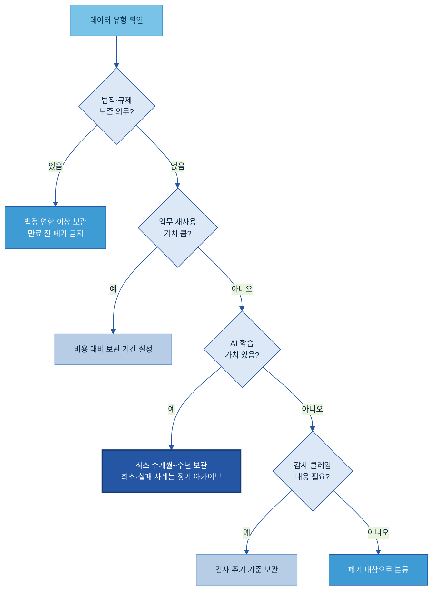
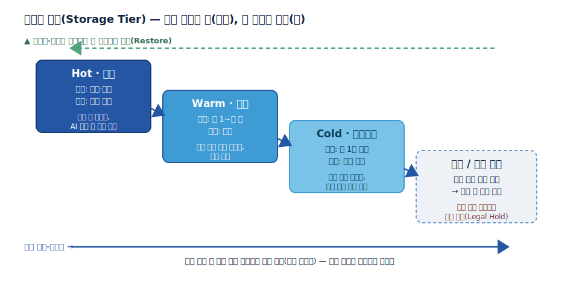
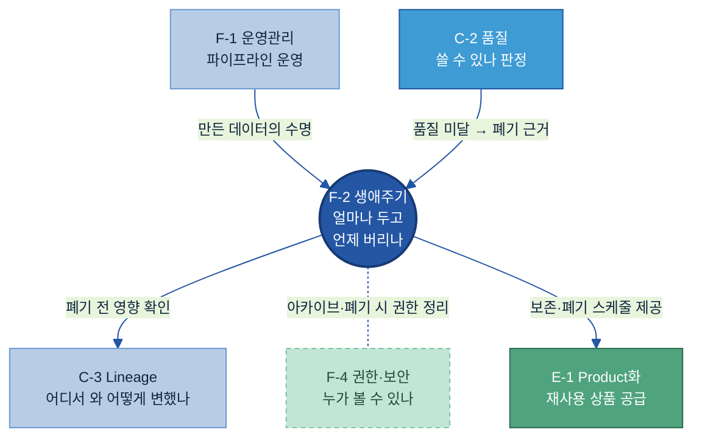

# F-2. 데이터 생애주기 관리(Data Lifecycle Management) 매뉴얼

> 정의: 데이터의 생성·사용·보관·아카이빙·폐기까지의 시간축을 정책 기반으로 통제하는 체계.

---

## 목차

- [이 가이드가 답하는 5가지 질문](#key-questions)

1. [Why — 왜 필요한가](#why)
    - [1.1 현업 Pain Point — 다 쌓아두기와 막 버리기 사이](#s11)
    - [1.2 기대 효과와 적용 전·후](#s12)
2. [What — 무엇을 갖추나](#what)
    - [2.1 데이터 생애주기 관리란 + 체계 내 위치](#s21)
    - [2.2 생애주기 단계 — 정본 모델](#s22)
    - [2.3 보존 기간 결정 기준](#s23)
    - [2.4 과정 데이터 보존 — 실패·불량도 자산이다](#s24)
    - [2.5 보존 정책 항목 사전](#s25)
3. [When — 어디부터 하나](#when)
    - [3.1 먼저 정리할 대상](#s31)
    - [3.2 먼저 보존할 대상](#s32)
4. [How — 어떻게 준비·운영하나](#how)
    - [4.1 구축 절차와 역할](#s41)
    - [4.2 저장소 계층화와 자동 티어링](#s42)
    - [4.3 폐기·아카이빙 절차](#s43)
    - [4.4 운영 — 승인·복원·예외와 작성 규칙](#s44)
5. [Tech Stack — 솔루션 검토](#tech)
    - [5.1 솔루션 유형](#s51)
    - [5.2 솔루션 비교](#s52)
    - [5.3 선정 기준](#s53)
6. [Where — 다른 주제와의 관계](#where)

- [별첨 (Appendix)](#별첨-appendix) · [참고자료 (References)](#참고자료-references) · [변경 이력 / 피드백 반영](#변경-이력--피드백-반영)

---

> 예시 표기 안내: 본 가이드의 표·예시에 나오는 구체 값(보존 연한·데이터 유형·수치·계열사명 등)은 이해를 돕기 위한 가상 예시이며 실제 데이터·실제 사내 정책이 아니다. 보존 연한은 적용 시점의 법령·고객 계약·사내 규정에 따라 달라지므로 법무·품질 부서 검토로 확정한다.

> 관련 가이드: [A-1 데이터 카탈로그](../A-1%20데이터%20카탈로그/A-1%20데이터%20카탈로그.md) · [C-2 데이터 품질 관리](../C-2%20데이터%20품질%20관리/C-2%20데이터%20품질%20관리.md) · [C-3 데이터 계통 Lineage](../C-3%20데이터%20계통%20Lineage/C-3%20데이터%20계통%20Lineage.md) · [E-1 데이터 Product화](../E-1%20데이터%20Product화/E-1%20데이터%20Product화.md) · [F-1 데이터 운영관리](../F-1%20데이터%20운영관리/F-1%20데이터%20운영관리.md) · [F-4 AI 데이터 권한 보안](../F-4%20AI%20데이터%20권한%20보안/F-4%20AI%20데이터%20권한%20보안.md)

이 가이드는 데이터 생애주기 관리가 왜 필요한지(1장), 무엇을 갖춰야 하는지(2장), 어디부터 정리·보존할지(3장), 실제로 어떻게 구축·운영하는지(4장), 어떤 솔루션을 쓰는지(5장)를 다룬다. 끝까지 강조하는 메시지는 하나다. 데이터를 무한정 쌓는 것도, 용량이 부족할 때 아무거나 지우는 것도 답이 아니다. 어떤 데이터를 얼마나 두고 언제 버릴지를 조직이 합의한 기준으로 정해 두어야, 비용·위험은 줄이고 AI가 다시 쓸 데이터는 지킬 수 있다.

<a id="key-questions"></a>

## 이 가이드가 답하는 5가지 질문

| 질문 | 한 줄 답 | 본문 |
|---|---|---|
| 생애주기 단계를 어떻게 정의하나 | 생성·수집 → 사용 → 보관 → 아카이빙 → 폐기의 시간축으로 나누고, 단계마다 책임자를 둔다 | [2.2](#s22) |
| 어떤 데이터를 얼마나 오래 보관하나 | 법적 의무·업무 가치·AI 재사용 가치·감사 필요성·비용 다섯 기준으로 유형별 보존 연한을 정한다 | [2.3](#s23) |
| 최종 결과 외 중간 과정 데이터는 | 실패 실험·불량·재작업처럼 AI 학습 가치가 큰 과정 데이터는 일부러 남긴다 | [2.4](#s24) |
| 폐기와 아카이빙은 어떻게 하나 | 보존 만료·법적 보존 여부로 분류해, 아카이빙(복원 가능)과 폐기(승인 후 안전 삭제)를 나눈다 | [4.3](#s43) |
| 저장 비용과 위험은 어떻게 줄이나 | 자주 쓰는 데이터만 비싼 저장소(Hot)에 두고, 안 쓰면 싼 계층으로 자동으로 내린다 | [4.2](#s42) |

---

<a id="why"></a>

## 1. Why — 왜 필요한가

데이터는 시간이 지나면 가치도, 위험도, 비용도 달라진다. 생애주기 관리는 그 시간축을 다룬다. 데이터가 처음 만들어진 순간부터 더 이상 필요 없어 폐기될 때까지를 단계로 나누고, 단계마다 "얼마나 두고, 어디에 두고, 언제 버릴지"를 정책으로 정한다. 카탈로그(A-1)가 "무엇이 어디에 있는가"를 다룬다면, 생애주기 관리는 "그 데이터가 언제까지 있어야 하는가"를 다룬다[\[1\]](#ref1).

<a id="s11"></a>

### 1.1 현업 Pain Point — 다 쌓아두기와 막 버리기 사이

생애주기 기준이 없는 조직은 두 극단 사이에서 흔들린다. 둘 다 비용을 치른다.

| 극단 | 무엇이 문제인가 |
|---|---|
| **다 쌓아둔다** | 저장 비용이 해마다 불어난다. 더 이상 필요 없는 개인정보·계약정보를 방치하면 규정 위반·유출 위험이 커진다. 오래되고 출처 불명한 데이터가 뒤섞여, 정작 AI에 쓸 믿을 만한 데이터를 찾기 어려워진다. |
| **막 버린다** | 용량이 부족할 때마다 임의로 지우면, 나중에 AI가 학습할 데이터가 사라진다. 특히 드물게 발생하는 불량·실패 사례는 한 번 잃으면 다시 모을 수 없다. 감사·클레임 때 증빙을 내지 못하고, 모델 성능이 나빠진 원인을 역추적할 과거 데이터도 없다. |

두 극단을 모두 만드는 공통 원인은 **조직 차원의 보존·폐기 기준이 없다**는 것이다. 기준이 없으면 담당자마다 "중요할 것 같으니 보관"과 "용량 없으니 삭제"를 제각각 판단하고, 데이터는 개인 PC·공유폴더·개인 NAS에 흩어진다. 담당자가 퇴직하면 그 사람만 알던 데이터가 함께 사라지거나 접근 불가 상태로 방치된다. 신규 데이터는 계속 쌓이는데 정리 기준이 없어 저장소는 매년 커진다.

> 용어 풀이 — 데이터 늪(Data Swamp): 데이터가 "있는데 못 쓰는" 상태. 오래되고 출처가 불분명한 데이터가 정비된 데이터와 뒤섞여, AI·분석이 신뢰할 데이터를 골라내기 어려워진 저장소를 말한다.

<a id="s12"></a>

### 1.2 기대 효과와 적용 전·후

생애주기 관리가 자리잡으면, 버릴 것은 정리해 비용·위험을 낮추고 남길 것은 지켜 AI가 다시 쓰게 한다.

| 기대 효과 | 구체 내용 |
|---|---|
| 저장 비용 절감 | 자주 쓰지 않는 데이터를 저렴한 계층으로 내리고, 중복·임시 파일을 정리해 비싼 저장소를 비운다 |
| 보안·규정 위험 감소 | 만료된 개인정보·계약정보를 정기적으로 폐기해 유출 시 피해 범위를 줄이고, 개인정보보호법·품질 규격 요건을 지킨다[\[3\]](#ref3)[\[4\]](#ref4) |
| AI 학습 데이터 확보 | 재사용 가치가 큰 불량·희소·실패 이력을 "보존" 기준으로 명시해 임의 삭제를 막는다 |
| 감사·규제 대응 | 유형별 보존 연한이 정책으로 명문화되어, 감사·고객 클레임 시 즉시 증빙을 제출한다 |
| 운영 투명성 | 폐기 승인 로그가 남아 "누가 무엇을 언제 지웠는가"를 추적할 수 있다 |

예를 들어 발전용·건물용 수소연료전지를 만드는 제조사(두산퓨얼셀 맥락, 가상)를 살펴본다. 이 회사는 스택(Stack) 내구 시험 데이터(수천 시간 연속 운전의 전압·전류·온도 시계열, 시험당 수십 GB), 제조 이력, 품질 성적서, 현장 장애·점검(C/S) 리포트를 만든다. 적용 전·후는 다음과 같이 갈린다.

| 구분 | 적용 전 (기준 없는 혼재) | 적용 후 (유형별 보존·폐기 정책) |
|---|---|---|
| 내구 시험 데이터 | 연구원 PC·개인 NAS에 분산, 퇴직 시 소실 | 정상분은 장기 보관 후 폐기, 실패·이상분은 장기 아카이브로 보존 |
| 저장소 | 용량 부족 시 "오래된 것"부터 임의 삭제(실패·불량이 먼저 지워짐) | 안 쓰는 데이터는 싼 계층으로 자동 이동, 임시·중복은 자동 정리 |
| 품질 성적서 | 일부는 출력본만 존재, 10년 전 성적서를 못 찾음 | 보존 연한 명시 + 아카이브 검색으로 클레임 시 즉시 제출 |
| 다음 AI 과제 | "학습할 데이터가 부족"한 상황 반복 | 보존해 둔 불량·실패 이력을 바로 학습에 투입 |

효과는 명확하다. 임시·중복 파일을 정리해 비싼 저장소 용량을 확보하고, 만료 개인정보를 정기 폐기해 위험을 낮추며, 실패·불량 이력은 지켜 AI가 다시 쓴다. 이때 "어떤 데이터를 얼마나 두고 어떻게 버릴지"의 구체 기준이 2장과 4장의 내용이다.

<a id="what"></a>

## 2. What — 무엇을 갖추나

이 장은 생애주기 관리가 무엇이고 무엇으로 이루어지는지를 정의한다. 구축 절차와 운영은 [4장](#how)에서 다루고, 여기서는 단계 모델·보존 기준·과정 데이터·항목 사전을 정의한다.

<a id="s21"></a>

### 2.1 데이터 생애주기 관리란 + 체계 내 위치

데이터 생애주기 관리(Data Lifecycle Management)는 데이터가 만들어진 순간부터 폐기될 때까지의 시간축을, 조직이 합의한 정책으로 통제하는 활동이다. 쉽게 말하면 "어떤 데이터를 얼마나 오래, 어디에 두고, 언제 없앨 것인가"를 사람 각자의 판단이 아니라 공통 기준으로 정하는 일이다[\[1\]](#ref1).

이는 새 저장 기술을 만드는 일이 아니라 AI-Ready Data 관점의 데이터 준비·유지 활동이다. AI가 쓸 데이터를 "쓸 건 지키고 안 쓸 건 정리"해 깨끗하고 재사용 가능한 상태로 유지하는 것이 목적이다.

생애주기 관리는 거버넌스(Governed) 그룹에서 **시간축(수명)**을 맡는 자리다. 같은 그룹의 운영관리(F-1)가 데이터가 흐르는 파이프라인을 안 멈추게 운영한다면, 생애주기 관리는 그렇게 흐른 데이터 자체가 얼마나 살아 있을지를 정한다. 권한·보안(F-4)이 "누가 볼 수 있는가"를, 품질(C-2)이 "쓸 수 있는가"를, 계통(C-3)이 "어디서 와 어떻게 변했는가"를 맡고, 생애주기 관리는 "얼마나 두고 언제 버리는가"만 맡는다(경계는 [6장](#where)).

<a id="s22"></a>

### 2.2 생애주기 단계 — 정본 모델

데이터는 한자리에 머물지 않고 단계를 거치며 가치와 사용 빈도가 변한다. 본 가이드는 아래 다섯 단계 + 재사용 루프를 생애주기의 정본 모델로 쓴다. 표준 프레임워크(DAMA-DMBOK 등)를 제조 현장에 맞게 단순화한 것이다[\[1\]](#ref1).


| 단계 | 무엇을 하는 구간인가 | 제조 현장 예시(가상) |
|---|---|---|
| 생성·수집 | 시스템·센서·사람이 데이터를 처음 만들거나 외부에서 받아들임 | 스택 성능시험 센서 로그 수신, 검사원이 외관 불량 기록 입력 |
| 사용(Active) | 분석·AI 학습·보고·실시간 판단에 활발히 쓰임 | 셀 제조 데이터로 수율 분석, 성능시험 로그로 모델 학습 |
| 보관(Inactive) | 일상 사용은 줄었지만 규정·재사용·감사를 위해 보관 | 출하 성적서를 수년간 보관(고객 클레임 대비) |
| 아카이빙 | 저비용 저장소로 옮기되 필요 시 복원 가능하게 장기 보존 | 내구 시험 로그를 콜드 저장소로 이전 |
| 폐기 | 보존 기간 만료·가치 소멸을 확인하고 안전하게 삭제 | 만료된 임시 파일 자동 삭제, 구형 공정 파라미터 파기 |

단계마다 책임자를 둔다. 누가 무엇을 맡는지는 [4.1](#s41)의 역할 표에서 다룬다.

<a id="s23"></a>

### 2.3 보존 기간 결정 기준

"얼마나 오래 보관할 것인가"는 데이터 유형마다 다르게 정한다. 다섯 가지 기준을 차례로 따져, 가장 긴 요건에 맞춘다[\[9\]](#ref9)[\[11\]](#ref11).

| 기준 | 무엇을 보나 | 제조 현장 예시 |
|---|---|---|
| ① 법적·규제 의무 | 법령이 강제하는 최소 보존 기간(이 이상은 반드시 보관) | 회계장부 10년(상법), 세금 관련 5년, 임금대장 3년 등[\[7\]](#ref7) |
| ② 업무 재사용 가치 | 실제 업무·분석에 다시 쓸 가능성 | 생산 중인 모델 성적서는 높음, 단종된 구형 모델은 낮음 |
| ③ AI 학습 가치 | 모델 재학습·이상 탐지에 필요한 이력의 깊이 | 예측 모델에 필요한 수개월~수년치 센서 이력 |
| ④ 감사 필요성 | 내부감사·인증심사·고객 감사에 소환될 가능성 | 품질 인증 심사, 고객 클레임 소명 대비 |
| ⑤ 저장 비용·위험 | 보관 비용 대 삭제 위험의 균형 | 용량 큰 고주파 센서 원시값은 집계 후 원본 축소 검토 |

판단 순서를 흐름으로 그리면 다음과 같다. 법적 의무가 있으면 무조건 그 기간 이상 보관하고, 없으면 가치·비용으로 결정한다.



> 주의 — 보존 연한은 단정하지 않는다. 법령(상법·세법·근로기준법 등)·품질 규격(ISO 9001, IATF 16949 등)·고객 계약은 업종·국가·시점마다 다르고 개정된다. 본 가이드의 연한은 참고 예시이며, 실제 값은 법무·품질 부서가 확정한다. 특히 발전설비처럼 고객 설비 수명(15~20년)에 맞춘 보존을 계약으로 요구받으면, 법령 기준을 넘어 고객 요건을 따른다[\[8\]](#ref8).

이 다섯 기준으로 데이터 유형별 보존 연한을 한 장에 정리한 표를 보존 일정표(Retention Schedule)라 한다. 그 항목 구성은 [2.5](#s25)에서, 채우는 방법은 [4.1](#s41)에서 다룬다.

<a id="s24"></a>

### 2.4 과정 데이터 보존 — 실패·불량도 자산이다

생애주기 관리에서 제조업 특유의 판단이 하나 있다. 최종 합격품·최종 성적서만 남기고 중간 과정 데이터를 버리기 쉬운데, AI 관점에서는 오히려 그 과정 데이터가 더 가치 있는 경우가 많다.

AI는 "정상"만으로는 "이상"을 가려내지 못한다. 불량·장애·실패를 함께 학습해야 한다. 그런데 제조 현장에서 불량은 드물게 발생하므로(희소), 불합격 기록은 다시 모으기 어려운 귀한 학습 자산이다. 합격품 데이터만 남기고 불량을 지우면, 다음 불량 탐지 모델을 만들 재료가 사라진다[\[2\]](#ref2).

| 과정 데이터 유형 | AI 재사용 가치 | 권장 |
|---|---|---|
| 불합격·불량 검사 기록 | 매우 높음 (희소 사례, 불량 탐지 학습) | 보존 — 별도 라벨로 분류 |
| 실패한 공정 파라미터 실험 | 높음 (파라미터 최적화) | 보존 — 실패 이유를 함께 기록 |
| 재작업(Rework) 이력 | 높음 (재작업 패턴 → 원인 분석) | 보존 |
| 중간 검사 결과 | 중간 (공정 흐름 이해) | 보존 또는 집계 후 보존 |
| 단순 중복·임시 센서 로그 | 낮음 | 집계 후 원본 축소·삭제 검토 |

> 판단 기준 — 다음 셋 중 하나라도 "예"이면 보존한다(분류·계층만 달리). ① 이 데이터로 AI가 같은 실패를 예측할 수 있는가, ② 다른 곳에서 재현·재생성이 불가능한가, ③ 감사·클레임 소명에 필요한가. 계측 오류 등으로 데이터를 제외할 때도 "왜 제외했는지"는 함께 남긴다.

<a id="s25"></a>

### 2.5 보존 정책 항목 사전

보존 일정표 한 줄에 들어가는 대표 항목이다. 전체 항목과 빈 템플릿은 [별첨 A·B](#별첨-appendix)에 둔다.

| 항목 | 쉬운 의미 | 예시값(가상) | 필수/선택 | 작성 주체 |
|---|---|---|---|---|
| 데이터 유형 | 어떤 종류의 데이터인가 | 스택 성능시험 데이터 / 셀 외관검사 기록 | 필수 | 데이터 오너 |
| 보존 기간 | 얼마나 오래 보관하나 | 5년 / 제품 출하 후 N년 / 영구 | 필수 | 데이터 오너(법무 검토) |
| 보존 근거 | 왜 이 기간인가 | 세법 / 고객 계약 / ISO 9001 / AI 재사용 | 필수 | 데이터 오너·법무 |
| 보관 등급 | Hot/Warm/Cold 중 어디인가 | Hot → (1년 후) Warm → (5년 후) Cold | 필수 | 데이터 커스터디언 |
| 폐기 방식 | 어떻게 지우나 | 보안 삭제 / 암호화 키 삭제 / 물리 파쇄 | 필수 | 데이터 커스터디언 |
| 법적 보존 여부 | 소송·감사 시 삭제 금지인가 | 정상 / 법적 보존(Legal Hold) | 필수 | 법무팀 |
| 데이터 오너 | 최종 책임자 | 품질보증팀장 / 제조기술팀장 | 필수 | 거버넌스 위원회 |
| 과정 데이터 여부 | 최종 결과가 아닌 중간 데이터인가 | 예(불합격 기록) / 아니오(최종 성적서) | 선택 | 데이터 스튜어드 |

> 용어 풀이 — 데이터 오너·스튜어드·커스터디언: 오너는 보존 기간·등급을 결정하는 책임자(업무 부서 리더), 스튜어드는 일상 점검·분류를 맡는 실무 담당자, 커스터디언은 저장소 이동·삭제를 실제 실행하는 IT 담당자다. 역할 분담은 [4.1](#s41).

<a id="when"></a>

## 3. When — 어디부터 하나

생애주기 관리는 모든 데이터에 다 필요하지만, 한 번에 전부 손대지 않는다. 효과와 위험이 큰 곳부터 정리하고 보존한다. 정리(폐기·아카이빙)와 보존, 두 방향으로 우선순위를 잡는다.

<a id="s31"></a>

### 3.1 먼저 정리할 대상

비용·위험은 큰데 가치는 낮은 데이터부터 정리한다.

- 보존 기간이 이미 끝났는데 방치된 데이터 — 폐기 또는 아카이브 검토 1순위.
- 더 이상 안 쓰는데 비싼 Hot 저장소를 차지하는 대용량 데이터(예: 수년 전 고주파 센서 원시값) — 싼 계층으로 이동.
- 만료된 개인정보·계약정보 — 규정 위반·유출 위험이 크므로 우선 폐기 대상.
- 단순 중복본·임시 작업 파일 — 자동 만료 정책으로 정리.

<a id="s32"></a>

### 3.2 먼저 보존할 대상

다시 모을 수 없고 가치가 큰 데이터부터 보존 기준을 명시한다.

- AI 학습 가치가 큰 불량·실패·희소 사례 — 임의 삭제 방지가 시급하므로 1순위로 "보존" 지정([2.4](#s24)).
- 법적 의무·고객 계약이 걸린 데이터(품질 성적서·제조 이력) — 만료 전 삭제 금지를 명문화.
- 감사·클레임 소명에 필요한 데이터 — 즉시 검색·제출 가능하게 아카이브.

> 권장 — 작게 시작한다. 데이터가 가장 많이 쌓이거나 위험이 큰 한 업무(예: 한 라인의 시험 데이터)부터 보존 일정표를 만들어 적용하고, 효과를 확인한 뒤 다른 업무로 넓힌다.

<a id="how"></a>

## 4. How — 어떻게 준비·운영하나

구축은 다음 순서로 한다 — 단계·보존 기준·역할을 정하고([4.1](#s41)), 저장소를 계층화해 자동으로 비용을 통제하며([4.2](#s42)), 폐기·아카이빙 절차를 세우고([4.3](#s43)), 승인·복원·예외를 운영한다([4.4](#s44)). 어떤 솔루션을 쓸지는 [5장](#tech)에서 비교한다.

<a id="s41"></a>

### 4.1 구축 절차와 역할

구축은 다섯 단계다. 각 단계에서 누가 무엇을 맡는지를 함께 정해야 자동화가 제대로 돈다.

| 단계 | 내용 | 주관 |
|---|---|---|
| ① 생애주기 단계 정의 | 데이터가 거치는 단계와 단계별 기준을 명문화([2.2](#s22)) | 데이터 오너 + 거버넌스 |
| ② 유형별 보존 기간 수립 | 데이터 유형·법적 요건에 따라 보존 일정표 작성([2.3](#s23)) | 데이터 오너, 법무 검토 |
| ③ 정책 엔진 설정 | 저장소·관리 도구에 자동 규칙(계층 전환·만료 삭제) 입력 | IT·데이터 엔지니어 |
| ④ 폐기·아카이빙 절차 수립 | 폐기 승인·복원·법적 보존 적용 방법 정의([4.3](#s43)) | 법무 + 데이터 오너 + IT |
| ⑤ 과정 데이터 보존 규칙 | AI 학습에 쓰인 데이터·실패 사례의 별도 보존 기준([2.4](#s24)) | 데이터 오너·AI팀 |

역할은 네 갈래로 나뉜다.

| 역할 | 누구 | 생애주기에서 하는 일 |
|---|---|---|
| 데이터 오너 | 업무 부서 리더(제조·품질 등) | 보존 기간·등급·폐기 여부 결정, 예산 승인 |
| 데이터 스튜어드 | 거버넌스·품질 실무 담당 | 생성 시 분류 적용, 보존 정책 준수 점검, 정리 대상 식별 |
| 데이터 커스터디언 | IT·인프라 엔지니어 | 계층 이동 자동화, 백업, 실제 폐기 실행 |
| 법무·컴플라이언스 | 법무팀 | 법적 보존 의무·규제 요건 제시, 폐기 전 최종 확인 |

<a id="s42"></a>

### 4.2 저장소 계층화와 자동 티어링

저장 비용과 위험을 통제하는 핵심 장치가 저장소 계층화다. 모든 데이터를 같은 저장소에 두지 않고, 사용 빈도에 따라 비싸고 빠른 계층부터 싸고 느린 계층까지 나눈다. 자주 쓰는 데이터만 비싼 곳(Hot)에 두고, 안 쓰는 데이터는 싼 곳(Cold·Archive)으로 내린다[\[10\]](#ref10)[\[23\]](#ref23).



| 계층 | 접근 빈도 | 비용 | 주요 용도 |
|---|---|---|---|
| Hot (운영) | 매일·수시 | 가장 높음 | 분석 중 데이터, AI 학습 중인 시험 로그 |
| Warm (보관) | 월 1~수 회 | 중간 | 최근 수년 품질 성적서, 제조 이력 |
| Cold (아카이브) | 연 1회 이하 | 매우 낮음 | 법적 보존 성적서, 장기 내구 시험 로그 |
| 폐기/만료 대기 | 거의 없음 | 최저 | 보존 만료 후 승인 삭제 대기(법적 보존이면 삭제 금지) |

핵심은 **자동 티어링(Auto-Tiering)**이다. 사람이 매번 옮기는 대신, "일정 기간 안 쓰면 다음 계층으로 자동 이동"하는 규칙을 정책 엔진에 한 번 걸어 둔다. 예를 들어 Hot에서 90일 미접근 시 Warm으로, Warm에서 1년 미접근 시 Cold로, Cold에서 보존 만료 시 폐기 검토로 내린다. 이동 기준은 접근 빈도와 생성일자를 조합해 정한다. 옮길 때 압축·중복 제거로 용량을 더 줄이기도 한다. 구체 도구는 [5장](#tech)에서 다룬다.

<a id="s43"></a>

### 4.3 폐기·아카이빙 절차

보존 기간이 끝나거나 가치가 사라진 데이터는 아카이빙하거나 폐기한다. 기록물의 생성부터 폐기까지를 정책으로 통제하라는 기록 관리 국제표준(ISO 15489)이 이 절차의 근거다[\[6\]](#ref6). 둘은 다르다.

| 항목 | 아카이빙 | 폐기(삭제) |
|---|---|---|
| 무엇을 하나 | 저비용 저장소로 옮김, 나중에 복원 가능 | 완전·안전하게 삭제, 복원 불가 |
| 목적 | 규제 보존·미래 재사용·감사 대비 | 비용 절감·개인정보 위험 제거 |
| 전제 | 아직 보존 의무·재사용 가치 있음 | 보존 만료 + 법적 보존 대상 아님 |

데이터는 처리 방향에 따라 세 가지로 나눈다 — ① 법적 보존 대상(폐기 금지, 아카이브), ② 업무·AI 재사용 대상(계층 이동, 검색 유지), ③ 폐기 대상(보존 만료·가치 없음·법적 의무 없음 → 안전 삭제). 폐기는 다음 순서를 거친다.

```text
① 보존 만료 확인   보존 일정표상 기간이 지났는지 확인
② 법적 보존 검토   소송·감사로 삭제 금지(Legal Hold) 대상인지 법무 확인
③ 오너 승인        데이터 오너가 폐기를 최종 승인
④ 안전 삭제 실행   전자: 보안 삭제·암호화 키 삭제 / 물리: 파쇄
⑤ 파기 증적 기록   언제·무엇을·어떻게 삭제했는지 로그 보존
```

민감 데이터의 안전 삭제는 복원이 불가능한 방식으로 하고, 공인 폐기 기준(NIST 미디어 보호 등)을 따른다[\[5\]](#ref5).

> 용어 풀이 — 법적 보존(Legal Hold): 소송·규제 조사·감사가 예상될 때, 정상적인 자동 폐기를 멈추고 관련 데이터를 그대로 보존하는 의무. 법무팀이 보존 명령을 내리면 IT가 해당 데이터의 자동 삭제를 일시 정지한다. 보존 기간이 만료되어도 삭제할 수 없고, 어기면 증거 인멸로 간주되어 제재 위험이 있다[\[22\]](#ref22).

<a id="s44"></a>

### 4.4 운영 — 승인·복원·예외와 작성 규칙

구축한 정책을 계속 돌리려면 자동으로 둘 것과 사람이 승인할 것을 가른다.

- **자동으로 두는 것**: 계층 전환, 만료 데이터 자동 삭제, 접근 빈도 기반 티어 전환.
- **사람이 승인하는 것**: 영구 삭제 전 오너·거버넌스 승인(폐기 로그 필수), 법적 보존 설정·해제, 표준과 다른 보존 예외(더 길게/짧게), 아카이브·삭제된 데이터의 복원 요청.
- **정기 점검**: 분기·반기마다 미사용·중복 데이터 현황을 점검하고, 활성 과제가 없는 데이터는 하위 계층 이동 또는 폐기를 검토해 거버넌스에 보고한다.

보존 정책을 채울 때의 작성 규칙은 다음과 같다.

| 항목 | 나쁜 예 | 좋은 예 |
|---|---|---|
| 보존 기간 | "일단 영구 보관" — 삭제 근거 없음 | 유형별 연한 명문화 — "센서 원시값 N년, 임시 로그 90일" |
| 삭제 주체 | 담당자가 임의로 삭제, 기록 없음 | 자동 만료 + 삭제 전 오너 승인 → 폐기 로그 자동 생성 |
| 법적 보존 | 소송 중에도 만료되면 자동 삭제됨 | Legal Hold 설정 → 해제 전까지 자동 삭제 차단 |
| 저장 비용 | 2년 된 데이터가 비싼 Hot에 방치 | 접근 빈도 기반 자동 티어 전환 |
| 과정 데이터 | 학습 후 원시 데이터·라벨 삭제 → 재검증 불가 | 학습 데이터 별도 보존 정책 — 모델 운영 기간 이상 유지 |

<a id="tech"></a>

## 5. Tech Stack — 솔루션 검토

<a id="s51"></a>

### 5.1 솔루션 유형

생애주기 관리는 보통 두 층으로 구현한다 — 데이터를 실제 저장하는 저장소의 **수명주기 정책 엔진**과, 문서·기록물 단위로 보존을 통제하는 **거버넌스·아카이빙 솔루션**이다. 제조 환경에서는 폐쇄망 여부가 선택을 크게 가른다.

- **클라우드 스토리지 수명주기 정책 엔진**: 오브젝트 스토리지가 자체 제공하는 계층 전환·만료 삭제 규칙. AWS S3 Lifecycle(+ Intelligent-Tiering·Glacier)[\[12\]](#ref12)[\[13\]](#ref13), Azure Blob Storage 수명주기 관리(Hot/Cool/Cold/Archive)[\[14\]](#ref14)[\[15\]](#ref15), Google Cloud Storage Object Lifecycle(+ Autoclass)[\[16\]](#ref16)[\[17\]](#ref17)가 대표적이다. 규칙을 한 번 걸면 자동 티어링·만료 삭제가 동작하고, 변경 불가 저장(WORM)·Legal Hold도 지원한다.
- **거버넌스·아카이빙·ILM 솔루션**: 문서·이메일·기록물 단위로 보존 정책·법적 보존을 거는 도구. Microsoft Purview 데이터 수명주기 관리(M365 문서·메일 보존·기록물 잠금)[\[18\]](#ref18), SAP ILM·Informatica 같은 ERP 아카이빙 솔루션(ERP 비활성 데이터 분리·압축 아카이빙)[\[19\]](#ref19), Cohesity(백업·불변 스냅샷·클라우드 티어링 통합)[\[20\]](#ref20)가 있다.
- **온프렘·폐쇄망**: 인터넷 연결이 막힌 제조 현장에서는 사내 스토리지만으로 계층화한다. S3 호환 온프렘 오브젝트 스토리지(MinIO AIStor — 에어갭 설치·수명주기·WORM 지원)[\[21\]](#ref21)나, 전통적인 운영 NAS(Hot) + 아카이브 NAS/오브젝트(Cold) + 테이프(Archive) 계층 구성을 쓴다.

> 용어 풀이 — WORM(Write Once Read Many): 한 번 쓰면 정해진 기간 동안 수정·삭제할 수 없고 읽기만 되는 저장 방식. 규제 증빙·법적 보존 데이터가 변조·삭제되지 않도록 보장한다.

<a id="s52"></a>

### 5.2 솔루션 비교

| 솔루션 | 유형 | 배포 | 무엇을 자동화하나 | 적합 상황 |
|---|---|---|---|---|
| AWS S3 Lifecycle + Glacier[\[12\]](#ref12) | 클라우드 오브젝트 스토리지 | 클라우드 | 계층 전환·만료 삭제·WORM·Legal Hold | 클라우드 데이터 레이크, 대용량 IoT 아카이빙 |
| S3 Intelligent-Tiering[\[13\]](#ref13) | 클라우드(접근빈도 자동) | 클라우드 | 접근 패턴 분석 → 자동 계층 전환 | 접근 패턴이 불규칙한 데이터 |
| Azure Blob 수명주기[\[14\]](#ref14) | 클라우드 오브젝트 스토리지 | 클라우드 | Hot/Cool/Cold/Archive 자동 전환, 재접근 시 Hot 복귀 | Azure·M365 중심 |
| GCS Object Lifecycle(Autoclass)[\[16\]](#ref16) | 클라우드 오브젝트 스토리지 | 클라우드 | 접근 기반 4계층 자동 관리 | GCP 환경, ML 파이프라인 |
| Microsoft Purview DLM[\[18\]](#ref18) | 거버넌스·컴플라이언스 | SaaS | 문서·메일 보존 정책·기록물 잠금·Legal Hold | M365 기반, 법적 기록 관리 |
| SAP ILM·Informatica[\[19\]](#ref19) | ERP 아카이빙 | 온프렘/클라우드 | ERP 비활성 데이터 분리·압축 아카이빙 | 대형 ERP(SAP·Oracle) 보유 |
| Cohesity[\[20\]](#ref20) | 백업·아카이빙 통합 | 온프렘/SaaS/하이브리드 | 불변 스냅샷·WORM·클라우드 티어링 | 온프렘 중심, 백업·복구 통합 |
| MinIO AIStor[\[21\]](#ref21) | 온프렘 오브젝트 스토리지 | 온프렘/에어갭 | 나이·태그 기반 수명주기, Cold 티어링, WORM | 폐쇄망 제조 현장, 데이터 주권 |
| NAS + 테이프(LTO) | 전통 스토리지 티어링 | 온프렘 | 정책·스크립트 기반 계층 이동, 장기 테이프 보존 | 기존 인프라 활용, 초대용량 Cold |

<a id="s53"></a>

### 5.3 선정 기준

제조 현장에서 솔루션을 고를 때 확인할 항목이다.

- 배포 방식 — 클라우드 전용인가, 온프렘·폐쇄망(에어갭) 설치가 되는가. 제조 보안 환경에서 가장 먼저 확인한다.
- 자동 티어링 — 시간·태그·접근 빈도 기반 자동 계층 전환을 지원하는가.
- WORM·Legal Hold — 법적 보존·규제 증빙 요건(변조 방지·소송 중 삭제 차단)을 충족하는가.
- 복원 속도와 비용 — 아카이브 계층은 복원에 수 시간이 걸리고 복원 비용이 따로 든다. 저장+접근+복원 복합 비용 구조를 본다.
- 기존 시스템 연동 — ERP·MES 등 기존 제조 시스템과 연동되는가.
- 감사 로그 — 폐기·복원·예외 처리 이력이 자동으로 남는가.

> 권장 — How와 맞춰 고른다. 클라우드를 쓰면 오브젝트 스토리지의 수명주기 정책 엔진으로 자동 티어링·만료 삭제를 먼저 걸고, 문서·메일 보존 컴플라이언스가 중요하면 거버넌스 솔루션을 얹는다. 폐쇄망이면 온프렘 오브젝트 스토리지나 NAS+테이프 계층으로 같은 원리를 구현한다. 가격·계층명·기능 범위는 변동되므로 단정하지 말고 PoC·공식 문서로 확인한다.

<a id="where"></a>

## 6. Where — 다른 주제와의 관계

생애주기 관리는 데이터의 **시간축(얼마나 두고 언제 버리나)**만 맡고, 인접 주제가 그 외를 분담한다.

| 데이터 생애주기 관리(F-2)가 하는 것 | 인접 주제 | 인접 주제가 하는 것 | 연계 포인트 |
|---|---|---|---|
| 얼마나 보존하고 언제 버릴지 결정 | [C-3 데이터 계통 Lineage](../C-3%20데이터%20계통%20Lineage/C-3%20데이터%20계통%20Lineage.md) | 데이터가 어디서 와 어떻게 변했는지 추적 | 폐기 전 영향 범위 확인에 계보 활용 |
| 데이터의 존재 기간·계층 결정 | [F-4 AI 데이터 권한 보안](../F-4%20AI%20데이터%20권한%20보안/F-4%20AI%20데이터%20권한%20보안.md) | 누가 접근할 수 있는지 통제 | 아카이브·폐기 시 접근 권한도 함께 정리 |
| 보존·폐기 대상 분류 | [C-2 데이터 품질 관리](../C-2%20데이터%20품질%20관리/C-2%20데이터%20품질%20관리.md) | 데이터가 쓸 수 있는 품질인지 판정 | 품질 미달 판정이 폐기 결정의 근거 |
| 데이터 수명 정책 수립 | [F-1 데이터 운영관리](../F-1%20데이터%20운영관리/F-1%20데이터%20운영관리.md) | 파이프라인을 안 멈추게 운영 | 파이프라인이 만든 데이터의 수명을 F-2가 정함 |
| 유형별 보존·폐기 기준 제공 | [E-1 데이터 Product화](../E-1%20데이터%20Product화/E-1%20데이터%20Product화.md) | 재사용 상품으로 패키징·공급 | 상품 데이터의 버전·폐기 스케줄은 F-2를 따름 |

가장 헷갈리는 경계는 F-2와 C-3다. 둘 다 데이터의 "과거"를 다루지만, C-3는 데이터가 **어디서 와 어떻게 변했는지(흐름·근거)**를 추적하고, F-2는 그 데이터를 **얼마나 더 둘지(수명)**를 정한다. 폐기 전 "이걸 지우면 어떤 리포트·모델이 영향받나"를 볼 때 C-3의 영향도 분석을 활용한다.



---

<a id="별첨-appendix"></a>

## 별첨 (Appendix)

### A. 보존 정책 항목 사전 (전체)

본문 [2.5](#s25)의 대표 항목에 운영 항목을 더한 전체 목록이다.

| 항목 | 쉬운 의미 | 필수/선택 | 작성 주체 |
|---|---|---|---|
| 데이터 유형 | 어떤 종류의 데이터인가 | 필수 | 데이터 오너 |
| 보존 기간 | 얼마나 오래 보관하나 | 필수 | 데이터 오너(법무 검토) |
| 보존 근거 | 왜 이 기간인가(법령·계약·AI 가치 등) | 필수 | 데이터 오너·법무 |
| 보관 위치 | 어느 시스템·저장소에 두나 | 필수 | 데이터 커스터디언 |
| 보관 등급 | Hot/Warm/Cold/Archive 중 어디인가 | 필수 | 데이터 커스터디언 |
| 폐기 방식 | 어떻게 지우나 | 필수 | 데이터 커스터디언 |
| 법적 보존 여부 | 소송·감사 시 삭제 금지인가 | 필수 | 법무팀 |
| 데이터 오너 | 최종 책임자 | 필수 | 거버넌스 위원회 |
| 검토 주기 | 보존 정책을 언제 다시 확인하나 | 선택 | 데이터 스튜어드 |
| 과정 데이터 여부 | 최종 결과가 아닌 중간 데이터인가 | 선택 | 데이터 스튜어드 |

표준값 목록(고르는 허용값):

- 보관 등급: Hot / Warm / Cold / Archive
- 폐기 방식: 보안 삭제(Secure Wipe) / 암호화 키 삭제(Crypto-Erase) / 물리 파쇄 / 클라우드 삭제 API
- 보존 근거 유형: 법적 의무 / 고객 계약 / 내부 정책 / AI 학습 가치 / 업무 재사용 가치 / 감사 필요성
- 법적 보존 상태: 정상 / 법적 보존(Legal Hold) / 폐기 예정 / 폐기 완료

### B. 빈 보존 일정표 + 1건 완성 예시

| 데이터 유형 | 보존 기간 | 보존 근거 | 보관 등급 | 폐기 방식 | 법적 보존 | 데이터 오너 |
|---|---|---|---|---|---|---|
| (예) 스택 성능시험 원시 로그 | 2년 | AI 학습 가치 | Hot→Warm | 보안 삭제 | 정상 | 제조기술팀장 |
| (예) 셀 외관검사 성적서 | 5년 | 세법·내부 정책 | Warm→Cold | 보안 삭제 | 정상 | 품질보증팀장 |
| (예) 불합격 셀 분석 기록 | 장기 | AI 학습 + 감사 | Cold | 보안 삭제 | 조건부 | 품질보증팀장 |
| (예) 내구시험 장기 로그 | 제품 출하 후 N년 | 고객 계약·품질 규격 | Archive | 보안 삭제 | 법적 보존 | 제조기술팀장 |

> 위 값은 가상 예시다. 실제 연한·근거·법적 보존 여부는 법무·품질 부서 검토로 확정한다.

### C. 주요 용어

- 데이터 생애주기 관리(Data Lifecycle Management, DLM): 데이터의 생성~폐기 시간축을 정책으로 통제하는 활동. 인프라 관점의 같은 개념을 정보 수명주기 관리(Information Lifecycle Management, ILM)라 부른다.
- 보존 일정표(Retention Schedule): 데이터 유형별 보존 기간·근거·폐기 방식을 한 장에 정리한 표.
- 저장소 계층(Storage Tier): 사용 빈도에 따라 나눈 저장소 등급. Hot(자주·빠름·비쌈) ~ Cold/Archive(드물게·느림·쌈).
- 자동 티어링(Auto-Tiering): 일정 기간 안 쓴 데이터를 자동으로 하위(싼) 계층으로 옮기는 정책.
- 아카이빙(Archiving): 데이터를 저비용 저장소로 옮기되 필요 시 복원 가능하게 장기 보존하는 것. 완전 삭제인 폐기와 다르다.
- 법적 보존(Legal Hold): 소송·감사 시 자동 폐기를 멈추고 데이터를 보존하는 의무. 보존 기간이 만료돼도 삭제 금지.
- WORM(Write Once Read Many): 한 번 쓰면 정해진 기간 수정·삭제 불가, 읽기만 되는 변조 방지 저장 방식.

---

## 참고자료 (References)

본문 곳곳의 **[N]** 표시를 누르면 아래 해당 항목으로 이동한다. 접속일 2026-06. 보존 연한·가격·계층명 등 변동·관할별 차이가 큰 정보는 각 공식 문서·법령 원문·PoC로 확인한다.

**표준·개념**
- <a id="ref1"></a>**[1]** DAMA International, DAMA-DMBOK (Data Management Body of Knowledge), 2nd Ed. — <https://www.dama.org/cpages/body-of-knowledge>
- <a id="ref2"></a>**[2]** IBM, Information Lifecycle Management 개요 — <https://www.ibm.com/topics/information-lifecycle-management>
- <a id="ref3"></a>**[3]** ISO 9001:2015 §7.5 Documented information — <https://www.iso.org/standard/62085.html>
- <a id="ref4"></a>**[4]** 개인정보보호위원회, 개인정보 보호법 (개인정보의 파기) — <https://www.pipc.go.kr/>
- <a id="ref5"></a>**[5]** NIST SP 800-53 Rev.5, Media Protection (안전한 데이터 폐기) — <https://csrc.nist.gov/pubs/sp/800/53/r5/upd1/final>
- <a id="ref6"></a>**[6]** ISO 15489-1:2016 Records management — <https://www.iso.org/standard/62542.html>

**보존 연한·규정(참고)**
- <a id="ref7"></a>**[7]** 상법 제33조(상업장부 10년)·국세기본법(세무 관련 5년)·근로기준법(임금대장 3년) 등 보존 의무 — 국가법령정보센터 <https://www.law.go.kr>
- <a id="ref8"></a>**[8]** IATF 16949 Clause 7.5.3.2.1 Record Retention 해설 — <https://preteshbiswas.com/2023/07/13/iatf-169492016-clause-7-5-3-2-1-record-retention/>
- <a id="ref9"></a>**[9]** Data Retention Policy — examples & best practices (SecureFrame) — <https://secureframe.com/blog/data-retention-policy>
- <a id="ref10"></a>**[10]** AWS IoT SiteWise — 데이터 저장 계층(Hot/Warm/Cold)·보존 기간 — <https://docs.aws.amazon.com/iot-sitewise/latest/userguide/manage-data-storage.html>
- <a id="ref11"></a>**[11]** Business Records Retention Guide by Industry (GRM) — <https://www.grmdocumentmanagement.com/blog/business-records-retention-guide/>

**클라우드 스토리지 수명주기 정책 엔진**
- <a id="ref12"></a>**[12]** AWS S3 Lifecycle 관리 — <https://docs.aws.amazon.com/AmazonS3/latest/userguide/object-lifecycle-mgmt.html>
- <a id="ref13"></a>**[13]** AWS S3 Intelligent-Tiering — <https://docs.aws.amazon.com/AmazonS3/latest/userguide/intelligent-tiering-overview.html>
- <a id="ref14"></a>**[14]** Azure Blob Storage 수명주기 관리 — <https://learn.microsoft.com/en-us/azure/storage/blobs/lifecycle-management-overview>
- <a id="ref15"></a>**[15]** Azure Blob 액세스 계층(Hot/Cool/Cold/Archive) — <https://learn.microsoft.com/en-us/azure/storage/blobs/access-tiers-overview>
- <a id="ref16"></a>**[16]** Google Cloud Storage Object Lifecycle Management — <https://cloud.google.com/storage/docs/lifecycle>
- <a id="ref17"></a>**[17]** Google Cloud Storage 스토리지 클래스 — <https://cloud.google.com/storage/docs/storage-classes>

**거버넌스·아카이빙·ILM 솔루션**
- <a id="ref18"></a>**[18]** Microsoft Purview 데이터 수명주기 관리 — <https://learn.microsoft.com/en-us/purview/data-lifecycle-management>
- <a id="ref19"></a>**[19]** SAP Information Lifecycle Management (ERP 데이터 아카이빙·보존) — <https://www.sap.com/products/technology-platform/information-lifecycle-management.html>
- <a id="ref20"></a>**[20]** Cohesity — Long-term Retention & Archival — <https://www.cohesity.com/solutions/long-term-retention-and-archival/>
- <a id="ref21"></a>**[21]** MinIO AIStor — Object Lifecycle Management — <https://docs.min.io/aistor/administration/object-lifecycle-management/>

**아카이빙·법적 보존 개념**
- <a id="ref22"></a>**[22]** OpenText — What is Legal Hold — <https://www.opentext.com/what-is/legal-hold>
- <a id="ref23"></a>**[23]** Cold Data Storage 개념 (Supermicro) — <https://www.supermicro.com/en/glossary/cold-data-storage>

---

## 변경 이력 / 피드백 반영

| 일자 | 버전 | 피드백 (누가/무엇) | 반영 내용 | 반영 위치 |
|------|------|--------------------|-----------|-----------|
| 2026-06-26 | 0.1 | 초안 작성 (00 전체 목차 F-2 계획 목차 + B-1·B-3 형식 참고) | Why(양면 딜레마·적용 전후)·What(5단계 정본 모델·보존 5기준·과정 데이터·항목 사전)·When(정리/보존 우선순위)·How(구축 5단계·계층화 SVG·폐기/아카이빙·운영)·Tech Stack(정책 엔진·ILM·온프렘 비교)·Where 작성. 생애주기 단계 mermaid·보존 결정 흐름 mermaid·저장소 계층 사다리 SVG·경계 mermaid 포함. KQ 5문항 전부 커버. | 전체 |
