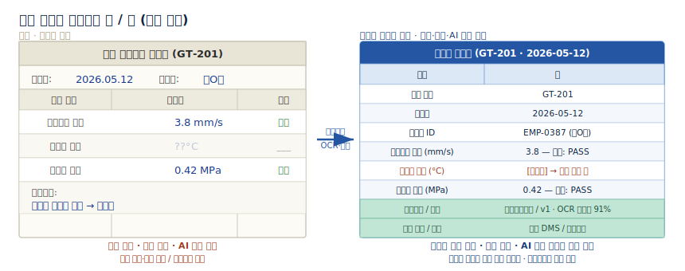
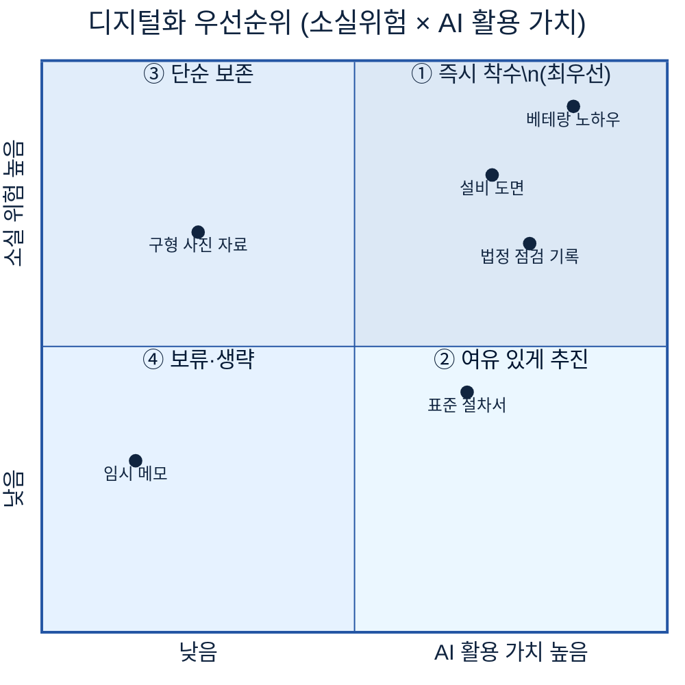
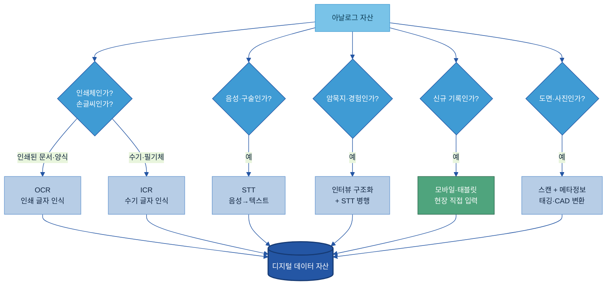
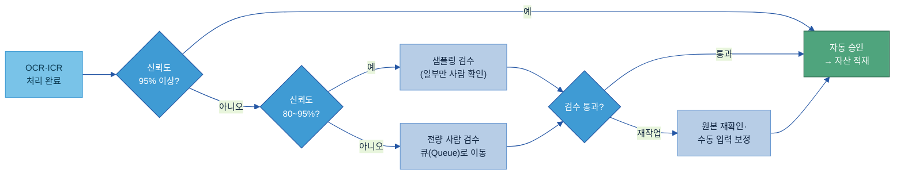
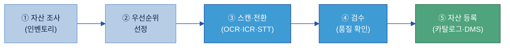
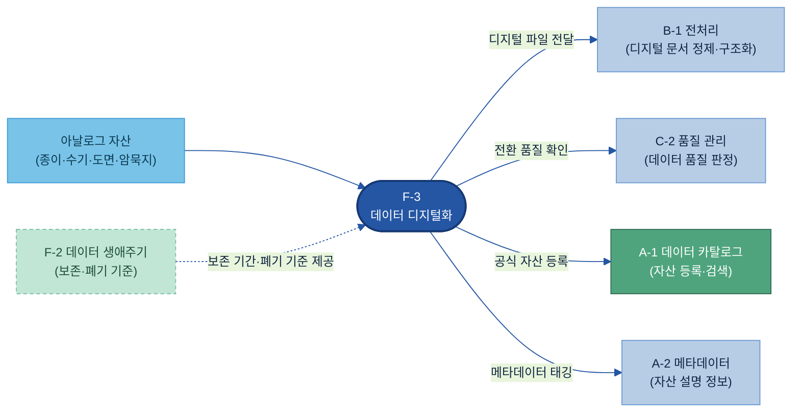

# F-3. 데이터 디지털화(Data Digitization) 매뉴얼

---

## 목차

1. [Why — 왜, 언제 필요한가 (적용 판단)](#why)
    - [1.1 현업 Pain Point](#s11)
    - [1.2 기대 효과 — 수기 검사표 디지털화 전/후](#s12)
    - [1.3 적용 판단 — 무엇부터 하나](#s13)
    - [1.4 작게 시작하기](#s14)
2. [What — 무엇인가·무엇을 갖추나](#what)
    - [2.1 정의 — 체계 내 위치](#s21)
    - [2.2 아날로그 자산 인벤토리](#s22)
    - [2.3 전환 방식](#s23)
    - [2.4 전환 품질 검증](#s24)
3. [How — 어떻게 준비·운영하나](#how)
    - [3.1 전환 절차](#s31)
    - [3.2 지속 수집 — 산재 데이터 공식 자산 승급](#s32)
    - [3.3 Digital-first 정착 + 역할·책임](#s33)
4. [Tech Stack — 솔루션 검토](#tech-stack)
    - [4.1 솔루션 유형](#s41)
    - [4.2 선정 기준](#s42)
5. [Where — 다른 주제와의 관계](#where)

- [별첨 — 아날로그 자산 인벤토리 템플릿 + 완성 예시](#별첨-appendix)
- [참고자료 (References)](#참고자료-references)
- [변경 이력 / 피드백 반영](#변경-이력--피드백-반영)

---

> **예시 표기 안내:** 본 가이드의 다이어그램·표·예시에 나오는 구체 값(설비 코드·측정값·인원·건수 등)은 이해를 돕기 위한 가상 예시이며 실제 데이터가 아니다. 실제 값은 PoC·프로젝트에서 확정한다. 계열사명도 적용 맥락 설명용이다.

> **관련 가이드:** [B-1 데이터 전처리](../B-1%20데이터%20전처리/B-1%20데이터%20전처리.md) · [C-2 데이터 품질 관리](../C-2%20데이터%20품질%20관리/C-2%20데이터%20품질%20관리.md) · [A-1 데이터 카탈로그](../A-1%20데이터%20카탈로그/A-1%20데이터%20카탈로그.md) · [A-2 메타데이터](../A-2%20메타데이터/A-2%20메타데이터.md) · [F-2 데이터 생애주기 관리](../F-2%20데이터%20생애주기%20관리/F-2%20데이터%20생애주기%20관리.md)

---

## 1. Why — 왜, 언제 필요한가 (적용 판단)

데이터 디지털화는 모든 아날로그 자산에 일괄 적용하는 것이 아니다. AI 활용을 가로막는 Pain Point가 뚜렷하고, 소실 위험이 높거나 활용 가치가 큰 자산을 골라서 한다.

### 1.1 현업 Pain Point

**종이·수기 기록은 AI가 아예 읽지 못한다.** 발전설비 현장에서 수십 년간 쌓인 터빈 정기점검 기록, 설비 이상 대응 이력, 수기 치수 검사표가 캐비닛에 잠겨 있으면, AI 예측 유지보수 모델은 "이 부품이 과거에 몇 번 교체됐는가"조차 파악할 수 없다. 모델이 고장 패턴을 학습하려면 과거 이력 데이터가 필요하지만, 아날로그로 잠긴 데이터는 존재하지 않는 것과 같다. [\[1\]](#ref1) [\[3\]](#ref3)

아날로그 자산에서 반복적으로 나타나는 문제는 세 가지다.

| 문제 | 현장 상황 | AI 관점 영향 |
|------|-----------|-------------|
| **종이·수기 기록 — 검색·집계 불가** | 수기 검사표가 캐비닛에 연도별로 보관됨. 특정 설비의 이상 이력을 찾으려면 수동으로 뒤져야 함 | 시계열 분석·추세 파악 불가. 모델 학습 데이터로 투입 불가 |
| **이중 입력과 전사 오류** | 수기 기록 → ERP·MES 재입력 과정에서 판독 오류·전사 실수 발생. 기록과 시스템 간 불일치 | 데이터 신뢰도 저하. AI가 학습해도 오류를 학습하는 결과 |
| **베테랑 은퇴 — 암묵지 영구 소실** | 30년 경력 터빈 엔지니어의 "이 진동 패턴은 ○○ 부위 마모" 같은 판단이 문서화되지 않은 채 퇴직과 함께 사라짐 | AI 진단 모델이 학습할 근거가 없는 지식 공백 발생 |

> **암묵지 소실의 심각성:** 숙련 작업자 은퇴 시 그가 보유한 노하우의 약 90%가 함께 사라지는 것으로 보고된다. [\[4\]](#ref4) [\[5\]](#ref5) 핵심 운영 지식의 상당 부분이 비문서화 상태라는 점에서, 이는 한 번 발생하면 되돌릴 수 없는 손실이다.

### 1.2 기대 효과 — 수기 검사표 디지털화 전/후

종이 기록을 디지털로 전환하면 검색·집계·분석·AI 학습이 한 번에 열린다. [\[2\]](#ref2) 아래 모형은 두산에너빌리티 터빈 정기점검 기록지를 가상 예시로 작성한 것이다.

| 구분 | 전(종이·수기) | 후(디지털화) |
|------|--------------|-------------|
| 기록 방식 | 현장 엔지니어 수기 기입, 캐비닛 보관 | 구조화 레코드, DB 자동 저장 |
| 검색 | 캐비닛 수동 탐색 (30분~수시간) | 설비코드·날짜·항목으로 즉시 검색 |
| 집계·분석 | 수작업 엑셀 집계 (1~2일) | 자동 집계, 트렌드 즉시 |
| AI 활용 | 불가 — AI가 종이를 읽지 못함 | 예측 유지보수 모델 학습 데이터로 투입 |
| 오류 위험 | 판독 오류·전사 오류 상시 | 입력 단계 단일화, 검증 로직 적용 |

> **발전소 전환 사례(참고):** 디지털 유지보수 관리 시스템(CMMS) 전환 후 비계획 정지 35% 감소, 유지보수 인력 비용 28% 절감 사례가 보고된다. [\[9\]](#ref9) 수치는 PoC·내부 측정으로 확인한다.

### 1.3 적용 판단 — 무엇부터 하나

모든 아날로그 자산을 다 디지털화하는 것은 비효율이다. **소실 위험** × **AI 활용 가치** 두 축으로 우선순위를 정한다.

**1순위(즉시 착수):** 은퇴 임박 베테랑의 노하우, 열화 중인 설비 도면, 법정 보존 의무 기록  
**2순위(여유 있게 추진):** 자주 참조하는 표준 절차서, 정기점검 양식  
**3순위(단순 보존):** 활용도 낮고 소실 위험 있는 기록 — 최소 스캔으로 보존  
**4순위(보류·생략):** 이미 다른 시스템에 디지털로 존재하거나, AI·분석 활용 계획도 없고 반복 참조도 드문 자료

> **"안 해도 되는" 기준:** ① 이미 다른 시스템에 디지털로 존재하는 중복 데이터 ② 보관 의무 기간이 지난 문서(법규 확인 후) ③ 디지털화 비용이 예상 활용 가치를 크게 초과하는 자료

### 1.4 작게 시작하기

한 업무·한 양식부터 시작해 효과를 확인한 뒤 확대한다. 전사 일괄 전환은 실패율이 높다.

1. **파일럿 대상 선정** — 가장 Pain이 크거나 AI 연결이 명확한 단일 양식 하나
2. **병행 운영 (2~4주)** — 종이와 디지털을 동시 운영하며 오류·누락 점검. 디지털 전환이 확인될 때까지 종이 백업 유지 [\[12\]](#ref12)
3. **효과 측정** — "입력 오류 ○% 감소", "검색 시간 ○분 단축" 등 구체 수치 확인
4. **확대** — 첫 양식의 성공 패턴을 인접 업무로 적용

> **예시(두산에너빌리티, 가상):** 터빈 정기점검 체크시트 한 종류 → 디지털 입력 전환 → 1개월 후 집계·검색 효과 확인 → 전체 정기점검 기록으로 확대 → 예측 유지보수 AI 모델 학습 데이터 파이프라인 연결

---

## 2. What — 무엇인가·무엇을 갖추나

### 2.1 정의 — 체계 내 위치

데이터 디지털화(Digitization)란 종이·수기·사진·암묵지 등 아날로그 자산을 AI가 활용 가능한 디지털 데이터 자산으로 전환하는 행위다.

이 주제는 아직 컴퓨터가 읽을 수 없는 상태의 자산을 디지털로 만드는 **일회성·대량 오프라인 전환**만 다룬다. 이미 디지털 파일로 존재하는 문서의 정제·구조화는 [B-1 데이터 전처리](../B-1%20데이터%20전처리/B-1%20데이터%20전처리.md)가, 전환된 데이터의 품질 판정은 [C-2 데이터 품질 관리](../C-2%20데이터%20품질%20관리/C-2%20데이터%20품질%20관리.md)가 맡는다.

> **Digitization vs Digitalization 구분:** 두 단어 모두 흔히 "디지털화"로 번역되어 혼동이 잦다. **Digitization**은 아날로그를 디지털 포맷으로 변환하는 행위 자체이고, **Digitalization**은 이미 디지털화된 데이터를 활용해 업무 프로세스를 자동화·개선하는 것이다. F-3은 전자(Digitization)만 다룬다. [\[13\]](#ref13)

AI-Ready Data 체계에서 F-3은 **원천 확보·디지털화** 묶음의 핵심이다. 아날로그 자산이 디지털화되어야 전처리(B-1)·품질 관리(C-2)·카탈로그 등록(A-1)으로 이어지는 파이프라인이 출발할 수 있다.

### 2.2 아날로그 자산 인벤토리

> 이 키트는 아날로그 자산 디지털화 프로젝트를 시작할 때 — 무엇이 얼마나 있는지 파악하는 단계에서 쓴다.

제조 현장의 아날로그 자산은 크게 여섯 유형으로 나뉜다. 아래는 두산에너빌리티(발전설비·터빈·대형 플랜트) 맥락의 대표 예시다.

| 자산 유형 | 쉬운 의미 | 예시(두산에너빌리티, 가상) | 권장 전환 방식 | 소실 위험 | 필수/선택 | 작성 주체 |
|-----------|-----------|--------------------------|--------------|----------|----------|---------|
| **수기 검사표·일지** | 작업자가 손으로 채운 점검 기록지 | 터빈 블레이드 치수 검사표, 설비 점검 일지 | ICR(수기 인식) + 사람 검수 | 높음(열화·분실) | 필수 | 현업 오너 확인 |
| **종이 문서·출력물** | 인쇄된 보고서·성적서 | 검사성적서, 시험 보고서, 납품 기록 | OCR(인쇄 인식) | 중간 | 필수 | 현업 오너 확인 |
| **도면 (청사진·마이크로필름)** | 설비·배관 설계 도면 원본 | 배관도(P&ID), 전기 계통도, 터빈 조립도 | 스캔 + 전용 도면 인식 | 높음(훼손 위험) | 필수 | IT + 현업 |
| **작업자 암묵지(노하우)** | 베테랑이 머릿속에만 가진 판단 기준 | "이 진동 패턴은 베어링 마모", 특정 기종 조정 요령 | 인터뷰 구조화 + STT(음성→텍스트) | 매우 높음(퇴직 시 영구 소실) | 필수 | 현업 오너 + 데이터 조직 |
| **사진 (비정형 이미지)** | 설비 이상 촬영본, 납품 현물 사진 | 터빈 부품 균열 부위 사진, 설치 현장 사진 | 메타정보(설비ID·날짜·이상유형) 태깅 | 낮음(파일 소실만 주의) | 선택 | 현업 촬영자 |
| **현장 메모·포스트잇** | SOP에 작업자가 추가한 판단 메모 | SOP 여백의 "이럴 땐 이렇게" 메모 | 스캔 + 텍스트 구조화 | 높음(분실 용이) | 선택 | 현업 오너 |

(전체 인벤토리 항목은 [별첨 — 아날로그 자산 인벤토리 템플릿](#별첨-appendix) 참고)

### 2.3 전환 방식

자산 유형마다 전환 방식이 다르다. 한 방식으로 모든 자산을 처리할 수 없다.

| 방식 | 개념 | 적합 대상 | 주의사항 |
|------|------|-----------|---------|
| **스캔** | 물리 문서를 고해상도 이미지로 변환. 전환의 첫 단계 | 도면, 성적서, 보고서 등 모든 종이 | 이미지 단독으로는 검색 불가. 반드시 OCR/ICR 후처리 필요. 300dpi 이상 권장 |
| **OCR** (인쇄 글자 인식) | 인쇄·타이핑된 글자를 텍스트로 변환 | 인쇄된 검사성적서, 표준 양식 | 인쇄체 정확도 95~99%. 손글씨·기울기·얼룩에 취약 |
| **ICR** (수기 글자 인식) | 필기체를 신경망으로 인식 | 수기 검사표, 현장 일지, 손 메모 | 평균 85~95%; 흘림체·저해상도에서 60~80%로 하락. 검수 비율 높임 |
| **STT** (음성→텍스트) | 음성을 텍스트로 변환 | 인터뷰 녹취, 현장 구술 작업 지시 | 제조 전용 어휘(부품명·규격)가 없으면 인식률 저하. 한국어 특화 솔루션 검토 필요 |
| **모바일·태블릿 직접 입력** | 처음부터 디지털로 기록 — 종이 배제 | 신규 점검·신규 공정의 기록 | 기존 아날로그 자산 전환에는 미적용. 미래 예방책 |
| **인터뷰 구조화** | 질문지·템플릿으로 암묵지를 언어화·데이터화 | SOP에 없는 판단 기준, 베테랑 노하우 | 인터뷰어 역량에 품질 의존. 반구조화 인터뷰 권장 [\[6\]](#ref6) |

> **한글 수기 특이사항:** 한글은 자음·모음이 음절 블록을 형성하는 구조로 인식 난이도가 높다. 흘림체·저해상도에서는 정확도가 크게 낮아지므로, 한국어 특화 ICR 솔루션 사용 또는 검수 비율 상향을 권장한다. [\[10\]](#ref10)

### 2.4 전환 품질 검증

전환 결과의 오류·누락을 걸러내는 단계다. 인식 신뢰도(Confidence Score)를 기준으로 사람 검수가 필요한 건을 자동 분류한다.

검수 기준은 신뢰도 구간으로 나눈다 [\[7\]](#ref7):

| 신뢰도 구간 | 처리 방식 | 검수 투입 비율(참고) |
|-------------|-----------|-------------------|
| 95% 이상 | 자동 승인 | 최소 |
| 80~95% | 샘플링 검수(일부만 확인) | 중간 |
| 80% 미만 | 전량 사람 검수 큐 | 전량 |

> **검수 이후:** 검수자가 수정한 내용을 OCR/ICR 모델에 피드백으로 반영하면 정확도가 점진적으로 향상된다. 수치(신뢰도 임계치, 샘플 비율)는 PoC에서 문서 유형·복잡도에 맞게 캘리브레이션한다.

---

## 3. How — 어떻게 준비·운영하나

### 3.1 전환 절차

전환은 조사 → 우선순위 → 전환 → 검수 → 자산 등록의 5단계 흐름으로 진행한다.

**① 자산 조사:** 어떤 종류의 문서가 얼마나 있는지 파악한다. 문서 유형·매수·보존 상태·보관 위치·법령 보존 의무를 목록으로 작성한다. (템플릿: [별첨](#별첨-appendix))

**② 우선순위 선정:** [1.3절](#s13) 소실위험 × 활용가치 기준으로 배치를 정한다. 훼손·노화 위험이 있는 문서는 긴급 처리한다.

**③ 스캔·전환:** 자산 유형에 맞는 방식([2.3절](#s23))으로 전환한다. 스캔 전 스테이플·클립 제거, 구겨진 종이 펴기 등 물리 준비가 먼저다. 도면·표 포함 문서는 컬러·고해상도(300dpi 이상) 스캔을 권장한다. [\[11\]](#ref11)

> **예시로 따라가기(두산에너빌리티 가상):** 터빈 블레이드 치수 검사표(수기 기입, A4 양식) → 300dpi 컬러 스캔 → ICR로 수기 수치(치수·온도·판정) 인식 → 신뢰도 90% 이상 항목은 자동 처리, 냉각수 온도 항목 신뢰도 72% → 사람 검수 큐로 이동 → 검수자가 원본과 대조 후 "82.3°C"로 수정 → 메타데이터(설비코드 GT-201, 점검일 2026-05-12, 점검자 ID) 태깅 → 사내 DMS에 공식 자산으로 등록 → A-1 데이터 카탈로그에 추가

**④ 검수:** [2.4절](#s24) 신뢰도 기반 라우팅에 따라 자동 또는 사람 검수를 진행한다. 핵심 필드(측정값·일자·설비코드)는 필수 확인 대상이다.

**⑤ 자산 등록:** 검수를 통과한 데이터를 중앙 저장소(ECM·DMS·데이터 레이크)에 적재한다. 접근 권한 설정 후 [A-1 데이터 카탈로그](../A-1%20데이터%20카탈로그/A-1%20데이터%20카탈로그.md)에 공식 자산으로 등록한다.

**Before→After 작성 규칙 — 전환 결과물 품질 기준:**

| 전환 유형 | 미흡한 결과물 | 갖춰진 결과물 |
|-----------|-------------|-------------|
| 스캔 단독 적재 | 이미지 파일만 저장. 파일명 `scan001.jpg`. 검색·집계 불가 | OCR·ICR 후 텍스트 추출 완료. 필드별 구조화 레코드. 메타데이터(설비코드·날짜·유형) 태깅 완료 |
| 수기 인식 오인식 방치 | "12.4 MPa"를 "12.4MPo"로 오인식 — 검수 없이 그대로 적재 | 신뢰도 80% 미만 필드는 검수 큐로 이동. 검수자가 원본 대조 후 수정 확정 |
| 메타데이터 누락 | 파일명·저장 날짜만 있고 설비코드·문서유형·작성자 없음 | 설비코드·문서유형·작성일·담당자·보존기한·OCR 신뢰도까지 필드로 기록 |

### 3.2 지속 수집 — 산재 데이터 공식 자산 승급

개인 PC·팀 공유폴더에 흩어진 Excel·파일(Shadow Data)과, 수집됐지만 분류·활용되지 않는 데이터(Dark Data)도 디지털화 대상이다. 이것을 그대로 두면 AI가 활용 가능한 데이터는 빙산의 일각뿐이다. [\[14\]](#ref14)

**Shadow Data(그림자 데이터)란** 공식 관리 시스템 밖에서 생성·저장되는 데이터다. 품질팀 각자 PC의 Excel 품질 기록, 팀 공유폴더의 비승인 파일 등이 해당한다.

공식 자산으로 승급하는 방법:

| 단계 | 하는 일 | 두산에너빌리티 예시 (가상) |
|------|---------|--------------------------|
| **1. 자동 탐색** | 조직 내 드라이브·SharePoint·DB를 스캔해 비관리 데이터 목록 자동 생성 | 현업 담당자 PC의 품질 Excel 파일 목록 파악 |
| **2. 원천 일원화** | 신규 데이터는 처음부터 지정 시스템에만 생성하도록 정책 수립 | 신규 점검 기록은 품질 관리 시스템에만 입력하도록 규정 |
| **3. 입력 표준화** | Excel 자유 양식 → 정해진 템플릿·드롭다운 코드 기반 입력 양식으로 전환 | "판정" 필드: 자유 입력 "OK / 이상 없음 / 양호" → 코드 선택 "PASS / FAIL / HOLD" |
| **4. 이전(Migration)** | 기존 Shadow Data를 카탈로그에 등록하거나 폐기 결정 | 5년치 Excel 품질 기록 → DMS로 이전 후 카탈로그 등록 |
| **5. 지속 모니터링** | 비승인 저장소에 다시 쌓이지 않도록 정기 감사 | 분기별 개인 드라이브 스캔 자동화 |

### 3.3 Digital-first 정착 + 역할·책임

**Digital-first**란 과거 자료는 디지털화하되, 앞으로 생성되는 신규 데이터는 처음부터 디지털로만 기록하는 방식이다. 모바일·태블릿 현장 입력(e-form)이 핵심 수단이다.

주요 기능과 효과:

| 기능 | 설명 | 효과 |
|------|------|------|
| 드롭다운·코드 선택 | 자유 입력 대신 허용값 목록에서 선택 | 오타·비표준 표기 제거 |
| 필수 입력 강제 | 공란으로 제출 불가 | 누락 데이터 방지 |
| 자동 타임스탬프 | 제출 시각 자동 기록 | 수기 날짜 변조 방지 |
| QR/바코드 스캔 | 설비 코드·부품 번호 자동 입력 | 입력 오류 근절 |
| 오프라인 모드 | 인터넷 불안정한 현장에서도 입력 후 나중에 동기화 | 제조 현장 적용 가능 |

> **예시(두산에너빌리티, 가상):** 터빈 블레이드 치수 검사 시 검사원이 태블릿에 측정값 입력 → 설비 코드 QR 스캔으로 자동 연결 → 기준값 초과 시 즉시 알람 → 담당자 전자서명 후 품질 DB에 자동 저장

**역할·책임(R&R):**

| 역할 | 주요 책임 |
|------|----------|
| **현업 오너(Data Owner)** | 디지털화할 자산 목록 확인·우선순위 결정. 변환 결과 검수(내용 정확성). 메타데이터 정의(어떤 항목이 필요한가) |
| **데이터 조직** | 표준 포맷·메타데이터 스키마 설계. 중앙 저장소 운영. 전체 프로젝트 조율·품질 기준 관리 |
| **IT** | 스캔·OCR 인프라 구성·운영. 저장소·파이프라인 구축. 보안·접근 권한 설정 |
| **외주 스캔·입력업체** | 대량 물리 문서 스캔·이미지 변환 실행. 이미지 품질 1차 보증 |

> **외주 활용 시 주의:** 메타데이터 정의와 검수 기준 결정은 반드시 내부(현업 + 데이터 조직)가 해야 한다. 외주는 실행(스캔·변환)만 맡긴다.

---

## 4. Tech Stack — 솔루션 검토

> 솔루션을 묶어 평가·선정하려면 → [Tech Stack 비교 정본](../../Tech%20Player/01%20Tech%20Stack%20비교%20(솔루션×주제).md)

### 4.1 솔루션 유형

**OCR(문자 인식)** 과 **IDP(지능형 문서 처리, Intelligent Document Processing)** 를 구분한다.

- **OCR:** 이미지 → 텍스트 변환. 단순 읽기. 정형 인쇄 문서·대량 단순 변환에 적합.
- **IDP:** OCR + AI(분류·추출·검증·워크플로우 자동화). 의미 이해. 비정형 문서·표·양식 자동 추출, 여러 문서 유형 처리에 적합. [\[8\]](#ref8)

**클라우드 OCR / 문서 AI:**

| 솔루션 | 강점 | 온프렘 | 한글 |
|--------|------|--------|------|
| [Azure AI Document Intelligence](https://azure.microsoft.com/en-us/products/ai-foundry/tools/document-intelligence) [\[15\]](#ref15) | 폼·인보이스 등 사전학습 모델 풍부. MS 생태계(SharePoint·Teams) 연동 | 불가 | 지원 |
| [Google Document AI](https://cloud.google.com/document-ai) [\[16\]](#ref16) | 200개+ 언어 지원. 복잡 레이아웃. Vertex AI 연동 | 불가 | 지원 |
| [AWS Textract](https://aws.amazon.com/textract/) [\[17\]](#ref17) | 표 추출 강점(셀 관계 매핑). AWS 생태계 연동 | 불가 | 제한적 |
| [ABBYY FineReader Server](https://www.abbyy.com/finereader-server/) [\[18\]](#ref18) | **온프렘 설치 가능**. 한국어 포함 200개+ 언어. 대량 배치 처리 | 가능 | 지원 |
| [ABBYY Vantage](https://www.abbyy.com/vantage/) [\[19\]](#ref19) | IDP 플랫폼. 프라이빗 클라우드/온프렘 선택 가능 | 가능 | 지원 |

**국내 한글·수기 특화 솔루션:**

| 솔루션 | 강점 | 온프렘 | 특이사항 |
|--------|------|--------|---------|
| [CLOVA OCR](https://www.ncloud.com/product/aiService/ocr) (네이버 클라우드) [\[20\]](#ref20) | 한국어·일어·영어 인식. 한글 수기 인식 지원 | 미확인 | API Gateway 연동 |
| [Document Parse](https://www.upstage.ai/products/document-parse) (업스테이지) [\[21\]](#ref21) | 복잡 테이블·다단 레이아웃 처리. LLM 연동 최적(HTML·Markdown 출력). **온프렘 제공** | 가능 | 정확도 수치는 자사 발표 기준 — PoC 확인 권장 |

**오픈소스 OCR (폐쇄망·온프렘 특화):**

| 솔루션 | 강점 | 한글 | 비고 |
|--------|------|------|------|
| [PaddleOCR](https://github.com/PaddlePaddle/PaddleOCR) [\[22\]](#ref22) | 복잡 레이아웃·다열 문서. 완전 오프라인(데이터 외부 전송 없음). GPU 불필요 | 지원 | 수기·한글 특수 폰트는 추가 학습 필요할 수 있음 |
| [Tesseract](https://github.com/tesseract-ocr/tesseract) | 가장 가벼움. CPU에서 빠름 | 지원 | 수기 인식 미흡 |

**STT (음성→텍스트) 솔루션:**

| 솔루션 | 강점 | 온프렘 | 한국어 |
|--------|------|--------|--------|
| [CLOVA Speech / CLOVA Note](https://www.ncloud.com/product/aiService/clovaSpeech) (네이버) [\[23\]](#ref23) | 한국어 최고 수준 인식률. 회의록 자동 생성 | 미확인 | 최적화 |
| [리턴제로 STT (VITO API)](https://www.rtzr.ai/stt) [\[24\]](#ref24) | 한국어 특화. 클라우드+온프렘 선택 가능. 화자 분리 지원 | 가능 | 최적화 |
| [Whisper](https://github.com/openai/whisper) (OpenAI) [\[25\]](#ref25) | 오픈소스, 자체 설치 가능. 99개 언어 | 가능 | 지원(학습 데이터 부족) |

### 4.2 선정 기준

| 기준 | 확인 사항 | 우선 후보 |
|------|----------|----------|
| **한글·수기 처리** | 한글 수기 ICR 지원 여부 | CLOVA OCR, 업스테이지 Document Parse, ABBYY |
| **표·도면 처리** | 복잡 레이아웃, 다단 표, 기술 도면 처리 | 업스테이지 Document Parse, AWS Textract, ABBYY |
| **온프렘(폐쇄망) 가능** | 클라우드 데이터 전송 없이 사내 설치 가능 여부 | ABBYY FineReader/Vantage, 업스테이지, PaddleOCR(오픈소스) |
| **STT 포함** | 음성(회의록·구술 기록) 변환 필요 시 | CLOVA Speech, 리턴제로 STT, Whisper |
| **기존 시스템 연동** | SAP·SharePoint·DMS 등 API 연동 | Azure AI(MS 생태계), ABBYY |

> **가격·정확도 수치는 단정하지 않는다.** 솔루션별 한글 수기 정확도·온프렘 구성 방식·비용은 PoC 또는 벤더 공식 문서로 확인한다.

---

## 5. Where — 다른 주제와의 관계

F-3 데이터 디지털화는 아날로그 자산을 디지털로 만드는 **입구**다. 디지털화된 이후의 처리는 각 주제가 전담한다.

| 관계 주제 | 역할 분담 | 경계 |
|-----------|----------|------|
| [B-1 데이터 전처리](../B-1%20데이터%20전처리/B-1%20데이터%20전처리.md) | **이미 디지털 파일**인 문서의 정제·구조화·청킹을 담당 | F-3 이후 단계. 디지털화가 완료된 파일을 받아 처리 |
| [C-2 데이터 품질 관리](../C-2%20데이터%20품질%20관리/C-2%20데이터%20품질%20관리.md) | 전환된 데이터의 품질 판정·규칙 정의 | 전환 품질 검증(신뢰도 기반 검수)은 F-3. 데이터 품질 기준 설정·모니터링은 C-2 |
| [A-1 데이터 카탈로그](../A-1%20데이터%20카탈로그/A-1%20데이터%20카탈로그.md) | 디지털화된 자산을 공식 자산으로 등록·검색 가능하게 함 | 등록 전 단계(자산 생성 자체)가 F-3. 등록·관리·검색이 A-1 |
| [A-2 메타데이터](../A-2%20메타데이터/A-2%20메타데이터.md) | 디지털화 산출물에 붙는 설명 정보(설비코드·날짜·담당자 등) 정의 | 메타데이터 태깅 실행은 F-3 전환 절차 안에. 스키마·표준 정의는 A-2 |
| [F-2 데이터 생애주기 관리](../F-2%20데이터%20생애주기%20관리/F-2%20데이터%20생애주기%20관리.md) | 어느 자산을 얼마나 보존할지, 언제 폐기할지 기준 제공 | 보존 기간·폐기 기준은 F-2. 디지털화 우선순위 결정에 이 기준을 참고 |

---

## 별첨 — 아날로그 자산 인벤토리 템플릿 + 완성 예시

### 빈 템플릿 (복사해서 사용)

| 자산 ID | 자산 유형 | 자산명 | 보관 위치 | 매수/분량 | 상태 | 보존 의무 | 소실 위험 | AI 활용 가능성 | 우선순위 | 권장 전환 방식 | 담당자 | 목표 완료 |
|---------|----------|--------|----------|----------|------|----------|----------|--------------|---------|--------------|--------|---------|
| | | | | | | | | | | | | |

### 완성 예시 (두산에너빌리티, 가상)

| 자산 ID | 자산 유형 | 자산명 | 보관 위치 | 매수/분량 | 상태 | 보존 의무 | 소실 위험 | AI 활용 가능성 | 우선순위 | 권장 전환 방식 | 담당자 | 목표 완료 |
|---------|----------|--------|----------|----------|------|----------|----------|--------------|---------|--------------|--------|---------|
| DOC-001 | 수기 검사표 | 터빈 정기점검 기록지 (2010~2020) | 창원사업장 3동 캐비닛 C-12 | 약 4,200장 | 일부 누렇게 변색 | 법정 5년(산업안전보건법) | 높음 (열화 진행) | 높음 (예측 유지보수 학습 소재) | **1순위** | OCR(양식) + ICR(수기 측정값) + 사람 검수 | 설비팀 이O환 | 2026-09 |
| DOC-002 | 작업자 암묵지 | 터빈 GT-계열 조정 노하우 (퇴직 예정 베테랑 3명) | 없음(머릿속) | — | 소실 임박 | 없음 | 매우 높음 (퇴직 예정) | 높음 (AI 진단 기초 지식) | **1순위** | 반구조화 인터뷰 + STT 녹취 + 구조화 | 기술팀 박O준 | 2026-08 |
| DOC-003 | 도면 | 1980년대 보일러 배관도(P&ID) 원본 | 설계부 도면 보관실 | 127장 (A0~A2) | 일부 찢어짐 | 영구보존 | 높음 (물리 훼손) | 중간 (설비 이력 참조) | **1순위** | 고해상도 컬러 스캔 + CAD 변환(DWG) | 설계팀 최O서 | 2026-07 |
| DOC-004 | 종이 보고서 | 납품 검사성적서 (2015~2023) | 품질팀 캐비닛 | 약 8,500장 | 양호 | 법정 3년 | 낮음 | 중간 (품질 분석) | **2순위** | OCR(인쇄체) | 품질팀 김O희 | 2026-12 |

### 주요 용어

| 용어 | 풀이 |
|------|------|
| **Digitization(디지털화)** | 아날로그 정보를 0·1 디지털 포맷으로 변환하는 행위. F-3의 범위 |
| **OCR** | 인쇄된 글자를 컴퓨터가 읽을 텍스트로 인식하는 기술(Optical Character Recognition) |
| **ICR** | 손으로 쓴 글자를 인식하는 기술. OCR보다 어렵고 검수 비율이 높음(Intelligent Character Recognition) |
| **STT** | 음성을 텍스트로 변환하는 기술(Speech-to-Text) |
| **IDP** | OCR에 AI(분류·추출·검증)를 더한 지능형 문서 처리(Intelligent Document Processing) |
| **암묵지(Tacit Knowledge)** | 경험으로 체득한 판단 기준. 언어화되지 않아 문서에 없는 지식 |
| **Shadow Data** | 공식 관리 시스템 밖에서 생성·저장되는 데이터(개인 PC Excel, 비승인 공유폴더 등) |
| **신뢰도(Confidence Score)** | OCR/ICR가 인식한 결과에 대해 스스로 부여하는 정확도 점수. 낮으면 사람 검수로 라우팅 |
| **Digital-first** | 신규 데이터를 처음부터 디지털로만 생성하는 방식. 종이 기록을 아예 배제 |

---

## 참고자료 (References)

**Pain Point · 필요성**

**[1]** AI 기반 예측 유지보수 시스템 — 발전소·전력 설비 — <https://velog.io/@shfur0657/AI-%EA%B8%B0%EB%B0%98-%EC%98%88%EC%B8%A1-%EC%9C%A0%EC%A7%80%EB%B3%B4%EC%88%98-%EC%8B%9C%EC%8A%A4%ED%85%9C-%EB%B0%9C%EC%A0%84%EC%86%8C%EC%A0%84%EB%A0%A5-%EC%84%A4%EB%B9%84-%EA%B3%A0%EC%9E%A5-%EC%98%88%EC%B8%A1%EA%B3%BC-%EB%8C%80%EC%9D%91-%EB%B0%A9%EB%B2%95-iswgvu3z>

**[2]** MachineMetrics, "Paperless Manufacturing: Top Benefits of Digitizing Your Data" — <https://www.machinemetrics.com/blog/paperless-manufacturing>

**[3]** DocumentScanning.ai, "How Document Scanning Supports Manufacturing Digital Transformation" — <https://www.documentscanning.ai/blog/how-document-scanning-supports-manufacturing-digital-transformation>

**[4]** Dovient, "Tacit Knowledge in Manufacturing: The Hidden Asset" — <https://dovient.com/resources/blog/tacit-knowledge-manufacturing-hidden-asset>

**[5]** Manual.to, "The Tribal Knowledge Crisis in Manufacturing" — <https://manual.to/the-tribal-knowledge-crisis-in-manufacturing/>

**[6]** Augmentir, "Tacit Knowledge in Manufacturing: Unlocking Hidden Expertise with AI" — <https://www.augmentir.com/glossary/tacit-knowledge>

**[7]** LlamaIndex, "OCR Accuracy Explained: How to Improve It" — <https://www.llamaindex.ai/blog/ocr-accuracy>

**[8]** ABBYY, "OCR vs. IDP: What's the difference?" — <https://www.abbyy.com/blog/ocr-vs-idp/>

**[9]** OxMaint, "Digital Maintenance Transformation in Power Plants" — <https://oxmaint.com/industries/power-plant/power-plant-shift-to-digital-maintenance-transformation>

**전환 기술**

**[10]** Intelligent Character Recognition (ICR) — 수기·필기체 인식 개요, Wikipedia — <https://en.wikipedia.org/wiki/Intelligent_character_recognition>

**[11]** eRecordsUSA, "How to Digitize Engineering Drawings and As-Built Plans" — <https://www.erecordsusa.com/how-to-digitize-engineering-drawings-as-built-plans/>

**[12]** IDsys, "Production Process Digitalization: A Practical Step-by-Step Guide" — <https://www.idsys.ee/en/manufacturing/production-process-digitalization-manufacturing/>

**[13]** Yokogawa, "The Differences Between Digitization, Digitalization, and Digital Transformation in Manufacturing" — <https://www.yokogawa.com/library/resources/white-papers/the-differences-between-digitization-digitalization-and-digital-transformation-in-manufacturing/>

**Shadow Data**

**[14]** SealPath, "Shadow Data Basics — How to Prevent its Risks in Organizations" — <https://www.sealpath.com/blog/shadow-data-organizations/>

**솔루션**

**[15]** Azure AI Document Intelligence — <https://azure.microsoft.com/en-us/products/ai-foundry/tools/document-intelligence>

**[16]** Google Document AI — <https://cloud.google.com/document-ai>

**[17]** AWS Textract — <https://aws.amazon.com/textract/>

**[18]** ABBYY FineReader Server — <https://www.abbyy.com/finereader-server/>

**[19]** ABBYY Vantage — <https://www.abbyy.com/vantage/>

**[20]** CLOVA OCR (네이버 클라우드) — <https://www.ncloud.com/product/aiService/ocr>

**[21]** 업스테이지 Document Parse — <https://www.upstage.ai/products/document-parse>

**[22]** PaddleOCR (오픈소스) — <https://github.com/PaddlePaddle/PaddleOCR>

**[23]** CLOVA Speech (네이버 클라우드) — <https://www.ncloud.com/product/aiService/clovaSpeech>

**[24]** 리턴제로 STT (VITO API) — <https://www.rtzr.ai/stt>

**[25]** OpenAI Whisper — <https://github.com/openai/whisper>

---

## 변경 이력 / 피드백 반영

| 일자 | 버전 | 피드백(누가/무엇) | 반영 내용 | 반영 위치 |
|------|------|-----------------|----------|---------|
| 2026-06-29 | 0.1 | 신규 작성(00 목차 기반·B-1·B-3 형식) | F-3 데이터 디지털화 가이드 초안 | 전체 |
