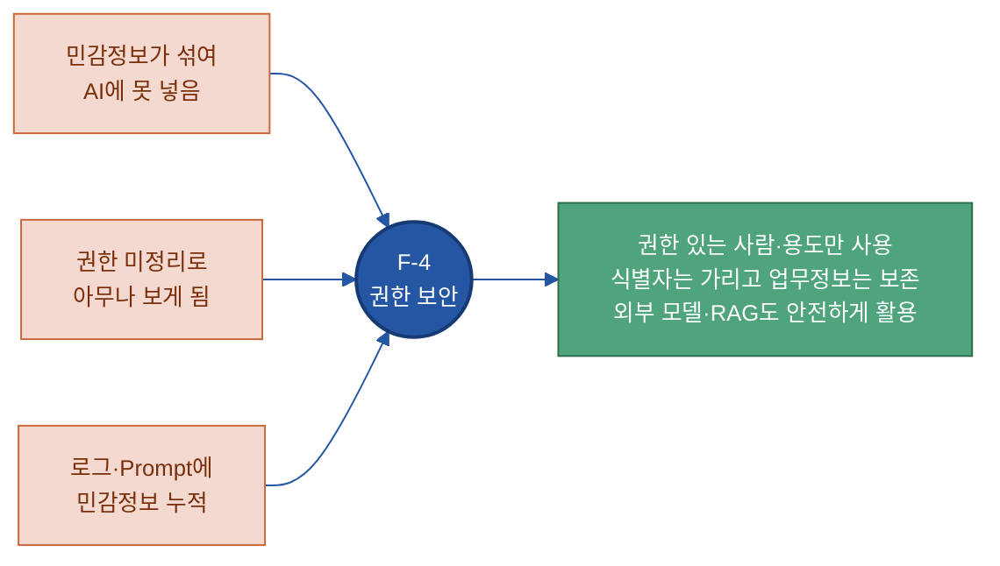
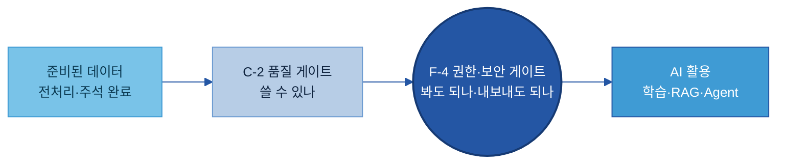
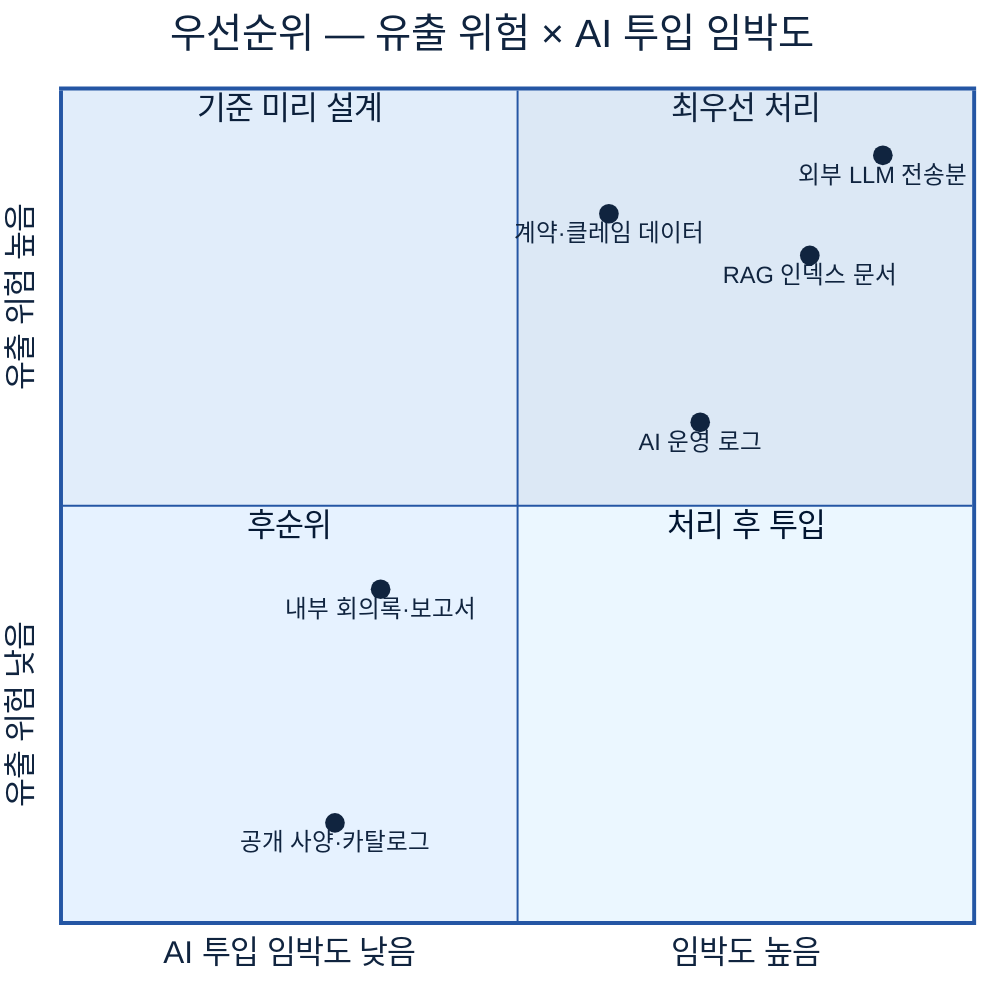
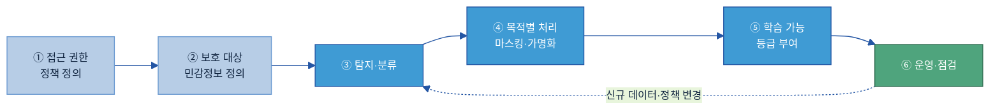
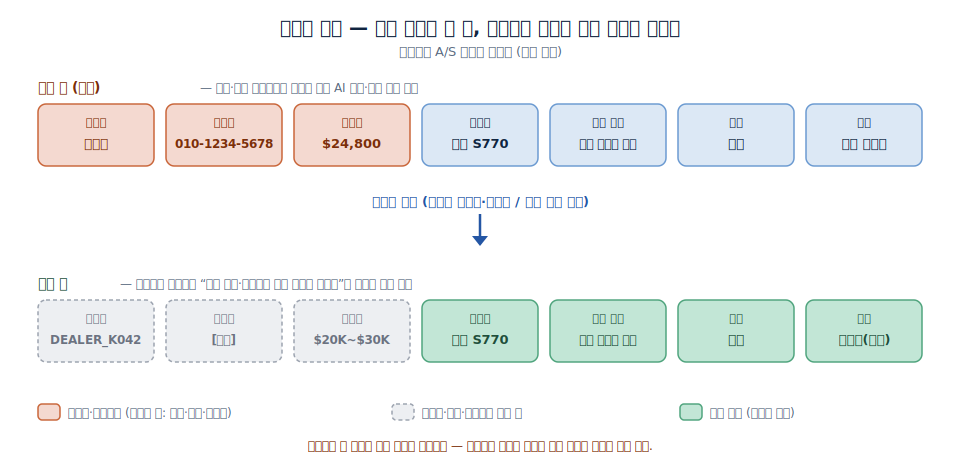
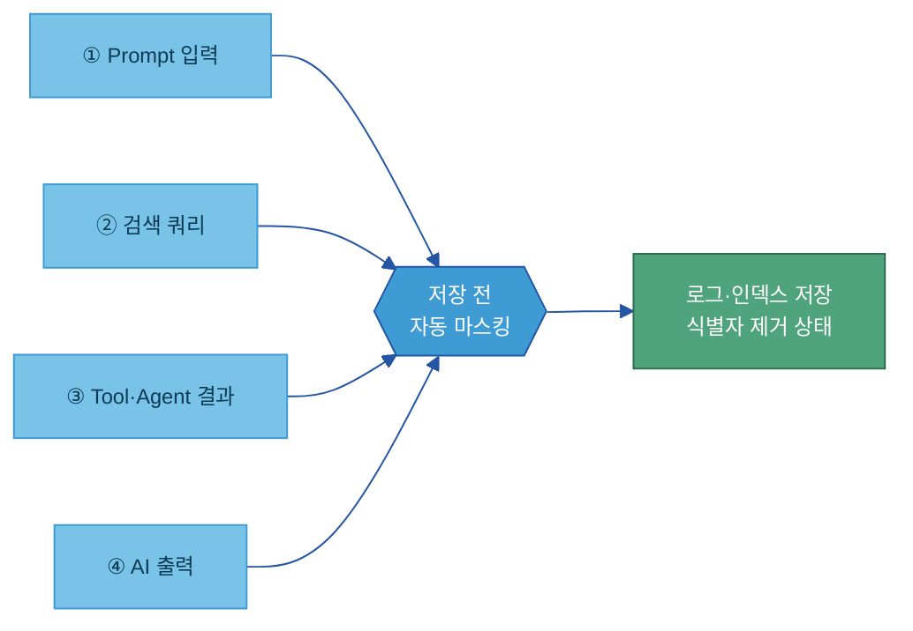
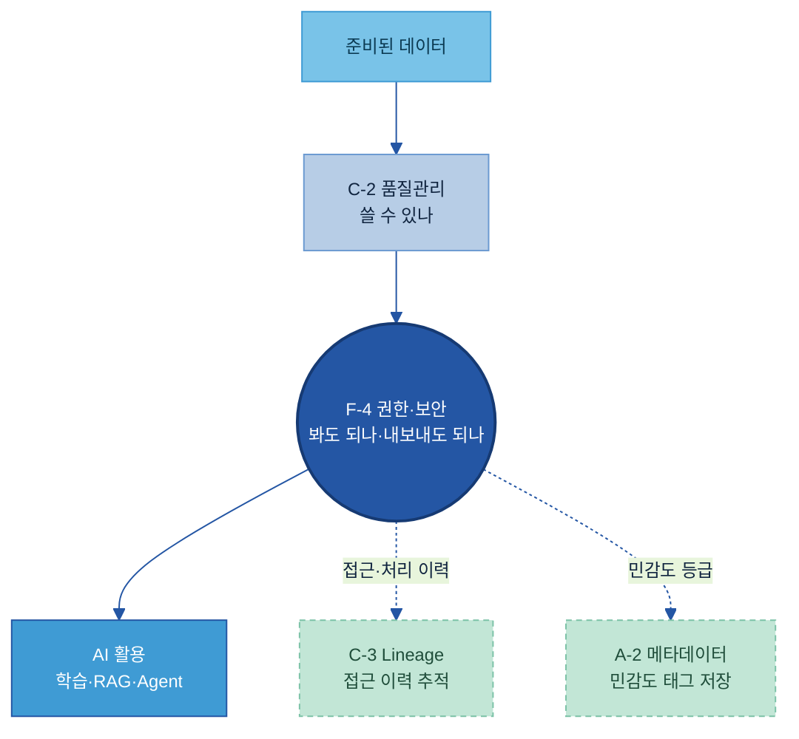

# F-4. AI 데이터 권한 보안(Data Access & Privacy) 매뉴얼

---

## 목차

- [이 가이드가 답하는 8가지 질문](#key-questions)

1. [Why — 왜 필요한가](#why)
    - [1.1 AI 과제를 막는 권한·보안 Pain Point](#s11)
    - [1.2 기대 효과 — 가리되 살린다](#s12)
2. [What — 무엇인가 (구성요소)](#what)
    - [2.1 정의 — 권한 통제 + 비식별 + 체계 내 위치](#s21)
    - [2.2 접근 권한 — 누가 무엇을 쓸 수 있나](#s22)
    - [2.3 보호 대상 — 무엇을 가려야 하나](#s23)
    - [2.4 비식별 처리 방식과 학습 가능 등급](#s24)
3. [When — 어디부터 하나](#when)
    - [3.1 우선 처리 대상 (위험이 큰 순서)](#s31)
    - [3.2 목적별 차등 — 용도에 따라 강도가 다르다](#s32)
4. [How — 어떻게 준비·운영하나](#how)
    - [4.1 구축 절차 6단계](#s41)
    - [4.2 민감정보 탐지와 작성 규칙](#s42)
    - [4.3 운영 — AI 입력·로그 마스킹](#s43)
    - [4.4 운영 — 재식별 점검·권한 재검토·역할](#s44)
5. [Tech Stack — 솔루션 검토](#tech)
    - [5.1 솔루션 유형 — 세 갈래 + 국내](#s51)
    - [5.2 선정 기준 (제조 현업 관점)](#s52)
6. [Where — 다른 주제와의 관계](#where)

- [별첨 (Appendix)](#별첨-appendix)
    - [민감정보 처리 대장 — 빈 템플릿 + 완성 예시](#app-template)
    - [주요 용어](#app-terms)
- [참고자료 (References)](#참고자료-references) · [변경 이력 / 피드백 반영](#변경-이력--피드백-반영)

---

> **예시 표기 안내:** 본 가이드의 표·예시·그림에 나오는 구체 값(딜러명·연락처·계약가·제품/결함명·날짜 등)은 이해를 돕기 위한 가상 예시이며 실제 데이터가 아니다. 실제 값과 등급·기법은 PoC·프로젝트에서 확정한다. 계열사명도 적용 맥락 설명용이다.

> **관련 가이드:** [C-2 데이터 품질 관리](../C-2%20데이터%20품질%20관리/C-2%20데이터%20품질%20관리.md) · [C-3 데이터 계통 Lineage](../C-3%20데이터%20계통%20Lineage/C-3%20데이터%20계통%20Lineage.md) · [A-2 메타데이터](../A-2%20메타데이터/A-2%20메타데이터.md) · [E-2 합성데이터](../E-2%20합성데이터/E-2%20합성데이터.md) · [E-3 AI 평가 데이터](../E-3%20AI%20평가%20데이터/E-3%20AI%20평가%20데이터.md)

이 가이드는 AI 데이터 권한 보안이 왜 필요한지(1장), 무엇으로 이루어지는지(2장), 어떤 데이터부터 적용할지(3장), 실제로 어떻게 처리하고 운영하는지(4장), 어떤 솔루션을 검토할지(5장)를 다룬다. 끝까지 강조하는 메시지는 하나다. 보안은 데이터를 "잠그는" 일이 아니라, 가릴 것만 정확히 가려 **AI가 안전하게 쓸 수 있는 데이터로 바꾸는** 준비 작업이다.

## 이 가이드가 답하는 8가지 질문

| 질문 | 한 줄 답 | 본문 |
|---|---|---|
| 데이터 접근 권한을 어떻게 통제하나 | 역할·목적·민감도에 따라 조회·분석·학습·반출 권한을 나누고, 표·문서뿐 아니라 RAG 인덱스에도 같은 규칙을 건다 | [2.2](#s22) |
| 어떤 정보를 보호 대상으로 보나 | 개인정보뿐 아니라 고객사명·계약가·도면·공정조건 같은 제조 기밀까지 — 민감도 4등급으로 분류 | [2.3](#s23) |
| 정형·비정형에서 민감정보를 어떻게 찾나 | DB 컬럼은 패턴·컬럼명으로, 문서·로그·Prompt는 개체명 인식과 AI로 — 자동 탐지 + 사람 검수 | [4.2](#s42) |
| 활용 목적별로 처리 방식을 어떻게 다르게 하나 | 학습·RAG·로그·외부 모델·외부 공유마다 삭제·마스킹·가명화·익명화 강도를 달리한다 | [3.2](#s32) |
| 가렸는데 AI 성능은 어떻게 유지하나 | 식별자만 가리고 제품·공정·결함 같은 업무 정보는 보존한다 | [2.4](#s24) · [4.2](#s42) |
| 학습해도 되는 데이터와 안 되는 데이터를 어떻게 나누나 | 원본 사용 / 가명화 후 / 익명화 후 / 학습 금지의 4등급으로 표시한다 | [2.4](#s24) |
| AI 로그와 Prompt의 민감정보는 어떻게 처리하나 | 입력·검색·실행·출력 네 지점에서 저장 전 자동 마스킹한다 | [4.3](#s43) |
| 재식별 위험은 어떻게 관리하나 | 속성 결합으로 다시 식별되는지 정기 점검하고, 고위험이면 등급을 올리거나 활용을 제한한다 | [4.4](#s44) |

---

## 1. Why — 왜 필요한가

데이터가 아무리 많아도 민감정보가 섞여 있고 누가 볼 수 있는지 정리되어 있지 않으면 AI 과제는 시작 단계에서 막힌다. 권한 보안은 이 막힘을 푸는 일이다 — 가릴 것을 가려 "법무·보안팀이 반대하던 데이터"를 "AI에 안전하게 넣는 데이터"로 바꾼다.

### 1.1 AI 과제를 막는 권한·보안 Pain Point

제조 현장의 클레임·A/S·영업 데이터는 본질적으로 민감정보 덩어리다. 두산밥캣 딜러 클레임 한 건에도 딜러명, 담당자 연락처, 계약가, 보증 조건이 함께 들어 있다. AI를 붙이려는 순간 다음 문제들이 한꺼번에 드러난다.

| 상황 | 실제 문제 |
|---|---|
| 민감정보가 섞여 있어 AI에 못 넣음 | 클레임·계약 데이터를 그대로 AI 학습에 쓰거나 외부 LLM(ChatGPT·Claude API 등)에 보내면 고객 개인정보·계약가가 외부에 저장·학습될 수 있어, 법무·보안팀 반대로 과제가 중단된다. |
| 접근 권한이 정리 안 돼 "아무나" 보게 됨 | 기존엔 "ERP는 회계만, MES는 생산만" 보던 묵시적 분리가, 사내 문서·DB 전체를 검색해 답하는 RAG 챗봇이 들어오면 사라진다. 현장 작업자가 AI 질문만으로 계약가·딜러 마진을 꺼낼 수 있게 된다[\[1\]](#ref1). |
| 보고서·로그·Prompt에 민감정보가 쌓임 | 사용자가 Prompt에 고객명·계약번호를 직접 입력하고, AI 출력·검색 결과·실행 로그에 민감정보가 섞여 저장되면, "또 다른 개인정보 저장소"가 새로 생긴다. |
| 다 가리면 데이터가 쓸모없어짐 | 반대로 보안을 너무 강하게 걸어 결함 유형·제품군·공정까지 뭉개면, AI가 "어떤 공정에서 어떤 결함이 많은가"를 학습할 수 없게 된다. |

이 문제들은 AI·RAG·Agent가 들어오며 **새로 생긴 유출 경로**다. 과거에는 "사람이 DB에 접속해 조회한다"는 단일 경로였지만, 지금은 외부 모델 전송, RAG 인덱스 과다 수집, AI 출력에 학습 데이터 속 개인정보가 재현되는 경로, Agent 실행 로그까지 길이 여러 갈래로 늘었다[\[16\]](#ref16).

### 1.2 기대 효과 — 가리되 살린다

권한 보안을 적용하면 막혀 있던 데이터가 다시 흐른다. 핵심은 "전부 잠그기"가 아니라 "식별자만 정확히 가리고 업무 판단에 필요한 정보는 남기기"다. 같은 클레임 데이터를 어떻게 바꾸는지로 효과를 먼저 그려 본다.

| 구분 | 적용 전 | 적용 후 |
|---|---|---|
| 고객·딜러 식별정보 | 이름·연락처·계약가 원문 저장 | 가명 ID·삭제·가격대 범주로 치환 |
| 업무 정보 | (구분 없이 함께 묶임) | 제품군·결함 유형·공정·지역(범주)은 보존 |
| AI 활용 | "개인정보 섞여 못 쓴다"로 중단 | "어떤 공정·기후대에서 어떤 결함이 많은가" 학습 가능 |
| 외부 활용 | 외부 LLM·분석 파트너 공유 불가 | 가명화 데이터로 공유 가능, 규제 준수 |

식별정보는 가렸지만 업무 판단에 필요한 정보(제품군·공정·결함 유형·지역 범주)는 살아 있어 AI 활용 가치가 유지된다. 이 "가리되 살린다"가 권한 보안의 본질이며, [4.2](#s42)에서 실제 처리 규칙으로 다시 다룬다.

---

## 2. What — 무엇인가 (구성요소)

AI 데이터 권한 보안은 두 축으로 이루어진다 — **누가 쓸 수 있는지 정하는 접근 권한 통제**와, **민감정보를 가려 데이터 자체를 안전하게 바꾸는 비식별**이다.

### 2.1 정의 — 권한 통제 + 비식별 + 체계 내 위치

AI 데이터 권한 보안이란 AI 학습·추론·RAG·Agent 실행 과정에서 데이터 접근 권한을 통제하고, 개인정보·민감정보를 탐지·마스킹·가명화해 안전하게 활용하는 체계다. "보안 시스템을 만드는 일"이 아니라, AI에 데이터를 넣기 전에 **누가 볼 수 있는지 정하고 가릴 것을 가려 안전한 데이터 자산으로 준비하는 일**이다.

체계 내 위치는 데이터가 AI로 올라가는 **마지막 관문**이다. [C-2 데이터 품질 관리](../C-2%20데이터%20품질%20관리/C-2%20데이터%20품질%20관리.md)가 "이 데이터를 써도 되는가(품질)"를 판정하는 같은 자리에서, F-4는 "이 데이터를 봐도 되는가(권한)·이대로 내보내도 되는가(민감정보)"를 함께 통제한다. 두 게이트를 통과한 데이터만 AI로 올라간다.

### 2.2 접근 권한 — 누가 무엇을 쓸 수 있나

접근 권한 통제란 누가 어떤 데이터를 어떤 목적으로 쓸 수 있는지 정하는 규칙이다. AI 환경에서는 같은 데이터라도 "조회만", "분석까지", "AI 학습까지", "외부 반출까지" 가능 범위를 나눠야 한다. 권한을 정하는 방식은 세 가지로 발전해 왔다.

| 방식 | 무엇으로 정하나 | 제조 예시 |
|---|---|---|
| **역할 기반** (RBAC) | 사람의 역할로 — "설계팀이면 도면 조회 가능" | 설계팀=도면 조회 / 영업팀=조회 불가 |
| **속성·목적 기반** (ABAC·PBAC) | 역할에 더해 상황·목적까지 — "설계팀이고, 목적이 AI 학습이고, 사내망일 때만" | "기밀 등급 데이터는 AI 학습 목적일 때만 허용" |
| **세분화 통제** (행·열·셀) | 같은 표 안에서도 행·열·칸 단위로 | 클레임 표에서 각 딜러는 자기 행만, 계약가 열은 영업팀만 |

> **용어 — 동적 마스킹(Dynamic Data Masking):** 원본은 그대로 두고 **조회하는 사람의 권한에 따라** 실시간으로 가려 보여주는 방식. 예를 들어 일반 직원이 고객 전화번호를 조회하면 `010-****-1234`로 보이고, 개인정보 담당자는 원본을 본다. 원본을 바꾸지 않으므로 권한 기준이 변하면 즉시 반영된다[\[4\]](#ref4).

AI 과제에서 특히 중요한 것은 **RAG 인덱스에도 같은 권한 규칙을 거는 것**이다. 원본 문서에 걸려 있던 "구매팀만 계약서 열람" 규칙이 벡터 DB(검색용 색인)에는 안 걸려 있으면, 누구나 AI 질문으로 계약 내용을 꺼낼 수 있게 된다[\[22\]](#ref22). 역할·목적 기반 통제의 자세한 모델 비교는 [별첨](#별첨-appendix) 또는 참고자료[\[1\]](#ref1)[\[2\]](#ref2)를 참고한다.

### 2.3 보호 대상 — 무엇을 가려야 하나

보호 대상은 개인정보에 그치지 않는다. 제조업에서는 개인정보가 아니어도 계약·기술 기밀이 더 큰 위험인 경우가 많다.

| 분류 | 무엇이 들어가나 | 제조(두산밥캣) 예시 |
|---|---|---|
| 개인정보 | 이름·연락처·주민번호·주소·이메일 | 딜러 담당자, A/S 고객 연락처 |
| 거래·계약 기밀 | 고객사명·딜러명·납품 단가·할인율·계약 조건 | 클레임의 딜러코드, 계약 단가 |
| 기술 기밀 | 도면(CAD)·BOM(부품 구성표)·공정조건·소재 배합 | 용접 파라미터, 조립 토크값, 도면 |
| 운영·품질 | 불량률·불량코드·고장 패턴 | A/S 고장 빈도·부위(제품 약점 노출 위험) |

이 보호 대상에 **민감도 등급**을 매겨, 등급에 따라 접근 권한과 처리 강도를 다르게 적용한다. 등급은 자유 입력이 아니라 정해진 값에서 고른다.

| 민감도 등급 | 의미 | 예시 |
|---|---|---|
| 공개(Public) | 누구나 볼 수 있음 | 제품 카탈로그, 공개 사양 |
| 내부(Internal) | 임직원 범위 내 | 일반 매뉴얼, 내부 절차서 |
| 기밀(Confidential) | 담당 부서·역할만 | 고객사명 포함 A/S 보고서, 계약 단가 |
| 극비(Restricted) | 최소 인원, 엄격 통제 | 도면·BOM·핵심 공정조건·원가 구조 |

### 2.4 비식별 처리 방식과 학습 가능 등급

민감정보를 찾았다면(탐지는 [4.2](#s42)) 그 데이터를 어떻게 가릴지 고른다. 비식별 기법은 **복원이 되는가**와 **원래 형식을 유지하는가**로 나뉜다. 아래 여섯 가지가 실무에서 쓰는 기법이며, 정해진 표준 목록이 아니라 대표적으로 고르는 예시다[\[5\]](#ref5)[\[6\]](#ref6)[\[7\]](#ref7).

| 기법 | 쉬운 뜻 | 복원 | 제조 예시 |
|---|---|---|---|
| 삭제(Suppression) | 값을 완전히 지움 | 불가 | 고객명 컬럼 통째 삭제 |
| 마스킹(Masking) | 일부 문자를 별표·고정값으로 가림 | 불가/조건부 | 딜러코드 `DCR-0412` → `DCR-****` |
| 가명화(Pseudonymization) | 식별자를 코드·난수로 교체, 매핑 키 별도 보관 | 가능(키 필요) | 고객사명 → `CUST_A047` |
| 익명화(Anonymization) | 다시 못 알아보게 영구 변환 | 불가 | 주소 `경기도 용인시` → `경기도` |
| 토큰화(Tokenization) | 의미 없는 토큰으로 교체, 금고에서만 역변환 | 가능(금고) | 계약번호 → `TKN-8f3a9c21` |
| 범주화(Generalization) | 정확한 값을 구간·범주로 뭉뚱그림 | 불가 | 계약가 `$24,800` → `$20K~$30K` |

> **가명화와 익명화는 다르다.** 가명화는 매핑 키와 결합하면 다시 식별할 수 있어 법적으로는 여전히 개인정보로 취급된다(단 통계·연구·AI 학습 목적이면 동의 없이 활용 가능). 익명화는 어떤 수단으로도 복원되지 않아야 한다 — 단순히 이름만 지운 것은 익명화가 아니라 가명화다[\[8\]](#ref8)[\[11\]](#ref11). 국내에서는 2024년 가이드라인 개정으로 이미지·문서 등 비정형 데이터의 가명처리 기준도 마련됐다[\[9\]](#ref9). AI 학습에는 대개 가명화로 충분하고, 외부 공개·파트너 공유처럼 활용 범위가 넓을 때 익명화를 쓴다.

처리를 마친 데이터에는 **AI 학습 가능 등급**을 붙여 "이 데이터를 어디까지 AI에 써도 되는지"를 한눈에 알 수 있게 한다.

| 등급 | 의미 | 제조 예시 |
|---|---|---|
| L1 원본 사용 가능 | 민감정보 없음, 비식별 없이 사용 | 제품 공개 사양, 일반 공정 타이밍 |
| L2 가명화 후 사용 | 식별자 교체 후 내부 학습 가능 | 딜러 가명화한 클레임 데이터 |
| L3 익명화 후 사용 | 재식별 불가 수준, 외부·외부모델 포함 가능 | 지역·기간만 남긴 불량 패턴 통계 |
| L4 학습 금지 | 어떤 처리 후에도 AI 학습 불가 | 도면 원본, 핵심 공정 파라미터, 특정 고객 계약 |

외부 LLM API(ChatGPT·Copilot·Gemini 등)는 더 엄격하다. 원칙적으로 L1 데이터만 보내고, 그 외에는 가명화·토큰화 후 전송하거나 사내·로컬 모델을 쓴다[\[17\]](#ref17). 직원이 승인 안 된 외부 AI에 도면·계약 조건을 직접 입력하는 일(Shadow AI)이 제조업의 대표적 유출 경로다.

`민감정보 처리 대장`에 들어가는 대표 항목은 아래와 같다. 전체 항목과 빈 템플릿·완성 예시는 [별첨](#app-template)에 둔다.

| 항목 | 쉬운 의미 | 예시값 | 필수/선택 | 작성 주체 |
|---|---|---|---|---|
| 데이터셋·필드명 | 어떤 데이터·항목인지 | `CLAIM_MASTER.DEALER_NM` | 필수 | 데이터 관리자 |
| 민감정보 유형 | 어떤 종류인지 | 고객식별정보 / 계약기밀 | 필수 | 개인정보·법무 |
| 민감도 등급 | 4등급 중 어디인지 | 기밀(Confidential) | 필수 | 데이터 오너 |
| 적용 비식별 기법 | 어떻게 가렸는지 | 가명화(딜러코드→난수ID) | 필수 | 데이터 엔지니어 |
| 학습 가능 등급 | AI에 어디까지 쓰나 | L2 — 가명화 후 내부 학습 | 필수 | 데이터 오너+법무 |
| 외부 LLM 사용 | 외부 AI에 보내도 되나 | 불가 — 계약기밀 포함 | 필수 | 정보보안 |
| 매핑 키 보관 위치 | 가명화 복원 키가 어디 있나 | 보안 금고, 접근자 2인 | 가명화 시 필수 | 정보보안 |

---

## 3. When — 어디부터 하나

F-4는 골라서 하는 주제가 아니라 **기본형**이다. AI 과제를 하는 곳이면 어디든 접근 통제와 민감정보 처리가 필요하다. 다만 모든 데이터를 한 번에 처리하려 하면 프로젝트가 멈추므로, 위험과 활용 가능성 순으로 단계를 밟는다.

### 3.1 우선 처리 대상 (위험이 큰 순서)

| 순위 | 대상 | 왜 먼저인가 |
|---|---|---|
| 1순위 | AI·외부 모델에 직접 들어가는 데이터 (외부 LLM 전송분, RAG 인덱스 색인 문서) | 외부 전송은 즉각적 유출 위험 — 처리 전 가명화·삭제 필수 |
| 2순위 | 민감정보 밀도가 높은 데이터 (계약·클레임·인사) | 재식별 가능성·법적 책임이 크다 |
| 3순위 | AI 운영 로그·Prompt 저장소 (대화 이력, Agent 실행 로그) | 운영 시작과 동시에 자동으로 쌓여, 초기에 기준을 안 정하면 소급 처리가 어렵다 |
| 4순위 | 내부 전용·비정형 문서 (사내 보고서·회의록·도면) | 개인정보보다 기술기밀이 주 위험, 재식별 위험은 상대적으로 낮음 |

### 3.2 목적별 차등 — 용도에 따라 강도가 다르다

같은 원본이라도 어디에 쓰느냐에 따라 처리 강도가 달라진다. 원칙은 "최소 비식별로 최대 활용성"이다.

| 활용 목적 | 처리 방식 | 이유 |
|---|---|---|
| 사내 AI 학습(내부 모델) | 가명화 | 재식별 범위 내에서 업무 패턴 보존 |
| 외부 모델(API) 전송 | 강한 마스킹·토큰화 또는 삭제 | 외부 서버 저장·학습 위험 |
| RAG 검색 인덱스 | 인덱싱 전 비식별 + 역할 기반 접근 분리 | 전체 마스킹보다 "누가 무엇을 검색하나" 통제가 실용적 |
| AI 평가 데이터 | 익명화 또는 합성 대체 | 공유 범위가 넓어 재식별 위험 큼([E-3](../E-3%20AI%20평가%20데이터/E-3%20AI%20평가%20데이터.md)) |
| AI 운영 로그 저장 | 저장 전 자동 마스킹 | 로그는 감사용 — 원문 저장 최소화 |
| 외부 파트너 공유 | 익명화·가명화 + 결합 금지 | 외부인의 재식별 공격 방어 |

---

## 4. How — 어떻게 준비·운영하나

권한 보안은 한 번 거는 설정이 아니라 데이터가 들어올 때마다 거치는 절차이자, 운영 내내 점검하는 활동이다. 본 가이드는 구축을 6단계로 정리한다.

### 4.1 구축 절차 6단계

| 단계 | 하는 일 | 주요 산출물 |
|---|---|---|
| ① 접근 권한 정책 정의 | 누가(역할·부서·시스템) 어떤 데이터를 쓸 수 있는지 정의. AI 파이프라인·RAG·Agent 포함 | 역할-데이터 매트릭스, 정책 문서 |
| ② 보호 대상 민감정보 정의 | 개인정보·계약기밀·기술기밀 범위와 민감도 등급 기준 확정 | 민감 데이터 목록, 등급 기준표([2.3](#s23)) |
| ③ 탐지·분류 | 정형·비정형 전체 스캔, 자동 탐지 + 사람 검수 | 탐지 리포트, 컬럼·필드 민감도 태그 |
| ④ 목적별 처리 | 용도별로 삭제·마스킹·가명화·토큰화·범주화 적용([3.2](#s32)) | 비식별 처리 데이터셋, 처리 규칙서 |
| ⑤ 학습 가능 등급 부여 | 처리 데이터에 L1~L4 등급 레이블 부착([2.4](#s24)) | 등급 레이블, 카탈로그 태그 |
| ⑥ 운영·점검 | 재식별 점검, 접근 로그 감사, 정책 갱신, 신규 데이터 재처리 | 점검 보고서, 정책 갱신 이력 |

> **예시로 따라가기 — 두산밥캣 클레임 데이터 (가상):** ① 클레임 DB는 "영업팀 조회·AI팀 학습"만 허용으로 정한다 → ② 딜러명·연락처·계약가를 보호 대상으로, 등급은 기밀로 지정 → ③ 컬럼명·패턴으로 `DEALER_NM`·`PHONE`·`CONTRACT_PRICE`를 민감 컬럼으로 탐지 → ④ 딜러명은 가명화(`DEALER_K042`), 연락처는 삭제, 계약가는 범주화(`$20K~$30K`), 제품·결함·공정·지역은 보존 → ⑤ 이 데이터셋에 `L2 — 가명화 후 내부 학습 가능` 부착 → ⑥ 분기마다 재식별 위험을 점검한다.

### 4.2 민감정보 탐지와 작성 규칙

탐지는 정형이냐 비정형이냐에 따라 방법이 다르다.

- **정형 데이터(DB 컬럼):** 컬럼명(`cust_name`·`phone_no`)과 값의 패턴(전화·주민번호 형식)으로 민감 컬럼을 자동 분류한다. 빠르고 결정적이라 1차 분류에 적합하다.
- **비정형 데이터(문서·로그·Prompt·AI 출력):** 구조가 없어 자동 분류가 안 되므로, 문장에서 사람·회사·지명을 자동으로 찾아내는 **개체명 인식**(NER, Named Entity Recognition)이나 문맥을 이해하는 AI로 탐지한다. "용인 딜러 김철수 씨의 325호기 계약 조건"에서 고객명·딜러명을 잡아내는 식이다[\[12\]](#ref12).

탐지에는 정규식(패턴)·사전(키워드 목록)·개체명 인식·AI 문맥 탐지를 조합한다. 다만 자동 탐지는 완벽하지 않다[\[13\]](#ref13) — 대표 오픈소스인 Microsoft Presidio도 "모든 민감정보를 찾는다고 보장하지 않는다"고 공식 문서에 명시한다[\[15\]](#ref15). 따라서 고위험 데이터(클레임·계약서·인사)는 자동 탐지 후 **반드시 사람이 표본 검수**한다. 제품코드·부품번호를 개인정보로 오인하는 오탐은 업무 도메인 예외 사전으로 줄인다.

처리 규칙을 세울 때는 "식별자는 가리고 업무 맥락은 살린다"를 기준으로 삼는다.

| 구분 | 나쁜 예 | 좋은 예 |
|---|---|---|
| 클레임 비식별 | 결함·제품군까지 전부 마스킹해 분석 불가 | 딜러명·연락처만 가명화·삭제, 제품·결함·공정 보존 |
| RAG 인덱스 | 계약서·인사 평가서를 비식별 없이 색인, 전 사용자 검색 허용 | 인덱싱 전 식별자 마스킹 + 민감도 태그로 역할 기반 검색 제한 |
| Prompt 로그 | `"딜러 홍길동(D-1234)의 S770 클레임 처리법"` 원문 저장 | `"딜러 [MASKED]의 S770 클레임 처리법"` — 업무 맥락만 남김 |

### 4.3 운영 — AI 입력·로그 마스킹

AI를 운영하면 민감정보가 네 지점에서 로그에 남는다 — ① 사용자가 직접 입력한 Prompt, ② RAG 검색 쿼리, ③ Tool·Agent 실행 결과, ④ AI 모델 출력값이다. 개인정보보호위원회도 Prompt·AI 출력에 고객 정보·민감정보가 담길 수 있어 보호 조치가 필요하다고 본다[\[10\]](#ref10). 이 네 가지를 저장하기 전에 자동으로 마스킹해야 "또 다른 개인정보 저장소"가 생기지 않는다. RAG 인덱스는 특히 주의한다 — 문서를 그대로 벡터로 색인하면 개인정보가 의미 표현으로 흡수되어 검색 결과로 노출된다(국제 보안 기준 OWASP가 LLM의 핵심 위험으로 분류)[\[16\]](#ref16)[\[20\]](#ref20).

### 4.4 운영 — 재식별 점검·권한 재검토·역할

비식별 처리를 했어도 여러 속성이 결합되면 다시 식별될 수 있다. "경기 용인 / 40대 / 굴착기 5대 보유 / 2022년 구매"처럼 조건을 좁히면 딜러가 소수일 때 거의 특정된다. 이 **재식별 위험**을 정기적으로 점검한다.

> **용어 — 재식별 점검 기준:** 흔히 쓰는 잣대가 k-익명성(k-anonymity)이다. "이 사람과 똑같아 보이는 레코드가 데이터셋에 최소 k개는 있어야 한다"는 뜻으로, k가 클수록 안전하지만 정보 손실도 커진다[\[18\]](#ref18). 제조 데이터는 행 단위 원본 대신 "부품별 평균 고장 간격" 같은 집계·통계 형태로 제공하면 재식별 위험을 낮추면서 패턴 학습은 유지할 수 있다.

운영 점검은 분기 1회 정기 점검을 기본으로 하고, 신규 데이터소스 추가·데이터 결합·법규 변경이 생기면 즉시 점검한다. k값이 기준에 못 미치거나 새 외부 데이터와 결합 가능성이 확인되면 등급을 올리거나 AI 활용을 제한한다. 역할은 아래와 같이 나눈다.

| 역할 | 담당 |
|---|---|
| 데이터 오너 | 민감도 등급 결정, 처리 목적·학습 등급 승인 |
| 정보보안 | 접근 권한 구현·감사, 마스킹 도구 운영, 매핑 키 보관 |
| 개인정보보호 담당 | 법적 근거 검토, 비식별 적정성 평가 승인 |
| AI 개발팀 | 파이프라인에서 비식별 데이터만 사용, 등급 준수 |

---

## 5. Tech Stack — 솔루션 검토

> **2층 연결:** 솔루션을 여러 주제에 걸쳐 묶어 평가·선정하려면 → [Tech Stack 비교 정본](../../Tech%20Player/01%20Tech%20Stack%20비교%20(솔루션×주제).md). 본 절은 F-4 관점의 기능 비교만 다룬다.

### 5.1 솔루션 유형 — 세 갈래 + 국내

권한 보안 솔루션은 하나로 정해지지 않는다. **접근 권한 통제**, **민감정보 탐지·발견**, **비식별 변환**의 세 기능이 필요하며, 한 제품이 일부만 담당하므로 묶어 쓴다. 특히 탐지 전용 도구(Macie·BigID)는 발견만 하므로 변환 도구와 짝지어야 한다.

| 기능 | 솔루션(예시) | 배포·특징 |
|---|---|---|
| 접근 권한 통제 | [Immuta](https://www.immuta.com/product/data-security-ai/)[\[21\]](#ref21) · [Privacera](https://privacera.com/platform/)[\[22\]](#ref22) | 멀티플랫폼 접근 통제·동적 마스킹, RAG/벡터DB 정책 적용. 클라우드 중심 |
| 접근 권한(오픈소스/내장) | [Apache Ranger](https://ranger.apache.org/)[\[23\]](#ref23) · [Unity Catalog](https://www.databricks.com/product/unity-catalog)[\[24\]](#ref24) · [Snowflake Horizon](https://www.snowflake.com/en/data-cloud/horizon/)[\[25\]](#ref25) | Ranger=온프레미스(제조 폐쇄망 적합). 클라우드 플랫폼은 내장 거버넌스로 권한·마스킹 |
| 민감정보 탐지·발견 | [BigID](https://bigid.com/discovery-classification/) · [Amazon Macie](https://aws.amazon.com/macie/)[\[26\]](#ref26) · [Google DLP](https://cloud.google.com/sensitive-data-protection)[\[27\]](#ref27) | 정형·비정형 스캔·분류. 발견 전용 — 단독으로는 부족 |
| 비식별 변환 | [Microsoft Presidio](https://github.com/microsoft/presidio)[\[14\]](#ref14) · [Protegrity](https://www.protegrity.com/product)[\[28\]](#ref28) · [Tonic.ai](https://www.tonic.ai/)[\[29\]](#ref29) · [Skyflow](https://www.skyflow.com/)[\[30\]](#ref30) | Presidio=오픈소스(온프레미스, 탐지+마스킹). Protegrity=토큰화·FPE, 온프레미스 가능 |
| 국내 | [파수 Fasoo Data Radar](https://www.fasoo.ai/products/fasoo-data-radar)[\[31\]](#ref31) · [이지서티 IDENTITY SHIELD](https://www.easycerti.com/)[\[32\]](#ref32) | 한국어 개인정보·국내법 특화, 온프레미스, 비정형·OCR 마스킹·가명처리 전 과정[\[33\]](#ref33) |

### 5.2 선정 기준 (제조 현업 관점)

| 기준 | 중요도 | 설명 |
|---|---|---|
| 정형+비정형 탐지 커버리지 | 높음 | DB 컬럼 + 문서·이미지·로그를 함께 탐지 |
| 온프레미스·폐쇄망 지원 | 높음 | 인터넷 미연결 제조 보안망에서 동작 |
| 한국어 민감정보 특화 | 높음 | 주민번호·전화·계좌 등 국내 포맷 |
| AI 파이프라인 통합 | 높음 | RAG·학습 워크플로우에 직접 연결 |
| 활용성 보존 | 중간 | 제품명·결함유형 보존하며 식별자만 제거 |
| 역할 기반 정책 세분도 | 중간 | 역할·목적별 차등 정책 |

> **권장 — 환경에 맞춰 고르기.** 이미 단일 클라우드(Databricks·Snowflake·AWS·GCP)를 쓰면 그 내장 거버넌스로 권한·마스킹을 시작하는 것이 합리적이다. 멀티플랫폼이면 전용 접근 통제(Immuta·Privacera)를 본다. 제조 폐쇄망에서 비정형·한국어 비식별이 중요하면 온프레미스 도구(Presidio·Protegrity)와 국내 솔루션(파수·이지서티)을 함께 검토한다. 자동 탐지는 사람 검수와 병행한다. 가격·버전·지원 범위는 변동되므로 단정하지 말고 PoC·공식 문서로 확인한다.

---

## 6. Where — 다른 주제와의 관계

권한 보안은 접근 통제와 민감정보 변환까지를 책임지고, 인접 주제가 그 앞뒤를 분담한다.

| AI 데이터 권한 보안(F-4)이 하는 것 | 인접 주제 | 인접 주제가 하는 것 | 연계 포인트 |
|---|---|---|---|
| 봐도 되는가(권한)·내보내도 되는가(민감정보) 판정 | [C-2 데이터 품질 관리](../C-2%20데이터%20품질%20관리/C-2%20데이터%20품질%20관리.md) | 쓸 수 있는가(품질) 판정 | 같은 AI 투입 관문에서 두 게이트를 함께 통과 |
| 접근 이력·처리 이력 발생 | [C-3 데이터 계통 Lineage](../C-3%20데이터%20계통%20Lineage/C-3%20데이터%20계통%20Lineage.md) | 출처·변환·접근 이력 추적·증빙 | 누가 접근했는지가 감사 Lineage의 입력 |
| 민감도 등급·비식별 여부를 데이터에 부착 | [A-2 메타데이터](../A-2%20메타데이터/A-2%20메타데이터.md) | 자산의 속성으로 등급 태그 저장·관리 | 민감도 태그가 메타데이터 항목 |
| 식별자를 가명화·삭제해 안전화 | [E-2 합성데이터](../E-2%20합성데이터/E-2%20합성데이터.md) | 부족·민감 데이터를 새로 생성해 대체 | 가명화 대신 합성으로 안전화하는 선택지 |
| 평가셋의 민감정보 익명화 | [E-3 AI 평가 데이터](../E-3%20AI%20평가%20데이터/E-3%20AI%20평가%20데이터.md) | 정답셋·평가 기준 구성 | 평가셋 비식별을 F-4가 분담 |

가장 헷갈리는 경계는 F-4와 C-2다. 둘 다 AI 투입 직전 같은 관문에 서지만, C-2는 데이터가 "쓸 만큼 정확·완전한가(품질)"를 보고, F-4는 "이 사람이 봐도 되는가(권한)·이대로 내보내도 되는가(민감정보)"를 본다. 품질이 좋아도 권한·민감정보 문제로 막힐 수 있고, 그 반대도 있다. 또 하나는 F-4와 E-2다 — 민감해서 못 쓰는 데이터를 F-4는 가려서(가명화) 안전하게 만들고, E-2는 비슷한 데이터를 새로 만들어(합성) 대체한다.

---

## 별첨 (Appendix)

### 민감정보 처리 대장 — 빈 템플릿 + 완성 예시

그대로 복사해 데이터셋별로 한 행씩 채운다.

**빈 템플릿**

| 데이터셋·필드 | 민감정보 유형 | 민감도 등급 | 탐지 방식 | 적용 기법 | 학습 가능 등급 | 외부 LLM | 매핑 키 위치 | 승인자 | 재검토 주기 |
|---|---|---|---|---|---|---|---|---|---|
|  |  |  |  |  |  |  |  |  |  |

**완성 예시 1건 (두산밥캣 클레임, 가상)**

| 데이터셋·필드 | 민감정보 유형 | 민감도 등급 | 탐지 방식 | 적용 기법 | 학습 가능 등급 | 외부 LLM | 매핑 키 위치 | 승인자 | 재검토 주기 |
|---|---|---|---|---|---|---|---|---|---|
| `CLAIM_MASTER.DEALER_NM` | 거래처 식별정보 | 기밀 | 컬럼명+사전 | 가명화(난수 ID) | L2 가명화 후 내부 학습 | 불가 | 보안 금고(접근 2인) | 정보보안팀장 | 분기 1회 |
| `CLAIM_MASTER.PHONE` | 개인정보 | 기밀 | 정규식(전화 패턴) | 삭제 | L2 | 불가 | — | 정보보안팀장 | 분기 1회 |
| `CLAIM_MASTER.CONTRACT_PRICE` | 계약기밀 | 기밀 | 컬럼명 | 범주화($10K 단위) | L2 | 불가 | — | 데이터 오너 | 분기 1회 |
| `CLAIM_MASTER.DEFECT_TYPE` | 일반(업무정보) | 내부 | — | 보존 | L1 | 가능 | — | 데이터 오너 | 연 1회 |

### 주요 용어

- 비식별(De-identification): 데이터에서 특정 개인·조직을 알아볼 수 있는 정보를 가리거나 바꿔 안전하게 만드는 일. 가명화·익명화·마스킹·삭제 등을 통칭한다.
- 가명화(Pseudonymization)·익명화(Anonymization): 가명화는 매핑 키와 결합하면 복원 가능(법적으로는 여전히 개인정보), 익명화는 복원 불가. 단순히 이름만 지운 것은 가명화다.
- 마스킹(Masking)·토큰화(Tokenization): 마스킹은 일부 문자를 가림(`010-****-1234`). 토큰화는 값을 의미 없는 토큰으로 바꾸고 금고에서만 역변환한다.
- 동적 마스킹(Dynamic Data Masking): 원본은 두고 조회자의 권한에 따라 실시간으로 가려 보여주는 방식.
- 개체명 인식(NER, Named Entity Recognition): 문장에서 사람·회사·지명·날짜 같은 개체를 자동으로 찾아내는 기술. 비정형 텍스트의 민감정보 탐지에 쓴다.
- 재식별(Re-identification)·k-익명성: 직접 식별자를 지워도 여러 속성을 결합하면 다시 특정되는 위험. k-익명성은 "똑같아 보이는 레코드가 최소 k개 있어야 한다"는 안전 잣대.
- RAG(Retrieval-Augmented Generation): AI가 답할 때 사내 문서·데이터를 검색해 근거로 함께 활용하는 방식. 검색용 색인(벡터 DB)에 민감정보가 들어가지 않게 주의한다.
- Shadow AI: 회사가 승인하지 않은 외부 AI 도구에 직원이 사내 데이터를 직접 입력하는 행위. 제조 기밀 유출의 대표 경로다.

---

## 참고자료 (References)

본문 곳곳의 **[N]** 표시를 누르면 아래 해당 항목으로 이동한다. 접속일 2026-06. 가격·버전·기능 지원 범위 등 변동 정보는 각 공식 문서·PoC로 확인한다.

**접근 권한 통제 개념**
- **[1]** RBAC vs ABAC vs PBAC 비교 — Promethium — <https://promethium.ai/guides/rbac-vs-abac-pbac-access-control-comparison/>
- **[2]** RBAC vs ABAC vs FGAC — Velotix — <https://www.velotix.ai/data-access-control/rbac-vs-abac-vs-fgac/>
- **[4]** Dynamic Data Masking — NextLabs — <https://www.nextlabs.com/products/data-access-enforcer/what-is-dynamic-data-masking/>

**비식별 기법·재식별**
- **[5]** Data Anonymization vs Data Masking — Tonic.ai — <https://www.tonic.ai/guides/data-anonymization-vs-data-masking-is-there-a-difference>
- **[6]** Pseudonymization vs Tokenization — K2view — <https://www.k2view.com/blog/pseudonymization-vs-tokenization/>
- **[7]** Format-Preserving Encryption — IRI — <https://www.iri.com/solutions/data-masking/static-data-masking/encrypt/format-preserving-encryption>
- **[18]** k-anonymity·l-diversity·t-closeness — Utrecht University Data Privacy Handbook — <https://utrechtuniversity.github.io/dataprivacyhandbook/k-l-t-anonymity.html>

**민감정보 탐지·AI 위험**
- **[12]** PII Detection for AI — OpenRedaction — <https://openredaction.com/blog/pii-detection-for-ai>
- **[13]** Why NER Models Fail at PII Detection in LLM Workflows — Protecto — <https://www.protecto.ai/blog/ner-models-pii-detection-llm-workflows/>
- **[14]** Microsoft Presidio (GitHub) — <https://github.com/microsoft/presidio>
- **[15]** Microsoft Presidio 공식 문서(탐지 한계 명시) — <https://presidio.dataprivacystack.org/>
- **[16]** OWASP GenAI LLM02:2025 Sensitive Information Disclosure — <https://genai.owasp.org/llmrisk/llm022025-sensitive-information-disclosure/>
- **[17]** AI Data Classification for ChatGPT/Copilot/Gemini — IntuitionLabs — <https://intuitionlabs.ai/articles/ai-data-classification-chatgpt-copilot-gemini-policies>
- **[20]** PII Detection and Masking in RAG Pipelines — Analytics Vidhya — <https://www.analyticsvidhya.com/blog/2024/03/pii-detection-and-masking-in-rag-pipelines/>

**한국·글로벌 규제**
- **[8]** 가명정보 처리 가이드라인 / 안내서 — 개인정보보호위원회 자료실 — <https://www.pipc.go.kr/np/cop/bbs/selectBoardList.do?bbsId=BS217&mCode=D010030000>
- **[9]** 비정형데이터 가명처리 가이드라인 개정(2024) — 신김 뉴스레터 — <https://www.shinkim.com/kor/media/newsletter/2342>
- **[10]** 생성형 AI 개발·활용을 위한 개인정보 처리 안내서(2025.8.) — 개인정보보호위원회 자료실 — <https://www.pipc.go.kr/np/cop/bbs/selectBoardList.do?bbsId=BS217&mCode=D010030000>
- **[11]** Pseudonymisation vs Anonymisation (GDPR) — GDPR Local — <https://gdprlocal.com/data-pseudonymisation-vs-anonymisation/>

**솔루션**
- **[21]** Immuta — Data Security for AI — <https://www.immuta.com/product/data-security-ai/>
- **[22]** Privacera — RAG/Vector DB 접근 통제 — <https://www.prnewswire.com/news-releases/privacera-enhances-ai-governance-solution-with-new-access-control-and-data-filtering-functionality-for-vector-dbrag-302116010.html>
- **[23]** Apache Ranger — <https://ranger.apache.org/>
- **[24]** Databricks Unity Catalog — <https://www.databricks.com/product/unity-catalog>
- **[25]** Snowflake Horizon — <https://www.snowflake.com/en/data-cloud/horizon/>
- **[26]** Amazon Macie — <https://aws.amazon.com/macie/>
- **[27]** Google Sensitive Data Protection — <https://cloud.google.com/sensitive-data-protection>
- **[28]** Protegrity — <https://www.protegrity.com/product>
- **[29]** Tonic.ai — <https://www.tonic.ai/>
- **[30]** Skyflow — <https://www.skyflow.com/>
- **[31]** 파수 Fasoo Data Radar — <https://www.fasoo.ai/products/fasoo-data-radar>
- **[32]** 이지서티 IDENTITY SHIELD — <https://www.easycerti.com/>
- **[33]** 2026 비식별화 솔루션 리포트 — 보안뉴스 — <https://m.boannews.com/html/detail.html?idx=143580>

---

## 변경 이력 / 피드백 반영

| 일자 | 버전 | 피드백 (누가/무엇) | 반영 내용 | 반영 위치 |
|------|------|--------------------|-----------|-----------|
| 2026-06-29 | 0.1 | 초안 작성 | 00 전체 목차 F-4 블록 기반·B-1·B-3 형식으로 신규 작성. 8개 Key Question 전부 커버(접근권한·보호대상·탐지·목적별 처리·활용성 보존·학습가능 등급·로그 마스킹·재식별). 활용성 보존 SVG·구축 6단계·로그 마스킹·우선순위 사분면 다이어그램 포함. | 전체 |
