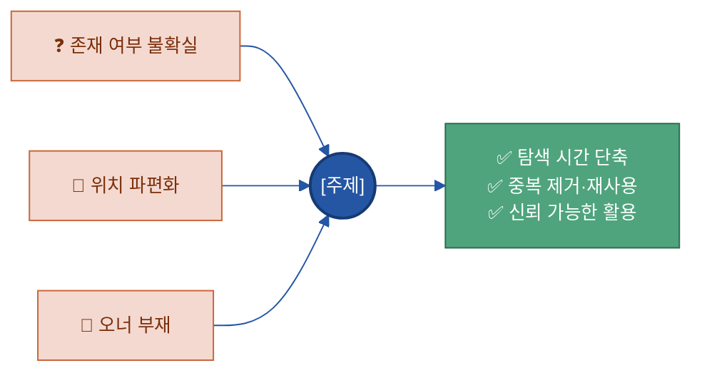
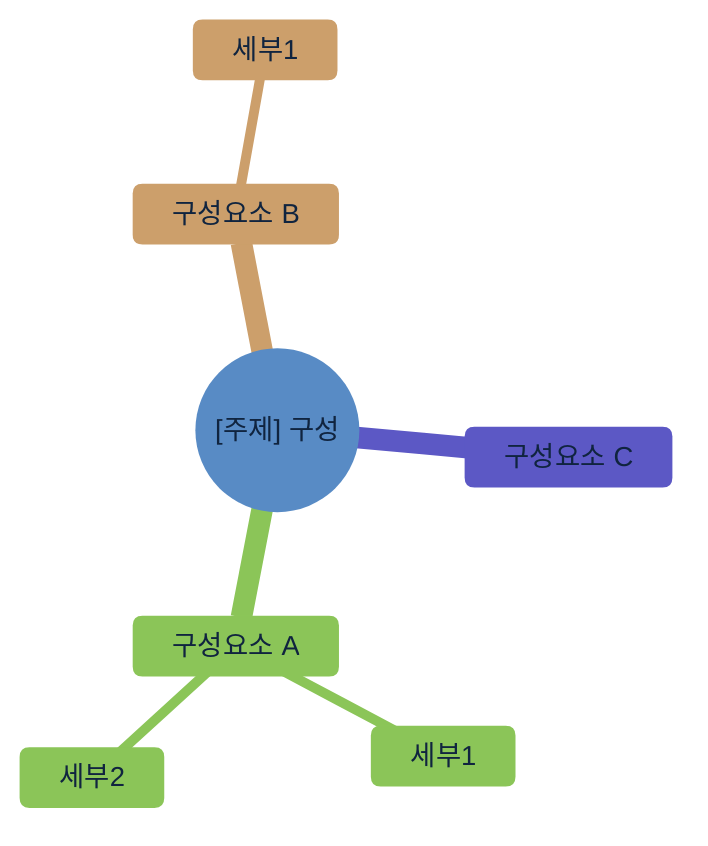
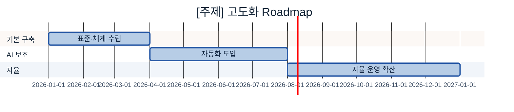

# 02 다이어그램 표준 (Mermaid)

> 모든 가이드의 다이어그램은 이 표준의 **컬러 스키마와 테마 헤더를 그대로** 쓴다. 임의 색 사용 금지.
> 다이어그램은 GitHub·대부분의 마크다운 뷰어에서 그대로 렌더된다.

---

## 1. 컬러 스키마 (파랑 6 + 초록 3)

| 역할(classDef) | Hex | 테두리 | 쓰임 |
|---|---|---|---|
| `cat` (핵심) | `#2456A4` (글자 흰색) | `#163a73` | 주제 주체·최종 산출(AI 서비스) 등 강조 노드 |
| `gate` (게이트/프로세스) | `#3F9BD4` (글자 흰색) | `#2456A4` | 품질 게이트·승인·핵심 처리 단계 |
| `src` (입력/원천) | `#79C3E8` | `#3F9BD4` | 원천 데이터·외부 입력 |
| `n` (일반 노드) | `#B7CDE6` | `#6B9AD1` | 일반 구성요소·단계 |
| `loop` (환류/긍정) | `#4FA47D` (글자 흰색) | `#2f6b50` | Feedback·기대효과·긍정 결과 |
| `cross` (기반/점선) | `#C2E6D6` | `#7CC2A7` | 가로지르는 기반(운영·생애주기·보안), 점선 연결 |
| 배경 틴트 | `#BFE4F5` / `#EEF4FB` | — | 옅은 강조 배경·클러스터 배경 |

---

## 2. 표준 테마 헤더 (모든 다이어그램 첫 줄에 복붙)

```
%%{init: {'theme':'base','themeVariables':{'primaryColor':'#DCE8F5','primaryBorderColor':'#2456A4','primaryTextColor':'#10243f','lineColor':'#2456A4','clusterBkg':'#EEF4FB','clusterBorder':'#6B9AD1','fontSize':'13px'}}}%%
```

## 3. 표준 classDef 블록 (flowchart 끝에 복붙)

```
    classDef n fill:#B7CDE6,stroke:#6B9AD1,color:#10243f;
    classDef src fill:#79C3E8,stroke:#3F9BD4,color:#0b3a52;
    classDef cat fill:#2456A4,color:#fff,stroke:#163a73,stroke-width:2px;
    classDef gate fill:#3F9BD4,stroke:#2456A4,color:#fff;
    classDef loop fill:#4FA47D,stroke:#2f6b50,color:#fff;
    classDef cross fill:#C2E6D6,stroke:#7CC2A7,color:#1f4d3a,stroke-dasharray:4 3;
```

---

## 4. 섹션별 권장 다이어그램

| 섹션 | 다이어그램 | 용도 |
|---|---|---|
| 1.5 체계 내 역할 / 10.연계 | `flowchart LR` (전체 조감도) | 20개 주제 가치사슬에서 이 주제 위치 강조 |
| 2. 필요성 | `flowchart LR` | Pain Point → [주제] → 기대효과 *(단, 본문 불릿이 이미 Pain·효과를 다 말하면 그림은 생략 — 아래 4-1)* |
| 3. 구성 체계 | `flowchart TB` 또는 `mindmap` | 구성요소·항목 분해(정본 모델). *단순 N개 나열이면 표로, 누적·계층·관계가 있을 때만 그림* |
| 5. 대상 선정 | `quadrantChart` | 중요도 × AI활용도 우선순위 |
| 7~8. 사례·구축 | `flowchart TB` | To-Be 아키텍처 |
| 9. 운영 | `sequenceDiagram` | 변경/요청 처리 흐름 |
| 12. Roadmap | `gantt` | 수기 → AI 보조 → 자율 단계 일정 |

> 다이어그램은 "이해를 돕는 곳"에만. 모든 섹션에 억지로 넣지 않는다(형식은 내용을 따른다 — `01` 0-6).

## 4-1. ★ 다이어그램 취사 기준 (만들 것 / 만들지 말 것)

위 표는 "권장 위치"일 뿐, **칸을 채우려고 그림을 만들지 않는다.** 다음 기준으로 판단한다.

**✅ 다이어그램으로 만든다 — 그림이라야 빨리 이해되는 것:**
- **구조·계층·누적** — 구성요소 분해, 계층 트리, "A 위에 B가 쌓인다"는 누적 관계 (예: 라벨→주석→해설)
- **분기·의사결정** — 조건에 따라 갈라지는 흐름 (예: 확신도 높음→자동승인 / 낮음→사람 검수)
- **순서·루프** — 단계가 있는 프로세스, 되돌아오는 피드백 (예: 8단계 구축, 보정 반복)
- **관계·경계 조감도** — 주제 간 역할 분담·주고받는 것 (10.연계/관계 섹션)
- **시간축**(`gantt` 로드맵) · **2축 좌표**(`quadrant` 우선순위) · **상호작용**(`sequence` 요청 처리)

**🚫 다이어그램으로 만들지 않는다 — 텍스트·표면 충분한 것:**
- **단순 나열** — 항목 N개를 평면 나열하는 것(불릿·표로 충분). mindmap으로 목록을 재나열하지 않는다.
- **본문 재진술** — 바로 위 문장/불릿이 이미 말한 내용을 그림으로 다시 그리는 것.
- **fan-in/out 나열** — "문제 3개 → 주제 → 효과 3개"처럼 화살표만 있고 구조가 없는 것(불릿이 더 빠르다).
- **한 줄 선형 관계** — `A → B → C`로 끝나 한 문장이면 되는 것.

> **판단 테스트:** *"이 그림을 표·불릿·한 문장으로 바꿔도 정보 손실이 없는가?"* — 없으면 그림을 쓰지 않는다.
> 반대로 *분기·누적·루프·좌표·시간축*처럼 텍스트로 풀면 장황해지는 것은 그림으로 만든다.

---

## 5. 표준 예시

### 5-1. 전체 조감도 (flowchart) — 10.연계 섹션 재사용용
이 주제만 `cat`/강조로 바꿔 하이라이트한다. (원본은 `00 전체 목차 (20개 주제).md` 참고.)

### 5-2. Pain Point → 해결 (2.필요성)


> `pain`(부정/문제)은 컬러 스키마 밖의 주황 계열을 보조로 허용한다. 그 외 노드는 표준 색을 쓴다.

### 5-3. 구성 체계 (mindmap)



### 5-4. Roadmap (gantt)



> gantt·sequenceDiagram·quadrantChart는 classDef를 쓰지 않으므로 `themeVariables`의 파랑 계열로 톤을 맞춘다.
