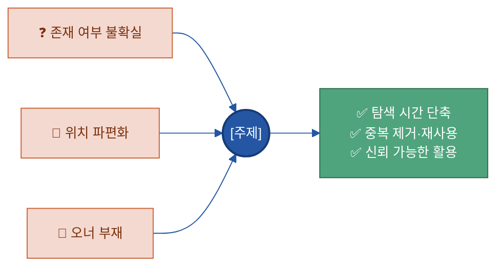
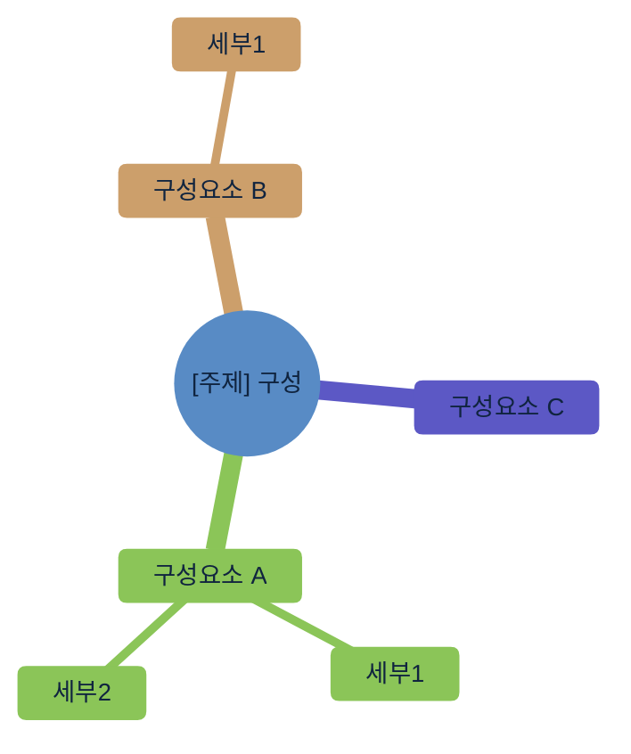
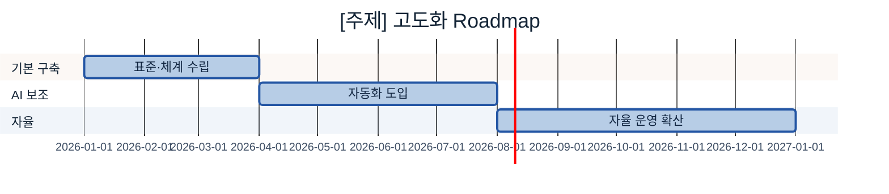

# 02 다이어그램 표준 (Mermaid)

> 모든 가이드의 다이어그램은 이 표준의 **컬러 스키마와 테마 헤더를 그대로** 쓴다. 임의 색 사용 금지.
> 다이어그램은 GitHub·대부분의 마크다운 뷰어에서 그대로 렌더된다.

---

## 1. 컬러 스키마 (파랑 6 + 초록 3)

| 역할(classDef) | Hex | 테두리 | 쓰임 |
|---|---|---|---|
| `cat` (핵심) | `#2456A4` (글자 흰색) | `#163a73` | 주제 주체·최종 산출(AI 서비스) 등 강조 노드 |
| `gate` (게이트/프로세스) | `#3F9BD4` (글자 흰색) | `#2456A4` | 품질 게이트·승인·핵심 처리 단계 |
| `src` (입력/원천) | `#79C3E8` | `#3F9BD4` | 원천 데이터·외부 입력 |
| `n` (일반 노드) | `#B7CDE6` | `#6B9AD1` | 일반 구성요소·단계 |
| `loop` (환류/긍정) | `#4FA47D` (글자 흰색) | `#2f6b50` | Feedback·기대효과·긍정 결과 |
| `cross` (기반/점선) | `#C2E6D6` | `#7CC2A7` | 가로지르는 기반(운영·생애주기·보안), 점선 연결 |
| 배경 틴트 | `#BFE4F5` / `#EEF4FB` | — | 옅은 강조 배경·클러스터 배경 |

---

## 2. 표준 테마 헤더 (모든 다이어그램 첫 줄에 복붙)

```
%%{init: {'theme':'base','themeVariables':{'primaryColor':'#DCE8F5','primaryBorderColor':'#2456A4','primaryTextColor':'#10243f','lineColor':'#2456A4','clusterBkg':'#EEF4FB','clusterBorder':'#6B9AD1','fontSize':'13px'}}}%%
```

## 3. 표준 classDef 블록 (flowchart 끝에 복붙)

```
    classDef n fill:#B7CDE6,stroke:#6B9AD1,color:#10243f;
    classDef src fill:#79C3E8,stroke:#3F9BD4,color:#0b3a52;
    classDef cat fill:#2456A4,color:#fff,stroke:#163a73,stroke-width:2px;
    classDef gate fill:#3F9BD4,stroke:#2456A4,color:#fff;
    classDef loop fill:#4FA47D,stroke:#2f6b50,color:#fff;
    classDef cross fill:#C2E6D6,stroke:#7CC2A7,color:#1f4d3a,stroke-dasharray:4 3;
```

---

## 4. 섹션별 권장 다이어그램

| 섹션 | 다이어그램 | 용도 |
|---|---|---|
| 1.5 체계 내 역할 / 10.연계 | `flowchart LR` (전체 조감도) | 20개 주제 가치사슬에서 이 주제 위치 강조 |
| 2. 필요성 | `flowchart LR` | Pain Point → [주제] → 기대효과 *(단, 본문 불릿이 이미 Pain·효과를 다 말하면 그림은 생략 — 아래 4-1)* |
| 3. 구성 체계 | `flowchart TB` 또는 `mindmap` | 구성요소·항목 분해(정본 모델). *단순 N개 나열이면 표로, 누적·계층·관계가 있을 때만 그림* |
| 5. 대상 선정 | `quadrantChart` | 중요도 × AI활용도 우선순위 |
| 7~8. 사례·구축 | `flowchart TB` | To-Be 아키텍처 |
| 9. 운영 | `sequenceDiagram` | 변경/요청 처리 흐름 |
| 12. Roadmap | `gantt` | 수기 → AI 보조 → 자율 단계 일정 |

> 다이어그램은 "이해를 돕는 곳"에만. 모든 섹션에 억지로 넣지 않는다(형식은 내용을 따른다 — `01` 0-6).

## 4-1. ★ 다이어그램으로 표현할 만한 구조 (적극 활용)

위 표는 "권장 위치"일 뿐이다. 핵심은 **"그림이라야 빨리 이해되는 구조적 내용"에는 적극적으로 다이어그램을 쓰는 것**이다. 아래는 이 매뉴얼의 20개 주제에서 다이어그램으로 표현하면 좋은 구조들을 유형별로 모은 카탈로그다 — 자기 주제에 해당하는 게 있으면 적극적으로 그린다. (한 주제에 여러 유형이 들어갈 수 있다.)

**A. 구성·계층·분해 (`flowchart TB` / `mindmap`)**
- 정본 모델 구성요소 분해 (예: 카탈로그 4요소, 메타데이터 5갈래)
- 분류 체계(Taxonomy) 계층 트리 — 대분류 > 중분류 > 소분류
- 온톨로지 클래스/개념 계층, 메타데이터 스키마 계층(메타-메타데이터)
- 추상화 레이어 적층 — 원천 → 정제 → 데이터 Product
- 의미 누적 스택 — 라벨 → 주석 → 해설 (위로 쌓이는 깊이)

**B. 파이프라인·처리 흐름 (`flowchart LR`)**
- 데이터 처리 파이프라인 — 수집 → 정제 → 구조화 → 적재(전처리·ETL)
- 구축 단계 프로세스 — 8단계 라벨링, 카탈로그 구축 단계
- 입력 → 처리 → 출력 — 검색 dataflow, RAG 검색 흐름
- 변환·매핑 — Before → After (용어 표준화, 스키마 매핑)
- 정밀도·비용 사다리 — 이미지 주석(분류 → 박스 → 마스크)

**C. 분기·의사결정 (`flowchart` + 조건 라벨)**
- 품질 게이트 — 통과 → 사용 / 미달 → 예외 승인(C-2)
- 확신도 라우팅 — 높음 → 자동 승인 / 낮음 → 사람 검수
- 적용 판단 트리 — 온톨로지·합성데이터 "할까/말까" 분기
- 위험도 분기 — Tool 조회형 → 자동 / 실행형 → 승인(D-2)
- 비식별 방식 선택, 예외 사용 승인 분기

**D. 상태·생애주기 (`stateDiagram-v2`)**
- 데이터 생애주기 — 활성 → 보관 → 폐기(F-2)
- 자산 등록 상태 — 등록 / 이전 / 폐기(Deprecated)
- 라벨·검수 상태 — 초안 → 검수중 → 승인 → (재작업)
- Prompt·Tool 버전 상태 — 후보 → 배포 → 폐기

**E. 피드백 루프·순환 (`flowchart` 순환 / 화살표 회귀)**
- 데이터 Feedback Loop — 운영 → 피드백 수집 → 분류 → 개선 환류(E-4)
- 라벨 보정 루프 — Pilot ↔ IAA 측정·가이드 보정
- 모델 재학습 선순환(Data Flywheel), 평가→개선→재평가 루프

**F. 관계·네트워크·경계 (`flowchart` / `graph`)**
- 전체 조감도 — 20개 주제 가치사슬에서 이 주제 강조(10.연계)
- 인접 주제 경계 — 누가 무엇을 분담하는가(역할 분담)
- 개념 관계 그래프(온톨로지) — 결함 ↔ 원인 ↔ 조치
- 의존성 맵 — Prompt ↔ Tool ↔ 데이터(D-3), 변경 영향도 분석
- 데이터 계보(Lineage) DAG — 원천 → 변환 → 파생 → 리포트(C-3)

**G. 상호작용·핸드오프 (`sequenceDiagram`)**
- 요청 처리 — 변경/접근 권한 신청 → 검토 → 승인 흐름
- 역할 간 핸드오프 — HITL(AI 1차 → 검수자 → SME)
- Agent의 Tool 호출 시퀀스, 관측(Observability) 알림 흐름(C-1)

**H. 시간축·진화 (`gantt`)**
- 고도화 로드맵 — 수기 → AI 보조 → 자율
- 구축 Wave 일정(핵심 자산 → 범위 확대 → AI 연계)

**I. 2축 좌표·매트릭스 (`quadrantChart`)**
- 우선순위 — 중요도 × AI 활용도, 비용 × 효과
- 위험도 × 빈도, 데이터 민감도 × 활용가치

> 💡 **반대로, 그림이 꼭 필요하진 않은 경우도 있다.** 단순 항목 나열이나 바로 위 문장을 그대로 옮긴 그림은 표·불릿이 더 빠를 수 있다. 금지가 아니라 우선순위의 문제다 — 판단 기준은 하나다: ***"표·불릿·한 문장으로 바꿨을 때 구조(계층·분기·순서·관계·시간)가 사라지는가?"*** 사라지면 그림으로, 그대로 살아 있으면 텍스트로 둔다.

---

## 5. 표준 예시

### 5-1. 전체 조감도 (flowchart) — 10.연계 섹션 재사용용
이 주제만 `cat`/강조로 바꿔 하이라이트한다. (원본은 `00 전체 목차 (20개 주제).md` 참고.)

### 5-2. Pain Point → 해결 (2.필요성)


> `pain`(부정/문제)은 컬러 스키마 밖의 주황 계열을 보조로 허용한다. 그 외 노드는 표준 색을 쓴다.

### 5-3. 구성 체계 (mindmap)



### 5-4. Roadmap (gantt)



> gantt·sequenceDiagram·quadrantChart는 classDef를 쓰지 않으므로 `themeVariables`의 파랑 계열로 톤을 맞춘다.
