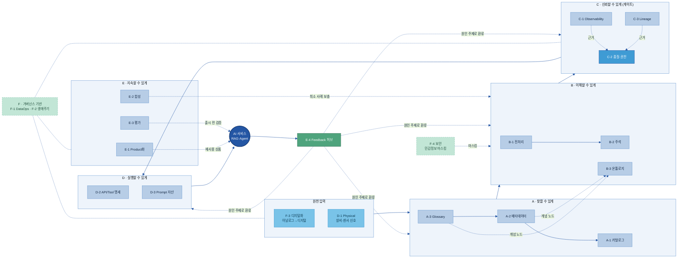
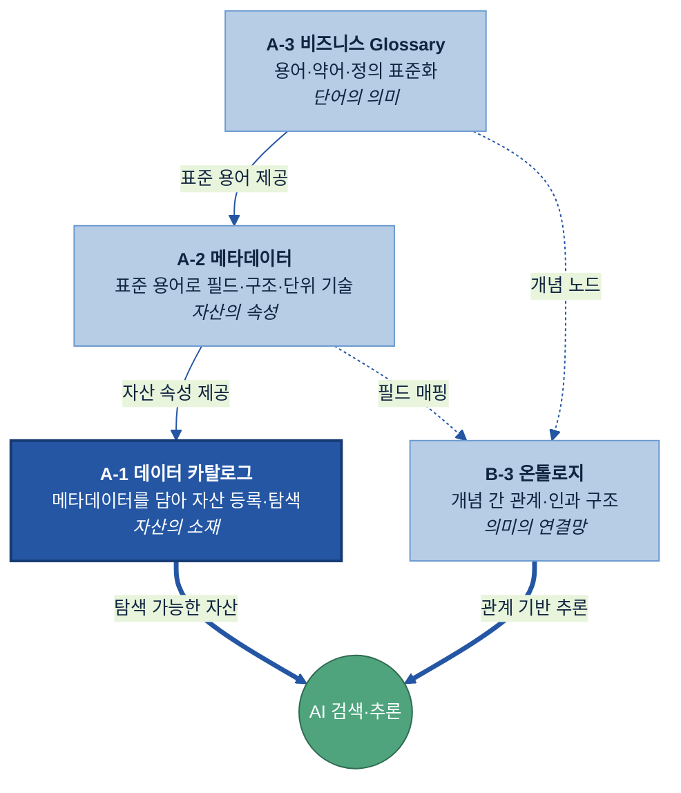

# AI-Ready Data 매뉴얼 — 전체 목차 (20개 주제)

> 목적: 20개 주제별 가이드(`가이드 작성/A-1 데이터 카탈로그/A-1 데이터 카탈로그.md` 형식)를 작성하기 전에, **모든 주제의 목차를 한 곳에서 검토·확정**하기 위한 문서입니다.
> 기준: `공통 규칙/최종 주제.md`의 주제 정의·Key Question + 참고 가이드(`파트너님 예시/data_catalog_manual.md`)의 12-섹션 구조.
> 폴더 구조: `공통 규칙/`(작성 표준·최종 주제) · `전체 목차/`(본 파일·`목차 검증/` 상세목차) · `가이드 작성/<주제>/`(실제 가이드) · `기존 매뉴얼 작성본/`(Kearney PPTX·목차 분석) · `파트너님 예시/`(참고 예시).
> 사용법: 12-섹션 고정 골격은 폐기하고, 주제마다 무게에 맞춰 섹션을 가감한 **현업판 논리 흐름**(개요→왜→무엇→언제→예시→어떻게→관계→지표)으로 정리했습니다.
> ★ **이 파일이 20개 주제 목차의 단일 정본(single source of truth)입니다** — 조감도 다이어그램 + 주제별 세부 H3 목차 + 확정사항을 모두 담습니다. 목차를 보거나 고칠 땐 이 파일만 봅니다. (`목차 검증/` 폴더는 **동결 아카이브**일 뿐 정본이 아닙니다 — 이름이 비슷했던 옛 스냅샷은 `[동결] 00 …v2.md`로 표시해 헷갈리지 않게 했습니다.)

---

## 전체 조감도 — 20개 주제의 연관 관계

20개 주제는 병렬 목록이 아니라, **6대 원칙(A 찾을 수 있게 → B 이해할 수 있게 → C 신뢰할 수 있게 → D 실행할 수 있게 → E 지속할 수 있게 / F 거버넌스)** 을 따라 데이터가 AI까지 가며 서로 먹여주는(feeds-into) 가치사슬이다. **F(거버넌스)는 전 구간을 받치고, E-4는 결과를 원인 주제로 되돌린다.**

### ① 6대 원칙 가치사슬 (의존 흐름)



> **읽는 법:** 굵은 흐름 `원천 입력 → A → B → C → D → AI`가 주 가치사슬. **A**(찾기)·**B**(이해)·**C**(신뢰 게이트)·**D**(실행)·**E**(지속)가 6대 원칙, **F**(거버넌스)는 전 구간을 받친다. 점선은 보조 관계 — A-2/A-3가 B-3에 개념 제공, E-2가 희소 사례 보충, E-3가 출시 전 검증, **E-4가 운영 결과를 원인 주제(A·B·C·D)로 되돌림**. *(F-3 디지털화·D-1 Physical은 각각 F·D군 소속이나 기능상 '원천 입력'에 배치.)*

### ② 의미 축적 스택 (A-3 → A-2 → A-1 → B-3)



> **표준 컬러 스키마**: 핵심=진파랑 `#2456A4` · 일반 노드=연파랑 `#B7CDE6` · 원천=하늘 `#79C3E8` · 게이트=밝은파랑 `#3F9BD4` · 환류/긍정=초록 `#4FA47D` · 기반=옅은초록 `#C2E6D6`(점선). 모든 주제 다이어그램은 이 테마를 따른다.

---

## 0. 목차 표준 (모든 주제 공통 원칙)

> 과거의 "12-섹션 고정 골격"은 폐기했습니다. 12개 섹션은 **참고용 풀**일 뿐, 주제마다 섹션을 더하고·빼고·합쳐 **주제 무게에 따라 섹션 수를 달리** 합니다(고정 금지). 합격 기준은 "12개를 다 채웠는가"가 아니라 **"`공통 규칙/최종 주제.md`의 Key Question에 전부 답했고 원칙을 지켰는가"**입니다. (상세 표준: `공통 규칙/01 가이드 작성 표준.md`)

**논리 흐름 (기본 순서):**
개요 → 왜(Why) → 무엇(What) → 언제/어디에(When) → **예시 시나리오(How 앞)** → 어떻게(솔루션·구축·운영) → 다른 주제와의 관계 → 성과 지표·고도화

**어떤 구성에서도 유지하는 것:**
- **4축**: 왜(Why·Pain Point) · 무엇(What·정의/구성) · 언제·어디(When·대상 선정) · 어떻게(How·구축/운영)
- **담당자 역할**(오너·현업·IT·보안·AI 조직)을 구축/운영 섹션 안에 포함
- **이해장치**: 섹션마다 한 줄 요약 + 어려운 용어 즉시 풀이 + 제조 현업 예시
- **현업 눈높이**: 핵심만, 어려운 약어는 풀거나 생략
- **★ 데이터 준비 관점**: "AI를 만드는 법"이 아니라 "그 AI가 쓸 **데이터를 준비·정비하는 법**"

**When 처리:** 골라서 하는 주제(온톨로지·합성데이터·평가데이터)는 "언제/무엇을 하나(적용 판단)", 기본 다 필요한 주제(카탈로그·메타데이터)는 "어디부터(우선순위)".

> **주제별 섹션 수(차등):** A-1 **10** · A-2 **10** · A-3 **9** · B-1 **9** · B-2 **9** · B-3 **10** · C-1 **9** · C-2 **11** · C-3 **9** · D-1 **10** · D-2 **10** · D-3 **10** · E-1 **9** · E-2 **9** · E-3 **9** · E-4 **9** · F-1 **9** · F-2 **9** · F-3 **10** · F-4 **10**
> **솔루션은 20개 전 주제 모두 독립 "솔루션(·도구 검토)" 섹션**으로 둔다(예시 다음·구축 앞). 독자가 "솔루션 뭘 쓰나"를 항상 같은 자리에서 찾게 — 무게가 가벼운 주제도 폴딩하지 않는다. 무게 차등은 섹션 수가 아니라 H3 깊이로 표현.
> **"다른 주제와의 관계"는 항상 독립 섹션**으로 끝에서 두 번째에 두고(경계만 다룸), 마지막은 "성과 지표·(로드맵·)고도화"로 둔다 — 지표·고도화와 합치지 않는다(20개 일관).
> **단계별 도입 로드맵**은 무거운 주제(인프라·플랫폼 구축형 9개: A-1·A-2·B-3·C-2·D-1·D-2·D-3·F-3·F-4)의 마지막 '성과 지표·로드맵·고도화' 절에 명시(1→2→3단계). 그 외 주제(B-2·E-1 등 프로세스·인력 중심 포함)는 '고도화' 한 줄로 갈음.
> (본 파일이 **단일 정본** — 조감도 + 세부 H3 목차를 함께 담음. `목차 검증/05 …v2.md`는 과거 상세본으로 아카이브 동결되어 더는 갱신하지 않음.)

---

# A · 찾을 수 있게 (Findable)

## A-1 데이터 카탈로그
> 파일명: `가이드 작성/A-1 데이터 카탈로그/A-1 데이터 카탈로그.md`
> 정의: AI와 사용자가 데이터 자산의 존재·위치·오너·접근 경로를 찾도록 등록하는 자산 목록 체계.

```
1. 개요
   1.1 데이터 카탈로그란 (데이터 자산의 주소록 — 소재·오너·접근경로)
   1.2 목적과 적용 범위
   1.3 대상 조직과 체계 내 위치 (A-1~A-3 Findable 묶음의 출발점 — 자산의 "소재·주소")
2. 왜 필요한가
   2.1 현업 Pain Point (데이터가 어디 있는지 몰라 사람마다 찾아 헤매고, AI도 못 찾음)
   2.2 기대 효과 (찾는 시간↓·중복 수집↓·AI가 필요한 데이터에 바로 도달)
3. 무엇을 갖추나 (등록 항목·구성)
   3.1 항목 구성 기준 (찾기 위한 최소 정보에 집중 — 업무·기술·보안·운영·AI 5가지 갈래)
   3.2 기본 등록 항목 (데이터명·시스템·위치·오너·접근경로·갱신주기)
   3.3 데이터 Type·분류 기준 (업무 도메인·데이터 유형·보유 조직)
   3.4 ★ AI 활용 식별 항목 (전처리 여부·원천 데이터 추적·AI 활용 목적 — AI가 재사용·재활용 판단하는 표식)
   (※ 조회·검색 화면 구성은 §8.2 운영으로 이관)
4. 어디부터 등록하나 (등록 대상 우선순위)   ← 기본형(다 필요)
   4.1 등록 대상 범위 (시스템·문서·보고서·품질·실험·설비 데이터)
   4.2 유형별 등록/제외 기준
   4.3 정형 데이터 중요도 선별
   4.4 취합 방식 (자동 수집 vs 수동 등록)
   4.5 보안 검토 기준 (내부 학습 vs 외부 LLM·외부망 노출 여부)
   4.6 최종 우선순위 (★ 사람이 다 찾아 등록하지 않는다 — 자동 수집 우선)
5. 예시 시나리오 (한눈에)
   5.1 적용 전/후 (검사 데이터 위치를 담당자 수소문 → 검색 한 번으로 위치·오너·접근법 확인)
   5.2 흐름 미리보기 (원천 자동 수집 → 오너·경로 채우기 → 분류 붙여 검색 → AI·현업이 탐색)
6. 솔루션 선정
   6.1 솔루션 유형·적용 범위 (전용 카탈로그·메타 통합형·오픈소스)
   6.2 후보 검토·기능 비교 (자동 수집 커버리지·연동·검색·권한)
   6.3 평가·선정·PoC
7. 구축
   7.1 취합 데이터 검토·정합성 보완
   7.2 To-Be 아키텍처 설계 (솔루션 기반)
   7.3 Legacy 연동·미연동/수동 업로드 Pipeline
   7.4 초기 적재 및 검증
   7.5 담당자 역할 (오너·현업·IT·보안·AI 조직 — 누가 등록·검수·승인하나)
8. 운영
   8.1 변경 관리 (요청 → 검토·승인 → 반영)
   8.2 등록·검색·조회 운영
   8.3 전처리·분석·질의 서비스 연계
   8.4 접근 권한·보안 / 운영 역할별 기능
   8.5 최신화 방식 (주기 갱신 vs 변경 시점 자동 갱신)
9. 다른 주제와의 관계
   9.1 메타데이터(A-2 속성)·Glossary(A-3 용어)·Lineage(C-3 흐름)·생애주기(F-2)·Product화(E-1)와의 경계
10. 성과 지표·로드맵·고도화
   10.1 성과 지표 (핵심 자산 등록률·자동 수집률·검색 성공률·탐색 Lead-time)
   10.2 단계별 도입 로드맵 (1단계 핵심 자산 수동 등록·오너 지정 → 2단계 원천 자동 수집 연동·검색 안정화 → 3단계 의미 기반 탐색·AI 에이전트 연계)
   10.3 고도화 (메타 초안 자동 생성 → 의미 기반(Semantic) 탐색 → AI 에이전트 연계)
```

## A-2 메타데이터
> 파일명: `가이드 작성/A-2 메타데이터/A-2 메타데이터.md`
> 정의: 데이터 자산의 구조·형식·단위·생성기준·갱신주기 등 기술·운영 속성을 설명하는 관리 정보.

```
1. 개요
   1.1 메타데이터란 (데이터의 설명서)
   1.2 적용 범위와 체계 내 위치 (A-1~A-3 Findable 묶음 안에서 메타데이터의 자리 — 자산의 "속성")
2. 왜 필요한가
   2.1 현업 Pain Point (항목 이름·단위만으론 뜻을 몰라 AI가 잘못 해석)
   2.2 기대 효과 (재사용이 쉬워지고 오해석이 줄어듦)
3. 무엇을 갖추나
   3.1 세 계층의 설명서 (테이블 설명 → 컬럼 설명 → 셀·코드값 풀이)
   3.2 표준 항목 5갈래 (업무·기술·보안·운영·★AI — AI: 전처리 여부·라벨링 상태·AI 활용 목적)
   3.3 항목 설명서 (약어·코드 풀이 — 예: DEF_CD = 결함 유형 코드)
   3.4 단위·기준일·집계 기준 (숫자를 잘못 비교하지 않도록)
4. ★ 데이터 유형별 메타데이터 차이   ← 신규 (정형/시계열/문서/이미지·도면/영상은 챙길 항목이 다름)
   4.1 유형 가르는 3가지 기준 (구조 정형/비정형 · 내용 텍스트/멀티미디어 · 시간 시계열/비시계열)
   4.2 정형(테이블) — 컬럼·코드값·키 관계(어느 컬럼이 어느 테이블과 이어지나)
   4.3 시계열(센서) — 기준 시각(Timestamp)·측정 단위·결측 구간·이상치 기준
   4.4 문서 — 문서 유형·버전·최신본 식별 (옛 버전 학습 방지)
   4.5 이미지·도면 — 해상도·촬영 맥락·연관 문서 (도면이 단독으로도 해석되게)
   4.6 영상·음성 — 길이·프레임(FPS)·구간(정상/이상) 표시
5. 어디부터 하나 (정비 우선순위)   ← 기본형(다 필요)
   5.1 정비 우선 대상 (설명이 비었거나 단위가 뒤죽박죽인 데이터부터)
   5.2 자동으로 모으고 사람은 검수만 (★ 기술·운영·보안 항목은 시스템이 자동, 업무·AI 항목만 현업 보완)
6. 예시 시나리오 (한눈에)
   6.1 적용 전/후 (AI가 'DEF_CD'를 못 알아봄 → 설명서를 달면 '결함 유형 코드'로 바로 해석)
   6.2 흐름 미리보기 (자동 수집 → 빈 설명·단위 채우기 → 담당자 검수 → AI가 바로 활용)
7. 솔루션·도구 검토
   7.1 도구 유형 (전용 메타데이터 관리·카탈로그 내장형·오픈소스)
   7.2 선정 기준 (자동 수집 커버리지·데이터 유형별 항목 지원·정합성 점검·현업 편집)
8. 어떻게 준비·운영하나
   8.1 구축 절차 (자동 수집 연결 → 유형별 설명·단위 보완 → 검증)
   8.2 정합성 자동 점검 (필수 항목 누락·형식 오류·코드값 유효성·중복을 규칙으로 자동 점검)
   8.3 운영 (항목이 바뀌면 갱신·승인 — 주기 갱신 vs 변경 시점 자동 갱신) / 담당자 역할 (오너·현업·IT·보안·AI 조직)
9. 다른 주제와의 관계
   9.1 카탈로그(소재)·Glossary(용어)·온톨로지(개념)·품질과의 경계
10. 성과 지표·로드맵·고도화
   10.1 성과 지표 (작성 완성률·자동 수집률·설명 충실도)
   10.2 단계별 도입 로드맵 (1단계 기술·운영 항목 자동 수집 → 2단계 업무·AI 항목 현업 보완·정합성 점검 → 3단계 유형별 메타 확대·AI 설명 초안 자동화)
   10.3 고도화 (AI가 설명 초안 작성 → 사람 검수)
```

## A-3 비즈니스 Glossary
> 파일명: `가이드 작성/A-3 비즈니스 Glossary/A-3 비즈니스 Glossary.md`
> 정의: 업무 용어·약어·동의어를 표준 정의로 통일해 데이터 해석 일관성을 확보하는 용어 사전.

```
1. 개요
   1.1 비즈니스 Glossary란 (용어·약어·동의어를 표준 정의로 통일한 사전)
   1.2 적용 범위와 체계 내 위치 (A-1~A-3 Findable 묶음 안에서 Glossary의 자리 — 용어의 "뜻")
2. 왜 필요한가
   2.1 현업 Pain Point (같은 결함을 현장마다 다르게 불러 AI 검색·집계가 따로 놂 — 특히 글로벌 현장)
   2.2 기대 효과 (현장 용어로 물어도 표준 용어로 변환돼 한 번에 검색·해석 일관)
3. 무엇을 갖추나
   3.1 표준 용어 템플릿 (표준명·영문명·약어·정의·사용 예시)
   3.2 동의어·금지어 (현장식 표현을 표준 용어로 이어주는 연결고리)
   3.3 연계 정보 (관련 데이터 필드·책임 부서)
4. 어디부터 표준화하나 (우선순위)   ← 기본형(다 필요)
   4.1 대상 용어 (결함명·검사항목·공정명·제품군·원인·조치·고객 불만 유형)
   4.2 우선순위 (AI 검색 영향 크고, 부서·계열사마다 다르게 쓰는 용어부터)
5. 예시 시나리오 (한눈에)
   5.1 적용 전/후 (현장식 결함명으로 검색하면 결과가 안 나옴 → 동의어를 표준명에 묶으면 어느 표현으로 물어도 검색)
   5.2 흐름 미리보기 (대상 용어 추리기 → 표준명·동의어 정의 → 충돌 조정·승인 → AI 검색에 연결)
6. 솔루션·도구 검토
   6.1 도구 유형 (전용 용어집 기능(카탈로그·메타 솔루션 내장형) vs 경량 시작(위키·스프레드시트))
   6.2 선정 기준 (동의어·금지어 매핑·검색 연계·현업이 직접 편집 가능한지·승인 워크플로우)
7. 어떻게 준비·운영하나
   7.1 용어 수집·정의 (현장·문서에서 실제 표현 모으기 → 표준명·동의어·금지어 정리)
   7.2 용어 충돌 조정 (같은 말 다른 뜻·다른 말 같은 뜻을 현업 전문가·오너·중앙 조직이 조정·승인)
   7.3 AI 활용 연계 (카탈로그·메타·AI 검색에 연결 — 현장 용어→표준 용어 자동 변환)
   7.4 운영 (신규·변경·폐기 버전 관리, 변경 영향 점검)
8. 다른 주제와의 관계
   8.1 경계 (메타데이터 필드 설명·온톨로지 관계·카탈로그 검색)
9. 성과 지표·고도화
   9.1 성과 지표 (표준화 용어 수·동의어 매핑률·현장 용어 변환 성공률)
   9.2 고도화 (문서에서 후보 용어·동의어 AI 초안 추출 → 검수)
```

---

# B · 이해할 수 있게 (Understandable)

## B-1 데이터 전처리
> 파일명: `가이드 작성/B-1 데이터 전처리/B-1 데이터 전처리.md`
> 정의: 문서·표·이미지 등 비정형/반정형 데이터를 AI가 읽을 수 있는 구조화 형태로 변환.

```
1. 개요
   1.1 데이터 전처리란 (PDF·PPT·Excel·이미지를 AI가 읽을 구조로 변환)
   1.2 적용 범위와 체계 내 위치 (이미 디지털인 자료를 AI가 읽을 구조로 바꾸는 자리)
2. 왜 필요한가
   2.1 현업 Pain Point (보고서·검사표는 사람 눈엔 읽혀도 AI는 표·문단 구조를 못 읽어 그대로 못 씀)
   2.2 기대 효과 (문서 속 표·수치·내용을 AI가 검색·분석에 바로 활용)
3. 무엇을 갖추나
   3.1 문서 유형별 추출 기준 (PDF=문단·표·페이지 / PPT=제목·본문·표 / Excel=시트·셀·병합)
   3.2 구조화 결과물 (텍스트·표·수치 + 원본 위치 정보 보존)
   3.3 변환 안정장치 (양식 바뀌어도 안 깨지게: 테스트 문서셋·예외 처리)
4. 어디부터 하나 (전처리 우선순위)   ← 기본형(다 필요)
   4.1 전처리 대상 (AI가 바로 읽기 어려운 디지털 자료)
   4.2 우선순위 (AI 과제에 자주 쓰고·반복 활용 많은 문서부터)
5. 예시 시나리오 (한눈에)
   5.1 적용 전/후 (점검 보고서 표를 사람이 일일이 옮겨 적음 → 전처리하면 AI가 바로 검색·집계)
   5.2 흐름 미리보기 (대상 문서 고르기 → 표·텍스트 추출 → 구조화 → AI 활용 환경에 제공)
6. 솔루션·도구 검토
   6.1 도구 유형 (문서 유형별 추출 — 전용 파서·클라우드 문서 AI·오픈소스)
   6.2 선정 기준 (표 구조 보존·마크다운/JSON 출력·청킹 내장·온프렘 가능 여부)
7. 어떻게 준비·운영하나
   7.1 변환 절차 (추출 → 구조화 → 위치 정보 보존 → 검색 인덱스·Vector DB·분석 테이블 적재)
   7.2 운영 (원천 양식 바뀌면 변환 로직 점검·갱신) / 역할·책임
8. 다른 주제와의 관계
   8.1 디지털화(F-3)·품질(C-2)·주석(B-2)과의 경계
9. 성과 지표·고도화
   9.1 성과 지표 (전처리 완료 문서 수·표/수치 추출 정확도·양식 변경 무중단율)
   9.2 고도화 (추출·구조화 자동화↑ → 사람은 어려운 양식만 검수)
```

## B-2 데이터 해설/주석
> 파일명: `가이드 작성/B-2 데이터 해설_주석/B-2 데이터 해설_주석.md`
> 정의: AI 학습을 위해 데이터에 라벨·분류·해석 기준 등 사람이 부여한 의미 정보를 붙이는 체계.

```
1. 개요
   1.1 데이터 해설/주석이란 (학습용으로 라벨·해석을 붙이는 것)
   1.2 적용 범위와 체계 내 위치 (학습용으로 데이터에 의미를 붙이는 자리)
2. 왜 필요한가
   2.1 현업 Pain Point (라벨이 없거나 기준이 제각각이면 AI 학습 품질이 떨어짐)
   2.2 기대 효과 (분류 자동화·판단 기준 일관·재작업 감소)
3. 무엇을 갖추나
   3.1 세 단계의 의미 부여 (라벨=큰 분류 / 주석=세부 정보(위치·원인·조치) / 해설=사람의 자유 서술)
   3.2 분류 체계(taxonomy)·라벨 정의 (결함·원인·조치 유형 — 경계·중복 없이)
   3.3 데이터 유형별 주석 방식 (텍스트/이미지/영상/음성 — 특히 이미지 결함은 위치를 박스·영역으로 표시)
   3.4 주석 기준·사례집 (헷갈리는 경우의 판단 기준)
   3.5 라벨 이력(버전) 관리 (누가·언제·왜 바꿨나)
4. 어디부터 하나 (주석 대상 선정)   ← 기본형(다 필요)
   4.1 주석 대상 (결함 이미지·고객 클레임·원인 분석 등)
   4.2 우선순위·규모 (자주 쓰고 영향 큰 것부터)
5. 예시 시나리오 (한눈에)
   5.1 적용 전/후 (결함 이미지를 사람이 일일이 분류 → 라벨을 달면 AI가 자동 분류, 검사 시간↓·기준 일관↑)
   5.2 흐름 미리보기 (분류 체계 정하기 → AI가 1차 라벨 → 사람은 헷갈리는 것만 검수 → 학습 데이터 완성)
6. 솔루션·도구 검토
   6.1 라벨링 플랫폼 유형 (데이터 유형별 — 이미지 박스/영역·텍스트·영상·음성 / 전용 도구 vs 통합형)
   6.2 선정 기준 (AI 1차 라벨(model-assisted) 지원·검수 워크플로우·작업자 간 일치도(IAA) 측정·버전 관리·온프레미스 가능 여부)
7. 어떻게 준비·운영하나
   7.1 분류 체계(taxonomy) 만드는 기준 (유형 간 경계·중복 없이)
   7.2 라벨링 시키는 법 (AI가 1차 라벨 + 가이드라인 + 사람 검수 — ★ 전수 검수 아님)
   7.3 품질 맞추는 법 (소규모 시범 → 여러 사람이 같게 다는지 점검(IAA, 작업자 간 일치도) → 가이드 보완)
   7.4 검수 분기 (신뢰도 높으면 자동 승인 / 애매하면 검수자 / 어려우면 전문가 — 모두 검수하지 않음)
   7.5 운영 (라벨 변경·버전 관리) / 담당자 역할 (오너·현업·검수자·전문가)
8. 다른 주제와의 관계
   8.1 평가 정답(E-3)·개념 관계(B-3)·용어 뜻(A-3)과의 경계
9. 성과 지표·고도화
   9.1 성과 지표 (라벨 정확도·작업자 간 일관성(IAA)·검수 합격률·AI 1차 라벨 채택률·작업 생산성)
   9.2 고도화 (수작업 → AI 1차 라벨 보조 → 자동화 비중↑, 사람은 어려운 것만 검수)
```

## B-3 온톨로지
> 파일명: `가이드 작성/B-3 온톨로지/B-3 온톨로지.md`
> 정의: 업무 개념 간 관계·계층·인과 구조를 정의해 AI가 맥락·연결성을 이해하게 하는 지식 구조.

```
1. 개요
   1.1 온톨로지란 (개념 사이의 관계 지도)
   1.2 적용 범위와 체계 내 위치 (개념 사이의 "관계"를 정의하는 자리)
2. 왜 필요한가
   2.1 현업 Pain Point (단순 검색으론 "왜 생겼고 어떻게 조치하나"를 못 찾음)
   2.2 기대 효과 (원인 분석·유사 사례·조치 추천이 가능)
3. 무엇을 갖추나
   3.1 개념 목록 (제품·공정·결함·원인·조치)
   3.2 개념 사이 관계 (발생한다·원인이 된다·조치한다)
   3.3 공통/계열사 확장 구조 (지주 공통 + 계열사 현장 특화)
   3.4 개념과 실제 데이터·문서 연결
4. ★ 언제 온톨로지를 하나 (적용 판단)   ← 선택형(골라서)
   4.1 적용 판단 (관계가 중요할 때만, 단어 통일이면 Glossary로 충분)
   4.2 작게 시작 (한 업무부터, 전사 거대 모델 금지)
   4.3 우선 만들 영역 고르기 (지식 많고 AI 활용 가치 큰 곳)
5. 예시 시나리오 (한눈에)
   5.1 적용 전/후 ("균열" 검색하면 문서만 나옴 → 관계도가 있으면 원인·조치까지 추천)
   5.2 흐름 미리보기 (개념·관계 정리 → 문서·데이터 연결 → AI가 원인→조치 추천)
6. 솔루션·도구 검토
   6.1 관계 저장·검색 도구 (그래프 DB·지식그래프 도구)
   6.2 비교·선정 (표현력·추론·현업이 다루기 쉬운지)
7. 구축
   7.1 지식 원천 취합·개념 정제 (중복·용어 충돌 정리, Glossary 연계)
   7.2 개념·관계 모델링 + 공통/계열사 계층
   7.3 데이터·문서 연결 → 관계 적재 → 검증
8. 운영·활용
   8.1 변경 관리 (개념·관계가 바뀌면 전문가 검토 후 갱신)
   8.2 AI 활용 (RAG 검색·원인 분석·유사 사례/조치 추천) / 현업 전문가 참여
9. 다른 주제와의 관계
   9.1 경계 (Glossary 단어 뜻·주석 분류 라벨·AI 검색/에이전트)
10. 성과 지표·로드맵·고도화
   10.1 성과 지표 (관계 채움 정도·추천 적중률)
   10.2 단계별 도입 로드맵 (1단계 한 업무 개념·관계 소규모 모델링 → 2단계 데이터·문서 연결·RAG 검색 적용 → 3단계 계열사 확장·원인→조치 추천 고도화)
   10.3 고도화 (문서에서 관계 AI 초안 추출 → 전문가 검수)
```

---

# C · 신뢰할 수 있게 (Trustworthy)

## C-1 데이터 Observability
> 파일명: `가이드 작성/C-1 Observability/C-1 Observability.md`
> 정의: 데이터 흐름의 지연·누락·변경·이상 징후를 운영 중 감지·알림하는 모니터링 체계.

```
1. 개요
   1.1 데이터 Observability란 (운영 중 데이터 상태를 지켜보고 알려주는 관제실)
   1.2 적용 범위와 체계 내 위치 (C 신뢰할 수 있게(Trustworthy) 묶음에서 "운영 중 실시간 감지"를 맡는 자리)
2. 왜 필요한가
   2.1 현업 Pain Point (수집이 멈췄거나 값이 튀어도 모른 채 AI가 잘못된 데이터를 그대로 씀)
   2.2 기대 효과 (이상을 빨리 잡아 AI 오작동·잘못된 보고를 사전에 막음)
3. 무엇을 갖추나
   3.1 관측 지표 (수집 실패·지연, 건수 급변, 빈칸(결측) 증가, 값 분포 변화)
   3.2 이상 판단 기준 (고정 한계값 vs 평소 추세 대비 변화)
   3.3 알림 체계 (심각도 등급별로 누구에게 어떻게)
   3.4 원인 구분용 기록 (데이터·모델·Prompt 버전을 함께 남겨 "데이터 탓인지" 가림)
4. 어디부터 관측하나 (관측 대상 우선순위)   ← 기본형(다 필요)
   4.1 기본 필수 (AI 서비스·핵심 리포트로 바로 흘러가는 흐름부터)
   4.2 더 촘촘히 (변동 잦거나 멈추면 타격 큰 흐름)
5. 예시 시나리오 (한눈에)
   5.1 적용 전/후 (센서 수집이 새벽에 끊긴 걸 아침에야 발견 → 관측을 걸면 멈춘 즉시 알림)
   5.2 흐름 미리보기 (관측 대상 고르기 → 지표·기준 설정 → 이상 시 등급별 알림 → 담당자 조치)
6. 솔루션·도구 검토
   6.1 도구 유형 (전용 데이터 관측 도구·플랫폼 내장·오픈소스)
   6.2 선정 기준 (이상탐지 방식(규칙 vs ML)·계보 연계·알림 연동·컬럼 단위 지원)
7. 어떻게 준비·운영하나
   7.1 구축 절차 (대상 흐름 연결 → 정상 기준선 잡기 → 알림 규칙 설정 → 시범 운영)
   7.2 운영 ★ 알림 피로 최소화 (사소한 알림 줄이기·등급 조정·중복 묶기)
8. 다른 주제와의 관계
   8.1 사후 추적(C-3)·사용 판정(C-2)·복구 조치(F-1)와의 경계
9. 성과 지표·고도화
   9.1 성과 지표 (이상 감지까지 걸린 시간·놓친 건수·오탐률·관측 범위)
   9.2 고도화 (평소 패턴 학습해 임계값 자동 조정 → 오탐·알림 피로↓)
```

## C-2 데이터 품질 관리
> 파일명: `가이드 작성/C-2 데이터 품질 관리/C-2 데이터 품질 관리.md`
> 정의: 데이터가 AI 활용 기준을 충족하는지 판정하는 통제 체계("쓸 수 있는가" 판정).

```
1. 개요
   1.1 데이터 품질 관리란 (AI 투입 전 "쓸 수 있는가"를 판정하는 통제 관문)
   1.2 적용 범위와 체계 내 위치 (C 신뢰할 수 있게(Trustworthy) 묶음에서 "쓸 수 있는가 판정·접근 통제"를 맡는 자리)
2. 왜 필요한가
   2.1 현업 Pain Point (빈칸·오류·오래된 데이터가 들어가 AI 답이 틀리고, 봐선 안 될 데이터까지 학습됨)
   2.2 기대 효과 (믿을 수 있는 데이터만 AI에 들어가 답 신뢰도↑·사고 위험↓)
3. 무엇을 갖추나 — 품질 기준
   3.1 품질 기준 (빠짐없음·정확·일관·최신·유효 — 업무별 합격선)
   3.2 사용 금지 기준 (출처 불명·미승인·기준 미달·목적 외 데이터)
4. 접근 권한·Quality Gate
   4.1 접근 권한 정책 (역할·목적·민감도에 따라 조회/분석/AI 학습/반출 구분)
   4.2 Quality Gate 구조 (품질+권한 동시 통과해야 투입 허용)
   4.3 예외 승인 (기준 미달인데 꼭 써야 할 때: 승인자·사유·기간·범위 기록)
5. 어디부터 게이트를 거나 (대상 우선순위)   ← 기본형(다 필요)
   5.1 기본 필수 (AI 학습·RAG·자동화로 바로 투입되는 데이터부터)
   5.2 더 엄격히 (틀리면 영향 큰 데이터일수록 기준 강화)
6. 예시 시나리오 (한눈에)
   6.1 적용 전/후 (오래된 검사 데이터가 섞여 AI가 엉뚱한 판정 → 게이트를 걸면 기준 미달 데이터 자동 차단)
   6.2 흐름 미리보기 (품질 기준·권한 정해두기 → 투입 직전 자동 점검 → 통과만 AI로, 미달은 차단·예외 승인)
7. 솔루션 선정
   7.1 품질 점검·권한 통제 도구 검토
   7.2 게이트 연동 방식·비교·선정
8. 구축
   8.1 품질 규칙·권한 정책 설계
   8.2 ★ 룰 기반 자동 판정 우선 (규칙으로 자동 합/불 → 애매한 것만 사람)
   8.3 게이트 연동·검증
9. 운영
   9.1 기준·권한 갱신 / 예외 승인 관리
   9.2 위반 처리·개선 요청 / 역할·책임
10. 다른 주제와의 관계
   10.1 경계 (접근 차단=C-2 / 마스킹=F-4 / 이상 감지=C-1)
11. 성과 지표·로드맵·고도화
   11.1 성과 지표 (품질 통과율·권한 위반 건수·미승인 사용 차단 건수)
   11.2 단계별 도입 로드맵 (1단계 핵심 투입 데이터에 품질 기준·권한 정책 수립 → 2단계 Quality Gate 자동 점검 연동 → 3단계 룰 자동 판정 비중↑·예외만 사람)
   11.3 고도화 (자동 판정 규칙 비중↑ → 사람은 예외만)
```

## C-3 데이터 계통 Lineage
> 파일명: `가이드 작성/C-3 데이터 계통 Lineage/C-3 데이터 계통 Lineage.md`
> 정의: 데이터 출처·이동·변환·활용 이력을 기록해 AI 결과의 근거를 추적하는 체계.

```
1. 개요
   1.1 데이터 계통(Lineage)이란 (출처→변환→AI 답변 근거까지 이어지는 경로 기록)
   1.2 적용 범위와 체계 내 위치 (C 신뢰할 수 있게(Trustworthy) 묶음에서 "사후 경로·근거 추적"을 맡는 자리)
2. 왜 필요한가
   2.1 현업 Pain Point (AI 답·보고서가 "어떤 데이터에서 나왔는지" 못 짚어 신뢰·검증이 안 됨)
   2.2 기대 효과 (근거 즉시 역추적·변경 영향 범위 파악·감사 대응)
3. 무엇을 갖추나
   3.1 추적 대상 흐름 (원천→전처리→데이터셋→리포트→RAG 인덱스→AI 답변)
   3.2 변환 이력 기록 (병합·필터·파생 생성 등 주요 가공 단계)
   3.3 AI 답변 근거 연결 (참조한 문서·청크·데이터셋 기록)
   3.4 영향도·감사 증빙 (변경 시 영향받는 곳 / 출처·이력 증빙)
4. 어디부터 추적하나 (대상 우선순위)   ← 기본형(범위는 선택)
   4.1 기본 필수 (AI 답변·핵심 보고서로 바로 이어지는 흐름부터)
   4.2 더 깊게 (감사·규제 대상이거나 틀리면 영향 큰 흐름)
5. 예시 시나리오 (한눈에)
   5.1 적용 전/후 (AI 점검 리포트 근거를 못 찾아 신뢰 불가 → 계통을 남기면 어느 센서·문서에서 나왔는지 클릭 한 번에 추적)
   5.2 흐름 미리보기 (추적할 흐름 고르기 → 출처·변환·근거 연결 → AI 답에 근거 링크 → 역추적·영향분석)
6. 솔루션·도구 검토
   6.1 도구 유형 (계통 자동 수집 표준(OpenLineage)·플랫폼 내장 계보·전용 도구)
   6.2 선정 기준 (컬럼 단위 추적·변환/근거 자동 수집·AI 답변 근거 연결)
7. 어떻게 준비·운영하나
   7.1 구축 절차 (대상 흐름 정의 → 출처·변환 연결 → AI 답변 근거 로깅 → 검증)
   7.2 운영 (흐름·로직 바뀌면 계통 갱신, 근거 보존) / 역할·책임
8. 다른 주제와의 관계
   8.1 이상 탐지(C-1)·보존 폐기(F-2)와의 경계
9. 성과 지표·고도화
   9.1 성과 지표 (계통 연결 범위·근거 추적 성공률·영향분석 소요시간)
   9.2 고도화 (변환·근거 연결 자동 수집 → 사람은 누락만 보완)
```

---

# D · 실행할 수 있게 (Actionable)

## D-1 Physical 데이터
> 파일명: `가이드 작성/D-1 Physical 데이터/D-1 Physical 데이터.md`
> 정의: 센서·설비·현장 시스템 등 물리세계 데이터를 AI 입력으로 연결·활용하는 데이터 체계.

```
1. 개요
   1.1 Physical 데이터란 (센서·설비·현장 시스템 신호를 AI 입력으로 연결)
   1.2 적용 범위와 체계 내 위치 (센서·설비 등 물리세계 신호를 AI 입력으로 연결하는 자리)
2. 왜 필요한가
   2.1 현업 Pain Point (시간·단위·설비 이름이 제각각이라 데이터를 합치거나 비교할 수 없음)
   2.2 기대 효과 (이상 감지·예지보전·품질 분석에 현장 데이터를 바로 활용)
3. 무엇을 갖추나
   3.1 수집 대상 목록 (센서값·설비 상태·검사 장비값·알람 로그·작업 조건·환경)
   3.2 표준 3종 맞추기 (시간 동기화·단위·설비ID/공정ID — "언제·무슨 단위·어느 설비")
   3.3 기초 정제 기준 (센서 잡음·결측·이상값·신호 끊김을 AI에 넣기 전 1차 정리)
4. 어디부터 수집하나 (핵심 설비부터)   ← 기본형(핵심부터·전수 X)
   4.1 우선 대상 (고장·품질 영향 큰 핵심 설비·태그부터)
   4.2 처리 방식 구분 (즉시 대응용 실시간 vs 분석·리포팅용 배치)
5. 예시 시나리오 (한눈에)
   5.1 적용 전/후 (설비마다 시간·단위가 달라 합산 불가 → 표준을 맞추면 여러 설비를 한 화면에서 비교·이상 감지)
   5.2 흐름 미리보기 (핵심 태그 선정 → 수집 연결 → 시간·단위·설비ID 표준화 → 잡음·결측 1차 정제 → AI 입력)
6. 솔루션·연결 방식
   6.1 수집·연결 방식 (설비·센서·Edge·IoT 플랫폼·MES/QMS, 실시간/파일/수동 입력 구분)
   6.2 시계열 저장·처리 도구 검토
7. 구축
   7.1 대상 태그 정의·수집 연결
   7.2 시간·단위·설비ID 표준화 + 기초 정제
   7.3 초기 적재·검증
8. 운영
   8.1 태그 추가·설비 교체 시 표준 갱신
   8.2 정제 기준·실시간 지연 점검 / 역할·책임
9. 다른 주제와의 관계
   9.1 경계 (최종 판정=C-2 / 문서 전처리=B-1 / 복구·백업=F-1)
10. 성과 지표·로드맵·고도화
   10.1 성과 지표 (표준화율·결측/이상값 비율·실시간 수집 지연)
   10.2 단계별 도입 로드맵 (1단계 핵심 설비·태그 수집 연결 → 2단계 시간·단위·설비ID 표준화·기초 정제 → 3단계 실시간 확대·이상값 자동 보정)
   10.3 고도화 (이상값·결측 자동 보정·신규 태그 자동 표준 매핑)
```

## D-2 API/Tool 연계 데이터
> 파일명: `가이드 작성/D-2 API_Tool 연계 데이터/D-2 API_Tool 연계 데이터.md`
> 정의: AI Agent가 외부 시스템·Tool을 안전하게 호출하도록 기능·입출력·제약을 정의한 명세 체계.

```
1. 개요
   1.1 API/Tool 연계 데이터란 (AI 에이전트가 호출할 기능의 설명서·규격)
   1.2 적용 범위와 체계 내 위치 (에이전트가 부를 "기능의 설명서·규격"을 정의하는 자리)
2. 왜 필요한가
   2.1 현업 Pain Point (설명이 부실하면 AI가 엉뚱한 Tool을 부르거나 위험한 동작을 실행)
   2.2 기대 효과 (에이전트가 맞는 도구를 정확·안전하게 호출, 오작동·사고 예방)
3. 무엇을 갖추나
   3.1 Tool 후보 목록 (조회·계산·보고서 생성·시스템 검색·업무 실행)
   3.2 Tool 설명서 (이름·기능·목적·입력값·출력값·제약·호출 예시)
   3.3 입출력 규격 (필수값·데이터 타입·허용값·응답·오류 — 무엇을 넣고 무엇이 나오는지 약속)
4. 무엇을 연결하나 (대상 선정·위험도)   ← 선택형(골라서)
   4.1 적용 판단 (에이전트가 실제로 외부 시스템을 부를 때만, 단순 답변형이면 불필요)
   4.2 위험도 분류·우선순위 (조회형 → 추천형 → 실행형 → 외부 전송형, 위험할수록 사람 승인)
5. 예시 시나리오 (한눈에)
   5.1 적용 전/후 (에이전트가 어떤 시스템을 어떻게 부를지 몰라 실패 → 설명서를 주면 정확히 조회·위험 동작은 승인 거침)
   5.2 흐름 미리보기 (조회형 Tool 골라 설명서 작성 → 입출력 규격 정의 → 위험도 분류·승인 규칙 → 등록 후 호출)
6. 솔루션·도구 검토
   6.1 명세 표준 (에이전트용 Tool 명세 표준(MCP)·API 명세 표준(OpenAPI)·입출력 규격(JSON Schema))
   6.2 레지스트리·도구 (명세를 모아 등록·검색·버전관리하는 Tool 등록소 Registry)
7. 구축
   7.1 구축 절차 (Tool 식별 → 설명서·규격 작성 → 위험도/승인 규칙 → 호출 테스트 → 등록)
8. 운영
   8.1 버전·오류 관리 (기능·규격·응답이 바뀌면 버전·이력 관리해 오호출 방지)
   8.2 호출 기록 (호출 시점·입력·출력·주체·성공/실패·오류 로그 — 활용·개선은 E-4)
9. 다른 주제와의 관계
   9.1 호출 절차·실행 흐름(D-3)·로그 활용 개선(E-4)·승인(거버넌스)과의 경계
10. 성과 지표·로드맵·고도화
   10.1 성과 지표 (호출 성공률·오호출률·위험 Tool 승인 준수율)
   10.2 단계별 도입 로드맵 (1단계 조회형 Tool 설명서·입출력 규격 작성 → 2단계 위험도 분류·승인 규칙·호출 로깅 → 3단계 실행형 확대·명세 초안 자동 생성)
   10.3 고도화 (시스템 명세에서 설명서 초안 자동 생성 → 사람 검수)
```

## D-3 Prompt/Harness 자산화
> 파일명: `가이드 작성/D-3 Prompt_Harness 자산화/D-3 Prompt_Harness 자산화.md`
> 정의: 사람의 업무 절차·판단 기준을 AI가 실행 가능한 Prompt·Harness로 구조화·관리하는 체계.

```
1. 개요
   1.1 Prompt/Harness 자산화란 (업무 지시·판단을 AI 실행용 Prompt로 구조화, Harness = 묶음 패키지)
   1.2 적용 범위와 체계 내 위치 (업무 절차·판단을 AI 실행용 Prompt 자산으로 만드는 자리)
2. 왜 필요한가
   2.1 현업 Pain Point (사람마다 Prompt를 따로 만들어 결과가 들쭉날쭉하고 노하우가 흩어짐)
   2.2 기대 효과 (검증된 Prompt를 공용 자산으로 재사용 → 결과 일관·재작업 감소·노하우 축적)
3. 무엇을 갖추나
   3.1 자산 목록 (업무별 Prompt·시스템 지시문·역할 정의·판단 기준·출력 형식·예외 처리)
   3.2 업무→Prompt 변환 틀 (입력·판단 단계·참조 기준·출력 형식·금지 행동)
   3.3 Harness (Prompt + 입력 + Tool 호출 순서 + 출력 형식을 묶은 반복 실행 단위)
4. ★ 무엇을 자산화하나 (적용 판단)   ← 선택형(골라서)
   4.1 적용 판단 (자주 쓰거나 업무 판단에 영향 큰 것만, 일회성·실험용은 제외)
   4.2 우선순위 (현업 노하우가 담긴 반복 업무부터 작게 시작)
5. 예시 시나리오 (한눈에)
   5.1 적용 전/후 (담당자마다 Prompt가 달라 결과가 제각각 → 검증된 공용 Prompt로 누가 써도 같은 품질)
   5.2 흐름 미리보기 (반복·고영향 업무 선정 → 절차를 Prompt로 변환 → 의존성 연결 → 버전 등록 → Harness로 재사용)
6. 솔루션·도구 검토
   6.1 도구 유형 (Prompt 등록소 Registry·버전 관리 — 오픈소스 셀프호스트 vs 상용 SaaS)
   6.2 선정 기준 (★ 셀프호스트 가능 여부·버전/롤백·평가 연계·비개발자 편집)
7. 구축
   7.1 구축 절차 (대상 업무 선정 → 절차→Prompt 변환 → 의존성 연결 → 테스트 → Harness 패키징)
8. 운영
   8.1 버전·의존성 관리 (변경 이력·사유·승인자, 어떤 데이터·용어·Tool에 의존하는지)
   8.2 성능 저하 감지·개선 (평가 결과·사용자 수정·실패 사례·정책 변경으로 개선, 영향 큰 것은 승인 후 배포)
9. 다른 주제와의 관계
   9.1 평가 기준(E-3)·Tool 명세(D-2)·용어(Glossary, A-3)와의 경계
10. 성과 지표·로드맵·고도화
   10.1 성과 지표 (재사용률·사용자 수정률·업무 결과 일관성)
   10.2 단계별 도입 로드맵 (1단계 반복·고영향 업무 Prompt 자산화·버전 등록 → 2단계 Harness 패키징·의존성 연결·재사용 확산 → 3단계 성능 저하 자동 감지·개선안 추천)
   10.3 고도화 (성능 저하 자동 감지 → 개선안 초안 추천, 사람 검수 후 배포)
```

---

# E · 지속할 수 있게 (Sustainable)

## E-1 데이터 Product화
> 파일명: `가이드 작성/E-1 데이터 Product화/E-1 데이터 Product화.md`
> 정의: 데이터를 반복 재사용 가능한 상품 단위로 정의하고 책임자·품질·제공 방식을 갖춰 운영.

```
1. 개요
   1.1 데이터 Product화란 (매번 새로 뽑지 말고, 한 번 잘 만들어 공유하는 데이터 "상품")
   1.2 적용 범위와 체계 내 위치 (데이터를 "책임지고 제공하는 상품"으로 만드는 자리)
2. 왜 필요한가
   2.1 현업 Pain Point (같은 데이터를 팀마다 따로 뽑아 버전·기준이 제각각, 담당자도 불분명)
   2.2 기대 효과 (한 번 만든 데이터를 여러 팀·AI 과제가 재사용, 중복 작업·오류 감소)
3. 무엇을 갖추나
   3.1 Product 명세서 (누가 쓰나·무슨 데이터·품질 기준·갱신 주기·사용 조건)
   3.2 책임자(Owner)와 제공 약속 (언제까지·어떤 수준으로)
   3.3 소비 방식 (테이블·파일·API·대시보드·AI 검색 소스)
4. ★ 무엇을 Product화하나 (대상 선정 — 과잉 금지)   ← 선택형(골라서)
   4.1 적용 판단 (반복 요청·다팀 사용·AI 과제 빈번 데이터만, 한두 번 쓰는 건 굳이 안 함)
   4.2 우선순위 (요청 빈도·사용 팀 수·중복 제거 효과 큰 것부터)
5. 예시 시나리오 (한눈에)
   5.1 적용 전/후 (월 보고용 수율 데이터를 팀마다 따로 집계해 숫자가 어긋남 → "수율 Product" 하나로 통일)
   5.2 흐름 미리보기 (대상 고르기 → 명세서·Owner 정하기 → 소비 방식 제공 → 사용 보고 개선)
6. 솔루션·도구 검토
   6.1 도구 유형 (데이터 Product 카탈로그·마켓플레이스 / 셀프서비스 제공 플랫폼 / 기존 카탈로그(A-1) 확장형)
   6.2 선정 기준 (명세서·Owner·SLA 관리·소비 방식 다양성(테이블·API·대시보드)·사용 로그 수집·계열사 다(多)시스템 연계)
7. 어떻게 준비·운영하나
   7.1 만드는 절차 (대상 선정 → 명세서 → 품질·갱신 기준 합의 → 소비 방식 공개)
   7.2 계열사마다 다른 시스템에서 같은 Product 제공 (원천 달라도 사용자에겐 동일하게)
   7.3 운영 (Owner: 품질 유지·변경 공지·문의 대응·버전/폐기 판단)
8. 다른 주제와의 관계
   8.1 카탈로그(등록, A-1)·품질(C-2)·생애주기(F-2)와의 경계
9. 성과 지표·고도화
   9.1 성과 지표 (재사용률·사용 팀 수·중복 데이터 감소·요청 처리시간 단축)
   9.2 고도화 (자주 쓰는 Product를 표준 패키지로, 사용 로그로 개선 우선순위 자동 파악)
```

## E-2 합성데이터 (Synthetic)
> 파일명: `가이드 작성/E-2 합성데이터/E-2 합성데이터.md`
> 정의: 실데이터가 부족·제한될 때 AI 학습·검증을 위해 인공 생성한 데이터.

```
1. 개요
   1.1 합성데이터란 (인공으로 만든 데이터 — 원본 대체가 아님)
   1.2 적용 범위와 체계 내 위치 (부족한 데이터를 인공으로 채우는 자리 — 원본 대체가 아님)
2. 왜 필요한가
   2.1 현업 Pain Point (불량 사례가 너무 적거나, 보안 때문에 원본을 못 씀)
   2.2 기대 효과 (부족한 사례를 채워 학습·검증 가능)
3. 무엇을 갖추나
   3.1 무엇을 합성할지 (불량·장애·예외 사례)
   3.2 만드는 방식 (통계·시뮬레이션·생성모델)
   3.3 검증 항목 + "합성" 표시
4. ★ 언제 합성하나 (적용 판단)   ← 선택형(골라서)
   4.1 적용 판단 (데이터 부족·희소하거나 보안으로 원본을 못 쓸 때만 — 충분하면 안 함)
   4.2 비교 기준이 될 실데이터 먼저 확보
5. 예시 시나리오 (한눈에)
   5.1 적용 전/후 (특정 불량 샘플이 10건뿐이라 학습 불가 → 합성으로 보강하면 검사 AI 정확도↑)
   5.2 흐름 미리보기 (만들 대상 정하기 → 방식 골라 생성 → 검증 → "합성" 표시 후 학습)
6. 솔루션·도구 검토
   6.1 도구 유형 (정형·시계열 합성 도구 / 이미지·비전 합성 / 오픈소스 — ★ 유형별로 도구가 다름)
   6.2 선정 기준 (실데이터 닮음·프라이버시 보존·재식별 위험·시범 적용)
7. 어떻게 만들고 운영하나
   7.1 만드는 절차 (생성 → 검증 → "합성" 표시·등록)
   7.2 운영 (재생성, 위험 점검: 편향·현실 왜곡·재식별)
8. 다른 주제와의 관계
   8.1 경계 (평가셋 E-3·비식별 F-4·사용 판정 C-2)
9. 성과 지표·고도화
   9.1 성과 지표 (실데이터와 닮은 정도·모델 성능 개선)
   9.2 고도화 (검증 자동화)
```

## E-3 AI 평가 데이터
> 파일명: `가이드 작성/E-3 AI 평가 데이터/E-3 AI 평가 데이터.md`
> 정의: AI 모델·Prompt·Agent 성능을 객관 판단하기 위한 정답셋·평가 기준 데이터.

```
1. 개요
   1.1 AI 평가 데이터란 (AI 답을 채점할 정답셋 + 무엇을 보고 맞다 할지의 기준)
   1.2 적용 범위와 체계 내 위치 (AI 성능을 "채점하는" 정답셋·기준을 만드는 자리)
2. 왜 필요한가
   2.1 현업 Pain Point ("잘 되는 것 같다"는 감(感)뿐, 좋아졌는지·나빠졌는지 숫자로 말 못 함)
   2.2 기대 효과 (성능을 숫자로 비교, 바꾼 뒤 더 나빠졌는지 바로 확인)
3. 무엇을 갖추나
   3.1 정답셋(Gold Set) (기준 질문·입력 데이터·기대 답변·정답 근거)
   3.2 채점 기준 (정확성·근거 제시·완전성·안전성 등 업무에 맞는 항목)
   3.3 전문가 코멘트 (왜 맞고 틀렸는지 — 단순 O/X를 넘어 이유 기록)
4. ★ 어떤 과제에 평가가 필요한가 (대상 선정)   ← 선택형(골라서)
   4.1 적용 판단 (틀리면 손해 큰 과제·검증 꼭 필요한 과제부터, 가벼운 보조 기능은 약식)
   4.2 우선순위 (AI 검색·원인 분석·자동 보고서처럼 답의 옳고 그름이 중요한 과제부터)
5. 예시 시나리오 (한눈에)
   5.1 적용 전/후 (Prompt를 바꿨는데 좋아졌는지 몰라 불안 → 정답셋 100문항 채점으로 "85→78점, 더 나빠짐" 확인)
   5.2 흐름 미리보기 (평가할 과제 정하기 → 정답셋·채점 기준 만들기 → 자동 채점 → 점수 비교로 채택)
6. 솔루션·도구 검토
   6.1 도구 유형 (정답 매칭 / 사람 평가 / AI가 채점(LLM 평가) / RAG 평가 전용·오픈소스)
   6.2 선정 기준 (정답셋·실험 버전 관리·채점기준 커스텀·CI 연동·셀프호스트)
7. 어떻게 준비·운영하나
   7.1 만드는 절차 (실제 업무 사례로 정답셋 → 채점 기준 합의 → 자동 채점 연결)
   7.2 운영 (바꿀 때마다 다시 채점·이전에 맞던 게 또 틀리지 않는지 점검 / 실패 사례 추가)
8. 다른 주제와의 관계
   8.1 학습 라벨(B-2)·Prompt(D-3)·피드백 루프(E-4)와의 경계
9. 성과 지표·고도화
   9.1 성과 지표 (정답셋 규모·평가 자동화율·변경 시 성능 변화 포착 여부)
   9.2 고도화 (사람 평가 → AI 1차 채점 + 사람은 애매한 것만, 정답셋 자동 보강)
```

## E-4 데이터 Feedback Loop
> 파일명: `가이드 작성/E-4 데이터 Feedback Loop/E-4 데이터 Feedback Loop.md`
> 정의: AI 운영 결과·오류·피드백을 데이터·모델·Prompt·Tool 개선으로 환류하는 체계.

```
1. 개요
   1.1 데이터 Feedback Loop란 (AI 운영 중 나온 문제를 모아 개선으로 되돌리는 고리)
   1.2 적용 범위와 체계 내 위치 (★ E-4는 "증상을 모아 원인 주제로 라우팅" — 고치는 일은 각 주제에서)
2. 왜 필요한가
   2.1 현업 Pain Point (같은 오류가 반복되는데 어디를 고쳐야 할지 몰라 방치됨)
   2.2 기대 효과 (오류가 개선으로 이어지고, 반복 실수가 점점 줄어듦)
3. 무엇을 갖추나
   3.1 피드백 수집 항목 (틀린 답·사용자 수정·근거 누락·Tool 호출 실패·사람 승인/거절)
   3.2 오류 유형 분류 (데이터 / 라벨 / Prompt / Tool / 권한 문제)
   3.3 개선 과제 연결판 (각 유형을 어느 주제로 보낼지의 지도)
4. 어디서 피드백을 모으나 (수집 지점)   ← 기본형(다 필요)
   4.1 기본 수집 지점 (AI가 답을 주는 모든 화면·사용자 수정·실패 로그)
   4.2 우선순위 (사용량 많고·틀리면 손해 큰 과제부터)
5. 예시 시나리오 (한눈에)
   5.1 적용 전/후 (AI가 자꾸 엉뚱한 답을 내는데 원인 모름 → 모아 분류하니 "근거 데이터 누락"이 원인 → A영역 정비로 해결)
   5.2 흐름 미리보기 (피드백 모으기 → 원인 유형 분류 → 해당 주제로 라우팅 → 고친 뒤 효과 확인)
6. 솔루션·도구 검토
   6.1 도구 유형 (AI 응답 화면 피드백 수집(👍/👎·수정) / 로그·모니터링 연계 / 이슈·Backlog 관리 도구)
   6.2 선정 기준 (수집 지점 자동 연동·원인 유형 태깅·라우팅 규칙 운영·개선 효과 추적·기존 협업 도구 연계)
7. 어떻게 준비·운영하나
   7.1 수집·분류 절차 (자동 수집 → 원인 유형 태깅 → 개선 Backlog로 정리)
   7.2 ★ 원인 주제로 라우팅 (데이터 누락→A / 라벨→B-2 / 평가→E-3 / Prompt→D-3 / Tool→D-2 / 권한→C-2)
   7.3 운영 (저위험은 자동 반영 후보, 고위험·고객 영향·보안은 전문가 검토 후 반영)
8. 다른 주제와의 관계
   8.1 각 원인 주제로의 연결 (A·B-2·C-2·D-2·D-3·E-3) — E-4는 "허브"
9. 성과 지표·고도화
   9.1 성과 지표 (반복 오류 감소·반영 리드타임·사용자 수정률 감소)
   9.2 고도화 (오류 자동 분류·라우팅 정확도↑)
```

---

# F · 거버넌스 (Governed)

## F-1 데이터 운영관리 (DataOps)
> 파일명: `가이드 작성/F-1 데이터 운영관리/F-1 데이터 운영관리.md`
> 정의: 데이터 파이프라인을 안정 실행·복구·변경 관리하는 DataOps 체계.

```
1. 개요
   1.1 데이터 운영관리(DataOps)란 (데이터 흐르는 길을 안 멈추게 운영)
   1.2 적용 범위와 체계 내 위치 (파이프라인의 "실행·복구·변경"을 맡는 자리)
2. 왜 필요한가
   2.1 현업 Pain Point (야간 수집이 조용히 실패 → 다음 날 AI가 옛 데이터로 잘못 답함)
   2.2 기대 효과 (멈춰도 빨리 되살리고, 바꿔도 사고가 안 남)
3. 무엇을 갖추나
   3.1 운영 표준 (수집·정제·변환·적재·제공의 실행 주기·배포 절차)
   3.2 장애 대응 절차(Runbook) (다시 돌리기·되돌리기(롤백)·담당자 알림·복구 확인)
   3.3 변경 관리 (양식·연결방식·제공방식 바뀔 때 미리 알리고 영향 점검)
4. 어디부터/얼마나 하나 (파이프라인 우선순위)   ← 기본형(중요도 차등)
   4.1 운영 대상 고르기 (AI 서비스·RAG·리포팅 핵심 흐름)
   4.2 중요도 차등 (멈추면 타격 큰 흐름은 촘촘히, 그 외는 가볍게)
5. 예시 시나리오 (한눈에)
   5.1 적용 전/후 (야간 수집 실패를 아침에야 발견 → 운영 체계가 있으면 즉시 재처리·알림으로 당일 정상화)
   5.2 흐름 미리보기 (핵심 흐름 정하기 → 실행·배포 표준화 → 실패 시 자동 재처리·알림 → 복구 확인 → 변경은 사전 공지)
6. 솔루션·도구 검토
   6.1 도구 유형 (오픈소스 오케스트레이터·클라우드 내장·매니지드)
   6.2 선정 기준 (스케줄·재시도·복구·CI/CD·이식성 vs 운영 위임)
7. 어떻게 준비·운영하나
   7.1 구축 절차 (핵심 파이프라인 등록 → 실행/배포 표준 → 장애 대응 절차 → 변경 절차 연결)
   7.2 운영 (정기 점검·재처리·변경 승인) / 역할·책임
8. 다른 주제와의 관계
   8.1 이상 감지(C-1)·추적(C-3)·품질 판정(C-2)과의 경계
9. 성과 지표·고도화
   9.1 성과 지표 (파이프라인 성공률·평균 복구 시간·약속 시간(SLA) 준수율·재처리 건수)
   9.2 고도화 (이상 감지(C-1)와 연동해 자동 복구 범위 확대)
```

## F-2 데이터 생애주기 관리
> 파일명: `가이드 작성/F-2 데이터 생애주기 관리/F-2 데이터 생애주기 관리.md`
> 정의: 데이터의 생성·사용·보관·아카이빙·폐기까지 시간축을 정책 기반으로 통제하는 체계.

```
1. 개요
   1.1 데이터 생애주기 관리란 (생성→사용→보관→정리(아카이빙)→폐기의 시간축 관리)
   1.2 적용 범위와 체계 내 위치 ("얼마나 두고 언제 버리나"의 시간축을 맡는 자리)
2. 왜 필요한가
   2.1 현업 Pain Point (다 쌓아두면 비용·위험↑, 막 버리면 나중에 AI가 학습할 데이터가 사라짐)
   2.2 기대 효과 (보관 비용·보안 위험은 줄이고, 쓸모 있는 데이터는 남겨 AI 재사용)
3. 무엇을 갖추나
   3.1 생애주기 단계 정의 (생성·사용·보관·아카이빙·폐기·재사용 + 단계별 책임자)
   3.2 보존 기간 기준 (법적 의무·업무 가치·AI 재사용 가치·비용으로 유형별 결정)
   3.3 ★ 과정 데이터 보존 기준 (실패한 실험·중간 결과·검토 의견처럼 재사용 가치 있는 것은 일부러 보존)
4. 어디부터 하나 (보존/폐기 대상 우선순위)   ← 기본형(다 필요)
   4.1 우선 정리 대상 (보존 기간 끝난 것·안 쓰는 것부터 폐기/아카이빙)
   4.2 우선 보존 대상 (AI 학습 가치·감사 필요성 큰 것은 먼저 보존)
5. 예시 시나리오 (한눈에)
   5.1 적용 전/후 (실패 실험 기록을 그때그때 삭제 → 보존 기준이 있으면 그 데이터로 불량 원인 AI를 학습)
   5.2 흐름 미리보기 (단계·기간 정하기 → 폐기/아카이빙 자동화 → 과정 데이터는 따로 보존 → 저장소 계층으로 비용 관리)
6. 솔루션·도구 검토
   6.1 도구 유형 (스토리지 수명주기 정책 엔진 + 저장소 계층(Hot/Warm/Cold)·ILM 전용 도구)
   6.2 선정 기준 (정책 엔진과 저장소 계층 조합·자동 티어링·폐기/복원·아카이빙)
7. 어떻게 준비·운영하나
   7.1 구축 절차 (단계 정의 → 유형별 보존 기간 → 폐기/아카이빙 절차 → 과정 데이터 보존 규칙)
   7.2 운영 (폐기 승인·복원 절차·보존 예외 관리) / 역할·책임
8. 다른 주제와의 관계
   8.1 변환 이력(C-3)·보안(F-4)·품질(C-2)과의 경계
9. 성과 지표·고도화
   9.1 성과 지표 (보존 정책 적용률·미사용 데이터 비중·저장 비용 절감·과정 데이터 재사용 건수)
   9.2 고도화 (사용 빈도를 보고 보관 등급을 자동 추천 → 사람 승인)
```

## F-3 데이터 디지털화
> 파일명: `가이드 작성/F-3 데이터 디지털화/F-3 데이터 디지털화.md`
> 정의: 종이·수기·사진·암묵지 등 아날로그 자산을 AI 활용 가능한 디지털 자산으로 전환.

```
1. 개요
   1.1 데이터 디지털화란 (아날로그 자산을 AI가 쓸 수 있는 디지털로 전환)
   1.2 적용 범위와 체계 내 위치 ("아날로그→디지털 전환"을 맡는 자리)
2. 왜 필요한가
   2.1 현업 Pain Point (수기 검사표·현장 노하우가 종이·머릿속에만 있어 AI가 아예 못 봄)
   2.2 기대 효과 (사라질 뻔한 자산을 데이터로 살려 AI 학습·검색에 활용)
3. 무엇을 갖추나
   3.1 아날로그 자산 목록(Inventory) (종이·수기 검사표·사진·현장 메모·작업자 노하우)
   3.2 전환 방식 (스캔·글자 인식(OCR)·수기 인식·음성→텍스트·모바일/태블릿 입력·인터뷰 구조화)
   3.3 전환 품질 검증 (원본 대비 검수·인식률 확인)
4. 무엇부터 하나 (디지털화 우선순위)   ← 선택형(골라서)
   4.1 적용 판단 (소실 위험 크거나 활용 가치 큰 것부터, 안 쓸 자료는 굳이 안 함)
   4.2 작게 시작 (한 업무·한 양식부터 → 효과 확인 후 확대)
5. 예시 시나리오 (한눈에)
   5.1 적용 전/후 (수기 검사표가 캐비닛에만 있어 분석 불가 → 디지털화하면 AI가 불량 패턴 분석)
   5.2 흐름 미리보기 (자산 조사 → 우선순위 → 방식 골라 전환·검수 → 자산 등록 → 신규는 Digital-first 입력)
6. 솔루션·도구 검토
   6.1 도구 유형 (전용 OCR/문서 AI·클라우드·오픈소스 / 국내 한글 OCR·음성→텍스트(STT))
   6.2 선정 기준 (한글·수기·표 처리·온프렘 가능·STT 포함 여부)
7. 어떻게 전환하나 (구축)
   7.1 전환 절차 (조사 → 우선순위 → 전환 → 검수 → 자산 등록)
8. 지속 수집·Digital-first (운영)
   8.1 개인 PC·엑셀 산재 데이터를 공식 자산으로 승급·지속 수집
   8.2 ★ Digital-first 정착 (앞으로는 종이 대신 처음부터 디지털 입력) / 역할·책임
9. 다른 주제와의 관계
   9.1 전처리(B-1)·품질 판정(C-2)·카탈로그 등록(A-1)과의 경계
10. 성과 지표·로드맵·고도화
   10.1 성과 지표 (우선 대상 전환율·글자 인식 정확도·검수 합격률·Digital-first 적용률)
   10.2 단계별 도입 로드맵 (1단계 소실 위험·고가치 자산 우선 전환·검수 → 2단계 자산 등록·산재 데이터 승급 → 3단계 Digital-first 정착·AI 1차 추출 자동화)
   10.3 고도화 (AI가 글자·표를 1차 추출 → 사람은 헷갈리는 것만 검수)
```

## F-4 AI 데이터 보안
> 파일명: `가이드 작성/F-4 AI 데이터 보안/F-4 AI 데이터 보안.md`
> 정의: AI 학습·추론·RAG·Agent 과정에서 개인·민감정보를 탐지·마스킹·가명화해 안전하게 활용.

```
1. 개요
   1.1 AI 데이터 보안이란 (민감정보를 탐지·마스킹·가명화해 안전하게 활용)
   1.2 적용 범위와 체계 내 위치 (민감정보를 "안전하게 변환"해 활용 가능하게 만드는 자리)
2. 왜 필요한가
   2.1 현업 Pain Point (보고서·로그에 고객명·계약가가 섞여 AI에 못 씀 → 다 막으면 활용도 안 됨)
   2.2 기대 효과 (식별정보는 가리되 업무 정보는 살려 AI를 안전하게 활용)
3. 무엇을 갖추나
   3.1 보호 대상 분류 (개인정보뿐 아니라 고객사명·가격·설계정보·기술기밀·영업비밀)
   3.2 탐지·처리 방식 (정형·비정형 모두 탐지 / 삭제·마스킹·가명화·익명화)
   3.3 ★ 활용성 보존 기준 (식별자는 가리되 제품군·공정·결함유형은 남겨 AI 성능 유지)
4. 어디부터 하나 (보안 처리 대상 우선순위)   ← 기본형(다 필요)
   4.1 우선 처리 대상 (AI 학습·RAG·외부 모델에 들어가는, 민감정보 많은 데이터부터)
   4.2 활용 목적별 차등 (학습·RAG·로그·외부 모델 여부에 따라 처리 강도 다르게)
5. 예시 시나리오 (한눈에)
   5.1 적용 전/후 (고객명이 들어 있어 클레임 데이터를 AI에 못 씀 → 고객명만 가명화하면 원인 분석 AI에 안전 활용)
   5.2 흐름 미리보기 (보호 대상 정하기 → 탐지 → 목적별 처리(마스킹·가명화) → 학습 가능 등급 부여 → 재식별 위험 점검)
6. 솔루션·도구 검토
   6.1 도구 유형 (★ 발견 → 변환 → 합성 — 탐지 전용 / 마스킹·가명화·토큰화 / 비식별+합성, 국내 도구·오픈소스 포함)
   6.2 선정 기준 (정형·비정형 탐지·활용성 보존·온프렘·LLM 문맥 탐지)
7. 구축
   7.1 구축 절차 (보호 대상 정의 → 탐지 → 목적별 처리 정책 → 학습 가능 등급 부여)
8. 운영
   8.1 AI 입력(Prompt)·실행 로그도 저장 전 마스킹
   8.2 재식별 위험 정기 점검 (여러 정보가 합쳐져 다시 식별되는지) / 역할·책임
9. 다른 주제와의 관계
   9.1 접근 차단·권한(C-2)·합성(E-2)·평가데이터(E-3)와의 경계
10. 성과 지표·로드맵·고도화
   10.1 성과 지표 (민감정보 탐지율·마스킹 적용률·학습 가능 등급 분류율·재식별 점검 건수)
   10.2 단계별 도입 로드맵 (1단계 보호 대상 정의·민감정보 많은 데이터 탐지 → 2단계 목적별 마스킹·가명화·학습 가능 등급 부여 → 3단계 LLM 문맥 탐지 자동화·재식별 정기 점검)
   10.3 고도화 (LLM 문맥 탐지로 탐지 자동화↑ → 사람은 고위험만 검수)
```

---

## 부록. 확정 사항 / 남은 검토

**확정(반영 완료):**
1. **섹션 골격** — 12-섹션 고정 폐기. 주제 무게에 따라 섹션 수 차등(현업판 논리 흐름). → §0 참조
2. **계열사 예시** — 주제별 핵심 계열사 지정(아래 전체 매핑). 예시 시나리오는 'How 앞' 단일 블록으로.

   | 주제 | 계열사 | 주제 | 계열사 | 주제 | 계열사 | 주제 | 계열사 |
   |---|---|---|---|---|---|---|---|
   | A-1 | 두산전자 | B-1 | 두산에너빌리티 | C-1 | 두산밥캣 | D-2 | 두산로보틱스 |
   | A-2 | 두산에너빌리티 | B-2 | 두산전자 | C-2 | 두산퓨얼셀 | D-3 | 두산밥캣 |
   | A-3 | 두산밥캣 | B-3 | 두산에너빌리티 | C-3 | 두산로보틱스 | E-1 | 두산테스나 |
   | E-2 | 두산전자 | E-3 | 두산로보틱스 | E-4 | 두산밥캣 | F-1 | 두산에너빌리티 |
   | F-2 | 두산퓨얼셀 | F-3 | 두산에너빌리티 | F-4 | 두산밥캣 | D-1 | 두산에너빌리티 |
3. **파일명·위치** — `가이드 작성/<주제>/<주제>.md` (공백·한글 사용, Glossary 등 영문 혼용 허용).

**남은 검토:**
4. **H3 상세 깊이** — 본 문서는 H3까지만 정의. 실제 가이드는 참고 예시(`파트너님 예시/`) 수준(H3별 본문·표·다이어그램)으로 작성.
5. **단일 정본 일원화 완료(2026-06-19)** — 세부 H3 목차를 본 파일로 통합해 단일 정본화. 이후 솔루션 4개 추가·단계별 로드맵·"다른 주제와의 관계" 독립 섹션화·계열사 전체 매핑까지 반영. `목차 검증/05 …v2.md`는 아카이브로 동결(이중 관리 종료).
