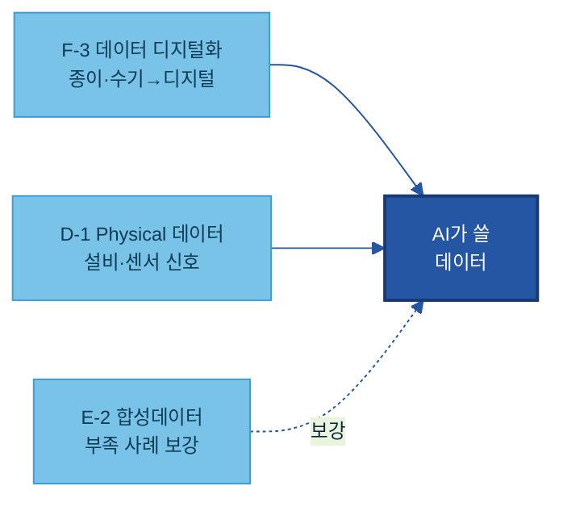
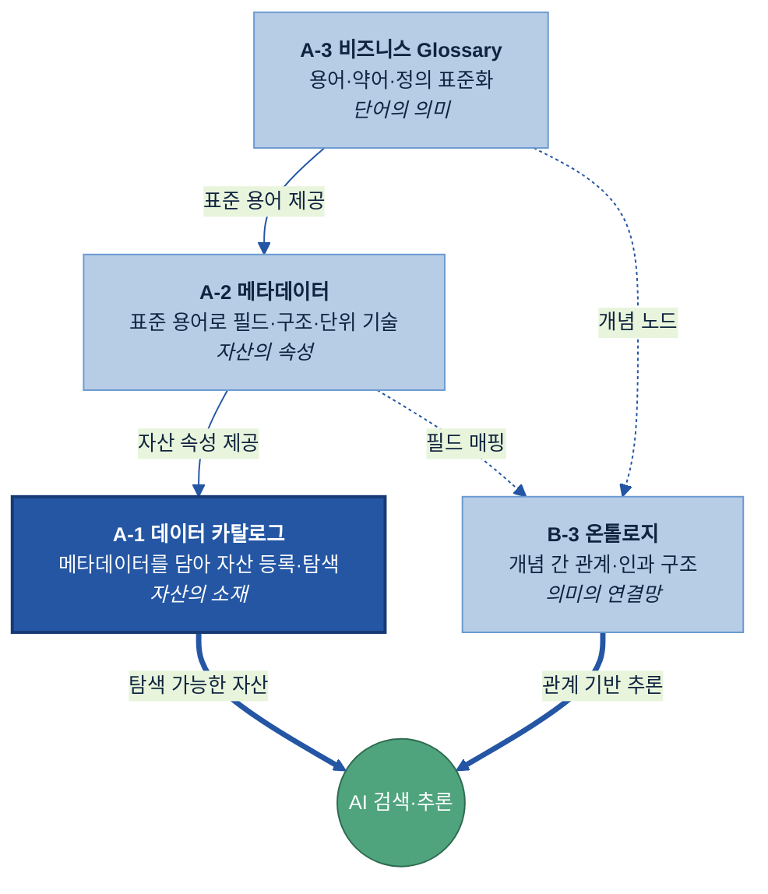
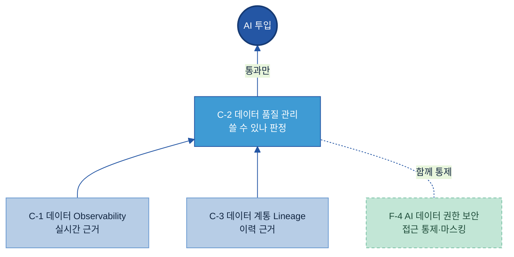
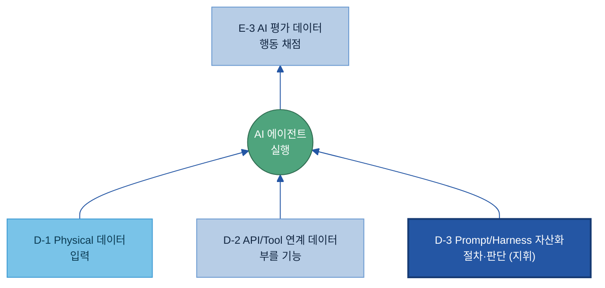
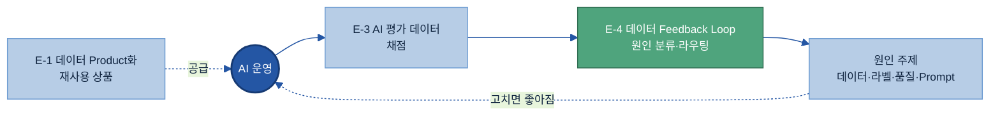
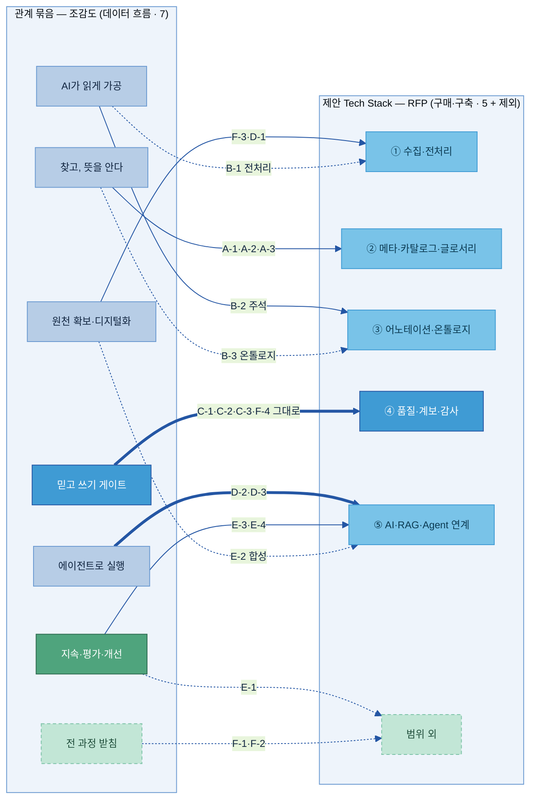

# AI-Ready Data 매뉴얼 — 전체 목차 (20개 주제)

> 목적: 20개 주제별 가이드(`가이드 작성/A-1 데이터 카탈로그/A-1 데이터 카탈로그.md` 형식)를 작성하기 전에, **모든 주제의 목차를 한 곳에서 검토·확정**하기 위한 문서입니다.
> 기준: `공통 규칙/최종 주제.md`의 주제 정의·Key Question + 참고 가이드(`파트너님 예시/data_catalog_manual.md`)의 12-섹션 구조.
> 폴더 구조: `공통 규칙/`(작성 표준·최종 주제) · `전체 목차/`(본 파일·`목차 검증/` 상세목차) · `가이드 작성/<주제>/`(실제 가이드) · `기존 매뉴얼 작성본/`(Kearney PPTX·목차 분석) · `파트너님 예시/`(참고 예시).
> 사용법: 12-섹션 고정 골격은 폐기하고, 주제마다 무게에 맞춰 섹션을 가감한 **현업판 논리 흐름**(Why→What→When→How→Tech Stack→Where)으로 정리했습니다. (개요 섹션은 두지 않고 정의·체계 내 위치를 What 첫 소절로 흡수 / 독립 '예시 시나리오' 섹션은 두지 않고 worked example을 Why·How에 흡수 — B-1·B-3 형식)
> ★ **이 파일이 20개 주제 목차의 단일 정본(single source of truth)입니다** — 조감도 다이어그램 + 주제별 세부 H3 목차 + 확정사항을 모두 담습니다. 목차를 보거나 고칠 땐 이 파일만 봅니다. (`목차 검증/` 폴더는 **동결 아카이브**일 뿐 정본이 아닙니다 — 이름이 비슷했던 옛 스냅샷은 `[동결] 00 …v2.md`로 표시해 헷갈리지 않게 했습니다.)

---

## 전체 조감도 — 20개 주제의 연관 관계

20개 주제는 서로 **먹여주고(feeds)·받치고(supports)·되돌리는(loops back)** 관계로 엮인다. 아래는 **관계로 묶되, 각 주제에 공식 이름과 코드(A-1·A-2…)를 함께** 달았다 — 코드는 6대 원칙에서 온 이름표일 뿐, 묶음은 알파벳 순서가 아니라 하는 일(관계)로 짠다. 순서 — 전체 흐름 한 장 → 각 주제 역할 → 묶음별로 뜯어보기 → 가로지르는 관계 → 어디부터 읽나 → (참고) 코드 → 제안 Tech Stack 5개 영역과의 정렬.

### 1. 전체 흐름 한 장 — 데이터 원천에서 AI Agent까지, 그리고 환류

**큰 영역 그림**이다. **원천 데이터 → 수집·전처리 → 의미·맥락 부여 → 품질·계보 관리**를 거쳐 **AI Agent**로 가고, 이 전 과정은 **데이터 운영 기준**을 따른다. AI 활용 영역에선 **실행**(D-3 Prompt·D-2 Tool)이 에이전트를 움직이고 **평가**(E-3·E-4)가 결과를 데이터·Prompt로 **환류**한다. 각 영역 박스에 그 영역의 가이드 코드를 함께 적었다 — 영역끼리 어떻게 엮이는지를 큰 틀로 본다(개별 가이드 상세는 §2 역할표·§3 묶음별 뜯어보기).


> **읽는 법:** 굵은 화살표 = 데이터 흐름(원천 → AI Agent), **파랑** = AI에 근거·도구 제공(③ 의미·맥락 RAG / 실행), **주황** = 평가·환류(AI → E-3·E-4 → 데이터·품질·Prompt), **회색 점선** = 전 과정에 적용되는 데이터 운영 기준. 각 영역의 가이드가 영역 안에서 어떻게 엮이는지는 §3 묶음별 뜯어보기에서 본다.

### 2. 각 주제의 역할 한눈에

비슷한 일을 하는 것끼리 **하는 일로** 묶었다 — 알파벳 순서가 아니다. 주제명 앞에 공식 코드를 달았으니, 개별 가이드로 바로 연결된다.

| 주제 (코드 · 공식명) | 역할 (한 줄) | 한 줄 정의 |
|---|---|---|
| **원천 확보·디지털화** — 데이터가 있게 만든다 | | |
| F-3 데이터 디지털화 | 종이·수기·암묵지를 **디지털로 전환** | 아날로그 자산을 AI가 쓸 디지털 자산으로 |
| D-1 Physical 데이터 | 현장 설비·센서 **신호를 AI 입력**으로 연결 | 물리세계 데이터를 AI 입력으로 연결 |
| E-2 합성데이터 | **부족한 사례**를 인공으로 채움 | 실데이터 부족·제한 시 인공 생성 |
| **찾고, 뜻을 안다** — 소재·속성·의미 | | |
| A-1 데이터 카탈로그 | 데이터가 **어디** 있는지 찾게 하는 주소록 | 자산의 존재·위치·오너·접근경로 목록 |
| A-2 메타데이터 | 그 데이터가 **무엇**인지 설명하는 설명서 | 구조·단위·생성기준 등 기술·운영 속성 |
| A-3 비즈니스 Glossary | 용어의 **뜻**을 하나로 통일하는 사전 | 용어·약어·동의어를 표준 정의로 통일 |
| B-3 온톨로지 | 개념 사이의 **관계**를 잇는 지식 지도 | 개념과 그 관계를 정리한 지식 지도 |
| **AI가 읽게 가공한다** — 형태 변환·의미 부여 | | |
| B-1 데이터 전처리 | 문서·표·이미지를 AI가 **읽을 형태**로 변환 | 비정형/반정형을 구조화 형태로 변환 |
| B-2 데이터 해설·주석 | 학습용으로 데이터에 **의미(라벨)** 부여 | 라벨·분류·해석 기준을 붙이는 체계 |
| **믿고 쓸 수 있는지 가린다** — 게이트 | | |
| C-2 데이터 품질 관리 | "**쓸 수 있는가**"를 판정하는 관문 | AI 활용 기준 충족 여부를 판정하는 통제 |
| C-1 데이터 Observability | 운영 중 이상을 **실시간 감지·알림** | 흐름의 지연·누락·이상을 감지하는 모니터링 |
| C-3 데이터 계통 Lineage | 출처→근거까지 경로를 **사후 추적** | 출처·이동·변환·활용 이력 기록 |
| F-4 AI 데이터 권한 보안 | **누가 볼 수 있는지** 통제 + 민감정보 가림 | 접근 통제 + 민감정보 탐지·마스킹 |
| **에이전트로 실행한다** — 도구·절차 | | |
| D-2 API/Tool 연계 데이터 | 에이전트가 부를 **기능의 설명서·규격** | Tool의 기능·입출력·제약을 정의한 명세 |
| D-3 Prompt/Harness 자산화 | 업무 절차·판단을 **재사용 Prompt 자산**으로 | 사람의 절차·판단을 AI 실행용으로 구조화 |
| **지속·평가·개선한다** — 재사용·채점·환류 | | |
| E-1 데이터 Product화 | 데이터를 **책임자 있는 재사용 상품**으로 | 반복 재사용 단위로 정의·운영 |
| E-3 AI 평가 데이터 | AI 답을 **채점**할 정답셋·기준 | 성능을 객관 판단할 정답셋·평가 기준 |
| E-4 데이터 Feedback Loop | 운영 결과를 **원인 주제로 되돌리는 허브** | 결과·오류를 개선으로 환류하는 고리 |
| **전 과정을 받친다** — 운영·수명 | | |
| F-1 데이터 운영관리(DataOps) | 데이터 흐르는 길을 **안 멈추게** 운영 | 파이프라인 실행·복구·변경 관리 |
| F-2 데이터 생애주기 관리 | **얼마나 두고 언제 버리나**의 시간축 | 생성→폐기 시간축을 정책으로 통제 |

### 3. 묶음별로 뜯어보기 — 엮이는 것끼리 그림으로

전체 흐름을 묶음별로 확대한다. 각 묶음 안에서 주제들이 어떻게 엮이는지 본다.

#### 3-1. 원천 확보·디지털화 — 데이터를 '있게' 만든다

세 주제는 **서로 다른 경로**로 데이터를 확보한다 — 종이·수기는 디지털화로, 현장은 Physical로, 부족한 사례는 합성으로. 셋 다 위 단계(찾기·가공)가 쓸 데이터를 만든다.



#### 3-2. 찾고, 뜻을 안다 — 의미가 쌓이는 축

단어(Glossary) → 필드(메타데이터) → 자산(카탈로그)으로 **의미가 쌓이고**, 그 위에 온톨로지가 개념 관계를 얹는다. 카탈로그(탐색 가능한 자산)와 온톨로지(관계 기반 추론)가 AI의 두 입구다.



카탈로그(A-1)가 20개 중 첫 주제이자 출발점이다. 카탈로그만 먼저 읽는 독자라면 인접 세 주제는 다음 한 줄로 충분하다 — **메타데이터(A-2)**는 "각 데이터가 무엇인지 설명하는 설명서", **비즈니스 Glossary(A-3)**는 "용어의 뜻을 하나로 통일한 사전", **온톨로지(B-3)**는 "개념 사이의 관계를 잇는 지식 지도"다. 넷의 관계는 역할 분담이다. 카탈로그가 "**어디 있나**"(소재)를 답하고, 그 항목이 "**무슨 속성인가**"는 메타데이터가, "**무슨 뜻인가**"는 글로서리가, "**무엇과 어떻게 엮이나**"는 온톨로지가 받친다. 상세 정의·구축은 각 주제 가이드에서 다룬다.

#### 3-3. AI가 읽게 가공 — 형태 다음 의미

전처리가 문서·표·이미지를 **읽을 수 있는 형태**로 바꾸고, 그다음 해설·주석이 **뜻(라벨)**을 더한다. 형태가 먼저, 의미가 그다음이다.


#### 3-4. 믿고 쓰기 — 품질 게이트

품질 관리(C-2)가 "쓸 수 있나"를 **판정**하고, Observability(C-1, 실시간)·Lineage(C-3, 이력)가 **근거**를 댄다. 권한·보안(F-4)은 같은 관문에서 접근을 함께 통제한다. **통과한 데이터만** AI로 올라간다.



#### 3-5. 에이전트로 실행 — 지휘는 절차, 도구는 기능

Prompt·Harness(D-3, 절차·판단)가 **위에서 지휘**하고, API/Tool 명세(D-2, 부를 기능)가 도구를, Physical 데이터(D-1)가 입력을 댄다. 에이전트가 한 행동은 AI 평가(E-3)가 채점한다.



#### 3-6. 지속·평가·개선 — 환류 고리

AI 운영 결과를 평가(E-3)가 **채점**하면, Feedback Loop(E-4)가 원인을 가려 **원래 주제로 되돌린다**(닫힌 고리). Product화(E-1)는 검증된 데이터를 재사용 상품으로 공급해 다시 AI를 먹인다.



### 4. 묶음을 가로지르는 관계

위 묶음은 데이터가 흐르는 단계로 나눈 것이다. 한 묶음에 갇히지 않고 **여러 묶음을 가로지르는** 관계도 있다.

- **재사용 자산** — 데이터 카탈로그(A-1, 소재)·데이터 품질 관리(C-2, 품질)·생애주기 관리(F-2, 수명)를 묶어, 데이터 Product화(E-1)가 "책임자 있는 재사용 상품"으로 공급한다. 서로 다른 세 묶음에서 하나씩 모인다.
- **환류 고리** — 결과를 원인 주제로 되돌리는 닫힌 고리(위 3-6에서 그림으로 다룸: E-3 → E-4 → 원인 주제).

> 관계가 단계 묶음(나아가 알파벳 코드)을 넘나든다는 게 핵심이다 — 그래서 코드는 칸막이가 아니라 이름표일 뿐이다.

### 5. 어디부터 어떻게 읽나 — 읽는 순서

전체를 처음부터 끝까지 다 읽기보다, **지금 우리 조직이 막힌 지점**부터 읽는 것을 권한다. 큰 흐름은 위 그림 그대로다 — 원천 확보 → 찾기·의미 → AI가 읽게 → 믿고 쓰기 → 실행 → 지속, 그 아래 운영·수명이 전 구간을 받친다.

기본 읽는 순서 (처음 시작이라면):
1. **A-1 데이터 카탈로그 → A-2 메타데이터 → A-3 비즈니스 Glossary** (필요 시 **B-3 온톨로지**) — 데이터를 찾고 해석하는 토대. 여기서 시작한다.
2. **B-1 데이터 전처리 → B-2 데이터 해설·주석** — AI가 읽고 의미를 이해하게. (대량 종이·수기 자료가 먼저면 **F-3 데이터 디지털화**부터)
3. **C-2 데이터 품질 관리 → C-1 Observability · C-3 Lineage** (접근은 **F-4 권한·보안**) — 믿고 쓰게 하는 게이트.
4. **D-2 API/Tool 연계 데이터 → D-3 Prompt/Harness 자산화** — 에이전트로 실행하게. (현장 신호는 **D-1 Physical 데이터**)
5. **E-1 데이터 Product화 → E-3 AI 평가 데이터 → E-4 Feedback Loop** (사례 부족하면 **E-2 합성데이터**) — 재사용·평가·환류로 지속 개선.
6. **F-1 데이터 운영관리 · F-2 데이터 생애주기 관리** — 운영·수명으로 전 구간을 받침.

꼭 갖출 것과 골라서 할 것을 먼저 가른다.

> **기본형 (대부분 다 필요):** A-1·A-2·A-3 · B-1·B-2 · C-1·C-2·C-3 · D-1 · E-4 · F-1·F-2·F-4 — "어디부터 정비하나(우선순위)"의 문제다.
> **선택형 (조건이 맞을 때만):** B-3 온톨로지 · D-2·D-3 · E-1·E-2·E-3 · F-3 — "지금 우리에게 필요한가(적용 판단)"를 먼저 따진다. 각 가이드의 Why 절이 그 판단 기준을 준다.

지금 겪는 문제로 찾아가기:

| 지금 겪는 문제 | 먼저 볼 주제 |
|---|---|
| 데이터가 어디 있는지 몰라 헤맨다 | A-1 카탈로그 → A-2 메타데이터 → A-3 Glossary |
| 보고서·도면·이미지를 AI가 못 읽는다 | B-1 전처리 (대량 종이·수기면 F-3 디지털화 먼저) |
| 같은 용어를 부서·계열사마다 다르게 쓴다 | A-3 Glossary (개념 관계까지면 B-3 온톨로지) |
| AI 답이 자꾸 틀리거나 못 믿겠다 | C-2 품질 → C-1·C-3 (라벨 문제면 B-2 주석) |
| 에이전트가 시스템을 부르게 하려 한다 | D-2 API/Tool → D-3 Prompt/Harness |
| 같은 오류가 반복되는데 어디를 고칠지 모른다 | E-4 Feedback Loop (채점 기준은 E-3 평가) |
| 학습할 사례가 너무 적다 | E-2 합성데이터 |
| 민감정보 때문에 데이터를 AI에 못 쓴다 | F-4 권한·보안 |

> **표준 컬러 스키마**: 핵심=진파랑 `#2456A4` · 일반 노드=연파랑 `#B7CDE6` · 원천=하늘 `#79C3E8` · 게이트=밝은파랑 `#3F9BD4` · 환류/긍정=초록 `#4FA47D` · 기반=옅은초록 `#C2E6D6`(점선). 모든 주제 다이어그램은 이 테마를 따른다.

### 6. (참고) 주제 코드와 6대 원칙

각 주제 코드의 알파벳은 6대 원칙에서 왔다 — **A 찾을 수 있게 · B 이해할 수 있게 · C 신뢰할 수 있게 · D 실행할 수 있게 · E 지속할 수 있게 · F 거버넌스**. 아래 표를 보면 한 관계 묶음 안에 **여러 원칙의 코드가 섞인다**(예: '믿고 쓰기 게이트'에 C-1·C-2·C-3와 F-4가 함께). 관계로 묶으면 알파벳 순서와 달라지기 때문이다 — 코드는 분류·탐색용 이름표일 뿐, 관계의 칸막이가 아니다.

| 관계 묶음 | 주제 | 코드 |
|---|---|---|
| **원천 확보·디지털화** | 데이터 디지털화 | F-3 |
|  | Physical 데이터 | D-1 |
|  | 합성데이터 | E-2 |
| **찾고, 뜻을 안다** | 데이터 카탈로그 | A-1 |
|  | 메타데이터 | A-2 |
|  | 비즈니스 Glossary | A-3 |
|  | 온톨로지 | B-3 |
| **AI가 읽게 가공** | 데이터 전처리 | B-1 |
|  | 데이터 해설·주석 | B-2 |
| **믿고 쓰기 (게이트)** | 데이터 품질 관리 | C-2 |
|  | 데이터 Observability | C-1 |
|  | 데이터 계통 Lineage | C-3 |
|  | AI 데이터 권한 보안 | F-4 |
| **에이전트로 실행** | API/Tool 연계 데이터 | D-2 |
|  | Prompt/Harness 자산화 | D-3 |
| **지속·평가·개선** | 데이터 Product화 | E-1 |
|  | AI 평가 데이터 | E-3 |
|  | 데이터 Feedback Loop | E-4 |
| **받침 (운영·수명)** | 데이터 운영관리(DataOps) | F-1 |
|  | 데이터 생애주기 관리 | F-2 |

> 아래 본문(§A~§F)은 이 코드 순서로 배열돼 있다. 관계로 읽을 땐 위 묶음으로, 개별 주제를 찾을 땐 코드로 — 두 길이 같은 20개 주제를 가리킨다.

### 7. 제안 Tech Stack 5개 영역과 어떻게 맞물리나

위 일곱 관계 묶음은 **데이터 흐름**(무엇이 무엇을 먹이나)으로 짠 것이고, [02 제안 Tech Stack](02%20제안%20Tech%20Stack%20(RFP%205개%20영역).md)의 **RFP 5개 영역**은 **솔루션 구매·구축 단위**(어떤 도구를 함께 사나)로 17개 주제를 묶은 것이다. 관점이 다르지만 대체로 정렬되며, 특히 **신뢰 게이트는 완전히 일치**한다. 갈리는 지점은 네 군데다.



> **읽는 법:** 굵은 화살표 = 묶음이 통째로 한 영역과 맞는 곳(믿고 쓰기 = ④ 완전 일치, 실행 = ⑤). 점선 = 관계로는 한 묶음이지만 RFP에선 다른 영역으로 가는 주제(갈림), 또는 RFP 범위 밖(제외).

| 관계 묶음 (조감도) | 주제 | 02 제안 Tech Stack 영역 | 정렬 |
|---|---|---|---|
| 원천 확보·디지털화 | F-3 디지털화 · D-1 Physical | ① 수집·전처리 | 일치 |
|  | E-2 합성데이터 | ⑤ AI·RAG·Agent | 갈림 |
| 찾고, 뜻을 안다 | A-1 카탈로그 · A-2 메타데이터 · A-3 Glossary | ② 메타·카탈로그·글로서리 | 일치 |
|  | B-3 온톨로지 | ③ 어노테이션·온톨로지 | 갈림 |
| AI가 읽게 가공 | B-2 데이터 해설·주석 | ③ 어노테이션·온톨로지 | 일치 |
|  | B-1 데이터 전처리 | ① 수집·전처리 | 갈림 |
| 믿고 쓰기 게이트 | C-1 · C-2 · C-3 · F-4 | ④ 품질·계보·감사 | 완전 일치 |
| 에이전트로 실행 | D-2 API/Tool · D-3 Prompt/Harness | ⑤ AI·RAG·Agent | 일치 |
| 지속·평가·개선 | E-3 평가 · E-4 Feedback | ⑤ AI·RAG·Agent | 일치 |
|  | E-1 데이터 Product화 | 범위 외 | 제외 |
| 전 과정 받침 | F-1 운영관리 · F-2 생애주기 | 범위 외 | 제외 |

정렬 결과:
- **완전 일치 — 믿고 쓰기 게이트 = RFP ④ 품질·계보·감사**: C-1·C-2·C-3·F-4가 그대로 같은 묶음이다. 두 관점이 정확히 겹친다.
- **거의 일치 — 찾기·의미 ≈ RFP ②**: A-1·A-2·A-3는 그대로 ②로 가고(온톨로지 B-3만 RFP에선 ③으로). 에이전트 실행(D-2·D-3)도 RFP ⑤에 그대로 든다.
- **갈리는 네 군데 (관점 차이)**:
  1. **전처리(B-1)** — 조감도는 'AI가 읽게 가공'(이해), RFP는 '수집·전처리'(①). 전처리를 "데이터를 들여오는 일"로 보면 ①, "AI가 읽게 만드는 일"로 보면 가공이다.
  2. **온톨로지(B-3)** — 조감도는 '찾기·의미'(개념까지 의미를 쌓음), RFP는 '어노테이션·온톨로지'(③, 라벨링과 같은 그래프 도구군으로).
  3. **합성데이터(E-2)** — 조감도는 '원천 확보'(없는 데이터를 만들어 들임), RFP는 'AI·RAG·Agent 연계'(⑤, 학습용 생성으로).
  4. **범위** — 조감도는 20개 전부(받침 F-1·F-2, 지속의 E-1 포함), RFP 5개 영역은 17개만(E-1·F-1·F-2는 범위 외 — 구현 시 [01 Tech Stack 비교](01%20Tech%20Stack%20비교%20(솔루션×주제).md) 참조).
- **왜 갈리나**: 조감도는 데이터가 흐르며 서로 먹이는 **관계**로 묶고, RFP 5개 영역은 **같이 사는 솔루션 단위**로 묶는다. 둘 다 유효하다 — 체계를 이해할 땐 관계(조감도)로, 솔루션을 조달·구축할 땐 RFP 영역으로 본다.

---

## 0. 목차 표준 (모든 주제 공통 원칙)

> 과거의 "12-섹션 고정 골격"은 폐기했습니다. 12개 섹션은 **참고용 풀**일 뿐, 주제마다 섹션을 더하고·빼고·합쳐 **주제 무게에 따라 섹션 수를 달리** 합니다(고정 금지). 합격 기준은 "12개를 다 채웠는가"가 아니라 **"`공통 규칙/최종 주제.md`의 Key Question에 전부 답했고 원칙을 지켰는가"**입니다. (상세 표준: `공통 규칙/01 가이드 작성 표준.md`)

**논리 흐름 (기본 순서 — B-1·B-3 형식 정답지 기준):**
왜(Why) → 무엇(What — 정의·체계 내 위치를 첫 소절로 흡수) → 언제/어디에(When) → 어떻게(How — 구축+운영) → 솔루션(Tech Stack) → 다른 주제와의 관계(Where) → *(성과 지표(KPI)는 신뢰성 주제 C-1·C-2·C-3에 한해 마지막에 둠)*  ※ 개요 섹션은 두지 않는다. **Tech Stack은 How 다음**(How에서 잡은 구축 방식에 맞춰 솔루션을 고르므로). **독립 '예시 시나리오' 섹션은 두지 않고**, before/after 효과는 Why 끝에, 흐름 미리보기는 How 구축 절차의 "예시로 따라가기"로 흡수한다(worked example 자체는 반드시 남긴다 — B-1·B-3 방식).

**어떤 구성에서도 유지하는 것:**
- **4축**: 왜(Why·Pain Point) · 무엇(What·정의/구성) · 언제·어디(When·대상 선정) · 어떻게(How·구축/운영)
- **담당자 역할**(오너·현업·IT·보안·AI 조직)을 구축/운영 섹션 안에 포함
- **이해장치**: 섹션마다 한 줄 요약 + 어려운 용어 즉시 풀이 + 제조 현업 예시
- **현업 눈높이**: 핵심만, 어려운 약어는 풀거나 생략
- **★ 데이터 준비 관점**: "AI를 만드는 법"이 아니라 "그 AI가 쓸 **데이터를 준비·정비하는 법**"

**When 처리:** 골라서 하는 주제(온톨로지·합성데이터·평가데이터)는 "언제/무엇을 하나(적용 판단)", 기본 다 필요한 주제(카탈로그·메타데이터)는 "어디부터(우선순위)".

**섹션 제목 표기(B-3 온톨로지 기준):** 핵심 축에 매핑되는 섹션만 영문 선두 표기를 붙인다 — `Why`(왜 필요한가) · `What`(무엇을 갖추나) · `When`(어디부터/언제 — 대상·우선순위) · `How`(어떻게 준비·운영하나, 구축+운영 묶음) · `Where`(다른 주제와의 관계). 솔루션 섹션은 `Tech Stack — 솔루션 검토`("도구"라는 말 대신 "솔루션"으로 통일), 성과 지표(C군)는 `KPI`로 표기한다. **개요 섹션은 두지 않는다** — 정의·체계 내 위치는 What 첫 소절(`[주제]란 + 체계 내 위치`)로 흡수하고, 한 줄 정의는 제목 아래 `> 정의:` 줄이 담당한다(뒤 What·Where와 중복 제거). **When은 전 주제 독립 섹션으로 둔다**(What 다음) — Why에는 Pain Point·기대 효과만 담고, "언제 하나"는 When으로 뺀다. 기본형은 When = "어디부터/우선순위", 선택형은 When = "언제/어떤 경우에 필요한가(적용 판단)". (E-1·E-2·E-3는 이 형태로 분리 정리 완료. B-3(완료본)·D-2·D-3·F-3은 아직 Why에 적용 판단을 합쳐 둔 옛 형태로, 추후 같은 방식 분리 검토 대상.) **예시 시나리오는 의무가 아니다** — before/after가 개념을 또렷이 보여주는 주제만 남기고, Pain Point·How와 겹쳐 군더더기가 되는 주제(예: F-1 DataOps·F-2 생애주기)는 둘 필요 없다. **이 목차의 주제별 세부 블록은 B-1·B-3 형식 정답지의 섹션 흐름(Why→What→When→How→Tech Stack→Where)을 단일 표준으로 따른다.** Tech Stack은 How 다음, 독립 '예시 시나리오' 섹션은 두지 않고 before/after는 Why 끝 또는 How 첫 소절(`적용 전후 비교`)로, 흐름 미리보기는 How 구축 절차로 흡수한다. **2026-07-01 기준 20개 주제 가이드가 모두 작성되었고, 이 목차는 실제 작성된 가이드 본문의 섹션 구조와 동기화되어 있다.** 두 가지 실제 편차는 다음과 같다 — ① **D-1·D-2·E-1·E-2 본문은 아직 독립 '예시 시나리오' 섹션을 두고 있다**(표준은 흡수). 목차에서는 A·B·C 가이드처럼 How 첫 소절 `적용 전후 비교`로 통합해 표기했으므로, 해당 4개 가이드 본문은 추후 흡수 방향으로 재정렬 대상이다. ② **F-1 본문은 KPI 섹션을 두고 있다**(표준상 KPI는 C-1·C-2·C-3에만) — 목차는 실제 구조를 반영해 F-1에 KPI를 표기했으며, 표준 유지/편차 인정 여부는 별도 결정 대상이다.

> **주제별 섹션 수(2026-06-26 목차 표준 — 별첨 제외 본문 섹션):** 가벼운 주제는 5~6개(Why·What·When·How·Tech Stack·Where), 무거운 주제(C-2 등)는 그 위에 H3 깊이로 무게를 더한다. **선택형**(B-3·D-2·D-3·E-1·E-2·E-3·F-3)은 Why가 When을 흡수해 한 섹션 적다. **KPI(성과 지표) 섹션은 C-1·C-2·C-3에만** `Where` 뒤에 마지막으로 둔다 — 나머지 17개 주제는 `Where — 다른 주제와의 관계`가 마지막 섹션이다. 무게 차등은 섹션 수가 아니라 **H3 깊이**(소목차 2~6개)로 표현한다.
> **솔루션은 독립 "Tech Stack — 솔루션 검토" 섹션**을 기본으로 두되 **How 다음·Where 앞**에 둔다(How에서 잡은 구축 방식에 맞춰 솔루션을 고르므로 — B-1·B-3 위치). **단 통합 플랫폼 하나가 여러 주제를 함께 커버하는 통합형 주제(전처리 B-1·해설/주석 B-2 등)는 솔루션을 독립 섹션 대신 How·아키텍처·별첨에 흡수할 수 있다**(A-1 카탈로그와 같은 플랫폼이라 독립 섹션이 그대로 중복되는 경우). 메타데이터 A-2도 카탈로그와 같은 플랫폼이지만, 고객 요청으로 독립 Tech Stack 섹션을 둔다(2026-06-29). 솔루션 자체를 묶어 비교·선정하는 일은 2층 정본 [01 Tech Stack 비교](../Tech%20Player/01%20Tech%20Stack%20비교%20(솔루션×주제).md)가 전담.
> **"다른 주제와의 관계"는 항상 독립 섹션**으로 둔다(경계만 다룸). **성과 지표(KPI)는 신뢰성(C-1·C-2·C-3) 주제에서만 마지막 섹션으로 둔다** — 인용된 합격 기준(데이터 품질·출처·변경 이력·계보로 AI 신뢰성 저하·Hallucination 방지)이 KPI를 요구하는 범위가 C군이기 때문. 나머지 17개 주제는 성과 지표 섹션을 두지 않아 "다른 주제와의 관계"가 마지막이 된다.
> **고도화 로드맵·미래 AI 자동화 전망은 (2026-06 결정) 20개 주제 전부에서 일단 제거**했다. 추후 다시 둘 경우의 작성 기준(달력 gantt 금지 / ① 성숙도 단계 Lv0 없음→Lv1 수기 표준화→Lv2 도구·AI 보조→Lv3 자율 + ② 미래 AI 자동화 전망)은 CLAUDE.md·02 다이어그램 표준 §5-4 참조.
> (본 파일이 **단일 정본** — 조감도 + 세부 H3 목차를 함께 담음. `목차 검증/05 …v2.md`는 과거 상세본으로 아카이브 동결되어 더는 갱신하지 않음.)

---

# A · 찾을 수 있게 (Findable)

## A-1 데이터 카탈로그
> 파일명: `가이드 작성/A-1 데이터 카탈로그/A-1 데이터 카탈로그.md`
> 정의: AI와 사용자가 데이터 자산의 존재·위치·오너·접근 경로를 찾도록 등록하는 자산 목록 체계.

```
0. 이 가이드가 답하는 5가지 질문
1. Why — 왜 필요한가
   1.1 현업 Pain Point (데이터가 어디 있는지 몰라 사람마다 찾아 헤매고, AI도 못 찾음)
   1.2 기대 효과 (찾는 시간↓·중복 수집↓·AI가 필요한 데이터에 바로 도달)
2. What — 무엇을 갖추나 (등록 항목·구성)
   2.1 데이터 카탈로그란 + 체계 내 위치 (자산의 주소록 — 소재·오너·접근경로)
   2.2 카탈로그 조회 방식 (검색·탐색 화면 구성)
   2.3 등록 항목 (찾기 위한 최소 정보 — 5영역 틀 + 대표 등록 항목)
   2.4 분류·태그 체계 (분류 기준 + 태그 표준값)
   2.5 AI 활용 식별 정보 (AI에 바로 쓸 수 있는 상태인지)
3. When — 어디부터 등록하나 (우선순위)
   3.1 등록 대상 선정 기준 (AI 활용·업무 중요도·재사용성)
   3.2 등록 우선순위 (사용량 로그 → Tier 1/2/3, 상위부터)
   3.3 유형별 등록 대상과 제외 (정형·비정형·AI 데이터별)
4. How — 어떻게 구축·운영하나
   4.1 등록 기준 정의 (등록 항목·분류·태그·보안 표준 + Before→After 작성 규칙)
   4.2 데이터 현황 조사 및 등록 대상 선정
   4.3 To-Be 아키텍처 (원천·수집·코어·소비 4계층)
   4.4 Legacy 연동 및 Pipeline 구축 (자동 커넥터·증분 / 수동 양식)
   4.5 초기 적재 및 검증 (검색 → 조회 → 권한신청 → 활용)
   4.6 담당자 역할 (오너·현업·IT·보안·AI 조직)
   4.7 항목별 작성 주체 — 플랫폼 매핑 (자동 수집·AI 초안 대부분, 사람은 의미·보안·승인)
   4.8 운영 및 유지관리 (갱신 트리거·정기 정합성 점검)
5. Tech Stack — 솔루션 검토
   5.1 카탈로그에 필요한 기능 (자동 수집·검색·권한·연동)
   5.2 대표 솔루션과 제공 기능 (전용 카탈로그·메타 통합형·오픈소스 — 기능 비교)
   5.3 AI를 활용한 카탈로그 기능 (자동 태깅·설명 초안·유사 자산 추천)
6. Where — 다른 주제와의 관계
   6.1 인접 주제와의 역할 분담 (메타데이터=A-2 속성 / Glossary=A-3 용어 / Lineage=C-3 흐름 / 생애주기=F-2 / Product화=E-1)
   6.2 전체 조감도 (경계 시각화)
```

## A-2 메타데이터
> 파일명: `가이드 작성/A-2 메타데이터/A-2 메타데이터.md`
> 정의: 데이터 자산의 구조·형식·단위·생성기준·갱신주기 등 기술·운영 속성을 설명하는 관리 정보.

```
1. Why — 왜 필요한가
   1.1 현업 Pain Point (항목 이름·단위만으론 뜻을 몰라 AI가 잘못 해석)
   1.2 기대 효과 (재사용이 쉬워지고 오해석이 줄어듦)
   1.3 적용 전 / 후 (같은 필드가 이름만 있던 상태 → 뜻·단위·기준이 붙은 상태)
2. What — 메타데이터의 구성 요소
   2.1 메타데이터의 정의와 위치 (데이터의 설명서)
   2.2 세 종류의 메타데이터 (기술 · 비즈 · 운영)
   2.3 다섯 계층 (어디에 붙나)
   2.4 항목 사전 — 대표 항목 (한 필드에 붙는 대표 메타 항목)
   2.5 필드 설명서 — 이름만으론 모르는 데이터 풀이
   2.6 단위·기준일·집계 기준
   2.7 메타데이터 표준 양식과 버전 관리
   2.8 데이터 유형별 메타데이터 차이 (정형·시계열·문서·이미지/도면·영상/음성)
3. When — 어디부터 하나 (정비 우선순위)
   3.1 정비 우선 대상
   3.2 자동으로 모으고, 사람은 검수만
   3.3 AI가 비즈 메타 초안을 채운다
4. How — 어떻게 준비·운영하나
   4.1 구축 절차
   4.2 비즈 메타 작성 — 좋은 예 vs 나쁜 예
   4.3 실제로 어디서 채우나 — 플랫폼 매핑
   4.4 정합성 자동 점검
   4.5 운영 — 갱신·승인과 역할
5. Tech Stack — 솔루션 검토
   5.1 도구 유형 (통합 카탈로그·플랫폼 내장·오픈소스)
   5.2 선정 기준 (자동 수집 커버리지·비즈 메타 작성 UX·Glossary 연동)
6. Where — 다른 주제와의 관계 (카탈로그=소재 / Glossary=용어 / 온톨로지=개념 / 품질)
```

## A-3 비즈니스 Glossary
> 파일명: `가이드 작성/A-3 비즈니스 Glossary/A-3 비즈니스 Glossary.md`
> 정의: 업무 용어·약어·동의어를 표준 정의로 통일해 데이터 해석 일관성을 확보하는 용어 사전.

```
1. Why — 왜 필요한가
   1.1 현업 Pain Point (같은 결함을 현장마다 다르게 불러 AI 검색·집계가 따로 놂 — 특히 글로벌 현장)
   1.2 기대 효과 (현장 용어로 물어도 표준 용어로 변환돼 한 번에 검색·해석 일관)
2. What — 무엇을 갖추나 (용어 카드·동의어·유형)
   2.1 비즈니스 Glossary란 + 체계 내 위치 (용어의 "뜻")
   2.2 표준 용어 카드 — 표준 정의 항목
   2.3 동의어·금지어 (현장 표현과 표준어 연결)
   2.4 연계 정보 (데이터 필드·책임 부서)
   2.5 주요 관리 유형 (비즈니스 용어 / 지표 기준)
3. When — 어디부터 표준화하나 (우선순위)
   3.1 표준화 대상 선정 기준 (업무 영향도·AI 활용도·혼선 정도)
   3.2 우선순위 (AI 검색 영향·혼선 큰 용어 먼저)
4. How — 어떻게 준비·운영하나
   4.1 표준 용어 정의 절차 (결함명 표준화 사례로 적용 전/후·수행 과정)
   4.2 용어 충돌 조정
   4.3 표준 용어 저장소와 활용 체계
   4.4 동의어 및 약어 관리
   4.5 용어 변경 관리
5. Tech Stack — 솔루션 검토
   5.1 도구 유형
   5.2 선정 기준
6. Where — 다른 주제와의 관계 (메타데이터 필드 설명=A-2 / 온톨로지 관계=B-3 / 카탈로그 검색=A-1)
별첨) A 용어 카드 템플릿 및 예시 · B 두산 도메인 용어 예시집 · C 표준값 목록
```

---

# B · 이해할 수 있게 (Understandable)

## B-1 데이터 전처리
> 파일명: `가이드 작성/B-1 데이터 전처리/B-1 데이터 전처리.md`
> 정의: 문서·표·이미지 등 비정형/반정형 데이터를 AI가 읽을 수 있는 구조화 형태로 변환.

```
0. 이 가이드가 답하는 5가지 질문
1. Why — 왜 필요한가
   1.1 전처리 없이 AI 활용이 어려운 이유 (분산·PDF/이미지·도면·수기 Excel — 데이터는 있으나 AI가 읽을 형태가 아님)
   · 이 가이드가 다루는 전처리의 범위 (Scope)
2. What — 데이터 전처리란 무엇인가
   2.1 데이터 전처리의 의미 (비정형/반정형을 AI가 읽는 구조로)
   2.2 전처리 4단계 (추출 → 정제 → 구조화 → 청킹)
   2.3 활용 목적별 형식 선택 기준 (RAG=Markdown · 집계=레코드 · 벡터/프로그램=JSON)
   2.4 청킹 전략 (구조 기반+표 단위 기본 / 고정·의미·계층)
3. When — 어디부터 하나
   3.1 전처리 대상 (PDF·PPT·Excel·스캔/도면·CSV·이메일·회의록)
4. How — 어떻게 구축·운영하나
   4.1 구축 흐름과 두 가지 실행 방식 (규칙·도구 기반 vs LLM 기반)
   4.2 문서 유형별 전처리 (PDF·PPT·Excel·이미지/스캔·이메일·Word/HWP·CSV·회의록 — 유형별 전/후)
   4.3 복잡한 문서의 LLM 기반 구조화 (스키마 먼저 → 값 추출, 환각 차단·검증)
   4.4 적재 — AI 활용 환경에 제공 (벡터 DB·검색 인덱스·분석 테이블)
   4.5 운영과 역할 (양식 변경을 골든셋 회귀로 탐지)
5. Tech Stack — 전처리 솔루션 비교 (규칙 기반 라이브러리 / 문서 파싱 솔루션 / AI(LLM) 기반 추출)
6. Where — 다른 주제와의 관계 (디지털화=F-3 / 주석=B-2 / 품질=C-2 / 계통=C-3 / 카탈로그=A-1 / 온톨로지=B-3)
별첨) 주요 용어
```

## B-2 데이터 해설·주석
> 파일명: `가이드 작성/B-2 데이터 해설·주석/B-2 데이터 해설·주석.md`
> 정의: AI 학습을 위해 데이터에 라벨·분류·해석 기준 등 사람이 부여한 의미 정보를 붙이는 체계.

```
1. Why — 왜 필요한가
   1.1 현업 Pain Point (라벨이 없거나 기준이 제각각이면 AI 학습 품질이 떨어짐)
   1.2 기대 효과 (분류 자동화·판단 기준 일관·재작업 감소)
   1.3 적용 전 / 후 (결함 이미지 주석)
2. What — 무엇을 갖추나
   2.1 데이터 해설·주석이란 + 체계 내 위치 (사람이 의미(라벨)를 붙이는 체계)
   2.2 정본 모델 — 세 층의 의미 부여 (라벨·주석·해설)
   2.3 분류 체계(Taxonomy)와 라벨 정의서
   2.4 데이터 유형별 주석 방식
   2.5 주석 데이터 구성 항목 (주석 1건의 입력 항목)
   2.6 주석 가이드라인·사례집
   2.7 라벨 이력(버전) 관리
3. How — 어떻게 준비·운영하나 (8단계)
   3.1 8단계 표준 구축 프로세스와 완료 기준
   3.2 ① 대상 선정 — 어떤 데이터부터 하나
   3.3 ④ Pilot — 작게 먼저 해보고 기준을 잡는다
   3.4 ⑤ 작업자 간 일치도(IAA)와 합의
   3.5 ⑥·⑦ 본 라벨링과 검수 분기 (AI 1차 라벨 + 사람 검수 · 확신도 기반 라우팅)
   3.6 ⑧ 운영 — 변경·버전 관리
4. Tech Stack — 구축 아키텍처와 솔루션 비교
   4.1 구축 아키텍처
   4.2 솔루션 비교 (주석 도구 관점 기능 비교)
5. AI 활용 방법
   5.1 여러 라벨러 운영과 합의
   5.2 AI 자동 라벨링과 자동화 루프
   5.3 라벨러 작업 지시서 (현업 실행 키트)
6. Where — 다른 주제와의 관계 (평가 정답=E-3 / 개념 관계=B-3 / 용어 뜻=A-3)
   6.1 인접 주제와의 역할 분담
   6.2 전체 조감도 — 경계 정리
별첨) 주요 용어
```

## B-3 온톨로지
> 파일명: `가이드 작성/B-3 온톨로지/B-3 온톨로지.md`
> 정의: 한 분야의 개념들과 **그 사이의 관계**를, 사람·컴퓨터가 함께 읽을 수 있게 정리해 둔 **지식 지도**. (정식 용어는 한글(영문) 병기, 깊은 스펙은 별첨)

```
1. Why — 왜, 언제 온톨로지가 필요한가
   1.1 온톨로지 도입 전 서비스의 본질 파악 (서비스·가치가 먼저, 온톨로지는 그 토대)
   1.2 온톨로지가 필요한 조건 (경우의 수 과다·관계 중심·결정적 답·다개념 탐색·암묵지·재사용)
   1.3 온톨로지가 불필요한 경우 (단어 통일=Glossary, 집계=SQL/BI, 유사 검색=벡터·생성형 AI)
2. What — 온톨로지란 무엇인가 (구성요소)
   2.1 정의 — 개념을 잇는 '지식 지도'
   2.2 범위와 경계 (단어=A-3·필드=A-2·위치=A-1)
   2.3 구성요소 — 노드·관계·속성 (클래스·인스턴스·속성·관계·계층·공리)
   2.4 개념의 3층 배치 (마스터 객체·사건·해석, 역방향 금지)
   2.5 핵심 개념과 관계 (제조 — 제품·공정·설비·검사항목·결함·원인·조치)
   2.6 코어와 유즈케이스 (재사용 축)
   2.7 전사 공통과 계열사 (조직 축 — 지주 공통 + 계열사 하위 확장)
3. How — 어떻게 구축하나 (개발 프로세스)
   3.1 설계 원칙 (현실·단일진실·재사용·관계 중심·도메인 먼저)
   3.2 온톨로지 설계 9단계 (코어 1~7 → 유즈케이스 8 → 운영 9)
   3.3 코어 설계 (1~7단계) — 「코어 설계 기획서」
   3.4 유즈케이스 설계 (8단계) — 「유즈케이스 기획서」
   3.5 운영·유지 (9단계) — 변경 관리 (고치기보다 더하기)
   3.6 주요 설계 함정
   3.7 검증 4원칙 (현실성·명시성·재사용성·설명력)
4. Tech Stack — 어떤 기술 아키텍처가 필요한가
   4.1 그래프 형식 — LPG와 RDF (쿼리 언어 openCypher/SPARQL)
   4.2 저장소(DB) 선정 — RDB·Graph DB 선택 방법 (혼용·폴리글랏)
   4.3 추론(Inference) — 사전 적재 ↔ 질의 시 추론 trade-off
   4.4 제조 표준 온톨로지 — IOF (쓸지 판단)
   4.5 도입 전 점검 — 보안·성능·비용
   4.6 저장·편집 솔루션 (도구 유형·명명·ID·필수 속성)
   4.7 솔루션 비교표 (참고)
5. AI — 온톨로지 기반 AI 활용 방법 (개념 확장 검색·다중 홉 원인 추적·유사 사례/조치 추천)
6. Where — 다른 주제와의 관계 (A-3 단어·A-2 필드·A-1 위치·B-2 라벨과의 경계)
별첨) A 온톨로지 설계 각론 (노드·관계를 세우고 바꿀 때의 설계·운영 판단 기준 — 별도 .md)
```

---

# C · 신뢰할 수 있게 (Trustworthy)

## C-1 데이터 Observability
> 파일명: `가이드 작성/C-1 Observability/C-1 Observability.md`
> 정의: 데이터 흐름의 지연·누락·변경·이상 징후를 운영 중 감지·알림하는 모니터링 체계.

```
1. Why — 왜 필요한가
   1.1 현업 Pain Point (수집이 멈췄거나 값이 튀어도 모른 채 AI가 잘못된 데이터를 그대로 씀)
   1.2 기대 효과 (이상을 빨리 잡아 AI 오작동·잘못된 보고를 사전에 막음)
2. What — 무엇인가·무엇을 갖추나
   2.1 데이터 Observability란 + 체계 내 위치 (운영 중 데이터 상태를 지켜보고 알려주는 관제실)
   2.2 관측 4축 — 무엇을 지켜보나 (수집 실패·지연 / 건수 급변 / 결측 증가 / 값 분포 변화)
   2.3 이상 판단 기준 — 고정 한계값과 평소 추세
   2.4 알림 체계 — 누구에게·어떤 등급으로
   2.5 원인 구분용 기록 — 데이터 탓인지 모델 탓인지
3. When — 어디부터 관측하나 (관측 대상 우선순위)
   3.1 기본 필수 대상 (AI 서비스·핵심 리포트로 바로 흘러가는 흐름부터)
   3.2 관측 우선순위 판단 기준 (변동 잦거나 멈추면 타격 큰 흐름)
4. How — 어떻게 준비·운영하나
   4.1 적용 전후 비교 (새벽 수집 끊김을 즉시 알림)
   4.2 Observability 구축 절차 (대상 흐름 연결 → 정상 기준선 → 알림 규칙 → 시범 운영)
   4.3 관측 지표·판단 기준 설정
   4.4 알림·에스컬레이션 운영 (알림 피로 최소화·등급 조정·중복 묶기 / 역할·책임)
5. Tech Stack — 솔루션 검토
   5.1 솔루션 유형 (전용 데이터 관측 솔루션 / 플랫폼 내장 / 오픈소스)
   5.2 선정 기준 (이상탐지 방식(규칙 vs ML) · 계보 연계 · 알림 연동 · 컬럼 단위 지원)
6. Where — 다른 주제와의 관계 (사후 추적=C-3 / 사용 판정=C-2 / 복구 조치=F-1)
7. KPI — 성과 지표 (이상 감지까지 걸린 시간 · 놓친 건수 · 오탐률 · 관측 범위)
```

## C-2 데이터 품질 관리
> 파일명: `가이드 작성/C-2 데이터 품질 관리/C-2 데이터 품질 관리.md`
> 정의: 데이터가 AI 활용 기준을 충족하는지 판정하는 통제 체계("쓸 수 있는가" 판정).

```
1. Why — 왜 필요한가
   1.1 현업 적용 시 발생하는 문제
   1.2 기대 효과 (품질 관리로 얻는 것)
2. What — 무엇인가·무엇을 갖추나
   2.1 데이터 품질 관리의 정의와 역할 (+ 체계 내 위치)
   2.2 품질 기준 — 여섯 가지 항목
   2.3 AI에 쓰면 안 되는 데이터
   2.4 Quality Gate — 투입 전 관문 (게이트 구조·예외 승인)
3. When — 어디부터 게이트를 적용하나 (적용 우선순위)
   3.1 기본 필수 대상
   3.2 적용 우선순위 판단 기준
4. How — 어떻게 준비·운영하나
   4.1 적용 전후 비교 (CCL 검사 데이터)
   4.2 구축 절차
   4.3 품질 규칙과 자동 판정 (규칙 기반 자동 판정 우선·게이트 연동·검증)
   4.4 운영 — 기준 갱신·예외 승인·위반 처리
5. Tech Stack — 품질 솔루션 검토
   5.1 솔루션 유형
   5.2 선정 기준
6. Where — 다른 주제와의 관계 (이상 감지=C-1 / 접근 권한·마스킹=F-4 / 계통=C-3)
7. KPI — 성과 지표 (품질 통과율 · 품질 미달 차단 건수 · 품질 개선 리드타임)
별첨) 품질 규칙 항목 사전 · 규칙 표준값 · 빈 템플릿+완성 예시 · 주요 용어
```

## C-3 데이터 계통 Lineage
> 파일명: `가이드 작성/C-3 데이터 계통 Lineage/C-3 데이터 계통 Lineage.md`
> 정의: 데이터 출처·이동·변환·활용 이력을 기록해 AI 결과의 근거를 추적하는 체계.

```
1. Why — 왜 필요한가
   1.1 현업 적용 시 발생하는 문제
   1.2 기대 효과 (계통으로 얻는 것)
2. What — 무엇을 준비하는가
   2.1 정의와 역할 (+ 범위·경계)
   2.2 추적 대상 흐름과 입도
   2.3 계통이 기록하는 세 가지
   2.4 계통으로 답하는 두 질문 — 영향도와 감사
3. When — 어디부터 추적하나 (대상 우선순위)
   3.1 우선 적용 대상
   3.2 적용 우선순위 판단 기준
4. How — 어떻게 준비·운영하나
   4.1 적용 전후 비교
   4.2 구축 절차
   4.3 수집 방식 고르기
   4.4 계통 레코드에 무엇을 남기나
   4.5 운영과 갱신
5. Tech Stack — 솔루션 검토
   5.1 솔루션 유형
   5.2 선정 기준
6. Where — 다른 주제와의 관계 (이상 탐지=C-1 / 보존 폐기=F-2)
7. KPI — 성과 지표 (계통 연결 범위 · 근거 추적 성공률 · 영향분석 소요시간)
별첨) 주요 용어 · 계통 레코드 항목 사전(전체) · 감사 대응 점검표
```

---

# D · 실행할 수 있게 (Actionable)

## D-1 Physical 데이터
> 파일명: `가이드 작성/D-1 Physical 데이터/D-1 Physical 데이터.md`
> 정의: 센서·설비·현장 시스템 등 물리세계 데이터를 AI 입력으로 연결·활용하는 데이터 체계.

```
1. Why — 왜 필요한가
   1.1 현업 Pain Point (시간·단위·설비 이름이 제각각이라 데이터를 합치거나 비교할 수 없음)
   1.2 기대 효과 (이상 감지·예지보전·품질 분석에 현장 데이터를 바로 활용)
2. What — 무엇인가·무엇을 갖추나
   2.1 Physical 데이터란 + 체계 내 위치 (센서·설비·현장 시스템 신호를 AI 입력으로 연결)
   2.2 수집 대상 (센서값·설비 상태·검사 장비값·알람 로그·작업 조건·환경)
   2.3 표준 3종 — 시간·단위·설비ID
   2.4 기초 정제 기준 (센서 잡음·결측·이상값·신호 끊김을 AI에 넣기 전 1차 정리)
3. When — 어디부터 수집하나 (우선순위)
   3.1 우선 대상 (고장·품질 영향 큰 핵심 설비·태그부터)
   3.2 실시간과 배치 구분
4. How — 어떻게 준비·운영하나
   4.1 적용 전후 비교 (설비별 시간·단위 표준화)
   4.2 대상 태그 정의와 수집 연결 (핵심 태그 선정 → 수집 → 시간·단위·설비ID 표준화 → 잡음·결측 정제 → AI 입력)
   4.3 표준화와 기초 정제
   4.4 초기 적재와 검증
   4.5 운영 — 태그 추가·설비 교체
   4.6 운영 — 정제 기준·실시간 지연·역할
5. Tech Stack — 솔루션·연결 방식
   5.1 수집·연결 방식 (설비·센서·Edge·IoT 플랫폼·MES/QMS, 실시간/파일/수동 입력 구분)
   5.2 시계열 저장·처리 솔루션
6. Where — 다른 주제와의 관계 (최종 판정=C-2 / 문서 전처리=B-1 / 복구·백업=F-1)```

## D-2 API/Tool 연계 데이터
> 파일명: `가이드 작성/D-2 API_Tool 연계 데이터/D-2 API_Tool 연계 데이터.md`
> 정의: AI Agent가 외부 시스템·Tool을 안전하게 호출하도록 기능·입출력·제약을 정의한 명세 체계.

```
1. Why — 왜, 언제 필요한가 (적용 판단)
   1.1 현업에서 막히는 지점 (설명이 부실하면 AI가 엉뚱한 Tool을 부르거나 위험한 동작을 실행)
   1.2 명세를 갖추면 달라지는 것과 적용 판단 (정확·안전한 호출 / 외부 시스템을 부를 때만)
   1.3 위험도 분류·우선순위 (조회형 → 추천형 → 실행형 → 외부 전송형, 위험할수록 승인)
2. What — 무엇을 갖추나
   2.1 API/Tool 연계 데이터란 + 체계 내 위치 (AI 에이전트가 부를 기능의 설명서·규격)
   2.2 Tool 후보 목록 (조회·계산·보고서 생성·시스템 검색·업무 실행 등)
   2.3 Tool 설명서와 입출력 규격 (이름·기능·입력·출력·제약 / 필수값·타입·허용값·오류)
3. How — 어떻게 준비·운영하나
   3.1 적용 전후 비교와 구축 절차 (Tool 식별 → 설명서·규격 → 위험도/승인 → 테스트 → 등록)
   3.2 운영 — 버전·오류 관리와 호출 기록
4. Tech Stack — 솔루션 검토 (명세 표준 MCP·OpenAPI·JSON Schema / Tool 등록소)
5. Where — 다른 주제와의 관계 (호출 절차·실행 흐름=D-3 / 로그 활용 개선=E-4 / 승인=거버넌스)```

## D-3 Prompt/Harness 자산화
> 파일명: `가이드 작성/D-3 Prompt_Harness 자산화/D-3 Prompt_Harness 자산화.md`
> 정의: 사람의 업무 절차·판단 기준을 AI가 실행 가능한 Prompt·Harness로 구조화·관리하는 체계.

```
1. Why — 왜, 언제 필요한가 (적용 판단)
   1.1 현업 Pain Point (사람마다 Prompt를 따로 만들어 결과가 들쭉날쭉하고 노하우가 흩어짐)
   1.2 기대 효과 (검증된 Prompt를 공용 자산으로 재사용 → 결과 일관·재작업 감소·노하우 축적)
   1.3 무엇을 자산화하나 (자주 쓰거나 업무 판단에 영향 큰 것만, 일회성·실험용은 제외)
   1.4 우선순위 — 작게 시작 (현업 노하우가 담긴 반복 업무부터)
2. What — 무엇인가·무엇을 갖추나
   2.1 Prompt/Harness 자산화란 + 체계 내 위치 (업무 절차·판단을 AI 실행용 Prompt로 구조화, Harness=묶음 패키지)
   2.2 자산 목록 (업무별 Prompt·시스템 지시문·역할 정의·판단 기준·출력 형식·예외 처리)
   2.3 업무→Prompt 변환 틀 (입력·판단 단계·참조 기준·출력 형식·금지 행동)
   2.4 Harness — 반복 실행 패키지 (Prompt + 입력 + Tool 호출 순서 + 출력 형식)
   2.5 항목 사전 — Prompt 자산 1건의 등록 항목
3. How — 어떻게 준비·운영하나
   3.1 구축 절차 (대상 업무 선정 → 절차→Prompt 변환 → 의존성 연결 → 테스트 → Harness 패키징)
   3.2 운영 — 버전·의존성 관리 (변경 이력·사유·승인자, 어떤 데이터·용어·Tool에 의존하는지)
   3.3 운영 — 성능 저하 감지·개선 (평가 결과·사용자 수정·실패 사례·정책 변경으로 개선)
   3.4 작성 규칙 — 작성 방식 비교 (잘 쓴 자산 vs 못 쓴 자산)
4. Tech Stack — 솔루션 검토
   4.1 솔루션 유형 (Prompt 등록소·버전 관리 — 오픈소스 셀프호스트 vs 상용 SaaS)
   4.2 선정 기준 (셀프호스트 가능 여부 · 버전/롤백 · 평가 연계 · 비개발자 편집)
5. Where — 다른 주제와의 관계 (평가 기준=E-3 / Tool 명세=D-2 / 용어=Glossary A-3)```

---

# E · 지속할 수 있게 (Sustainable)

## E-1 데이터 Product화
> 파일명: `가이드 작성/E-1 데이터 Product화/E-1 데이터 Product화.md`
> 정의: 데이터를 반복 재사용 가능한 상품 단위로 정의하고 책임자·품질·제공 방식을 갖춰 운영.

```
1. Why — 왜 필요한가
   1.1 현업에서 막히는 지점 (같은 데이터를 팀마다 따로 뽑아 버전·기준 제각각, 담당자도 불분명)
   1.2 Product화로 얻는 것 (여러 팀·AI 과제가 재사용, 중복 작업·오류 감소)
2. What — 무엇을 갖추나
   2.1 데이터 Product화란 + 체계 내 위치 (한 번 잘 만들어 공유하는 데이터 "상품")
   2.2 Product 명세서 (누가 쓰나·무슨 데이터·품질·갱신 주기·사용 조건)
   2.3 책임자(Owner)·제공 약속과 소비 방식 (테이블·파일·API·대시보드·AI 검색)
3. When — 무엇을·언제 Product화하나 (적용 판단)
   3.1 적용 판단 (반복 요청·다팀 사용·AI 과제 빈번 데이터만, 한두 번 쓰는 건 굳이 안 함)
   3.2 우선순위 (요청 빈도·사용 팀 수·중복 제거 효과 큰 것부터)
4. How — 어떻게 준비·운영하나
   4.1 적용 전후 비교와 만드는 절차 (대상 선정 → 명세서 → 품질·갱신 기준 → 소비 방식 공개)
   4.2 다시스템에서 같은 Product 제공과 Owner 운영 (품질 유지·변경 공지·버전/폐기)
5. Tech Stack — 솔루션 검토 (Product 카탈로그·마켓플레이스 / 셀프서비스 / 카탈로그(A-1) 확장 / 선정 기준)
6. Where — 다른 주제와의 관계 (카탈로그 등록=A-1 / 품질=C-2 / 생애주기=F-2)```

## E-2 합성데이터 (Synthetic)
> 파일명: `가이드 작성/E-2 합성데이터/E-2 합성데이터.md`
> 정의: 실데이터가 부족·제한될 때 AI 학습·검증을 위해 인공 생성한 데이터.

```
1. Why — 왜 필요한가
   1.1 데이터 부족의 구조적 유형 (불량 사례가 너무 적거나 특정 케이스가 비어 있음)
   1.2 보안·규제 맥락 (보안·개인정보 때문에 원본을 못 씀)
   1.3 기대 효과 (부족한 사례를 채워 학습·검증 가능)
2. What — 합성데이터란 무엇인가
   2.1 합성데이터의 의미와 체계 내 위치 (인공으로 만든 데이터 — 원본 대체가 아님)
   2.2 무엇을 합성하나 (불량·장애·예외 사례)
   2.3 어떻게 만드나 — 생성 방식 네 가지 (통계·시뮬레이션·생성모델 등)
   2.4 검증 항목과 합성 표시
3. When — 언제 합성하나 (적용 판단)
   3.1 적용 판단 (데이터 부족·희소하거나 보안으로 원본을 못 쓸 때만 — 충분하면 안 함)
   3.2 비교 기준이 될 실데이터 먼저 확보
4. How — 어떻게 만들고 운영하나
   4.1 적용 전후 비교 (불량 샘플 보강 → 정확도↑)
   4.2 만드는 절차 — 합성데이터 구축 7단계 (생성 → 검증 → "합성" 표시·등록)
   4.3 End-to-End 사례 (CCL Delamination — 대상 → 방식 → 검증 → "합성" 표시 후 학습)
   4.4 운영과 위험 관리 (재생성, 위험 점검: 편향·현실 왜곡·재식별)
5. Tech Stack — 솔루션 검토
   5.1 솔루션 유형 및 기능 비교 (정형·시계열 합성 / 이미지·비전 합성 / 오픈소스)
   5.2 선정 기준과 생성 방식 선택 (실데이터 닮음·프라이버시 보존·재식별 위험·시범 적용)
6. Where — 다른 주제와의 관계 (평가셋=E-3 / 비식별=F-4 / 사용 판정=C-2)```

## E-3 AI 평가 데이터
> 파일명: `가이드 작성/E-3 AI 평가 데이터/E-3 AI 평가 데이터.md`
> 정의: AI 모델·Prompt·Agent 성능을 객관 판단하기 위한 정답셋·평가 기준 데이터.

```
1. Why — 왜 필요한가
   1.1 평가 데이터 없이 운영할 때의 문제 (감(感)뿐, 좋아졌는지 숫자로 못 말함)
   1.2 기대 효과 (성능을 숫자로 비교, 바꾼 뒤 나빠졌는지 바로 확인)
2. What — 무엇을 갖추나
   2.1 정의 — AI 답을 채점하는 정답셋·기준
   2.2 정답셋(Gold Set)·채점 기준(Rubric)·전문가 코멘트
   2.3 과제 유형별 평가 데이터 차이
3. When — 어떤 과제에 평가 데이터가 필요한가 (적용 판단)
   3.1 적용 판단 (틀리면 손해 큰 과제·검증 꼭 필요한 과제부터)
   3.2 우선순위 (답의 옳고 그름이 중요한 과제부터)
4. How — 어떻게 준비·운영하나
   4.1 만드는 절차와 평가셋 구성 (규모·표본·구성비)
   4.2 채점 방법 (코드·사람·AI) 과 운영 (회귀 테스트·버전 관리)
5. Tech Stack — 솔루션 검토 (유형·대표 솔루션·온프레미스 / 선정 기준)
6. Where — 다른 주제와의 관계 (학습 라벨=B-2 / Prompt=D-3 / 피드백 루프=E-4)```

## E-4 데이터 Feedback Loop
> 파일명: `가이드 작성/E-4 데이터 Feedback Loop/E-4 데이터 Feedback Loop.md`
> 정의: AI 운영 결과·오류·피드백을 데이터·모델·Prompt·Tool 개선으로 환류하는 체계.

```
0. 이 가이드가 답하는 4가지 질문
1. Why — 왜 필요한가 (같은 오류 반복·어디 고칠지 모름 / 오류가 개선으로 이어짐)
2. What — 무엇을 갖추나
   2.1 데이터 Feedback Loop란 + 체계 내 위치 (증상을 모아 원인 주제로 되돌리는 고리)
   2.2 피드백 수집 항목·오류 유형 분류 (데이터/라벨/Prompt/Tool/권한)
   2.3 개선 과제 연결판 — 라우팅 지도
3. When — 어디서 피드백을 모으나 (기본 수집 지점 / 우선순위)
4. How — 어떻게 준비·운영하나
   4.1 수집 → 분류 → 라우팅 → 반영 4단계 (+ 기록 항목)
   4.2 원인 주제로 라우팅하는 운영 규칙 (데이터→A / 라벨→B-2 / 평가→E-3 / Prompt→D-3 / Tool→D-2 / 권한→F-4)
   4.3 운영 — 자동·수동 반영 게이트와 역할
5. Tech Stack — 솔루션 검토 (세 갈래 / 선정 기준)
6. Where — 다른 주제와의 관계 (원인 주제 A·B-2·D-2·D-3·E-3·F-4로 연결 — E-4는 "허브")
```

---

# F · 거버넌스 (Governed)

## F-1 데이터 운영관리 (DataOps)
> 파일명: `가이드 작성/F-1 데이터 운영관리/F-1 데이터 운영관리.md`
> 정의: 데이터 파이프라인을 안정 실행·복구·변경 관리하는 DataOps 체계.

```
0. 이 가이드가 답하는 4가지 질문
1. Why — 왜 필요한가 (야간 수집 조용한 실패 → 옛 데이터로 오답 / 멈춰도 빨리 복구·바꿔도 사고 안 남)
2. What — 무엇을 갖추나
   2.1 데이터 운영관리(DataOps)란 + 체계 내 위치
   2.2 실행·배포 표준 (실행 주기·배포 절차)
   2.3 장애 대응 절차(Runbook)와 변경 관리
3. When — 어디부터 / 얼마나 하나 (운영 대상 고르기 / 중요도 차등·등록표)
4. How — 어떻게 구축·운영하나
   4.1 구축 절차 (파이프라인 등록 → 실행/배포 표준 → 장애 대응 → 변경 절차)
   4.2 운영·역할과 플랫폼 매핑 (변경 작성 규칙·정기 점검·재처리·승인)
5. Tech Stack — 솔루션 검토 (오픈소스 오케스트레이터 / 클라우드 내장 / 매니지드)
6. Where — 다른 주제와의 관계 (이상 감지=C-1 / 추적=C-3 / 품질 판정=C-2)
7. KPI — 성과 지표 (관리 기준 / 운영 KPI)```

## F-2 데이터 생애주기 관리
> 파일명: `가이드 작성/F-2 데이터 생애주기 관리/F-2 데이터 생애주기 관리.md`
> 정의: 데이터의 생성·사용·보관·아카이빙·폐기까지 시간축을 정책 기반으로 통제하는 체계.

```
0. 이 가이드가 답하는 5가지 질문
1. Why — 왜 필요한가 (다 쌓아두기와 막 버리기 사이 — 비용·위험 vs 학습 데이터 소실 / 적용 전·후)
2. What — 무엇을 갖추나
   2.1 데이터 생애주기 관리란 + 체계 내 위치 (생성→사용→보관→아카이빙→폐기)
   2.2 생애주기 단계 — 정본 모델 (+ 단계별 책임자)
   2.3 보존 기간 결정 기준 (법적·업무·AI 재사용 가치·비용 / 과정 데이터도 자산)
3. When — 어디부터 하나 (먼저 정리할 대상 / 먼저 보존할 대상)
4. How — 어떻게 준비·운영하나
   4.1 구축 절차와 역할 (단계 정의 → 보존 기간 → 폐기/아카이빙 → 과정 데이터 보존)
   4.2 저장소 계층화·자동 티어링과 운영 (Hot/Warm/Cold · 승인·복원·예외)
5. Tech Stack — 솔루션 검토 (수명주기 정책 엔진·저장소 계층·ILM / 선정 기준)
6. Where — 다른 주제와의 관계 (변환 이력=C-3 / 보안=F-4 / 품질=C-2)```

## F-3 데이터 디지털화
> 파일명: `가이드 작성/F-3 데이터 디지털화/F-3 데이터 디지털화.md`
> 정의: 종이·수기·사진·암묵지 등 아날로그 자산을 AI 활용 가능한 디지털 자산으로 전환.

```
1. Why — 왜, 언제 필요한가 (적용 판단)
   1.1 현업 Pain Point (수기 검사표·현장 노하우가 종이·머릿속에만 있어 AI가 못 봄)
   1.2 기대 효과와 적용 판단 (전/후 · 무엇부터 · 작게 시작)
2. What — 무엇을 갖추나
   2.1 정의 — 체계 내 위치 (아날로그 자산을 AI가 쓸 수 있는 디지털로 전환)
   2.2 아날로그 자산 인벤토리 (종이·수기 검사표·사진·현장 메모·노하우)
   2.3 전환 방식과 품질 검증 (스캔·OCR·수기 인식·STT / 원본 대비 검수)
3. How — 어떻게 준비·운영하나
   3.1 전환 절차 (조사 → 우선순위 → 전환 → 검수 → 자산 등록)
   3.2 지속 수집·Digital-first 정착 + 역할·책임
4. Tech Stack — 솔루션 검토 (OCR/문서 AI·클라우드·오픈소스·한글 OCR·STT / 선정 기준)
5. Where — 다른 주제와의 관계 (전처리=B-1 / 품질 판정=C-2 / 카탈로그 등록=A-1)```

## F-4 AI 데이터 권한 보안
> 파일명: `가이드 작성/F-4 AI 데이터 권한 보안/F-4 AI 데이터 권한 보안.md`
> 정의: AI 학습·추론·RAG·Agent 과정에서 데이터 접근 권한을 통제하고, 개인·민감정보를 탐지·마스킹·가명화해 안전하게 활용.

```
0. 이 가이드가 답하는 8가지 질문
1. Why — 왜 필요한가
   1.1 AI 과제를 막는 권한·보안 Pain Point (민감정보 섞임·권한 미정리로 아무나 봄·로그 누적·다 가리면 무용지물)
   1.2 기대 효과 — 가리되 살린다 (클레임 가명화 전/후)
2. What — 무엇인가 (구성요소)
   2.1 정의 — 권한 통제 + 비식별 + 체계 내 위치 (C-2와 같은 AI 투입 관문)
   2.2 접근 권한 — 누가 무엇을 쓸 수 있나 (역할/속성·목적/행·열 단위, 동적 마스킹, RAG 인덱스에도 같은 규칙)
   2.3 보호 대상 — 무엇을 가려야 하나 (개인정보+거래·기술기밀 / 민감도 4등급)
   2.4 비식별 처리 방식과 학습 가능 등급 (기법 6종 / 가명화 vs 익명화 / 학습 가능 L1~L4)
3. When — 어디부터 하나
   3.1 우선 처리 대상 (외부 LLM → 민감 고밀도 → 로그 → 내부 문서 순)
   3.2 목적별 차등 — 용도에 따라 강도가 다르다 (학습·외부전송·RAG·평가·로그·외부공유)
4. How — 어떻게 준비·운영하나
   4.1 구축 절차 6단계 (권한 → 보호대상 → 탐지 → 처리 → 등급부여 → 점검)
   4.2 민감정보 탐지와 작성 규칙 (정형·비정형 / 자동+사람검수 / 활용성 보존 Before→After)
   4.3 운영 — AI 입력·로그 마스킹 (입력·검색·실행·출력 4지점 저장 전 마스킹)
   4.4 운영 — 재식별 점검·권한 재검토·역할 (k-익명성·정기점검·역할 분담)
5. Tech Stack — 솔루션 검토
   5.1 솔루션 유형 — 세 갈래 + 국내 (접근 통제 / 탐지·발견 / 비식별 변환 + 파수·이지서티)
   5.2 선정 기준 (정형·비정형 탐지 · 온프렘 · 한국어 · AI 파이프라인 통합 · 활용성 보존)
6. Where — 다른 주제와의 관계 (품질 판정=C-2 / 접근 이력=C-3 / 민감도 태그=A-2 / 합성=E-2 / 평가셋 비식별=E-3)```

---

## 부록. 확정 사항 / 남은 검토

**확정(반영 완료):**
1. **섹션 골격** — 12-섹션 고정 폐기. 주제 무게에 따라 섹션 수 차등(현업판 논리 흐름). → §0 참조
2. **계열사 예시** — 주제별 핵심 계열사 지정(아래 전체 매핑). 예시 시나리오는 'How 앞' 단일 블록으로.

   | 주제 | 계열사 | 주제 | 계열사 | 주제 | 계열사 | 주제 | 계열사 |
   |---|---|---|---|---|---|---|---|
   | A-1 | 두산전자 | B-1 | 두산에너빌리티 | C-1 | 두산밥캣 | D-2 | 두산로보틱스 |
   | A-2 | 두산에너빌리티 | B-2 | 두산전자 | C-2 | 두산퓨얼셀 | D-3 | 두산밥캣 |
   | A-3 | 두산밥캣 | B-3 | 두산에너빌리티 | C-3 | 두산로보틱스 | E-1 | 두산테스나 |
   | E-2 | 두산전자 | E-3 | 두산로보틱스 | E-4 | 두산밥캣 | F-1 | 두산에너빌리티 |
   | F-2 | 두산퓨얼셀 | F-3 | 두산에너빌리티 | F-4 | 두산밥캣 | D-1 | 두산에너빌리티 |
3. **파일명·위치** — `가이드 작성/<주제>/<주제>.md` (공백·한글 사용, Glossary 등 영문 혼용 허용).

**남은 검토:**
4. **H3 상세 깊이** — 본 문서는 H3까지만 정의. 실제 가이드는 참고 예시(`파트너님 예시/`) 수준(H3별 본문·표·다이어그램)으로 작성.
5. **단일 정본 일원화 완료(2026-06-19)** — 세부 H3 목차를 본 파일로 통합해 단일 정본화. 이후 솔루션 4개 추가·단계별 로드맵·"다른 주제와의 관계" 독립 섹션화·계열사 전체 매핑까지 반영. `목차 검증/05 …v2.md`는 아카이브로 동결(이중 관리 종료).
