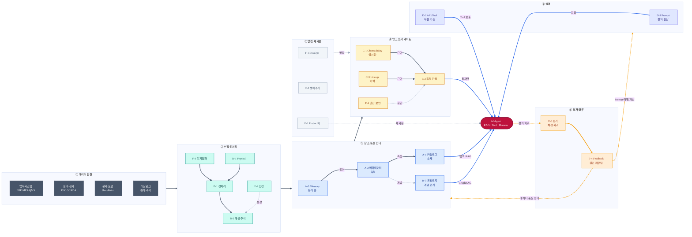
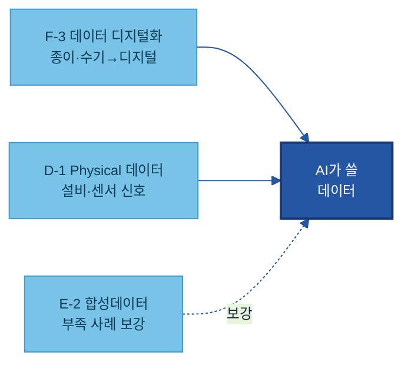
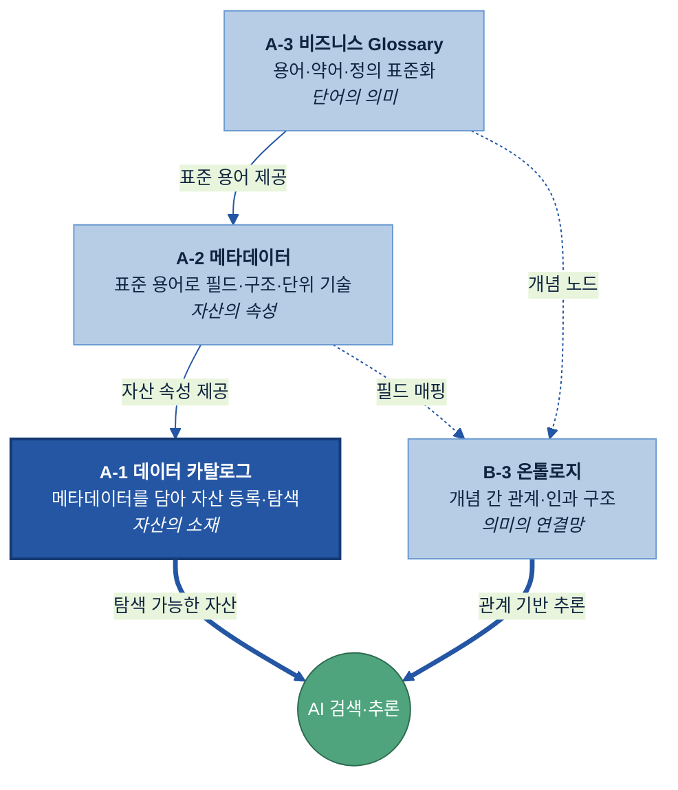
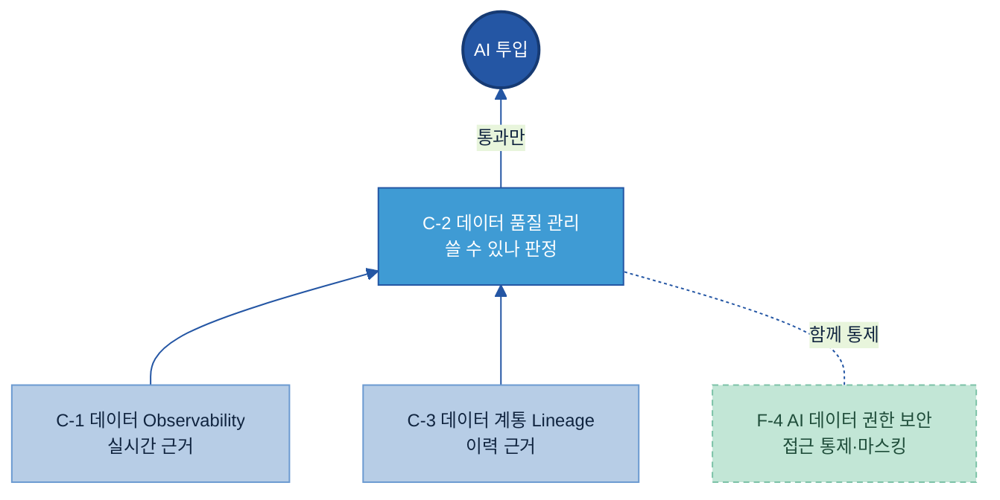
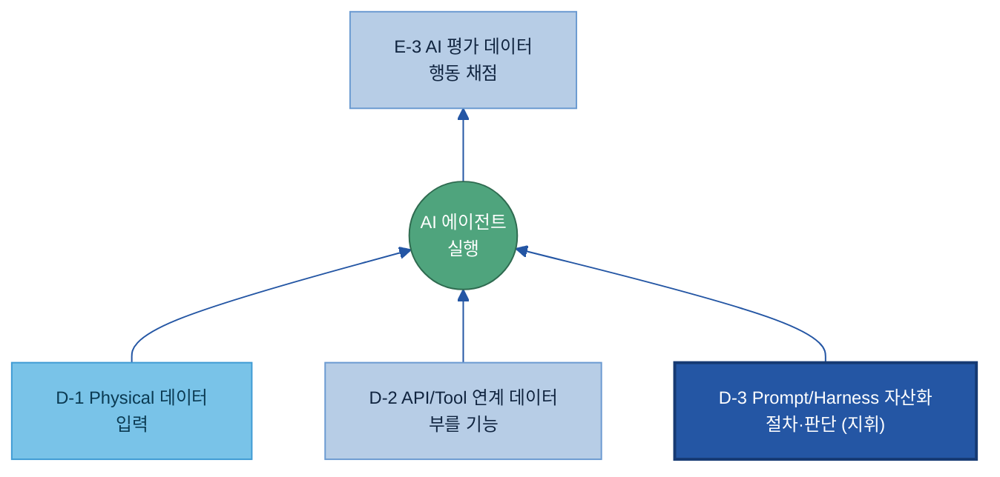
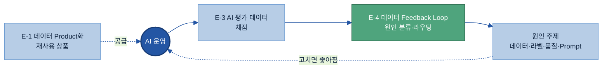
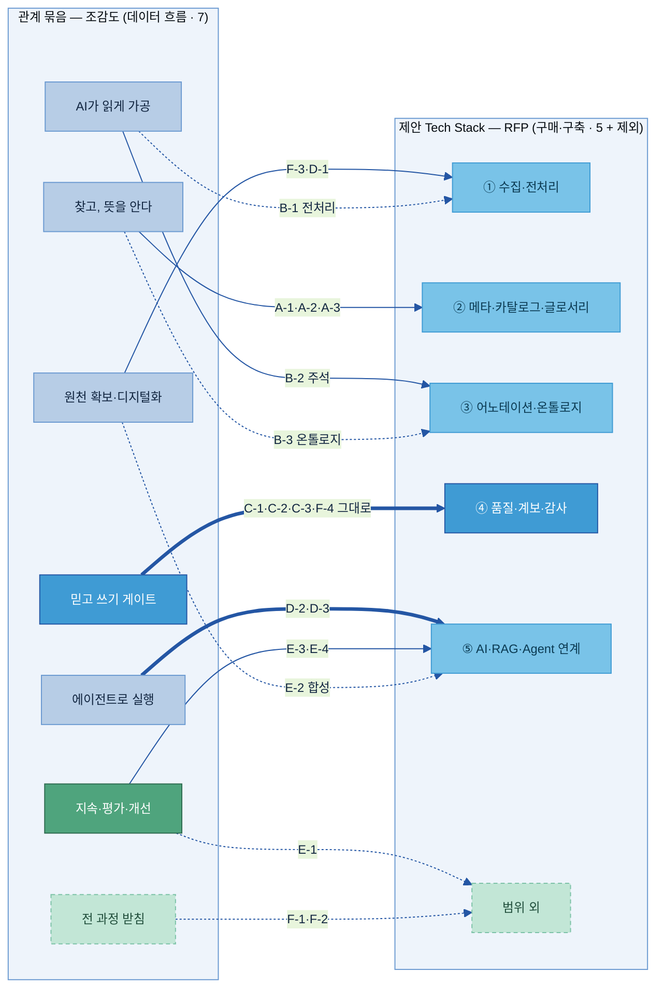

# AI-Ready Data 매뉴얼 — 전체 목차 (20개 주제)

> 목적: 20개 주제별 가이드(`가이드 작성/A-1 데이터 카탈로그/A-1 데이터 카탈로그.md` 형식)를 작성하기 전에, **모든 주제의 목차를 한 곳에서 검토·확정**하기 위한 문서입니다.
> 기준: `공통 규칙/최종 주제.md`의 주제 정의·Key Question + 참고 가이드(`파트너님 예시/data_catalog_manual.md`)의 12-섹션 구조.
> 폴더 구조: `공통 규칙/`(작성 표준·최종 주제) · `전체 목차/`(본 파일·`목차 검증/` 상세목차) · `가이드 작성/<주제>/`(실제 가이드) · `기존 매뉴얼 작성본/`(Kearney PPTX·목차 분석) · `파트너님 예시/`(참고 예시).
> 사용법: 12-섹션 고정 골격은 폐기하고, 주제마다 무게에 맞춰 섹션을 가감한 **현업판 논리 흐름**(왜→무엇→언제→예시→어떻게→관계)으로 정리했습니다. (개요 섹션은 두지 않고 정의·체계 내 위치를 What 첫 소절로 흡수)
> ★ **이 파일이 20개 주제 목차의 단일 정본(single source of truth)입니다** — 조감도 다이어그램 + 주제별 세부 H3 목차 + 확정사항을 모두 담습니다. 목차를 보거나 고칠 땐 이 파일만 봅니다. (`목차 검증/` 폴더는 **동결 아카이브**일 뿐 정본이 아닙니다 — 이름이 비슷했던 옛 스냅샷은 `[동결] 00 …v2.md`로 표시해 헷갈리지 않게 했습니다.)

---

## 전체 조감도 — 20개 주제의 연관 관계

20개 주제는 서로 **먹여주고(feeds)·받치고(supports)·되돌리는(loops back)** 관계로 엮인다. 아래는 **관계로 묶되, 각 주제에 공식 이름과 코드(A-1·A-2…)를 함께** 달았다 — 코드는 6대 원칙에서 온 이름표일 뿐, 묶음은 알파벳 순서가 아니라 하는 일(관계)로 짠다. 순서 — 전체 흐름 한 장 → 각 주제 역할 → 묶음별로 뜯어보기 → 가로지르는 관계 → 어디부터 읽나 → (참고) 코드 → 제안 Tech Stack 5개 영역과의 정렬.

### 1. 전체 흐름 한 장 — 데이터 원천에서 AI Agent까지, 그리고 환류

이 한 장이 **데이터 흐름 · AI 실행 · 평가/피드백 환류**를 한눈에 담는다(16:9). **왼쪽 데이터 원천**에서 오른쪽으로 흐르며 수집·전처리 → 찾기·의미 → 믿고 쓰기 게이트를 거쳐 맨 오른쪽 **AI Agent**에 닿고, AI가 낸 결과는 **평가(E-3)·피드백(E-4)**을 거쳐 다시 왼쪽 원인 주제로 **환류**한다. **묶음 안에서도 화살표로 관계를 그렸다** — 단순 나열이 아니라(③ 글로서리→메타→카탈로그로 의미가 쌓임, ④ 관측·계통 근거 → 품질 판정). 선 색 = 흐름 종류(회색=수집·파랑=AI 활용·주황 점선=평가/피드백·회색 점선=받침).



> **읽는 법:** **왼쪽→오른쪽이 데이터 흐름** — 원천 → 수집·전처리 → 찾기·의미 → 믿고 쓰기 게이트 → 실행 → 오른쪽 **AI Agent**. **묶음 안 화살표가 내부 관계**다 — ② 디지털화·Physical→전처리→주석, ③ Glossary→메타데이터→카탈로그(+온톨로지), ④ Observability·Lineage→품질 판정. **파랑**=AI 활용(RAG·GraphRAG·Prompt·Tool), **주황 점선**=평가·피드백 환류(AI→E-3→E-4→데이터·품질·Prompt·라벨), **회색 점선**=받침(⑦ F-1·F-2·E-1). 묶음은 알파벳이 아니라 하는 일로 나눴다.

### 2. 각 주제의 역할 한눈에

비슷한 일을 하는 것끼리 **하는 일로** 묶었다 — 알파벳 순서가 아니다. 주제명 앞에 공식 코드를 달았으니, 개별 가이드로 바로 연결된다.

| 주제 (코드 · 공식명) | 역할 (한 줄) | 한 줄 정의 |
|---|---|---|
| **원천 확보·디지털화** — 데이터가 있게 만든다 | | |
| F-3 데이터 디지털화 | 종이·수기·암묵지를 **디지털로 전환** | 아날로그 자산을 AI가 쓸 디지털 자산으로 |
| D-1 Physical 데이터 | 현장 설비·센서 **신호를 AI 입력**으로 연결 | 물리세계 데이터를 AI 입력으로 연결 |
| E-2 합성데이터 | **부족한 사례**를 인공으로 채움 | 실데이터 부족·제한 시 인공 생성 |
| **찾고, 뜻을 안다** — 소재·속성·의미 | | |
| A-1 데이터 카탈로그 | 데이터가 **어디** 있는지 찾게 하는 주소록 | 자산의 존재·위치·오너·접근경로 목록 |
| A-2 메타데이터 | 그 데이터가 **무엇**인지 설명하는 설명서 | 구조·단위·생성기준 등 기술·운영 속성 |
| A-3 비즈니스 Glossary | 용어의 **뜻**을 하나로 통일하는 사전 | 용어·약어·동의어를 표준 정의로 통일 |
| B-3 온톨로지 | 개념 사이의 **관계**를 잇는 지식 지도 | 개념과 그 관계를 정리한 지식 지도 |
| **AI가 읽게 가공한다** — 형태 변환·의미 부여 | | |
| B-1 데이터 전처리 | 문서·표·이미지를 AI가 **읽을 형태**로 변환 | 비정형/반정형을 구조화 형태로 변환 |
| B-2 데이터 해설·주석 | 학습용으로 데이터에 **의미(라벨)** 부여 | 라벨·분류·해석 기준을 붙이는 체계 |
| **믿고 쓸 수 있는지 가린다** — 게이트 | | |
| C-2 데이터 품질 관리 | "**쓸 수 있는가**"를 판정하는 관문 | AI 활용 기준 충족 여부를 판정하는 통제 |
| C-1 데이터 Observability | 운영 중 이상을 **실시간 감지·알림** | 흐름의 지연·누락·이상을 감지하는 모니터링 |
| C-3 데이터 계통 Lineage | 출처→근거까지 경로를 **사후 추적** | 출처·이동·변환·활용 이력 기록 |
| F-4 AI 데이터 권한 보안 | **누가 볼 수 있는지** 통제 + 민감정보 가림 | 접근 통제 + 민감정보 탐지·마스킹 |
| **에이전트로 실행한다** — 도구·절차 | | |
| D-2 API/Tool 연계 데이터 | 에이전트가 부를 **기능의 설명서·규격** | Tool의 기능·입출력·제약을 정의한 명세 |
| D-3 Prompt/Harness 자산화 | 업무 절차·판단을 **재사용 Prompt 자산**으로 | 사람의 절차·판단을 AI 실행용으로 구조화 |
| **지속·평가·개선한다** — 재사용·채점·환류 | | |
| E-1 데이터 Product화 | 데이터를 **책임자 있는 재사용 상품**으로 | 반복 재사용 단위로 정의·운영 |
| E-3 AI 평가 데이터 | AI 답을 **채점**할 정답셋·기준 | 성능을 객관 판단할 정답셋·평가 기준 |
| E-4 데이터 Feedback Loop | 운영 결과를 **원인 주제로 되돌리는 허브** | 결과·오류를 개선으로 환류하는 고리 |
| **전 과정을 받친다** — 운영·수명 | | |
| F-1 데이터 운영관리(DataOps) | 데이터 흐르는 길을 **안 멈추게** 운영 | 파이프라인 실행·복구·변경 관리 |
| F-2 데이터 생애주기 관리 | **얼마나 두고 언제 버리나**의 시간축 | 생성→폐기 시간축을 정책으로 통제 |

### 3. 묶음별로 뜯어보기 — 엮이는 것끼리 그림으로

전체 흐름을 묶음별로 확대한다. 각 묶음 안에서 주제들이 어떻게 엮이는지 본다.

#### 3-1. 원천 확보·디지털화 — 데이터를 '있게' 만든다

세 주제는 **서로 다른 경로**로 데이터를 확보한다 — 종이·수기는 디지털화로, 현장은 Physical로, 부족한 사례는 합성으로. 셋 다 위 단계(찾기·가공)가 쓸 데이터를 만든다.



#### 3-2. 찾고, 뜻을 안다 — 의미가 쌓이는 축

단어(Glossary) → 필드(메타데이터) → 자산(카탈로그)으로 **의미가 쌓이고**, 그 위에 온톨로지가 개념 관계를 얹는다. 카탈로그(탐색 가능한 자산)와 온톨로지(관계 기반 추론)가 AI의 두 입구다.



카탈로그(A-1)가 20개 중 첫 주제이자 출발점이다. 카탈로그만 먼저 읽는 독자라면 인접 세 주제는 다음 한 줄로 충분하다 — **메타데이터(A-2)**는 "각 데이터가 무엇인지 설명하는 설명서", **비즈니스 Glossary(A-3)**는 "용어의 뜻을 하나로 통일한 사전", **온톨로지(B-3)**는 "개념 사이의 관계를 잇는 지식 지도"다. 넷의 관계는 역할 분담이다. 카탈로그가 "**어디 있나**"(소재)를 답하고, 그 항목이 "**무슨 속성인가**"는 메타데이터가, "**무슨 뜻인가**"는 글로서리가, "**무엇과 어떻게 엮이나**"는 온톨로지가 받친다. 상세 정의·구축은 각 주제 가이드에서 다룬다.

#### 3-3. AI가 읽게 가공 — 형태 다음 의미

전처리가 문서·표·이미지를 **읽을 수 있는 형태**로 바꾸고, 그다음 해설·주석이 **뜻(라벨)**을 더한다. 형태가 먼저, 의미가 그다음이다.


#### 3-4. 믿고 쓰기 — 품질 게이트

품질 관리(C-2)가 "쓸 수 있나"를 **판정**하고, Observability(C-1, 실시간)·Lineage(C-3, 이력)가 **근거**를 댄다. 권한·보안(F-4)은 같은 관문에서 접근을 함께 통제한다. **통과한 데이터만** AI로 올라간다.



#### 3-5. 에이전트로 실행 — 지휘는 절차, 도구는 기능

Prompt·Harness(D-3, 절차·판단)가 **위에서 지휘**하고, API/Tool 명세(D-2, 부를 기능)가 도구를, Physical 데이터(D-1)가 입력을 댄다. 에이전트가 한 행동은 AI 평가(E-3)가 채점한다.



#### 3-6. 지속·평가·개선 — 환류 고리

AI 운영 결과를 평가(E-3)가 **채점**하면, Feedback Loop(E-4)가 원인을 가려 **원래 주제로 되돌린다**(닫힌 고리). Product화(E-1)는 검증된 데이터를 재사용 상품으로 공급해 다시 AI를 먹인다.



### 4. 묶음을 가로지르는 관계

위 묶음은 데이터가 흐르는 단계로 나눈 것이다. 한 묶음에 갇히지 않고 **여러 묶음을 가로지르는** 관계도 있다.

- **재사용 자산** — 데이터 카탈로그(A-1, 소재)·데이터 품질 관리(C-2, 품질)·생애주기 관리(F-2, 수명)를 묶어, 데이터 Product화(E-1)가 "책임자 있는 재사용 상품"으로 공급한다. 서로 다른 세 묶음에서 하나씩 모인다.
- **환류 고리** — 결과를 원인 주제로 되돌리는 닫힌 고리(위 3-6에서 그림으로 다룸: E-3 → E-4 → 원인 주제).

> 관계가 단계 묶음(나아가 알파벳 코드)을 넘나든다는 게 핵심이다 — 그래서 코드는 칸막이가 아니라 이름표일 뿐이다.

### 5. 어디부터 어떻게 읽나 — 읽는 순서

전체를 처음부터 끝까지 다 읽기보다, **지금 우리 조직이 막힌 지점**부터 읽는 것을 권한다. 큰 흐름은 위 그림 그대로다 — 원천 확보 → 찾기·의미 → AI가 읽게 → 믿고 쓰기 → 실행 → 지속, 그 아래 운영·수명이 전 구간을 받친다.

기본 읽는 순서 (처음 시작이라면):
1. **A-1 데이터 카탈로그 → A-2 메타데이터 → A-3 비즈니스 Glossary** (필요 시 **B-3 온톨로지**) — 데이터를 찾고 해석하는 토대. 여기서 시작한다.
2. **B-1 데이터 전처리 → B-2 데이터 해설·주석** — AI가 읽고 의미를 이해하게. (대량 종이·수기 자료가 먼저면 **F-3 데이터 디지털화**부터)
3. **C-2 데이터 품질 관리 → C-1 Observability · C-3 Lineage** (접근은 **F-4 권한·보안**) — 믿고 쓰게 하는 게이트.
4. **D-2 API/Tool 연계 데이터 → D-3 Prompt/Harness 자산화** — 에이전트로 실행하게. (현장 신호는 **D-1 Physical 데이터**)
5. **E-1 데이터 Product화 → E-3 AI 평가 데이터 → E-4 Feedback Loop** (사례 부족하면 **E-2 합성데이터**) — 재사용·평가·환류로 지속 개선.
6. **F-1 데이터 운영관리 · F-2 데이터 생애주기 관리** — 운영·수명으로 전 구간을 받침.

꼭 갖출 것과 골라서 할 것을 먼저 가른다.

> **기본형 (대부분 다 필요):** A-1·A-2·A-3 · B-1·B-2 · C-1·C-2·C-3 · D-1 · E-4 · F-1·F-2·F-4 — "어디부터 정비하나(우선순위)"의 문제다.
> **선택형 (조건이 맞을 때만):** B-3 온톨로지 · D-2·D-3 · E-1·E-2·E-3 · F-3 — "지금 우리에게 필요한가(적용 판단)"를 먼저 따진다. 각 가이드의 Why 절이 그 판단 기준을 준다.

지금 겪는 문제로 찾아가기:

| 지금 겪는 문제 | 먼저 볼 주제 |
|---|---|
| 데이터가 어디 있는지 몰라 헤맨다 | A-1 카탈로그 → A-2 메타데이터 → A-3 Glossary |
| 보고서·도면·이미지를 AI가 못 읽는다 | B-1 전처리 (대량 종이·수기면 F-3 디지털화 먼저) |
| 같은 용어를 부서·계열사마다 다르게 쓴다 | A-3 Glossary (개념 관계까지면 B-3 온톨로지) |
| AI 답이 자꾸 틀리거나 못 믿겠다 | C-2 품질 → C-1·C-3 (라벨 문제면 B-2 주석) |
| 에이전트가 시스템을 부르게 하려 한다 | D-2 API/Tool → D-3 Prompt/Harness |
| 같은 오류가 반복되는데 어디를 고칠지 모른다 | E-4 Feedback Loop (채점 기준은 E-3 평가) |
| 학습할 사례가 너무 적다 | E-2 합성데이터 |
| 민감정보 때문에 데이터를 AI에 못 쓴다 | F-4 권한·보안 |

> **표준 컬러 스키마**: 핵심=진파랑 `#2456A4` · 일반 노드=연파랑 `#B7CDE6` · 원천=하늘 `#79C3E8` · 게이트=밝은파랑 `#3F9BD4` · 환류/긍정=초록 `#4FA47D` · 기반=옅은초록 `#C2E6D6`(점선). 모든 주제 다이어그램은 이 테마를 따른다.

### 6. (참고) 주제 코드와 6대 원칙

각 주제 코드의 알파벳은 6대 원칙에서 왔다 — **A 찾을 수 있게 · B 이해할 수 있게 · C 신뢰할 수 있게 · D 실행할 수 있게 · E 지속할 수 있게 · F 거버넌스**. 아래 표를 보면 한 관계 묶음 안에 **여러 원칙의 코드가 섞인다**(예: '믿고 쓰기 게이트'에 C-1·C-2·C-3와 F-4가 함께). 관계로 묶으면 알파벳 순서와 달라지기 때문이다 — 코드는 분류·탐색용 이름표일 뿐, 관계의 칸막이가 아니다.

| 관계 묶음 | 주제 | 코드 |
|---|---|---|
| **원천 확보·디지털화** | 데이터 디지털화 | F-3 |
|  | Physical 데이터 | D-1 |
|  | 합성데이터 | E-2 |
| **찾고, 뜻을 안다** | 데이터 카탈로그 | A-1 |
|  | 메타데이터 | A-2 |
|  | 비즈니스 Glossary | A-3 |
|  | 온톨로지 | B-3 |
| **AI가 읽게 가공** | 데이터 전처리 | B-1 |
|  | 데이터 해설·주석 | B-2 |
| **믿고 쓰기 (게이트)** | 데이터 품질 관리 | C-2 |
|  | 데이터 Observability | C-1 |
|  | 데이터 계통 Lineage | C-3 |
|  | AI 데이터 권한 보안 | F-4 |
| **에이전트로 실행** | API/Tool 연계 데이터 | D-2 |
|  | Prompt/Harness 자산화 | D-3 |
| **지속·평가·개선** | 데이터 Product화 | E-1 |
|  | AI 평가 데이터 | E-3 |
|  | 데이터 Feedback Loop | E-4 |
| **받침 (운영·수명)** | 데이터 운영관리(DataOps) | F-1 |
|  | 데이터 생애주기 관리 | F-2 |

> 아래 본문(§A~§F)은 이 코드 순서로 배열돼 있다. 관계로 읽을 땐 위 묶음으로, 개별 주제를 찾을 땐 코드로 — 두 길이 같은 20개 주제를 가리킨다.

### 7. 제안 Tech Stack 5개 영역과 어떻게 맞물리나

위 일곱 관계 묶음은 **데이터 흐름**(무엇이 무엇을 먹이나)으로 짠 것이고, [02 제안 Tech Stack](02%20제안%20Tech%20Stack%20(RFP%205개%20영역).md)의 **RFP 5개 영역**은 **솔루션 구매·구축 단위**(어떤 도구를 함께 사나)로 17개 주제를 묶은 것이다. 관점이 다르지만 대체로 정렬되며, 특히 **신뢰 게이트는 완전히 일치**한다. 갈리는 지점은 네 군데다.



> **읽는 법:** 굵은 화살표 = 묶음이 통째로 한 영역과 맞는 곳(믿고 쓰기 = ④ 완전 일치, 실행 = ⑤). 점선 = 관계로는 한 묶음이지만 RFP에선 다른 영역으로 가는 주제(갈림), 또는 RFP 범위 밖(제외).

| 관계 묶음 (조감도) | 주제 | 02 제안 Tech Stack 영역 | 정렬 |
|---|---|---|---|
| 원천 확보·디지털화 | F-3 디지털화 · D-1 Physical | ① 수집·전처리 | 일치 |
|  | E-2 합성데이터 | ⑤ AI·RAG·Agent | 갈림 |
| 찾고, 뜻을 안다 | A-1 카탈로그 · A-2 메타데이터 · A-3 Glossary | ② 메타·카탈로그·글로서리 | 일치 |
|  | B-3 온톨로지 | ③ 어노테이션·온톨로지 | 갈림 |
| AI가 읽게 가공 | B-2 데이터 해설·주석 | ③ 어노테이션·온톨로지 | 일치 |
|  | B-1 데이터 전처리 | ① 수집·전처리 | 갈림 |
| 믿고 쓰기 게이트 | C-1 · C-2 · C-3 · F-4 | ④ 품질·계보·감사 | 완전 일치 |
| 에이전트로 실행 | D-2 API/Tool · D-3 Prompt/Harness | ⑤ AI·RAG·Agent | 일치 |
| 지속·평가·개선 | E-3 평가 · E-4 Feedback | ⑤ AI·RAG·Agent | 일치 |
|  | E-1 데이터 Product화 | 범위 외 | 제외 |
| 전 과정 받침 | F-1 운영관리 · F-2 생애주기 | 범위 외 | 제외 |

정렬 결과:
- **완전 일치 — 믿고 쓰기 게이트 = RFP ④ 품질·계보·감사**: C-1·C-2·C-3·F-4가 그대로 같은 묶음이다. 두 관점이 정확히 겹친다.
- **거의 일치 — 찾기·의미 ≈ RFP ②**: A-1·A-2·A-3는 그대로 ②로 가고(온톨로지 B-3만 RFP에선 ③으로). 에이전트 실행(D-2·D-3)도 RFP ⑤에 그대로 든다.
- **갈리는 네 군데 (관점 차이)**:
  1. **전처리(B-1)** — 조감도는 'AI가 읽게 가공'(이해), RFP는 '수집·전처리'(①). 전처리를 "데이터를 들여오는 일"로 보면 ①, "AI가 읽게 만드는 일"로 보면 가공이다.
  2. **온톨로지(B-3)** — 조감도는 '찾기·의미'(개념까지 의미를 쌓음), RFP는 '어노테이션·온톨로지'(③, 라벨링과 같은 그래프 도구군으로).
  3. **합성데이터(E-2)** — 조감도는 '원천 확보'(없는 데이터를 만들어 들임), RFP는 'AI·RAG·Agent 연계'(⑤, 학습용 생성으로).
  4. **범위** — 조감도는 20개 전부(받침 F-1·F-2, 지속의 E-1 포함), RFP 5개 영역은 17개만(E-1·F-1·F-2는 범위 외 — 구현 시 [01 Tech Stack 비교](01%20Tech%20Stack%20비교%20(솔루션×주제).md) 참조).
- **왜 갈리나**: 조감도는 데이터가 흐르며 서로 먹이는 **관계**로 묶고, RFP 5개 영역은 **같이 사는 솔루션 단위**로 묶는다. 둘 다 유효하다 — 체계를 이해할 땐 관계(조감도)로, 솔루션을 조달·구축할 땐 RFP 영역으로 본다.

---

## 0. 목차 표준 (모든 주제 공통 원칙)

> 과거의 "12-섹션 고정 골격"은 폐기했습니다. 12개 섹션은 **참고용 풀**일 뿐, 주제마다 섹션을 더하고·빼고·합쳐 **주제 무게에 따라 섹션 수를 달리** 합니다(고정 금지). 합격 기준은 "12개를 다 채웠는가"가 아니라 **"`공통 규칙/최종 주제.md`의 Key Question에 전부 답했고 원칙을 지켰는가"**입니다. (상세 표준: `공통 규칙/01 가이드 작성 표준.md`)

**논리 흐름 (기본 순서):**
왜(Why) → 무엇(What — 정의·체계 내 위치를 첫 소절로 흡수) → 언제/어디에(When) → **예시 시나리오(How 앞)** → 솔루션(Tech Stack) → 어떻게(How — 구축+운영) → 다른 주제와의 관계(Where) → *(성과 지표(KPI)는 신뢰성 주제 C-1·C-2·C-3에 한해 마지막에 둠)*  ※ 개요 섹션은 두지 않는다.

**어떤 구성에서도 유지하는 것:**
- **4축**: 왜(Why·Pain Point) · 무엇(What·정의/구성) · 언제·어디(When·대상 선정) · 어떻게(How·구축/운영)
- **담당자 역할**(오너·현업·IT·보안·AI 조직)을 구축/운영 섹션 안에 포함
- **이해장치**: 섹션마다 한 줄 요약 + 어려운 용어 즉시 풀이 + 제조 현업 예시
- **현업 눈높이**: 핵심만, 어려운 약어는 풀거나 생략
- **★ 데이터 준비 관점**: "AI를 만드는 법"이 아니라 "그 AI가 쓸 **데이터를 준비·정비하는 법**"

**When 처리:** 골라서 하는 주제(온톨로지·합성데이터·평가데이터)는 "언제/무엇을 하나(적용 판단)", 기본 다 필요한 주제(카탈로그·메타데이터)는 "어디부터(우선순위)".

**섹션 제목 표기(B-3 온톨로지 기준):** 핵심 축에 매핑되는 섹션만 영문 선두 표기를 붙인다 — `Why`(왜 필요한가) · `What`(무엇을 갖추나) · `When`(어디부터/언제 — 대상·우선순위) · `How`(어떻게 준비·운영하나, 구축+운영 묶음) · `Where`(다른 주제와의 관계). 솔루션 섹션은 `Tech Stack — 솔루션 검토`("도구"라는 말 대신 "솔루션"으로 통일), 성과 지표(C군)는 `KPI`로 표기한다. **개요 섹션은 두지 않는다** — 정의·체계 내 위치는 What 첫 소절(`[주제]란 + 체계 내 위치`)로 흡수하고, 한 줄 정의는 제목 아래 `> 정의:` 줄이 담당한다(뒤 What·Where와 중복 제거). **선택형 주제**(B-3·D-2·D-3·E-1·E-3·F-3)는 Why와 When을 한 섹션으로 통합해 맨 앞에 두고("Why — 왜, 언제 필요한가 (적용 판단)") What을 뒤에 둔다. **예시 시나리오는 의무가 아니다** — before/after가 개념을 또렷이 보여주는 주제만 남기고, Pain Point·How와 겹쳐 군더더기가 되는 주제(예: F-1 DataOps·F-2 생애주기)는 둘 필요 없다. **이 목차의 주제별 세부 블록은 실제 작성된 14개 가이드(A-1~E-2)의 H2/H3 구조를 그대로 반영한다(2026-06-24 동기화).** 따라서 위 '개요 제거·영문 축·KPI 제거' 등은 권장 기본형일 뿐, **실제 가이드가 다르면 가이드를 따른다** — 예: A-1·A-2·A-3은 아직 옛 형식(`개요` 섹션 · `왜 필요한가(Why)` 한글 제목 · `성과 지표·고도화 로드맵` 섹션)을 유지하므로 목차도 그대로 둔다(신형식으로 개정할지는 별도 결정). 아직 미작성인 6개(E-3·E-4·F-1·F-2·F-3·F-4)만 계획 목차이며, 작성 시 실제 구조로 재동기화한다.

> **주제별 섹션 수(2026-06-24 실제 가이드 기준, 별첨 제외):** A-1 **10** · A-2 **9** · A-3 **9** · B-1 **6** · B-2 **7** · B-3 **6** · C-1 **8** · C-2 **9** · C-3 **8** · D-1 **7** · D-2 **6** · D-3 **6** · E-1 **6** · E-2 **6** *(이상 14개 작성 완료)* / E-3·E-4·F-1·F-2·F-3·F-4 *(미작성 — 계획 목차)*.  *KPI(성과 지표) 섹션은 C-1·C-2·C-3에만 있다. A-1·A-2·A-3은 아직 옛 형식이라 `개요` 섹션을 두고 마지막을 `성과 지표·고도화 로드맵`으로 두며, 그 외 작성 주제(B·D·E군)는 `다른 주제와의 관계`가 마지막 섹션이다.*
> **솔루션은 독립 "솔루션(·도구 검토)" 섹션**을 기본으로 둔다(예시 다음·구축 앞) — 독자가 "솔루션 뭘 쓰나"를 항상 같은 자리에서 찾게. **단 통합 플랫폼 하나가 여러 주제를 함께 커버하는 통합형 주제(메타데이터 A-2·전처리 B-1·해설/주석 B-2 등)는 솔루션을 독립 섹션 대신 How·아키텍처·별첨에 흡수할 수 있다**(A-1 카탈로그와 같은 플랫폼이라 독립 섹션이 그대로 중복되는 경우). 솔루션 자체를 묶어 비교·선정하는 일은 2층 정본 [01 Tech Stack 비교](../Tech%20Player/01%20Tech%20Stack%20비교%20(솔루션×주제).md)가 전담. 무게 차등은 섹션 수가 아니라 H3 깊이로 표현.
> **"다른 주제와의 관계"는 항상 독립 섹션**으로 둔다(경계만 다룸). **성과 지표(KPI)는 신뢰성(C-1·C-2·C-3) 주제에서만 마지막 섹션으로 둔다** — 인용된 합격 기준(데이터 품질·출처·변경 이력·계보로 AI 신뢰성 저하·Hallucination 방지)이 KPI를 요구하는 범위가 C군이기 때문. 나머지 17개 주제는 성과 지표 섹션을 두지 않아 "다른 주제와의 관계"가 마지막이 된다.
> **고도화 로드맵·미래 AI 자동화 전망은 (2026-06 결정) 20개 주제 전부에서 일단 제거**했다. 추후 다시 둘 경우의 작성 기준(달력 gantt 금지 / ① 성숙도 단계 Lv0 없음→Lv1 수기 표준화→Lv2 도구·AI 보조→Lv3 자율 + ② 미래 AI 자동화 전망)은 CLAUDE.md·02 다이어그램 표준 §5-4 참조.
> (본 파일이 **단일 정본** — 조감도 + 세부 H3 목차를 함께 담음. `목차 검증/05 …v2.md`는 과거 상세본으로 아카이브 동결되어 더는 갱신하지 않음.)

---

# A · 찾을 수 있게 (Findable)

## A-1 데이터 카탈로그
> 파일명: `가이드 작성/A-1 데이터 카탈로그/A-1 데이터 카탈로그.md`
> 정의: AI와 사용자가 데이터 자산의 존재·위치·오너·접근 경로를 찾도록 등록하는 자산 목록 체계.

```
1. 개요
   1.1 데이터 카탈로그란 (자산의 주소록 — 소재·오너·접근경로)
   1.2 목적과 적용 범위 (무엇을 다루고/안 다루는가)
   1.3 대상 조직과 AI-ready 체계 내 위치
2. 왜 필요한가 (Why)
   2.1 현업 Pain Point (데이터가 어디 있는지 몰라 사람마다 찾아 헤매고, AI도 못 찾음)
   2.2 기대 효과 (찾는 시간↓·중복 수집↓·AI가 필요한 데이터에 바로 도달)
3. 무엇을 갖추나 (What — 등록 항목·구성)
   3.1 카탈로그 조회 방식 (검색·탐색 화면 구성)
   3.2 항목 구성 기준 (찾기 위한 최소 정보 — 5갈래)
   3.3 기본 등록 항목 (데이터명·시스템·위치·오너·접근경로·갱신주기)
   3.4 데이터 분류 기준 (업무 도메인·데이터 유형·보유 조직)
   3.5 AI 활용 식별 항목 (전처리 여부·원천 추적·AI 활용 목적)
   3.6 태그 표준값 목록 (자유입력 금지 — 고르는 값)
4. 어디부터 등록하나 (When/우선순위)   ← 기본형(다 필요)
   4.1 등록 대상 범위
   4.2 유형별 등록/제외
   4.3 정형 데이터 중요도 선별
   4.4 수집·등록 방식 (자동 vs 수동)
   4.5 보안 검토 (내부 학습 vs 외부 LLM 노출)
   4.6 최종 우선순위 — 사람이 다 찾아 등록하지 않는다 (자동 수집 우선)
5. 예시 시나리오 — 두산전자 적용 흐름
   5.1 적용 전/후 대비
   5.2 흐름 미리보기 (원천 자동 수집 → 오너 채우기 → 분류 → AI·현업 탐색)
6. 솔루션 선정
   6.1 솔루션 유형·적용 범위 (전용 카탈로그·메타 통합형·오픈소스)
   6.2 후보 검토·기능 비교 (자동 수집 커버리지·연동·검색·권한)
   6.3 평가·선정·PoC 기준
7. 구축
   7.1 수집한 메타데이터 검토·정합성 보완
   7.2 To-Be 아키텍처 (솔루션 기반)
   7.3 Legacy 연동·미연동/수동 업로드 Pipeline
   7.4 초기 적재·검증
   7.5 담당자 역할 (오너·현업·IT·보안·AI 조직 RACI)
   7.6 잘 쓴 등록 vs 못 쓴 등록 (Before → After)
   7.7 실제로 어디서 채우나 — 플랫폼 매핑
8. 운영
   8.1 변경 관리 (요청 → 검토·승인 → 반영)
   8.2 등록·검색·조회 운영
   8.3 전처리·분석·질의(RAG) 서비스 연계
   8.4 접근 권한·보안/운영 역할별 기능
   8.5 최신화 (주기 갱신 vs 변경시점 자동 갱신·미등록 정기 점검)
9. 다른 주제와의 관계
   9.1 인접 주제와의 역할 분담 (메타데이터=A-2 속성 / Glossary=A-3 용어 / Lineage=C-3 흐름 / 생애주기=F-2 / Product화=E-1)
   9.2 전체 조감도 (경계 시각화)
10. 성과 지표·고도화 로드맵
   10.1 성과 지표 (KPI)
   10.2 고도화 로드맵 — 우리 수준과 다음 한 걸음 (성숙도 단계)
   10.3 미래 AI 자동화 전망 — 어디는 AI가, 어디는 사람이
별첨) A 등록 항목 사전(전체) · B 빈 등록 템플릿
```

## A-2 메타데이터
> 파일명: `가이드 작성/A-2 메타데이터/A-2 메타데이터.md`
> 정의: 데이터 자산의 구조·형식·단위·생성기준·갱신주기 등 기술·운영 속성을 설명하는 관리 정보.

```
1. 개요
   1.1 메타데이터란 (데이터의 설명서)
   1.2 적용 범위와 체계 내 위치 (자산의 "속성")
   1.3 주요 대상 조직
2. 왜 필요한가 (Why)
   2.1 현업 Pain Point (항목 이름·단위만으론 뜻을 몰라 AI가 잘못 해석)
   2.2 기대 효과 (재사용이 쉬워지고 오해석이 줄어듦)
3. 무엇을 갖추나 (What — 세 종류·다섯 계층)
   3.1 세 종류의 메타데이터 (기술 · 비즈 · 운영)
   3.2 다섯 계층 (어디에 붙나)
   3.3 항목 사전 — 대표 항목 (현업 실행 키트 ㉠)
   3.4 필드 설명서 — 이름만으론 모르는 데이터 풀이
   3.5 단위·기준일·집계 기준
   3.6 메타데이터 스키마(메타-메타데이터)와 버전 관리
4. 데이터 유형별 메타데이터 차이
   4.1 유형을 가르는 3가지 기준 (구조 · 내용 · 시간)
   4.2 유형별 챙길 메타데이터 (정형·시계열·문서·이미지/도면·영상/음성)
5. 어디부터 하나 (정비 우선순위)   ← 기본형(다 필요)
   5.1 정비 우선 대상
   5.2 자동으로 모으고, 사람은 검수만
6. 예시 시나리오 — 두산전자 적용 흐름
   6.1 적용 전 / 후
   6.2 흐름 미리보기
7. 어떻게 준비·운영하나 (How)
   7.1 수집·관리 도구 검토
   7.2 구축 절차
   7.3 비즈 메타 작성 — 잘 쓴 예 vs 못 쓴 예 (현업 실행 키트 ㉡)
   7.4 실제로 어디서 채우나 — 플랫폼 매핑 (현업 실행 키트 ㉤)
   7.5 정합성 자동 점검
   7.6 운영 — 갱신·승인과 역할
8. 다른 주제와의 관계 (카탈로그=소재 / Glossary=용어 / 온톨로지=개념 / 품질)
9. 성과 지표·고도화 로드맵
   9.1 성과 지표 (KPI)
   9.2 고도화 로드맵 — 우리 수준과 다음 한 걸음 (성숙도 단계)
   9.3 미래 AI 자동화 전망 — 어디는 AI가, 어디는 사람이
별첨) A 기술 메타데이터 항목 사전 · B 비즈 메타 작성 양식·도출 프레임워크 · C 표준 태그 값 목록 · D 계층별 메타데이터 예시
```

## A-3 비즈니스 Glossary
> 파일명: `가이드 작성/A-3 비즈니스 Glossary/A-3 비즈니스 Glossary.md`
> 정의: 업무 용어·약어·동의어를 표준 정의로 통일해 데이터 해석 일관성을 확보하는 용어 사전.

```
1. 개요
   1.1 비즈니스 Glossary란
   1.2 적용 범위와 체계 내 위치 (용어의 "뜻")
   1.3 주요 대상 조직
2. 왜 필요한가 (Why)
   2.1 현업 Pain Point (같은 결함을 현장마다 다르게 불러 AI 검색·집계가 따로 놂 — 특히 글로벌 현장)
   2.2 기대 효과 (현장 용어로 물어도 표준 용어로 변환돼 한 번에 검색·해석 일관)
3. 무엇을 갖추나 (What — 용어 카드·동의어·유형)
   3.1 표준 용어 카드 — 표준 정의 항목
   3.2 동의어·금지어 (현장 표현을 표준어로 잇기)
   3.3 연계 정보 (데이터 필드·책임 부서)
   3.4 두 가지 유형 — 비즈니스 용어 / 지표 기준
4. 어디부터 표준화하나 (우선순위)   ← 기본형(다 필요)
   4.1 표준화 대상 용어
   4.2 우선순위
   4.3 표준화 대상 선정 기준
5. 예시 시나리오 — 결함명 표준화 (두산전자 품질)
   5.1 적용 배경
   5.2 적용 전 / 후
   5.3 표준화 수행 과정
6. 솔루션·도구 검토
   6.1 도구 유형
   6.2 선정 기준
7. 어떻게 준비·운영하나 (How)
   7.1 표준 용어 정의 절차
   7.2 용어 충돌 조정
   7.3 표준 용어 저장소와 활용 체계
   7.4 동의어 및 약어 관리
   7.5 용어 변경 관리
8. 다른 주제와의 관계 (메타데이터 필드 설명=A-2 / 온톨로지 관계=B-3 / 카탈로그 검색=A-1)
9. 성과 지표·고도화 로드맵
   9.1 성과 지표 (KPI)
   9.2 고도화 로드맵 — 우리 수준과 다음 한 걸음 (성숙도 단계)
   9.3 미래 AI 자동화 전망 — 어디는 AI가, 어디는 사람이
별첨) A 용어 카드 템플릿 및 예시 · B 두산 도메인 용어 예시집 · C 표준값 목록
```

---

# B · 이해할 수 있게 (Understandable)

## B-1 데이터 전처리
> 파일명: `가이드 작성/B-1 데이터 전처리/B-1 데이터 전처리.md`
> 정의: 문서·표·이미지 등 비정형/반정형 데이터를 AI가 읽을 수 있는 구조화 형태로 변환.

```
1. Why — 왜 필요한가
   1.1 현업에서 막히는 지점 (보고서·검사표는 사람 눈엔 읽혀도 AI는 표·문단 구조를 못 읽음)
   1.2 전처리로 얻는 것 (문서 속 표·수치·내용을 AI가 검색·분석에 바로 활용)
2. What — 무엇인가·무엇을 갖추나
   2.1 데이터 전처리란 + 범위·경계 (PDF·PPT·Excel·이미지를 AI가 읽을 구조로 변환 / 이미 디지털인 자료를 AI가 읽을 구조로 바꾸는 자리)
   2.2 전처리 변환 사슬 (추출 → 구조화 → 위치보존 → 청킹)
   2.3 구조화 산출물
3. When — 어디부터 하나 (우선순위)   ← 기본형(다 필요)
   3.1 전처리 대상
   3.2 우선순위
4. How — 어떻게 구축·운영하나
   4.1 구축 흐름과 두 가지 실행 방식 (룰 기반 vs LLM 위임)
   4.2 문서 유형별 전처리 (PDF·PPT·Excel·이미지)
   4.3 복잡한 문서의 LLM 기반 구조화
   4.4 적재 — AI 활용 환경에 제공
   4.5 운영 — 양식이 바뀌어도 계속 돌아가게
5. Tech Stack — 전처리 솔루션 비교
6. Where — 다른 주제와의 관계 (디지털화=F-3 / 품질=C-2 / 주석=B-2)
별첨) 주요 용어 · 청킹 전략 비교 · 배치 처리와 증분 처리 · 운영 체크리스트
```

## B-2 데이터 해설·주석
> 파일명: `가이드 작성/B-2 데이터 해설·주석/B-2 데이터 해설·주석.md`
> 정의: AI 학습을 위해 데이터에 라벨·분류·해석 기준 등 사람이 부여한 의미 정보를 붙이는 체계.

```
1. 개요 (정의·참여 조직·체계 내 위치 — H2 소절로 구성)
   1.1 데이터 해설·주석이란
   1.2 주요 참여 조직
   1.3 AI-ready Data 체계 내 위치
2. 왜 필요한가 (Why)
   2.1 현업 Pain Point (라벨이 없거나 기준이 제각각이면 AI 학습 품질이 떨어짐)
   2.2 기대 효과 (분류 자동화·판단 기준 일관·재작업 감소)
3. 무엇을 갖추나 (What)
   3.1 정본 모델 — 세 층의 의미 부여 (라벨·주석·해설)
   3.2 분류 체계(Taxonomy)와 라벨 정의서
   3.3 데이터 유형별 주석 방식
   3.4 주석 1건의 입력 항목 사전
   3.5 Guideline 및 사례집
   3.6 라벨 이력(버전) 관리
4. 어디부터 하나 (When/주석 대상 선정)   ← 기본형(다 필요)
   4.1 주석 대상
   4.2 우선순위·규모
5. 예시 시나리오 — 결함 이미지 주석
   5.1 적용 전 / 후
   5.2 흐름 미리보기
6. 어떻게 준비·운영하나 (How)
   6.1 8단계 표준 구축 프로세스
   6.2 Pilot — 작게 먼저 해보고 기준을 잡는다
   6.3 작업자 간 일치도(IAA)와 합의
   6.4 본 라벨링 — AI 1차 라벨 + 사람 검수
   6.5 검수 분기 — 확신도 기반 라우팅
   6.6 운영 — 변경·버전 관리와 역할
   6.7 현업 실행 키트 — 라벨러 작업 지시서
7. 다른 주제와의 관계 (Where)
   7.1 인접 주제와의 역할 분담 (평가 정답=E-3 / 개념 관계=B-3 / 용어 뜻=A-3)
   7.2 전체 조감도 — 경계 한눈에
별첨) Appendix A 주요 용어 · B 라벨러 작업 예시 · C 주석 품질 점검 체크리스트
```
> B-2는 솔루션 독립 섹션·별첨을 두지 않는다(라벨링 도구 비교는 2층 정본 01 Tech Stack에서). 본문은 H2(`##`)로 1.1·2.1… 소절을 직접 다는 형식이라 상위 섹션 제목이 별도 헤딩으로 나타나지 않는다.

## B-3 온톨로지
> 파일명: `가이드 작성/B-3 온톨로지/B-3 온톨로지.md`
> 정의: 한 분야의 개념들과 **그 사이의 관계**를, 사람·컴퓨터가 함께 읽을 수 있게 정리해 둔 **지식 지도**. (정식 용어는 한글(영문) 병기, 깊은 스펙은 별첨)

```
1. Why — 왜, 언제 온톨로지가 필요한가   ← 선택형(골라서) · Why와 When을 한 섹션으로 통합
   1.1 온톨로지 도입 전 서비스의 본질 파악 (서비스·가치가 먼저, 온톨로지는 그 토대)
   1.2 온톨로지가 필요한 조건 (경우의 수 과다·관계 중심·결정적 답·다개념 탐색·암묵지·재사용)
   1.3 온톨로지가 불필요한 경우 (단어 통일=Glossary, 집계=SQL/BI, 유사 검색=벡터·생성형 AI)
2. What — 온톨로지란 무엇인가 (구성요소)
   2.1 정의 — 개념을 잇는 '지식 지도'
   2.2 범위와 경계 (단어=A-3·필드=A-2·위치=A-1)
   2.3 구성요소 — 노드·관계·속성 (클래스·인스턴스·속성·관계·계층·공리)
   2.4 개념의 3층 배치 (마스터 객체·사건·해석, 역방향 금지)
   2.5 핵심 개념과 관계 (제조 — 제품·공정·설비·검사항목·결함·원인·조치)
   2.6 코어와 유즈케이스 (재사용 축)
   2.7 전사 공통과 계열사 (조직 축 — 지주 공통 + 계열사 하위 확장)
3. How — 어떻게 구축하나 (개발 프로세스)
   3.1 설계 원칙 (현실·단일진실·재사용·관계 중심·도메인 먼저)
   3.2 온톨로지 설계 9단계 (코어 1~7 → 유즈케이스 8 → 운영 9)
   3.3 코어 설계 (1~7단계) — 「코어 설계 기획서」
   3.4 유즈케이스 설계 (8단계) — 「유즈케이스 기획서」
   3.5 운영·유지 (9단계) — 변경 관리 (고치기보다 더하기)
   3.6 주요 설계 함정
   3.7 검증 4원칙 (현실성·명시성·재사용성·설명력)
4. Tech Stack — 어떤 기술 아키텍처가 필요한가   ← 형식→저장소→추론→IOF→진단→도구
   4.1 그래프 형식 — LPG와 RDF (쿼리 언어 openCypher/SPARQL)
   4.2 저장소(DB) 선정 — RDB·Graph DB 선택 방법 (혼용·폴리글랏)
   4.3 추론(Inference) — 사전 적재 ↔ 질의 시 추론 trade-off
   4.4 제조 표준 온톨로지 — IOF (쓸지 판단)
   4.5 도입 전 점검 — 보안·성능·비용
   4.6 저장·편집 솔루션 (도구 유형·명명·ID·필수 속성)
   4.7 솔루션 비교표 (참고)
5. AI — 온톨로지 기반 AI 활용 방법 (개념 확장 검색·다중 홉 원인 추적·유사 사례/조치 추천)
6. Where — 다른 주제와의 관계 (A-3 단어·A-2 필드·A-1 위치·B-2 라벨과의 경계)
별첨) A 온톨로지 설계 각론 (노드·관계를 세우고 바꿀 때의 설계·운영 판단 기준 — 별도 .md)
```

---

# C · 신뢰할 수 있게 (Trustworthy)

## C-1 데이터 Observability
> 파일명: `가이드 작성/C-1 Observability/C-1 Observability.md`
> 정의: 데이터 흐름의 지연·누락·변경·이상 징후를 운영 중 감지·알림하는 모니터링 체계.

```
1. Why — 왜 필요한가
   1.1 현업 Pain Point (수집이 멈췄거나 값이 튀어도 모른 채 AI가 잘못된 데이터를 그대로 씀)
   1.2 기대 효과 (이상을 빨리 잡아 AI 오작동·잘못된 보고를 사전에 막음)
2. What — 무엇인가·무엇을 갖추나
   2.1 데이터 Observability란 + 체계 내 위치 (운영 중 데이터 상태를 지켜보고 알려주는 관제실 / C 신뢰 묶음에서 "운영 중 실시간 감지" 담당)
   2.2 관측 4축 — 무엇을 지켜보나 (수집 실패·지연 / 건수 급변 / 빈칸(결측) 증가 / 값 분포 변화)
   2.3 이상 판단 기준 — 고정 한계값과 평소 추세
   2.4 알림 체계 — 누구에게·어떤 등급으로
   2.5 원인 구분용 기록 — 데이터 탓인지 모델 탓인지
3. When — 어디부터 관측하나 (관측 대상 우선순위)   ← 기본형(다 필요)
   3.1 기본 필수 (AI 서비스·핵심 리포트로 바로 흘러가는 흐름부터)
   3.2 더 촘촘히 (변동 잦거나 멈추면 타격 큰 흐름)
4. 예시 시나리오 (한눈에)
   4.1 적용 전/후 (센서 수집이 새벽에 끊긴 걸 아침에야 발견 → 관측을 걸면 멈춘 즉시 알림)
   4.2 흐름 미리보기 (관측 대상 선정 → 지표·기준 설정 → 이상 시 등급별 알림 → 담당자 조치)
5. Tech Stack — 솔루션 검토
   5.1 솔루션 유형 (전용 데이터 관측 솔루션 / 플랫폼 내장 / 오픈소스)
   5.2 선정 기준 (이상탐지 방식(규칙 vs ML) · 계보 연계 · 알림 연동 · 컬럼 단위 지원)
6. How — 어떻게 준비·운영하나
   6.1 구축 절차 (대상 흐름 연결 → 정상 기준선 잡기 → 알림 규칙 설정 → 시범 운영)
   6.2 운영 — 알림 피로 최소화 (사소한 알림 줄이기·등급 조정·중복 묶기) / 역할·책임
7. Where — 다른 주제와의 관계 (사후 추적=C-3 / 사용 판정=C-2 / 복구 조치=F-1)
8. KPI — 성과 지표 (이상 감지까지 걸린 시간 · 놓친 건수 · 오탐률 · 관측 범위)
별첨) A 관측 축별 점검 항목 (현업 실행 키트)
```

## C-2 데이터 품질 관리
> 파일명: `가이드 작성/C-2 데이터 품질 관리/C-2 데이터 품질 관리.md`
> 정의: 데이터가 AI 활용 기준을 충족하는지 판정하는 통제 체계("쓸 수 있는가" 판정).

```
1. Why — 왜 필요한가
   1.1 현업에서 막히는 지점
   1.2 품질 관리로 얻는 것
2. What — 무엇인가·무엇을 갖추나
   2.1 데이터 품질 관리란 + 체계 내 위치
   2.2 품질 기준 — 여섯 가지 차원
   2.3 AI에 쓰면 안 되는 데이터
3. Quality Gate — 투입 전 관문
   3.1 Quality Gate 구조
   3.2 예외 승인
4. When — 어디부터 게이트를 거나 (우선순위)   ← 기본형(다 필요)
   4.1 기본 필수
   4.2 더 엄격히
5. 예시 시나리오 — CCL 검사 데이터
6. Tech Stack — 품질 솔루션 검토
7. How — 어떻게 준비·운영하나
   7.1 품질 규칙 설계
   7.2 규칙 기반 자동 판정 우선
   7.3 게이트 연동·검증
   7.4 운영 — 기준 갱신·예외 승인
   7.5 운영 — 위반 처리·역할
8. Where — 다른 주제와의 관계 (사용 판정=C-2 / 접근 권한·마스킹=F-4 / 이상 감지=C-1)
9. KPI — 성과 지표 (품질 통과율 · 품질 미달 차단 건수 · 품질 개선 리드타임)
별첨) 품질 규칙 항목 사전 · 규칙 표준값 · 빈 템플릿+완성 예시 · 주요 용어
```

## C-3 데이터 계통 Lineage
> 파일명: `가이드 작성/C-3 데이터 계통 Lineage/C-3 데이터 계통 Lineage.md`
> 정의: 데이터 출처·이동·변환·활용 이력을 기록해 AI 결과의 근거를 추적하는 체계.

```
1. Why — 왜 필요한가
   1.1 현업에서 막히는 지점
   1.2 계통으로 얻는 것
2. What — 무엇인가·무엇을 갖추나
   2.1 데이터 계통이란 + 범위·경계
   2.2 추적 대상 흐름과 입도
   2.3 계통이 기록하는 세 가지
   2.4 계통으로 답하는 두 가지 질문 — 영향도와 감사
3. When — 어디부터 추적하나 (대상 우선순위)   ← 기본형(범위는 선택)
   3.1 기본 필수
   3.2 더 깊게
4. 예시 시나리오 — 한눈에
5. Tech Stack — 계통 솔루션 검토
   5.1 솔루션 유형
   5.2 선정 기준
6. How — 어떻게 준비·운영하나
   6.1 구축 절차
   6.2 수집 방식 고르기
   6.3 계통 레코드에 무엇을 남기나
   6.4 운영과 역할
7. Where — 다른 주제와의 관계 (이상 탐지=C-1 / 보존 폐기=F-2)
8. KPI — 성과 지표 (계통 연결 범위 · 근거 추적 성공률 · 영향분석 소요시간)
별첨) 주요 용어 · 계통 레코드 항목 사전(전체) · 수집 방식 비교 · 감사 대응 점검표
```

---

# D · 실행할 수 있게 (Actionable)

## D-1 Physical 데이터
> 파일명: `가이드 작성/D-1 Physical 데이터/D-1 Physical 데이터.md`
> 정의: 센서·설비·현장 시스템 등 물리세계 데이터를 AI 입력으로 연결·활용하는 데이터 체계.

```
1. Why — 왜 필요한가
   1.1 현업 Pain Point (시간·단위·설비 이름이 제각각이라 데이터를 합치거나 비교할 수 없음)
   1.2 기대 효과 (이상 감지·예지보전·품질 분석에 현장 데이터를 바로 활용)
2. What — 무엇인가·무엇을 갖추나
   2.1 Physical 데이터란 + 체계 내 위치 (센서·설비·현장 시스템 신호를 AI 입력으로 연결 / 물리세계 신호를 AI 입력으로 잇는 자리)
   2.2 수집 대상 목록 (센서값·설비 상태·검사 장비값·알람 로그·작업 조건·환경)
   2.3 표준 3종 맞추기 (시간 동기화·단위·설비ID/공정ID — "언제·무슨 단위·어느 설비")
   2.4 기초 정제 기준 (센서 잡음·결측·이상값·신호 끊김을 AI에 넣기 전 1차 정리)
3. When — 어디부터 수집하나 (핵심 설비부터)   ← 기본형(핵심부터·전수 X)
   3.1 우선 대상 (고장·품질 영향 큰 핵심 설비·태그부터)
   3.2 처리 방식 구분 (즉시 대응용 실시간 vs 분석·리포팅용 배치)
4. 예시 시나리오 (한눈에)
   4.1 적용 전/후 (설비마다 시간·단위가 달라 합산 불가 → 표준을 맞추면 여러 설비를 한 화면에서 비교·이상 감지)
   4.2 흐름 미리보기 (핵심 태그 선정 → 수집 연결 → 시간·단위·설비ID 표준화 → 잡음·결측 1차 정제 → AI 입력)
5. Tech Stack — 솔루션·연결 방식
   5.1 수집·연결 방식 (설비·센서·Edge·IoT 플랫폼·MES/QMS, 실시간/파일/수동 입력 구분)
   5.2 시계열 저장·처리 솔루션 검토
6. How — 어떻게 준비·운영하나
   6.1 대상 태그 정의와 수집 연결
   6.2 표준화와 기초 정제
   6.3 초기 적재와 검증
   6.4 운영 — 태그 추가·설비 교체
   6.5 운영 — 정제 기준·실시간 지연·역할
7. Where — 다른 주제와의 관계 (최종 판정=C-2 / 문서 전처리=B-1 / 복구·백업=F-1)
별첨) 태그 표준 등록표 항목 사전(전체) · 빈 템플릿과 완성 예시 · 주요 용어·단위 표준값
```

## D-2 API/Tool 연계 데이터
> 파일명: `가이드 작성/D-2 API_Tool 연계 데이터/D-2 API_Tool 연계 데이터.md`
> 정의: AI Agent가 외부 시스템·Tool을 안전하게 호출하도록 기능·입출력·제약을 정의한 명세 체계.

```
1. Why — 왜, 언제 필요한가 (적용 판단)   ← 선택형(골라서) · Why와 When을 한 섹션으로 통합
   1.1 현업에서 막히는 지점 (설명이 부실하면 AI가 엉뚱한 Tool을 부르거나 위험한 동작을 실행)
   1.2 명세를 갖추면 달라지는 것 (에이전트가 맞는 도구를 정확·안전하게 호출 → 오작동·사고 예방)
   1.3 적용 판단 — 언제 만드나 (에이전트가 실제로 외부 시스템을 부를 때만, 단순 답변형이면 불필요)
   1.4 위험도 분류·우선순위 (조회형 → 추천형 → 실행형 → 외부 전송형, 위험할수록 사람 승인을 끼움)
2. What — 무엇인가·무엇을 갖추나
   2.1 API/Tool 연계 데이터란 + 체계 내 위치 (AI 에이전트가 부를 기능의 설명서·규격 / D 실행 묶음에서 "기능의 설명서·규격"을 정의하는 자리)
   2.2 Tool 후보 목록 (조회·계산·보고서 생성·시스템 검색·업무 실행 등 부를 기능 후보)
   2.3 Tool 설명서 (이름·기능·목적·입력값·출력값·제약·호출 예시 — 에이전트가 읽고 고르게)
   2.4 입출력 규격 (필수값·타입·허용값·응답·오류 — 무엇을 넣고 무엇이 나오는지의 약속)
3. 예시 시나리오 (한눈에)
   3.1 적용 전/후 (어떤 시스템을 어떻게 부를지 몰라 실패 → 설명서를 주면 정확히 조회·위험 동작은 승인 거침)
   3.2 흐름 미리보기 (조회형 Tool부터 설명서 작성 → 입출력 규격 정의 → 위험도·승인 규칙 → 등록 후 호출)
4. Tech Stack — 솔루션 검토
   4.1 명세 표준 (에이전트용 Tool 명세 표준(MCP) · API 명세 표준(OpenAPI) · 입출력 규격(JSON Schema))
   4.2 레지스트리·솔루션 (명세를 모아 등록·검색·버전관리하는 Tool 등록소(Registry))
5. How — 어떻게 준비·운영하나
   5.1 구축 절차 (Tool 식별 → 설명서·규격 작성 → 위험도/승인 규칙 → 호출 테스트 → 등록)
   5.2 운영 — 버전·오류 관리 (기능·규격·응답이 바뀌면 버전·이력 관리해 오호출 방지)
   5.3 운영 — 호출 기록 (호출 시점·입력·출력·주체·성공/실패·오류 로그 — 활용·개선은 E-4)
6. Where — 다른 주제와의 관계 (호출 절차·실행 흐름=D-3 / 로그 활용 개선=E-4 / 승인=거버넌스)
별첨) Appendix A Tool 명세 항목 사전(전체) · B 빈 Tool 명세 템플릿 + 1건 완성 예시
```

## D-3 Prompt/Harness 자산화
> 파일명: `가이드 작성/D-3 Prompt_Harness 자산화/D-3 Prompt_Harness 자산화.md`
> 정의: 사람의 업무 절차·판단 기준을 AI가 실행 가능한 Prompt·Harness로 구조화·관리하는 체계.

```
1. Why — 왜, 언제 필요한가 (적용 판단)   ← 선택형(골라서) · Why와 When을 한 섹션으로 통합
   1.1 현업 Pain Point (사람마다 Prompt를 따로 만들어 결과가 들쭉날쭉하고 노하우가 흩어짐)
   1.2 기대 효과 (검증된 Prompt를 공용 자산으로 재사용 → 결과 일관·재작업 감소·노하우 축적)
   1.3 적용 판단 — 무엇을 자산화하나 (자주 쓰거나 업무 판단에 영향 큰 것만, 일회성·실험용은 제외)
   1.4 우선순위 (현업 노하우가 담긴 반복 업무부터 작게 시작)
2. What — 무엇인가·무엇을 갖추나
   2.1 Prompt/Harness 자산화란 + 체계 내 위치 (업무 절차·판단을 AI 실행용 Prompt로 구조화, Harness=묶음 패키지 / D 실행 묶음에서 Prompt 자산을 만드는 자리)
   2.2 자산 목록 (업무별 Prompt·시스템 지시문·역할 정의·판단 기준·출력 형식·예외 처리)
   2.3 업무→Prompt 변환 틀 (입력·판단 단계·참조 기준·출력 형식·금지 행동)
   2.4 Harness (Prompt + 입력 + Tool 호출 순서 + 출력 형식을 묶은 반복 실행 단위)
   2.5 항목 사전 — Prompt 자산 1건의 등록 항목
3. 예시 시나리오 (한눈에)
   3.1 적용 전/후 (담당자마다 Prompt가 달라 결과가 제각각 → 검증된 공용 Prompt로 누가 써도 같은 품질)
   3.2 흐름 미리보기 (반복·고영향 업무 선정 → 절차를 Prompt로 변환 → 의존성 연결 → 버전 등록 → Harness로 재사용)
4. Tech Stack — 솔루션 검토
   4.1 솔루션 유형 (Prompt 등록소(Registry)·버전 관리 — 오픈소스 셀프호스트 vs 상용 SaaS)
   4.2 선정 기준 (셀프호스트 가능 여부 · 버전/롤백 · 평가 연계 · 비개발자 편집)
5. How — 어떻게 준비·운영하나
   5.1 구축 절차 (대상 업무 선정 → 절차→Prompt 변환 → 의존성 연결 → 테스트 → Harness 패키징)
   5.2 운영 — 버전·의존성 관리 (변경 이력·사유·승인자, 어떤 데이터·용어·Tool에 의존하는지)
   5.3 운영 — 성능 저하 감지·개선 (평가 결과·사용자 수정·실패 사례·정책 변경으로 개선, 영향 큰 것은 승인 후 배포)
   5.4 작성 규칙 — 잘 쓴 자산과 못 쓴 자산
   5.5 역할 (RACI)
6. Where — 다른 주제와의 관계 (평가 기준=E-3 / Tool 명세=D-2 / 용어=Glossary A-3)
별첨) Appendix A Prompt 자산 항목 사전(전체) · B 빈 템플릿 + 완성 예시
```

---

# E · 지속할 수 있게 (Sustainable)

## E-1 데이터 Product화
> 파일명: `가이드 작성/E-1 데이터 Product화/E-1 데이터 Product화.md`
> 정의: 데이터를 반복 재사용 가능한 상품 단위로 정의하고 책임자·품질·제공 방식을 갖춰 운영.

```
1. Why — 왜, 언제 필요한가 (적용 판단)   ← 선택형(골라서) · Why와 When을 한 섹션으로 통합
   1.1 현업에서 막히는 지점 (같은 데이터를 팀마다 따로 뽑아 버전·기준이 제각각, 담당자도 불분명)
   1.2 Product화로 얻는 것 (한 번 만든 데이터를 여러 팀·AI 과제가 재사용, 중복 작업·오류 감소)
   1.3 적용 판단 — 무엇을 Product화하나 (반복 요청·다팀 사용·AI 과제 빈번 데이터만, 한두 번 쓰는 건 굳이 안 함)
   1.4 우선순위 (요청 빈도·사용 팀 수·중복 제거 효과 큰 것부터)
2. What — 무엇인가·무엇을 갖추나
   2.1 데이터 Product화란 + 체계 내 위치 (한 번 잘 만들어 공유하는 데이터 "상품" / 데이터를 책임지고 제공하는 상품으로 만드는 자리)
   2.2 Product 명세서 (누가 쓰나·무슨 데이터·품질 기준·갱신 주기·사용 조건)
   2.3 책임자(Owner)와 제공 약속 (언제까지·어떤 수준으로)
   2.4 소비 방식 (테이블·파일·API·대시보드·AI 검색 소스)
3. 예시 시나리오 (한눈에)
   3.1 적용 전/후 (월 보고용 수율 데이터를 팀마다 따로 집계해 숫자가 어긋남 → "수율 Product" 하나로 통일)
   3.2 흐름 미리보기 (대상 고르기 → 명세서·Owner 정하기 → 소비 방식 제공 → 사용 보고 개선)
4. Tech Stack — 솔루션 검토
   4.1 솔루션 유형 (데이터 Product 카탈로그·마켓플레이스 / 셀프서비스 제공 플랫폼 / 기존 카탈로그(A-1) 확장형)
   4.2 선정 기준 (명세서·Owner·SLA 관리 · 소비 방식 다양성(테이블·API·대시보드) · 사용 로그 수집 · 계열사 다(多)시스템 연계)
5. How — 어떻게 준비·운영하나
   5.1 만드는 절차 (대상 선정 → 명세서 → 품질·갱신 기준 합의 → 소비 방식 공개)
   5.2 계열사마다 다른 시스템에서 같은 Product 제공 (원천 달라도 사용자에겐 동일하게)
   5.3 운영 — Owner가 하는 일 (품질 유지·변경 공지·문의 대응·버전/폐기 판단)
6. Where — 다른 주제와의 관계 (카탈로그 등록=A-1 / 품질=C-2 / 생애주기=F-2)
별첨) 별첨 A 데이터 Product 명세서 항목 사전(전체) · B 빈 명세서 템플릿 + 완성 예시
```

## E-2 합성데이터 (Synthetic)
> 파일명: `가이드 작성/E-2 합성데이터/E-2 합성데이터.md`
> 정의: 실데이터가 부족·제한될 때 AI 학습·검증을 위해 인공 생성한 데이터.

```
1. Why — 왜, 언제 합성하나 (적용 판단)   ← 선택형(골라서) · Why와 When을 한 섹션으로 통합
   1.1 데이터 부족의 구조적 유형 (불량 사례가 너무 적거나 특정 케이스가 비어 있음)
   1.2 보안·규제 맥락 (보안·개인정보 때문에 원본을 못 씀)
   1.3 기대 효과 (부족한 사례를 채워 학습·검증 가능)
   1.4 적용 판단 (데이터 부족·희소하거나 보안으로 원본을 못 쓸 때만 — 충분하면 안 함)
   1.5 비교 기준이 될 실데이터 먼저 확보
2. What — 무엇인가·무엇을 갖추나
   2.1 합성데이터란 + 체계 내 위치 (인공으로 만든 데이터 — 원본 대체가 아님 / 부족한 데이터를 인공으로 채우는 자리)
   2.2 무엇을 합성하나 (불량·장애·예외 사례)
   2.3 어떻게 만드나 (생성 방식 4가지 — 통계·시뮬레이션·생성모델 등)
   2.4 검증 항목과 합성 표시
3. 예시 시나리오 (한눈에)
   3.1 적용 전/후 (특정 불량 샘플이 너무 적어 학습 불가 → 합성으로 보강하면 검사 AI 정확도↑)
   3.2 흐름 미리보기 (만들 대상 정하기 → 방식 골라 생성 → 검증 → "합성" 표시 후 학습)
4. Tech Stack — 솔루션 검토
   4.1 솔루션 유형 및 기능 비교 (정형·시계열 합성 / 이미지·비전 합성 / 오픈소스 — 유형별로 솔루션이 다름)
   4.2 선정 기준 (실데이터 닮음·프라이버시 보존·재식별 위험·시범 적용) + 생성 방식 선택 기준
5. How — 어떻게 만들고 운영하나
   5.1 만드는 절차 — 합성데이터 구축 7단계 (생성 → 검증 → "합성" 표시·등록)
   5.2 End-to-End 사례 (CCL Delamination)
   5.3 운영과 위험 관리 (재생성, 위험 점검: 편향·현실 왜곡·재식별)
6. Where — 다른 주제와의 관계
   6.1 경계 (평가셋=E-3 / 비식별=F-4 / 사용 판정=C-2)
별첨) A 주요 용어 · B 합성 표시(Synthetic Tag) 전체 항목 사전 + 빈 템플릿
```

## E-3 AI 평가 데이터
> 파일명: `가이드 작성/E-3 AI 평가 데이터/E-3 AI 평가 데이터.md` — ※ 가이드 미작성: 아래는 계획 목차(작성 시 실제 구조로 동기화)
> 정의: AI 모델·Prompt·Agent 성능을 객관 판단하기 위한 정답셋·평가 기준 데이터.

```
1. Why — 왜, 언제 필요한가 (적용 판단)   ← 선택형(골라서) · Why와 When을 한 섹션으로 통합
   1.1 현업 Pain Point ("잘 되는 것 같다"는 감(感)뿐, 좋아졌는지·나빠졌는지 숫자로 말 못 함)
   1.2 기대 효과 (성능을 숫자로 비교, 바꾼 뒤 더 나빠졌는지 바로 확인)
   1.3 적용 판단 — 어떤 과제에 평가가 필요한가 (틀리면 손해 큰 과제·검증 꼭 필요한 과제부터, 가벼운 보조 기능은 약식)
   1.4 우선순위 (AI 검색·원인 분석·자동 보고서처럼 답의 옳고 그름이 중요한 과제부터)
2. What — 무엇인가·무엇을 갖추나
   2.1 AI 평가 데이터란 + 체계 내 위치 (AI 답을 채점할 정답셋 + 무엇을 보고 맞다 할지의 기준 / AI 성능을 "채점하는" 정답셋·기준을 만드는 자리)
   2.2 정답셋(Gold Set) (기준 질문·입력 데이터·기대 답변·정답 근거)
   2.3 채점 기준 (정확성·근거 제시·완전성·안전성 등 업무에 맞는 항목)
   2.4 전문가 코멘트 (왜 맞고 틀렸는지 — 단순 O/X를 넘어 이유 기록)
3. 예시 시나리오 (한눈에)
   3.1 적용 전/후 (Prompt를 바꿨는데 좋아졌는지 몰라 불안 → 정답셋 채점으로 "오히려 더 나빠짐"을 숫자로 확인)
   3.2 흐름 미리보기 (평가할 과제 정하기 → 정답셋·채점 기준 만들기 → 자동 채점 → 점수 비교로 채택)
4. Tech Stack — 솔루션 검토
   4.1 솔루션 유형 (정답 매칭 / 사람 평가 / AI가 채점(LLM 평가) / RAG 평가 전용·오픈소스)
   4.2 선정 기준 (정답셋·실험 버전 관리 · 채점기준 커스텀 · CI 연동 · 셀프호스트)
5. How — 어떻게 준비·운영하나
   5.1 만드는 절차 (실제 업무 사례로 정답셋 → 채점 기준 합의 → 자동 채점 연결)
   5.2 운영 (바꿀 때마다 다시 채점·이전에 맞던 게 또 틀리지 않는지 점검 / 실패 사례 추가)
6. Where — 다른 주제와의 관계
   6.1 경계 (학습 라벨=B-2 / Prompt=D-3 / 피드백 루프=E-4)
```

## E-4 데이터 Feedback Loop
> 파일명: `가이드 작성/E-4 데이터 Feedback Loop/E-4 데이터 Feedback Loop.md` — ※ 가이드 미작성: 아래는 계획 목차(작성 시 실제 구조로 동기화)
> 정의: AI 운영 결과·오류·피드백을 데이터·모델·Prompt·Tool 개선으로 환류하는 체계.

```
1. Why — 왜 필요한가
   1.1 현업 Pain Point (같은 오류가 반복되는데 어디를 고쳐야 할지 몰라 방치됨)
   1.2 기대 효과 (오류가 개선으로 이어지고, 반복 실수가 점점 줄어듦)
2. What — 무엇인가·무엇을 갖추나
   2.1 데이터 Feedback Loop란 + 체계 내 위치 (AI 운영 중 나온 문제를 모아 개선으로 되돌리는 고리 / "증상을 모아 원인 주제로 라우팅" — 고치는 일은 각 주제에서)
   2.2 피드백 수집 항목 (틀린 답·사용자 수정·근거 누락·Tool 호출 실패·사람 승인/거절)
   2.3 오류 유형 분류 (데이터 / 라벨 / Prompt / Tool / 권한 문제)
   2.4 개선 과제 연결판 (각 유형을 어느 주제로 보낼지의 지도)
3. When — 어디서 피드백을 모으나 (수집 지점)   ← 기본형(다 필요)
   3.1 기본 수집 지점 (AI가 답을 주는 모든 화면·사용자 수정·실패 로그)
   3.2 우선순위 (사용량 많고·틀리면 손해 큰 과제부터)
4. 예시 시나리오 (한눈에)
   4.1 적용 전/후 (AI가 자꾸 엉뚱한 답을 내는데 원인 모름 → 모아 분류하니 "근거 데이터 누락"이 원인 → A영역 정비로 해결)
   4.2 흐름 미리보기 (피드백 모으기 → 원인 유형 분류 → 해당 주제로 라우팅 → 고친 뒤 효과 확인)
5. Tech Stack — 솔루션 검토
   5.1 솔루션 유형 (AI 응답 화면 피드백 수집(좋아요/싫어요·수정) / 로그·모니터링 연계 / 이슈·Backlog 관리 솔루션)
   5.2 선정 기준 (수집 지점 자동 연동 · 원인 유형 태깅 · 라우팅 규칙 운영 · 개선 효과 추적 · 기존 협업 도구 연계)
6. How — 어떻게 준비·운영하나
   6.1 수집·분류 절차 (자동 수집 → 원인 유형 태깅 → 개선 Backlog로 정리)
   6.2 원인 주제로 라우팅 (데이터 누락→A / 라벨→B-2 / 평가→E-3 / Prompt→D-3 / Tool→D-2 / 권한→F-4)
   6.3 운영 (저위험은 자동 반영 후보, 고위험·고객 영향·보안은 전문가 검토 후 반영)
7. Where — 다른 주제와의 관계
   7.1 각 원인 주제로의 연결 (A·B-2·D-2·D-3·E-3·F-4) — E-4는 "허브"
```

---

# F · 거버넌스 (Governed)

## F-1 데이터 운영관리 (DataOps)
> 파일명: `가이드 작성/F-1 데이터 운영관리/F-1 데이터 운영관리.md` — ※ 가이드 미작성: 아래는 계획 목차(작성 시 실제 구조로 동기화)
> 정의: 데이터 파이프라인을 안정 실행·복구·변경 관리하는 DataOps 체계.

```
1. Why — 왜 필요한가
   1.1 현업 Pain Point (야간 수집이 조용히 실패 → 다음 날 AI가 옛 데이터로 잘못 답함)
   1.2 기대 효과 (멈춰도 빨리 되살리고, 바꿔도 사고가 안 남)
2. What — 무엇인가·무엇을 갖추나
   2.1 데이터 운영관리(DataOps)란 + 체계 내 위치 (데이터 흐르는 길을 안 멈추게 운영 / 파이프라인의 "실행·복구·변경"을 맡는 자리)
   2.2 운영 표준 (수집·정제·변환·적재·제공의 실행 주기·배포 절차)
   2.3 장애 대응 절차(Runbook) (다시 돌리기·되돌리기(롤백)·담당자 알림·복구 확인)
   2.4 변경 관리 (양식·연결방식·제공방식 바뀔 때 미리 알리고 영향 점검)
3. When — 어디부터/얼마나 하나 (파이프라인 우선순위)   ← 기본형(중요도 차등)
   3.1 운영 대상 고르기 (AI 서비스·RAG·리포팅 핵심 흐름)
   3.2 중요도 차등 (멈추면 타격 큰 흐름은 촘촘히, 그 외는 가볍게)
4. Tech Stack — 솔루션 검토
   4.1 솔루션 유형 (오픈소스 오케스트레이터 / 클라우드 내장 / 매니지드)
   4.2 선정 기준 (스케줄·재시도·복구·CI/CD·이식성 vs 운영 위임)
5. How — 어떻게 준비·운영하나
   5.1 구축 절차 (핵심 파이프라인 등록 → 실행/배포 표준 → 장애 대응 절차 → 변경 절차 연결)
   5.2 운영 (정기 점검·재처리·변경 승인) / 역할·책임
6. Where — 다른 주제와의 관계
   6.1 경계 (이상 감지=C-1 / 추적=C-3 / 품질 판정=C-2)
```

## F-2 데이터 생애주기 관리
> 파일명: `가이드 작성/F-2 데이터 생애주기 관리/F-2 데이터 생애주기 관리.md` — ※ 가이드 미작성: 아래는 계획 목차(작성 시 실제 구조로 동기화)
> 정의: 데이터의 생성·사용·보관·아카이빙·폐기까지 시간축을 정책 기반으로 통제하는 체계.

```
1. Why — 왜 필요한가
   1.1 현업 Pain Point (다 쌓아두면 비용·위험↑, 막 버리면 나중에 AI가 학습할 데이터가 사라짐)
   1.2 기대 효과 (보관 비용·보안 위험은 줄이고, 쓸모 있는 데이터는 남겨 AI 재사용)
2. What — 무엇인가·무엇을 갖추나
   2.1 데이터 생애주기 관리란 + 체계 내 위치 (생성→사용→보관→정리(아카이빙)→폐기의 시간축 관리 / "얼마나 두고 언제 버리나"의 시간축을 맡는 자리)
   2.2 생애주기 단계 정의 (생성·사용·보관·아카이빙·폐기·재사용 + 단계별 책임자)
   2.3 보존 기간 기준 (법적 의무·업무 가치·AI 재사용 가치·비용으로 유형별 결정)
   2.4 과정 데이터 보존 기준 (실패한 실험·중간 결과·검토 의견처럼 재사용 가치 있는 것은 일부러 보존)
3. When — 어디부터 하나 (보존/폐기 대상 우선순위)   ← 기본형(다 필요)
   3.1 우선 정리 대상 (보존 기간 끝난 것·안 쓰는 것부터 폐기/아카이빙)
   3.2 우선 보존 대상 (AI 학습 가치·감사 필요성 큰 것은 먼저 보존)
4. Tech Stack — 솔루션 검토
   4.1 솔루션 유형 (스토리지 수명주기 정책 엔진 + 저장소 계층(Hot/Warm/Cold)·ILM 전용 솔루션)
   4.2 선정 기준 (정책 엔진과 저장소 계층 조합 · 자동 티어링 · 폐기/복원 · 아카이빙)
5. How — 어떻게 준비·운영하나
   5.1 구축 절차 (단계 정의 → 유형별 보존 기간 → 폐기/아카이빙 절차 → 과정 데이터 보존 규칙)
   5.2 운영 (폐기 승인·복원 절차·보존 예외 관리) / 역할·책임
6. Where — 다른 주제와의 관계
   6.1 경계 (변환 이력=C-3 / 보안=F-4 / 품질=C-2)
```

## F-3 데이터 디지털화
> 파일명: `가이드 작성/F-3 데이터 디지털화/F-3 데이터 디지털화.md` — ※ 가이드 미작성: 아래는 계획 목차(작성 시 실제 구조로 동기화)
> 정의: 종이·수기·사진·암묵지 등 아날로그 자산을 AI 활용 가능한 디지털 자산으로 전환.

```
1. Why — 왜, 언제 필요한가 (적용 판단)   ← 선택형(골라서) · Why와 When을 한 섹션으로 통합
   1.1 현업 Pain Point (수기 검사표·현장 노하우가 종이·머릿속에만 있어 AI가 아예 못 봄)
   1.2 기대 효과 (사라질 뻔한 자산을 데이터로 살려 AI 학습·검색에 활용)
   1.3 적용 판단 — 무엇부터 하나 (소실 위험 크거나 활용 가치 큰 것부터, 안 쓸 자료는 굳이 안 함)
   1.4 작게 시작 (한 업무·한 양식부터 → 효과 확인 후 확대)
2. What — 무엇인가·무엇을 갖추나
   2.1 데이터 디지털화란 + 체계 내 위치 (아날로그 자산을 AI가 쓸 수 있는 디지털로 전환 / "아날로그→디지털 전환"을 맡는 자리)
   2.2 아날로그 자산 목록(Inventory) (종이·수기 검사표·사진·현장 메모·작업자 노하우)
   2.3 전환 방식 (스캔·글자 인식(OCR)·수기 인식·음성→텍스트·모바일/태블릿 입력·인터뷰 구조화)
   2.4 전환 품질 검증 (원본 대비 검수·인식률 확인)
3. 예시 시나리오 (한눈에)
   3.1 적용 전/후 (수기 검사표가 캐비닛에만 있어 분석 불가 → 디지털화하면 AI가 불량 패턴 분석)
   3.2 흐름 미리보기 (자산 조사 → 우선순위 → 방식 골라 전환·검수 → 자산 등록 → 신규는 Digital-first 입력)
4. Tech Stack — 솔루션 검토
   4.1 솔루션 유형 (전용 OCR/문서 AI·클라우드·오픈소스 / 국내 한글 OCR·음성→텍스트(STT))
   4.2 선정 기준 (한글·수기·표 처리 · 온프렘 가능 · STT 포함 여부)
5. How — 어떻게 준비·운영하나
   5.1 전환 절차 (조사 → 우선순위 → 전환 → 검수 → 자산 등록)
   5.2 지속 수집 (개인 PC·엑셀 산재 데이터를 공식 자산으로 승급·지속 수집)
   5.3 Digital-first 정착 (앞으로는 종이 대신 처음부터 디지털 입력) / 역할·책임
6. Where — 다른 주제와의 관계
   6.1 경계 (전처리=B-1 / 품질 판정=C-2 / 카탈로그 등록=A-1)
```

## F-4 AI 데이터 권한 보안
> 파일명: `가이드 작성/F-4 AI 데이터 권한 보안/F-4 AI 데이터 권한 보안.md` — ※ 가이드 미작성: 아래는 계획 목차(작성 시 실제 구조로 동기화)
> 정의: AI 학습·추론·RAG·Agent 과정에서 데이터 접근 권한을 통제하고, 개인·민감정보를 탐지·마스킹·가명화해 안전하게 활용.

```
1. Why — 왜 필요한가
   1.1 현업 Pain Point (아무나 볼 수 있고, 보고서·로그에 고객명·계약가가 섞여 AI에 못 씀)
   1.2 기대 효과 (권한 있는 사람만, 식별정보는 가리되 업무 정보는 살려 안전하게 활용)
2. What — 무엇인가·무엇을 갖추나
   2.1 AI 데이터 권한 보안이란 + 체계 내 위치 (누가 쓸 수 있는지 정하고 민감정보는 가려서 안전하게 활용 / 접근을 통제하고 민감정보를 안전하게 바꿔 쓰게 만드는 자리)
   2.2 접근 권한 (역할·목적에 따라 누가 조회/분석/학습/반출할 수 있는지 정함)
   2.3 보호 대상 (개인정보·고객사명·가격·설계정보 등 가려야 할 정보)
   2.4 처리 방식 (탐지 → 삭제·마스킹·가명화 / 식별정보는 가리되 업무정보는 남김)
3. When — 어디부터 하나 (대상 우선순위)   ← 기본형(다 필요)
   3.1 우선 처리 대상 (AI·외부 모델에 들어가는, 민감정보 많은 데이터부터)
   3.2 목적별 차등 (학습·RAG·로그·외부 모델 여부에 따라 강도 다르게)
4. 예시 시나리오 (한눈에)
   4.1 적용 전/후 (고객명 때문에 클레임 데이터를 AI에 못 씀 → 권한 통제 + 고객명만 가명화하면 원인 분석에 안전 활용)
   4.2 흐름 미리보기 (권한 정하기 → 가릴 것 탐지 → 가명화·마스킹 → 학습 가능 등급 → 재식별 점검)
5. Tech Stack — 솔루션 검토
   5.1 솔루션 유형 (접근 통제 / 민감정보 탐지 / 마스킹·가명화 — 국내 솔루션·오픈소스 포함)
   5.2 선정 기준 (정형·비정형 탐지 · 활용성 보존 · 온프렘 가부)
6. How — 어떻게 준비·운영하나
   6.1 구축 절차 (권한 정하기 → 보호 대상 정의 → 탐지 → 처리 → 학습 가능 등급 부여)
   6.2 운영 — AI 입력(Prompt)·실행 로그도 저장 전 마스킹
   6.3 운영 — 권한·재식별 위험 정기 점검 / 역할·책임
7. Where — 다른 주제와의 관계
   7.1 경계 (품질 판정=C-2 / 합성=E-2 / 평가데이터=E-3)
```

---

## 부록. 확정 사항 / 남은 검토

**확정(반영 완료):**
1. **섹션 골격** — 12-섹션 고정 폐기. 주제 무게에 따라 섹션 수 차등(현업판 논리 흐름). → §0 참조
2. **계열사 예시** — 주제별 핵심 계열사 지정(아래 전체 매핑). 예시 시나리오는 'How 앞' 단일 블록으로.

   | 주제 | 계열사 | 주제 | 계열사 | 주제 | 계열사 | 주제 | 계열사 |
   |---|---|---|---|---|---|---|---|
   | A-1 | 두산전자 | B-1 | 두산에너빌리티 | C-1 | 두산밥캣 | D-2 | 두산로보틱스 |
   | A-2 | 두산에너빌리티 | B-2 | 두산전자 | C-2 | 두산퓨얼셀 | D-3 | 두산밥캣 |
   | A-3 | 두산밥캣 | B-3 | 두산에너빌리티 | C-3 | 두산로보틱스 | E-1 | 두산테스나 |
   | E-2 | 두산전자 | E-3 | 두산로보틱스 | E-4 | 두산밥캣 | F-1 | 두산에너빌리티 |
   | F-2 | 두산퓨얼셀 | F-3 | 두산에너빌리티 | F-4 | 두산밥캣 | D-1 | 두산에너빌리티 |
3. **파일명·위치** — `가이드 작성/<주제>/<주제>.md` (공백·한글 사용, Glossary 등 영문 혼용 허용).

**남은 검토:**
4. **H3 상세 깊이** — 본 문서는 H3까지만 정의. 실제 가이드는 참고 예시(`파트너님 예시/`) 수준(H3별 본문·표·다이어그램)으로 작성.
5. **단일 정본 일원화 완료(2026-06-19)** — 세부 H3 목차를 본 파일로 통합해 단일 정본화. 이후 솔루션 4개 추가·단계별 로드맵·"다른 주제와의 관계" 독립 섹션화·계열사 전체 매핑까지 반영. `목차 검증/05 …v2.md`는 아카이브로 동결(이중 관리 종료).
