<a id="top"></a>

# A-1. 데이터 카탈로그 매뉴얼

> 본 문서는 AI-ready 데이터 체계 내 'A-1 데이터 카탈로그' 과제의 실무 매뉴얼이다.
> 목차의 각 소목차를 순차적으로 구체화하며, 계열사가 동일한 기준으로 데이터 카탈로그를
> 기획·구축·운영할 수 있도록 **정의 → 배경 → 상세 기준 → 실무 적용 포인트 → 예시/체크리스트**
> 순으로 기술한다.

---

## 📑 목차

- [1. 개요](#1-개요)
  - [1.1 데이터 카탈로그의 정의](#11-데이터-카탈로그의-정의)
  - [1.2 데이터 카탈로그의 목적](#12-데이터-카탈로그의-목적)
  - [1.3 데이터 카탈로그 적용 범위](#13-데이터-카탈로그-적용-범위)
  - [1.4 데이터 카탈로그 주요 대상 조직](#14-데이터-카탈로그-주요-대상-조직)
  - [1.5 AI-ready 데이터 체계 내 데이터 카탈로그의 역할](#15-ai-ready-데이터-체계-내-데이터-카탈로그의-역할)
- [2. 데이터 카탈로그 필요성 및 기대 효과](#2-데이터-카탈로그-필요성-및-기대-효과)
  - [2.1 AI 과제 수행 시 주요 Pain Point](#21-ai-과제-수행-시-주요-pain-point)
  - [2.2 데이터 카탈로그 구축의 필요성](#22-데이터-카탈로그-구축의-필요성)
  - [2.3 데이터 카탈로그 구축의 기대 효과](#23-데이터-카탈로그-구축의-기대-효과)
  - [2.4 데이터 카탈로그 주요 기능](#24-데이터-카탈로그-주요-기능)
- [3. 데이터 카탈로그 구성 체계](#3-데이터-카탈로그-구성-체계)
  - [3.1 데이터 카탈로그 조회 방식](#31-데이터-카탈로그-조회-방식)
  - [3.2 데이터 카탈로그 항목 구성 기준](#32-데이터-카탈로그-항목-구성-기준)
  - [3.3 데이터 카탈로그 기본 항목 정의](#33-데이터-카탈로그-기본-항목-정의)
  - [3.4 데이터 Type 작성 기준](#34-데이터-type-작성-기준)
- [4. 추진 역할 및 책임](#4-추진-역할-및-책임)
  - [4.1 주요 담당자 정의](#41-주요-담당자-정의)
  - [4.2 역할별 책임 구분 (RACI)](#42-역할별-책임-구분-raci)
  - [4.3 계열사 상황에 따른 담당 조직 조정 기준](#43-계열사-상황에-따른-담당-조직-조정-기준)
- [5. 데이터 현황 조사 및 등록 대상 선정](#5-데이터-현황-조사-및-등록-대상-선정)
  - [5.1 데이터 카탈로그 등록 대상 기준 정의](#51-데이터-카탈로그-등록-대상-기준-정의)
  - [5.2 데이터 유형별 등록 기준](#52-데이터-유형별-등록-기준)
  - [5.3 데이터 유형별 등록 제외 기준](#53-데이터-유형별-등록-제외-기준)
  - [5.4 정형 데이터 중요도 선별 기준](#54-정형-데이터-중요도-선별-기준)
  - [5.5 데이터 취합 방식](#55-데이터-취합-방식)
  - [5.6 보안 검토 기준](#56-보안-검토-기준)
  - [5.7 최종 등록 대상 및 우선순위 정의](#57-최종-등록-대상-및-우선순위-정의)
  - [5.8 자동화로 수작업 최소화 (★ "사람이 다 찾아 정리하지 않는다")](#58-자동화로-수작업-최소화-★-사람이-다-찾아-정리하지-않는다)
- [6. 데이터 카탈로그 솔루션 선정 검토](#6-데이터-카탈로그-솔루션-선정-검토)
  - [6.1 솔루션 검토 목적](#61-솔루션-검토-목적)
  - [6.2 솔루션 적용 범위 정의](#62-솔루션-적용-범위-정의)
  - [6.3 데이터 카탈로그 솔루션 유형](#63-데이터-카탈로그-솔루션-유형)
  - [6.4 주요 솔루션 후보군 검토](#64-주요-솔루션-후보군-검토)
  - [6.5 솔루션 기능 비교 기준](#65-솔루션-기능-비교-기준)
  - [6.6 솔루션 선정 시 검토 항목](#66-솔루션-선정-시-검토-항목)
  - [6.7 솔루션 평가 및 선정 프로세스](#67-솔루션-평가-및-선정-프로세스)
  - [6.8 솔루션 PoC 검토 기준](#68-솔루션-poc-검토-기준)
  - [6.9 데이터 카탈로그 세부 영역별 솔루션 제안 (기능 단위, 중복 허용)](#69-데이터-카탈로그-세부-영역별-솔루션-제안-기능-단위-중복-허용)
- [7. 계열사 적용 예시: 두산전자 데이터 카탈로그 구축 시나리오](#7-계열사-적용-예시-두산전자-데이터-카탈로그-구축-시나리오)
  - [7.1 두산전자 데이터 환경 가정](#71-두산전자-데이터-환경-가정)
  - [7.2 두산전자 데이터 카탈로그 구축 목표](#72-두산전자-데이터-카탈로그-구축-목표)
  - [7.3 두산전자 주요 데이터 Source 식별 예시](#73-두산전자-주요-데이터-source-식별-예시)
  - [7.4 두산전자 등록 대상 데이터 선정 예시](#74-두산전자-등록-대상-데이터-선정-예시)
  - [7.5 두산전자 등록 제외 데이터 판단 예시](#75-두산전자-등록-제외-데이터-판단-예시)
  - [7.6 두산전자 메타데이터 항목 작성 예시](#76-두산전자-메타데이터-항목-작성-예시)
  - [7.7 두산전자 데이터 중요도 분류 예시](#77-두산전자-데이터-중요도-분류-예시)
  - [7.8 두산전자 보안 검토 예시](#78-두산전자-보안-검토-예시)
  - [7.9 두산전자 솔루션 선정 검토 예시](#79-두산전자-솔루션-선정-검토-예시)
  - [7.10 두산전자 To-Be 아키텍처 예시](#710-두산전자-to-be-아키텍처-예시)
  - [7.11 두산전자 구축 단계 예시](#711-두산전자-구축-단계-예시)
  - [7.12 두산전자 운영 시나리오 예시](#712-두산전자-운영-시나리오-예시)
  - [7.13 두산전자 기대 효과 예시](#713-두산전자-기대-효과-예시)
- [8. 데이터 카탈로그 구축](#8-데이터-카탈로그-구축)
  - [8.1 취합 데이터 검토](#81-취합-데이터-검토)
  - [8.2 데이터 정합성 검토 및 보완 요청](#82-데이터-정합성-검토-및-보완-요청)
  - [8.3 To-Be 아키텍처 설계](#83-to-be-아키텍처-설계)
  - [8.4 솔루션 기반 목표 아키텍처 반영](#84-솔루션-기반-목표-아키텍처-반영)
  - [8.5 Legacy DB 연동 방안 검토](#85-legacy-db-연동-방안-검토)
  - [8.6 미연동 데이터 Pipeline 개발](#86-미연동-데이터-pipeline-개발)
  - [8.7 수동 업로드 Pipeline 개발](#87-수동-업로드-pipeline-개발)
  - [8.8 카탈로그 기능 정의 및 개발 착수](#88-카탈로그-기능-정의-및-개발-착수)
  - [8.9 솔루션 설정 및 초기 환경 구성](#89-솔루션-설정-및-초기-환경-구성)
  - [8.10 솔루션-계열사 시스템 연동 테스트](#810-솔루션-계열사-시스템-연동-테스트)
  - [8.11 데이터 카탈로그 초기 적재 및 검증](#811-데이터-카탈로그-초기-적재-및-검증)
- [9. 데이터 카탈로그 운영](#9-데이터-카탈로그-운영)
  - [9.1 변경 요구사항 요청](#91-변경-요구사항-요청)
  - [9.2 변경 검토 및 승인](#92-변경-검토-및-승인)
  - [9.3 변경 요청 반영](#93-변경-요청-반영)
  - [9.4 데이터 및 메타데이터 생성·등록](#94-데이터-및-메타데이터-생성·등록)
  - [9.5 카탈로그 검색 및 조회](#95-카탈로그-검색-및-조회)
  - [9.6 전처리·분석·대화식 질의 서비스 연계](#96-전처리·분석·대화식-질의-서비스-연계)
  - [9.7 카탈로그 Pipeline 운영](#97-카탈로그-pipeline-운영)
  - [9.8 접근 권한 및 보안 관리](#98-접근-권한-및-보안-관리)
  - [9.9 운영 역할별 기능](#99-운영-역할별-기능)
  - [9.10 솔루션 운영 관리](#910-솔루션-운영-관리)
- [10. AI-ready 데이터 체계 내 연계 범위](#10-ai-ready-데이터-체계-내-연계-범위)
  - [10.1 A-1 데이터 카탈로그의 과제 범위](#101-a-1-데이터-카탈로그의-과제-범위)
  - [10.2 C-3 데이터 계통(Lineage)와의 연계](#102-c-3-데이터-계통lineage와의-연계)
  - [10.3 F-2 데이터 생애주기 관리와의 연계](#103-f-2-데이터-생애주기-관리와의-연계)
  - [10.4 카탈로그 History 및 Life Cycle 관리 범위 구분](#104-카탈로그-history-및-life-cycle-관리-범위-구분)
  - [10.5 솔루션 기능과 AI-ready 데이터 체계 간 연계 범위](#105-솔루션-기능과-ai-ready-데이터-체계-간-연계-범위)
  - [10.6 데이터 카탈로그와 인접 데이터 관리 영역의 관계 (개요)](#106-데이터-카탈로그와-인접-데이터-관리-영역의-관계-개요)
  - [10.7 메타데이터 관리 전체 체계 속 카탈로그의 위치](#107-메타데이터-관리-전체-체계-속-카탈로그의-위치)
  - [10.8 비즈니스 용어집·데이터 사전과의 관계](#108-비즈니스-용어집·데이터-사전과의-관계)
  - [10.9 거버넌스·MDM·품질과의 관계 (역할 분담)](#109-거버넌스·mdm·품질과의-관계-역할-분담)
  - [10.10 데이터 메시(Data Mesh)·데이터 프로덕트와의 관계](#1010-데이터-메시data-mesh·데이터-프로덕트와의-관계)
  - [10.11 데이터 옵저버빌리티(Data Observability)와의 관계](#1011-데이터-옵저버빌리티data-observability와의-관계)
- [11. KPI 및 성과 관리](#11-kpi-및-성과-관리)
  - [11.1 카탈로그 활용도 지표](#111-카탈로그-활용도-지표)
  - [11.2 신규 AI 과제 활용 수](#112-신규-ai-과제-활용-수)
  - [11.3 카탈로그 Feedback 개선 요청 비중](#113-카탈로그-feedback-개선-요청-비중)
  - [11.4 데이터 탐색 Lead-time 개선 효과](#114-데이터-탐색-lead-time-개선-효과)
  - [11.5 AI 데이터 재사용 및 전처리 비용 절감 효과](#115-ai-데이터-재사용-및-전처리-비용-절감-효과)
  - [11.6 데이터 최신성·신뢰도 개선 효과](#116-데이터-최신성·신뢰도-개선-효과)
  - [11.7 솔루션 운영 안정성 지표](#117-솔루션-운영-안정성-지표)
- [12. 고도화 Roadmap](#12-고도화-roadmap)
  - [12.1 AI 기반 메타데이터 초안 생성](#121-ai-기반-메타데이터-초안-생성)
  - [12.2 Description·태그·품질 초안 자동 생성](#122-description·태그·품질-초안-자동-생성)
  - [12.3 현업 검수 및 승인 프로세스](#123-현업-검수-및-승인-프로세스)
  - [12.4 Semantic Layer 기반 자연어 탐색](#124-semantic-layer-기반-자연어-탐색)
  - [12.5 AI Agent 기반 서비스 연계](#125-ai-agent-기반-서비스-연계)
  - [12.6 솔루션 고도화 및 확산 Roadmap](#126-솔루션-고도화-및-확산-roadmap)

---

## 1. 개요

### 1.1 데이터 카탈로그의 정의

**한 줄 정의**
데이터 카탈로그(Data Catalog)는 조직이 보유한 데이터 자산을 **메타데이터 중심으로 수집·정리·검색·관리**하여, 사용자가 "어떤 데이터가, 어디에, 누구의 책임 하에, 어떤 의미와 품질로 존재하는가"를 한 곳에서 파악하게 하는 **메타데이터의 단일 진실 공급원(Single Source of Truth)**이다.

**구성 요소 (무엇으로 이루어지는가)**

| 구성 요소 | 설명 | 예시 |
| --- | --- | --- |
| 메타데이터 저장소(Metadata Repository) | 데이터 자산의 속성을 표준 스키마로 저장 | 테이블·컬럼·소유자·등급 정보 |
| 수집기(Crawler/Connector) | 원천 시스템에서 메타데이터를 자동/수동 수집 | Oracle, Hive, S3, BI 도구 커넥터 |
| 검색·탐색 엔진 | 키워드·자연어·계층형 탐색 제공 | 통합 검색, 도메인 트리 |
| 데이터 계통(Lineage) 엔진 | 데이터의 생성→가공→소비 흐름 추적 | ETL Job 기반 계통 그래프 |
| 거버넌스/권한 모듈 | 소유자·보안 등급·접근 통제 관리 | 등급별 마스킹, 승인 워크플로우 |

**자주 하는 오해 (데이터 카탈로그가 '아닌 것')**

- ❌ 데이터를 실제로 저장하는 **저장소(DW/Data Lake)가 아니다** → 데이터 실물은 원천에 그대로 두고, 카탈로그는 '설명'만 보관한다.
- ❌ ETL/데이터 파이프라인 **실행 도구가 아니다** → 파이프라인의 결과(메타데이터·계통)를 수집할 뿐, 데이터를 변환하지 않는다.
- ❌ 단순 **테이블 목록(Excel) 관리가 아니다** → 검색·계통·거버넌스·자동 수집이 결합된 살아있는(Living) 체계다.

**비유**
도서관에서 책(데이터)은 서가(저장소)에 꽂혀 있고, 데이터 카탈로그는 "어떤 책이 어느 서가 몇 번째 칸에 있고, 누가 관리하며, 언제 들어온 책인지"를 알려주는 **색인 카드 + 사서(Steward) 체계**에 해당한다.

**실물 예시 — 카탈로그에 등록된 자산 1건이 보여주는 정보**

```
자산명     : 고객기본정보 (CUST_BASE)
도메인     : 고객
위치       : CRM / ORACLE / SALES.CUST_BASE
Type       : 정형(Table), 컬럼 28개, 약 1,240만 건
소유자     : 영업기획팀 홍길동 (hong@doosan.com)
보안 등급  : 기밀 · 개인정보 포함(성명/연락처)
최신성     : 2026-06-17 갱신 / 일배치
품질 점수  : 92점 (정합성 98%, 결측 3%)
AI 활용    : 전처리 완료 → '고객 이탈예측' 모델 학습 사용 이력 있음
Description: 고객의 식별·연락·계약 기본정보를 담은 마스터 테이블
```

사용자는 이 한 장의 카드만으로 "쓸 수 있는 데이터인지"를 데이터 실물을 열어보지 않고 판단할 수 있다.

---

### 1.2 데이터 카탈로그의 목적

데이터 카탈로그의 근본 목적은 **"데이터를 찾고(Find) → 이해하고(Understand) → 신뢰하고(Trust) → 활용하는(Use)"** 전 과정의 시간과 비용을 구조적으로 줄이는 것이다.

| # | 목적 | 해결하려는 문제 | 카탈로그가 제공하는 것 |
| --- | --- | --- | --- |
| 1 | **탐색성(Findability)** | 데이터가 어디 있는지 몰라 매번 사람에게 물어봄 | 통합 검색·계층형 탐색으로 셀프서비스 발견 |
| 2 | **이해 가능성(Understandability)** | 컬럼명만으로 의미를 알 수 없음 | 비즈니스 정의·용어·태그·설명 제공 |
| 3 | **신뢰성(Trust)** | 최신·정확한 데이터인지 판단 불가 | 최신성·품질 점수·출처·인증 표시 |
| 4 | **거버넌스(Governance)** | 소유자·보안 등급이 표준화되지 않음 | 소유자/등급/규제 정보 표준 관리 |
| 5 | **AI 활용 가속(AI Enablement)** | AI용 데이터 재사용이 안 됨 | 전처리 상태·피처·학습 이력 가시화 |

**목적의 우선순위 관점**
도입 초기에는 1·2(탐색·이해)에 집중하여 "쓸 수 있는 카탈로그"를 빠르게 만들고, 안정화 이후 3·4(신뢰·거버넌스), 확산기에 5(AI 활용)로 무게중심을 이동하는 것이 일반적이다.

---

### 1.3 데이터 카탈로그 적용 범위

적용 범위는 **"메타데이터 관리"를 중심으로** 명확히 선을 긋되, 인접 영역과의 **연계 인터페이스는 포함**한다.

**포함(In-Scope)**

- 데이터 자산의 등록·수정·삭제 등 **메타데이터 Life Cycle 관리**
- 메타데이터 **5대 카테고리**(Business / Technical / Compliance / Operational / AI) 정의·수집·관리
- **검색·조회** 및 **데이터 계통(Lineage)** 가시화
- **자동·수동 수집 Pipeline** 운영
- **접근 권한·보안 등급** 관리 및 승인 워크플로우

**제외(Out-of-Scope)**

- 데이터 실물의 **저장·정제·변환(ETL 실행) 자체** → 데이터 플랫폼 영역
- 모델 **학습·서빙·MLOps** → AI 플랫폼 영역
- 데이터 **품질 측정 룰의 실행 엔진** → 데이터 품질 솔루션 영역(단, 결과 점수는 카탈로그에 표시)

**회색지대(연계로 처리하는 영역)**

| 항목 | 처리 원칙 |
| --- | --- |
| 데이터 계통(Lineage) | 카탈로그가 '표시'하고, 상세 추적은 C-3 과제와 연계 |
| 생애주기/보존 | 메타데이터로 '명시'하고, 실제 삭제·아카이빙은 F-2 과제와 연계 |
| 품질 점수 | 외부 품질 솔루션 결과를 '수집·표시'만 수행 |

---

### 1.4 데이터 카탈로그 주요 대상 조직

데이터 카탈로그는 **생산 → 거버넌스 → 소비 → 통제**의 4개 축 조직이 함께 사용하는 공용 인프라다.

| 축 | 조직 | 주 활동 | 카탈로그 활용 관점 |
| --- | --- | --- | --- |
| 생산 | 현업 부서, IT/시스템 운영 | 데이터 생성·적재 | 자산 등록, 메타데이터 작성, 최신성 유지 |
| 거버넌스 | 데이터 거버넌스/관리 조직 | 표준·정책 수립 | 표준 정의, 등록 승인, 품질 관리 |
| 소비 | AI 조직, 분석가, 현업 사용자 | 데이터 활용 | 탐색·재사용·전처리 입력 확보 |
| 통제 | 보안/컴플라이언스 | 통제·점검 | 등급 분류, 접근 통제, 규제 준수 확인 |

**조직 성숙도에 따른 운영 형태**

- **소규모/도입기**: 데이터 거버넌스 담당자가 생산·거버넌스 역할을 겸임
- **중대형/확산기**: 도메인별 Data Steward를 지정해 분산 운영 + 중앙 거버넌스가 표준 통제

---

### 1.5 AI-ready 데이터 체계 내 데이터 카탈로그의 역할

데이터 카탈로그(A-1)는 AI-ready 데이터 체계의 **"입구(Entry Point)이자 메타데이터 허브"**다.

**역할 1 — AI 과제의 출발점**
모든 AI 과제는 "어떤 데이터를 쓸 수 있는가"에서 시작한다. 카탈로그는 과제 착수 시 가장 먼저 접근하는 데이터 탐색 관문으로, 데이터 확보 단계의 Lead-time을 결정한다.

**역할 2 — 후속 과제의 메타데이터 허브**
카탈로그가 보유한 메타데이터는 다른 과제의 입력이 된다.

| 연계 과제 | 카탈로그와의 관계 |
| --- | --- |
| C-3 데이터 계통(Lineage) | 카탈로그가 자산을 식별·표시하고, 계통 상세를 C-3이 추적·공급 |
| F-2 데이터 생애주기 관리 | 카탈로그의 등록·보존 메타데이터를 기준으로 생애주기 정책 적용 |
| AI 전처리/분석/Agent 서비스 | 카탈로그 탐색 결과를 입력으로 전처리·분석 자동화 연계 |

**역할 3 — '데이터 → AI' 흐름의 기반 계층(Foundation Layer)**
데이터의 **발견(Discovery) · 신뢰(Trust) · 전달(Delivery)**을 책임지며, 상위의 AI 활용 계층이 안정적으로 작동하도록 받치는 토대 역할을 한다.

**한눈에 보는 위치**

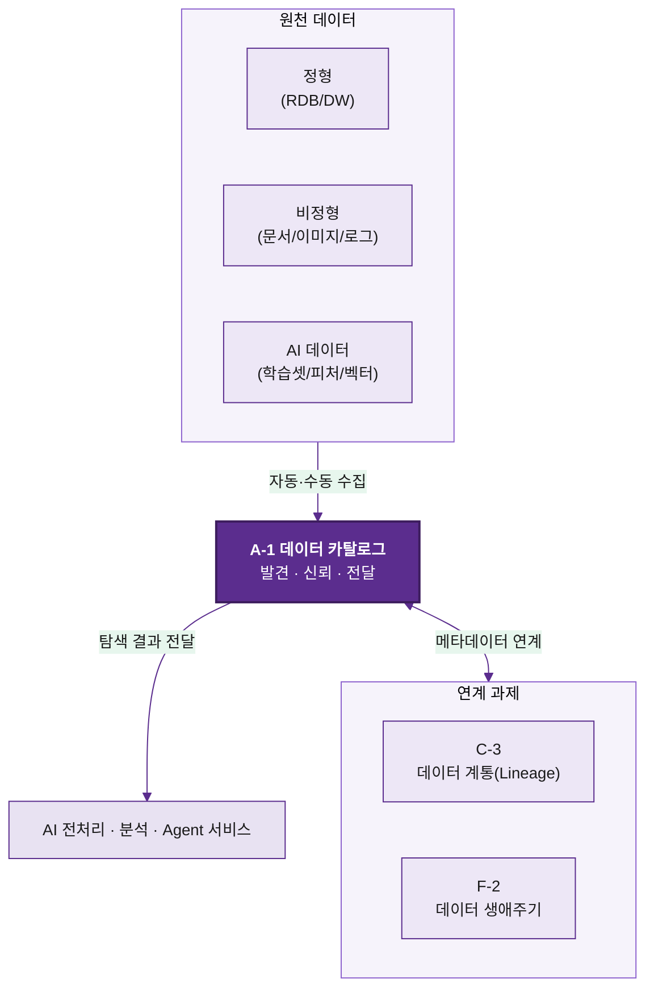

[↑ 맨 위로](#top)

---

## 2. 데이터 카탈로그 필요성 및 기대 효과

### 2.1 AI 과제 수행 시 주요 Pain Point

AI 과제에서 모델링보다 **데이터 확보·이해 단계가 전체 기간의 60~80%**를 차지하는 경우가 많다. 현장에서 반복되는 Pain Point를 실제 장면과 함께 정리한다.

| Pain Point | 현장 장면 (예시) | 결과 |
| --- | --- | --- |
| 존재 여부 불확실 | "설비 온도 이력 데이터가 있나요?" → 아무도 확답 못 함 | 데이터를 새로 수집·재구축 |
| 위치 파편화 | 같은 '매출' 데이터가 ERP·BI·엑셀에 따로 존재 | 어느 것이 정본인지 논쟁 |
| 소유자 부재 | 담당자 찾는 데만 메일 7번, 2주 소요 | 과제 착수 지연 |
| 의미 불명확 | 컬럼 `STAT_CD` 의미를 아무도 모름 | 잘못 해석한 채 분석 |
| 신뢰 불가 | 최신 데이터인지 알 수 없어 배치 시점 추측 | 오래된 데이터로 모델 학습 |
| 재사용 불가 | 작년 과제의 전처리 로직을 못 찾음 | 동일 전처리 반복 개발 |

**예시 시나리오 — 카탈로그가 없을 때 vs 있을 때**

> *없을 때*: AI 엔지니어 A는 '품질 불량 예측' 과제를 위해 검사 데이터를 찾는다. 생산팀·품질팀·IT에 각각 문의 → 2주 만에 데이터 3종을 받았으나 컬럼 의미 불명확 → 다시 1주 협의 → 일부는 권한 문제로 사용 불가.
>
> *있을 때*: A는 카탈로그에서 "검사 불량"을 검색 → 관련 테이블 4건과 소유자·등급·최신성·기존 전처리 이력 확인 → 30분 만에 사용 가능 데이터 2종 확정, 권한 신청까지 완료.

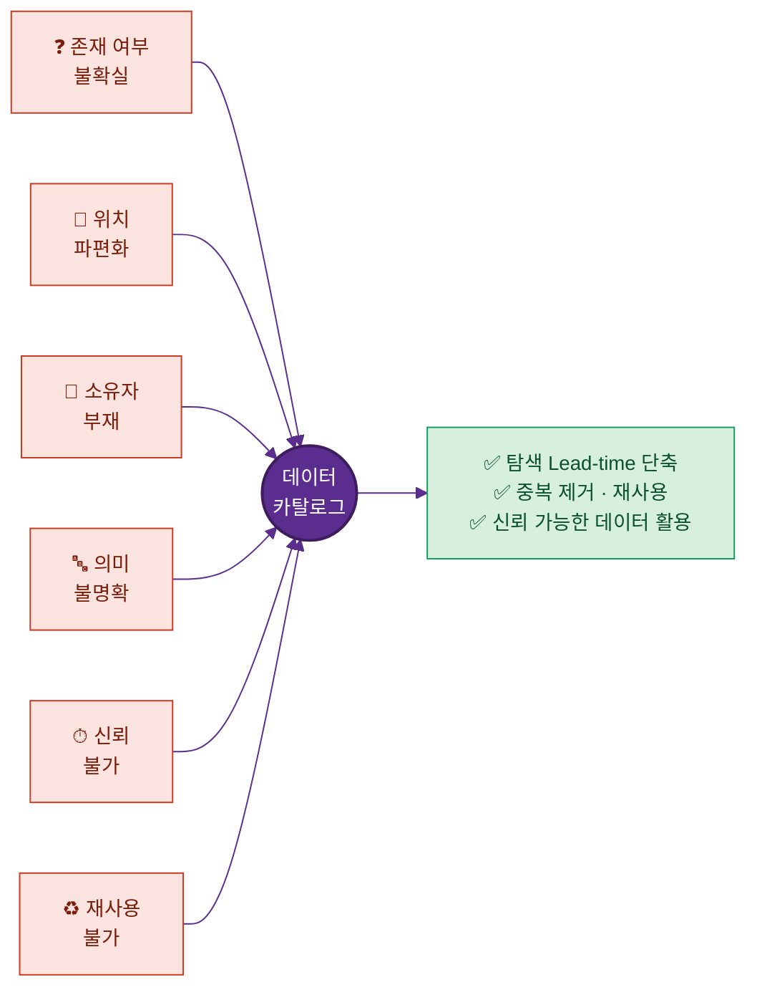

---

### 2.2 데이터 카탈로그 구축의 필요성

- **탐색 비용의 구조적 전환**: 데이터 찾기를 '개인 인맥·경험'에서 '시스템 셀프서비스'로 전환 → 담당자 변경·퇴사에도 지식 유실 없음
- **거버넌스의 실행 기반**: 표준·소유자·보안 등급을 한 곳에서 강제하고 점검 → "정책 문서는 있으나 현장에서 안 지켜지는" 문제 해소
- **AI 확산의 전제 조건**: 과제 수가 늘수록 탐색 병목은 비선형으로 증가. 카탈로그는 과제 N개를 동시에 떠받치는 공용 인프라
- **규제 대응 근거**: 개인정보·민감정보의 소재와 통제 상태를 즉시 제시 가능

**필요성 판단 체크리스트 (해당 항목이 많을수록 구축 시급)**

- [ ] 같은 데이터를 부서마다 따로 관리하고 있다
- [ ] 데이터 담당자를 찾는 데 며칠씩 걸린다
- [ ] AI/분석 과제가 매년 증가하고 있다
- [ ] 개인정보 보유 현황을 한 번에 보고하기 어렵다
- [ ] 과거 분석·전처리 산출물이 재사용되지 못한다

---

### 2.3 데이터 카탈로그 구축의 기대 효과

기대 효과는 **정성 효과**와 **정량 지표(KPI 연계)**로 나누어 제시한다.

| 관점 | 정성 효과 | 정량 지표(예시 목표) |
| --- | --- | --- |
| 시간 | 탐색을 셀프서비스로 전환 | 데이터 탐색 Lead-time 2주 → 1일 |
| 비용 | 중복 수집·중복 전처리 제거 | 전처리 재사용률 0% → 40% |
| 품질 | 최신성·정합성 가시화 | 잘못된 데이터 사용 인시던트 50% 감소 |
| 거버넌스 | 소유자·등급 표준화 | 필수 메타데이터 충족률 95% 이상 |
| 확산 | 과제 착수 가속 | 신규 AI 과제 데이터 확보 기간 70% 단축 |

> 정량 목표 수치는 계열사 기준선(As-Is) 측정 후 확정한다. (11장 KPI와 연계)

---

### 2.4 데이터 카탈로그 주요 기능

카탈로그가 사용자에게 답해야 할 **5대 핵심 질문**과, 그것을 충족하는 기능·메타데이터를 매핑한다.

| 사용자 질문 | 기능 | 근거 메타데이터 | 화면 예시 |
| --- | --- | --- | --- |
| ① 이런 데이터가 있는가? | 통합 검색·태그 탐색 | 자산명, Description, 태그 | 검색창 "설비 온도" → 결과 12건 |
| ② 어디에 있는가? | 위치·주소 표시 | System/Schema/Table/Path | `MES / HIVE / sensor.temp_log` |
| ③ 누구에게 물어보나? | 소유자·연락 채널 | Owner/Steward, 이메일 | "설비관리팀 김철수 / 문의" 버튼 |
| ④ AI에 쓸 수 있나? | AI 활용 상태 표시 | 전처리 여부·피처·학습 이력 | "전처리 완료 · 2개 모델 사용" 배지 |
| ⑤ 믿고 쓸 수 있나? | 최신성·신뢰도 표시 | 갱신일·주기·품질·인증 | "어제 갱신 · 품질 92 · ✔인증" |

**기능별 상세**

- **데이터 존재 여부 확인**: 자연어·키워드·동의어 검색 지원. 예) "고객 이탈" 검색 시 'churn', '해지', '계약해지' 동의어까지 매칭
- **데이터 위치 및 주소 확인**: 논리 위치(도메인)와 물리 위치(시스템·경로)를 함께 표기하여 접근 경로를 명확화
- **데이터 소유자 확인**: Owner(책임)·Steward(관리)·Custodian(운영)을 구분 표기, 원클릭 문의/권한 신청 연계
- **AI 활용·전처리 여부 확인**: '원천 / 전처리 / 피처 / 학습셋' 단계 배지와 연결된 산출물 링크 제공 → 재사용 유도
- **데이터 최신성 및 신뢰도 확인**: 최종 갱신 시점, 갱신 주기 준수 여부(지연 시 경고), 품질 점수, 거버넌스 인증 마크 표시

[↑ 맨 위로](#top)

---

## 3. 데이터 카탈로그 구성 체계

### 3.1 데이터 카탈로그 조회 방식

사용자의 탐색 패턴은 **"무엇을 찾을지 아는 경우(Search)"**와 **"둘러보며 발견하는 경우(Browse)"**로 나뉜다. 두 방식을 모두 제공한다.

**글로벌 탐색(Global Search)**
- 키워드·자연어 기반 통합 검색. 자산명·Description·태그·컬럼명·소유자 전체를 색인
- 필터: 도메인 / 시스템 / 보안등급 / 데이터 Type / 최신성 / AI활용여부
- 정렬: 관련도 / 인기도(조회·사용 빈도) / 최신순

> **검색 예시**
> 검색어: `이탈`
> ```
> 결과 (3건)
> 1. 고객이탈예측_피처셋  [AI Data·전처리완료]  마케팅 / S3 / churn_feature.parquet  품질 95
> 2. 계약해지이력          [정형]               CRM / ORACLE / SALES.CANCEL_HIST  품질 90
> 3. 해지사유코드          [정형·코드]          CRM / ORACLE / CODE.CANCEL_RSN   품질 88
> ```
> 필터에서 'AI활용여부=Y'를 켜면 1번만 남는다.

**계층형 탐색(Hierarchical Browse)**
- `도메인 → 시스템 → 스키마 → 테이블 → 컬럼` 트리 구조
- 비즈니스 도메인(영업/생산/구매/품질 등) 기준 분류와 병행

> **계층 탐색 예시**
> ```
> 📁 고객 도메인
>   └ 🗄 CRM 시스템
>       └ 📂 SALES 스키마
>           ├ 📄 CUST_BASE (고객기본정보)  28컬럼
>           ├ 📄 CONTRACT (계약정보)        41컬럼
>           └ 📄 CANCEL_HIST (계약해지이력) 12컬럼
> ```

**두 방식의 사용 가이드**

| 상황 | 권장 방식 |
| --- | --- |
| 찾는 데이터의 키워드가 명확 | 글로벌 탐색 |
| 특정 도메인 전체를 둘러보고 싶음 | 계층형 탐색 |
| 신규 사용자의 학습/탐방 | 계층형 → 글로벌 순 병행 |

---

### 3.2 데이터 카탈로그 항목 구성 기준

메타데이터는 **5대 카테고리**로 구조화한다. 각 카테고리는 "누가 주로 작성·활용하는가"가 다르다.

| 카테고리 | 정의 | 대표 항목 | 주 작성자 |
| --- | --- | --- | --- |
| **Business** | 비즈니스 의미·맥락 | 비즈니스명, 정의, 도메인, 용어, 태그 | 현업 |
| **Technical** | 물리·기술 속성 | 시스템/DB/스키마/테이블/컬럼, 타입, 길이, PK/FK, 건수 | IT(자동 수집) |
| **Compliance** | 규제·보안 속성 | 보안 등급, 개인정보 여부, 민감유형, 보존기간, 규제분류 | 보안/컴플라이언스 |
| **Operational** | 운영·관리 속성 | 소유자, 최종 갱신일, 주기, 적재방식, 품질점수 | IT/거버넌스 |
| **AI** | AI 활용 속성 | 전처리 여부, 피처 정의, 학습 이력, 임베딩 여부, 재사용성 | AI 조직 |

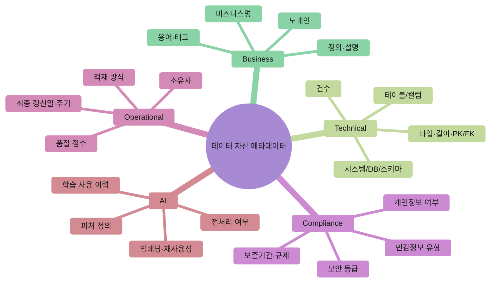

> **카테고리별 작성 예시 (고객기본정보 자산)**
> ```
> Business    : 고객기본정보 / "고객 식별·연락 마스터" / 도메인=고객 / 태그=#마스터 #개인정보
> Technical   : CRM·ORACLE·SALES.CUST_BASE / 28컬럼 / PK=CUST_ID / 1,240만건
> Compliance  : 기밀 / 개인정보=Y(성명,연락처) / 보존기간=거래종료 후 5년 / 규제=개인정보보호법
> Operational : 소유자=영업기획팀 홍길동 / 일배치 / 최종갱신=2026-06-17 / 품질=92
> AI          : 전처리=완료 / 피처=고객연령,가입기간 / 학습이력=이탈예측v2 / 재사용=가능
> ```

---

### 3.3 데이터 카탈로그 기본 항목 정의

모든 자산이 갖춰야 할 **필수/권장 항목**과 작성 규칙을 정의한다.

| 항목 | 카테고리 | 필수 | 작성 규칙 | 예시 |
| --- | --- | --- | --- | --- |
| 자산명(논리/물리) | Business/Technical | 필수 | 논리명은 한글, 물리명은 원천 그대로 | 고객기본정보 / CUST_BASE |
| Description | Business | 필수 | 1~2문장, 무엇을/누가/언제 관점 | 고객 식별·연락 기본정보 마스터 |
| 도메인 | Business | 필수 | 표준 도메인 코드에서 선택 | 고객 |
| 시스템/위치 | Technical | 필수 | System/Schema/Table 또는 Path | CRM/ORACLE/SALES.CUST_BASE |
| 데이터 Type | Technical | 필수 | 표준 Type 분류값 사용(3.4) | 정형(Table) |
| 소유자 | Operational | 필수 | 부서+담당자+연락처 | 영업기획팀 홍길동 |
| 보안 등급 | Compliance | 필수 | 4단계 등급 중 선택 | 기밀 |
| 개인정보 여부 | Compliance | 필수 | Y/N + 항목 | Y(성명,연락처) |
| 최종 갱신일·주기 | Operational | 필수 | 자동 수집 우선 | 2026-06-17 / 일배치 |
| 품질 점수 | Operational | 권장 | 품질 솔루션 연계 | 92 |
| AI 활용 상태 | AI | 권장 | 원천/전처리/피처/학습셋 | 전처리 완료 |

**작성 원칙**
- 자동 수집 가능한 항목(Technical/Operational 일부)은 **자동을 기본**, 수동은 보완용
- 필수 항목 미충족 자산은 "미완성(Draft)"으로 표기하여 검색 노출 제한
- ⚠️ **이 항목들을 사람이 일일이 입력하는 것이 아니다.** 대부분은 솔루션이 자동으로 채우고, 사람은 의미·등급·검수만 담당한다 → 상세는 **5.8 자동화 가이드** 참조

---

### 3.4 데이터 Type 작성 기준

데이터 Type은 탐색 필터·등록 기준의 근간이므로 **표준 분류값**만 사용한다.

| 대분류 | 표준 Type 값 | 설명 |
| --- | --- | --- |
| 정형(Structured) | Table, View, Column, File(CSV/Parquet) | 스키마가 명확한 데이터 |
| 반정형(Semi-structured) | JSON, XML, Key-Value, API Response | 구조는 있으나 가변적 |
| 비정형(Unstructured) | Document, Image, Audio/Video, Log, Text | 스키마 없음 |
| AI Data | Training Dataset, Feature Set, Embedding/Vector, Model I/O | AI 가공·산출 데이터 |

**작성 원칙**
1. **최하위 단위 기준** 분류 — 테이블 자산은 컬럼 단위까지 Type 기재
2. **솔루션 표준 코드와 매핑** — 솔루션 내장 분류와 1:1 매핑표 유지
3. **복합 자산은 대표+보조 병기** — 예) 로그파일(대표=Log, 보조=JSON)

> **Type 분류 예시**
> | 자산 | 대표 Type | 보조 Type |
> | --- | --- | --- |
> | SALES.CUST_BASE | 정형(Table) | - |
> | 계약서 PDF 모음 | 비정형(Document) | - |
> | 설비 센서 로그 | 비정형(Log) | 반정형(JSON) |
> | 이탈예측 학습셋 | AI(Training Dataset) | 정형(File/Parquet) |

[↑ 맨 위로](#top)

---

## 4. 추진 역할 및 책임

### 4.1 주요 담당자 정의

데이터 카탈로그는 한 조직이 아닌 **다섯 주체의 협업**으로 운영된다.

| 역할 | 정의 | 핵심 책임 | 예시 직무 |
| --- | --- | --- | --- |
| **데이터 오너(Data Owner)** | 데이터에 대한 최종 의사결정 권한 보유자 | 등록 승인, 등급 결정, 공개 범위 결정 | 영업기획팀장 |
| **현업(Business User)** | 데이터를 생성·활용하는 부서 | 비즈니스 정의·설명 작성, 활용 피드백 | 영업/생산/품질 담당 |
| **IT** | 시스템·데이터 적재 운영 | 기술 메타데이터 수집, 연동·파이프라인 운영 | DBA, 시스템 운영자 |
| **보안(Security)** | 보안·규제 통제 | 등급 분류 검토, 접근 통제, 개인정보 점검 | 정보보안팀 |
| **AI 조직(AI/Data Science)** | AI 데이터 소비·생산 | AI 메타데이터 작성, 전처리/피처 등록, 재사용 | AI 엔지니어, 데이터 사이언티스트 |

**관련 용어 구분**
- **Owner**: 책임자(승인·등급 결정) / **Steward**: 관리자(메타데이터 품질 유지) / **Custodian**: 운영자(기술적 보관·접근 제공)

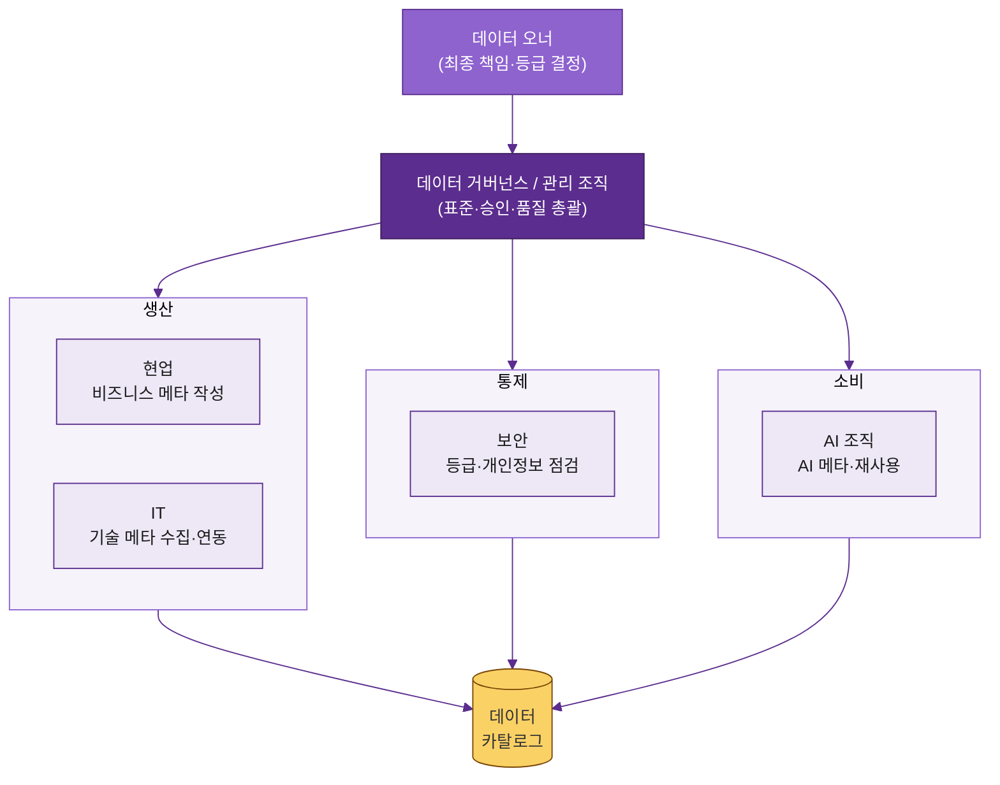

### 4.2 역할별 책임 구분 (RACI)

데이터 카탈로그 주요 활동에 대한 RACI(R=실행, A=최종책임, C=협의, I=공유)를 정의한다.

| 활동 | 데이터 오너 | 현업 | IT | 보안 | AI 조직 |
| --- | --- | --- | --- | --- | --- |
| 자산 등록 대상 선정 | A | C | R | C | C |
| 비즈니스 메타데이터 작성 | A | R | I | I | C |
| 기술 메타데이터 수집 | I | I | R/A | I | I |
| 보안 등급 분류 | C | C | I | R/A | I |
| 등록 승인 | R/A | C | I | C | I |
| AI 메타데이터 작성 | I | C | I | I | R/A |
| 최신성·품질 관리 | A | C | R | I | C |
| 접근 권한 부여 | A | I | R | C | I |

> **읽는 법 예시 (보안 등급 분류)**: 실제 분류·최종책임은 **보안(R/A)**, 데이터 오너·현업은 협의(C), IT·AI는 공유(I)받는다.

### 4.3 계열사 상황에 따른 담당 조직 조정 기준

계열사 규모·성숙도에 따라 역할을 통합/분리한다.

| 상황 | 조정 기준 | 예시 |
| --- | --- | --- |
| 전담 데이터 조직 부재(소규모) | IT가 Steward·Custodian 겸임, 현업이 Owner 겸 작성 | 중소 계열사 |
| 데이터 거버넌스 조직 존재(중대형) | 도메인별 Steward 분산 + 중앙 거버넌스 표준 통제 | 대형 제조 계열사 |
| AI 조직 미흡 | 초기엔 IT/현업이 AI 메타데이터 대행, 이후 AI 조직 이관 | AI 도입 초기 계열사 |
| 보안 전담 부재 | 그룹 공통 보안 정책 준용 + 외부 검토 위탁 | 신설/소규모 계열사 |

**조정 원칙**
- 역할은 통합하더라도 **A(최종책임)는 반드시 1인/1조직으로 명확화**한다(책임 공백 방지).
- 겸임 시에도 RACI 표를 계열사별로 작성해 문서화한다.

[↑ 맨 위로](#top)

---

## 5. 데이터 현황 조사 및 등록 대상 선정

**전체 흐름 한눈에 보기 — "전수 → 선별 → 등록"**

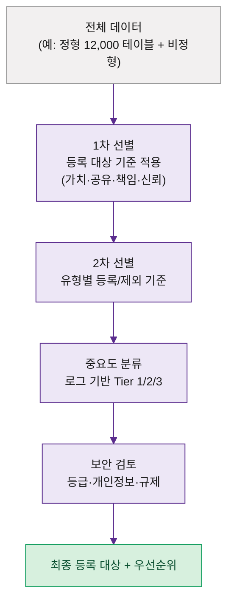

### 5.1 데이터 카탈로그 등록 대상 기준 정의

"모든 데이터를 다 넣는다"는 접근은 실패한다. **가치 있고 관리 가능한 데이터부터** 등록하는 기준을 세운다.

**등록 대상 4대 판단 축**
1. **활용 가치**: 현재/향후 AI·분석·업무에 쓰이는가
2. **공유 필요성**: 부서 간 공유·재사용 수요가 있는가
3. **관리 책임 존재**: 소유자·갱신 주체가 명확한가
4. **신뢰성**: 정합성·최신성이 일정 수준 이상인가

> **판단 예시**
> | 데이터 | 활용가치 | 공유필요 | 책임 | 신뢰성 | 등록? |
> | --- | --- | --- | --- | --- | --- |
> | 고객기본정보 | 높음 | 높음 | 명확 | 높음 | ✅ 등록 |
> | 개인 PC의 임시 엑셀 | 낮음 | 낮음 | 불명확 | 낮음 | ❌ 제외 |
> | 설비 센서 로그 | 높음 | 중간 | 명확 | 중간 | ✅ 등록 |

### 5.2 데이터 유형별 등록 기준

| 유형 | 등록 기준 | 예시 |
| --- | --- | --- |
| **정형 데이터** | 운영 시스템의 마스터·트랜잭션 테이블, BI/분석 활용 테이블 | ERP/CRM/MES 테이블, DW 마트 |
| **비정형 데이터** | 업무·AI에 활용되는 문서·이미지·로그(검색/분석 대상) | 계약서, 검사 이미지, 설비 로그 |
| **AI 데이터** | 재사용 가치가 있는 학습셋·피처·임베딩 | 학습 데이터셋, 피처스토어 산출물 |

### 5.3 데이터 유형별 등록 제외 기준

| 제외 사유 | 설명 | 예시 |
| --- | --- | --- |
| 임시/개인 데이터 | 개인 보관·일회성 | 개인 PC 엑셀, 임시 테이블 |
| 백업/이력 사본 | 원본과 중복 | `_BAK`, `_TMP`, 스냅샷 |
| 시스템 내부 데이터 | 업무 의미 없음 | 로그인 세션, 시스템 카운터 |
| 폐기 예정 | 사용 중단 | 미사용 레거시 테이블 |
| 책임자 부재 + 저활용 | 관리 불가 | 출처불명 방치 데이터 |

> **제외 예시**: `SALES.CUST_BASE_BAK_20250101` → 백업 사본이므로 제외, 원본 `CUST_BASE`만 등록.

### 5.4 정형 데이터 중요도 선별 기준

정형 데이터는 양이 많아 **로그·메타 기반으로 사용량을 측정**해 중요도를 객관적으로 분류한다.

| 분석 소스 | 무엇을 알 수 있나 | 활용 |
| --- | --- | --- |
| **Query Log** | 실제 조회 빈도·사용자 수 | 많이 쓰는 테이블 식별 |
| **ETL Job Log** | 데이터 흐름·적재 대상 | 핵심 적재 테이블 식별 |
| **BI Report Lineage** | 리포트가 참조하는 테이블 | 경영 의사결정 활용도 |
| **API/Interface Log** | 시스템 간 연계 대상 | 연동 핵심 데이터 |
| **Batch Schedule** | 정기 처리 대상 | 운영 중요 데이터 |
| **Access Log** | 접근 주체·빈도 | 활성/비활성 구분 |

**Tier 분류 기준 (사용량 종합)**

| Tier | 기준(예시) | 처리 |
| --- | --- | --- |
| **Tier 1** | 다수 부서 조회 + BI/API 참조 + 정기 배치 | 최우선 등록, 메타 완비 |
| **Tier 2** | 일부 부서 조회 또는 단일 시스템 핵심 | 차순위 등록 |
| **Tier 3** | 조회 빈도 낮음, 제한적 사용 | 선택 등록 |
| **Unknown** | 로그상 사용 흔적 없음 | 소유자 확인 후 제외/보류 |

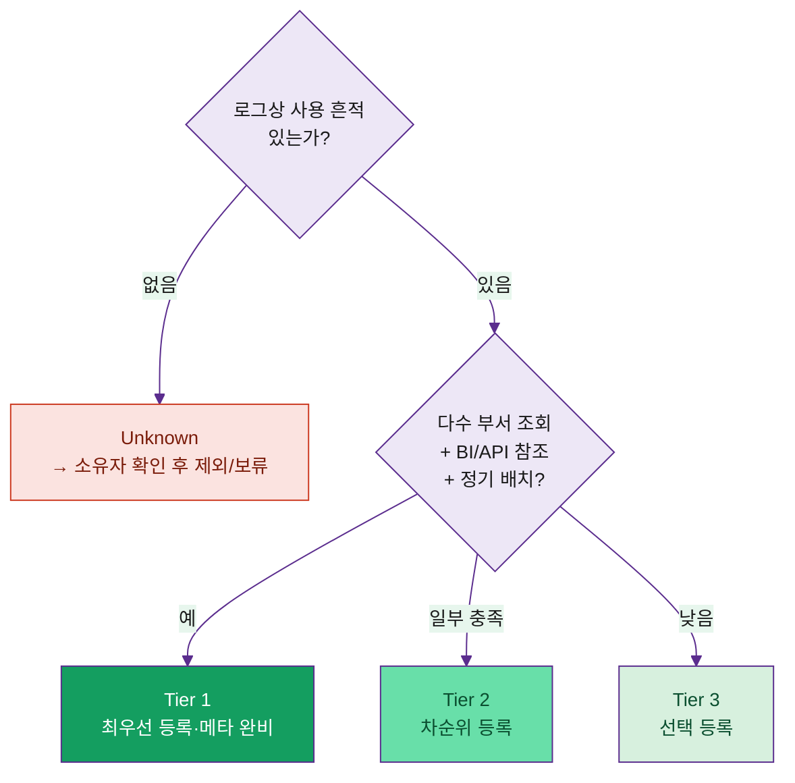

> **Tier 분류 예시**
> ```
> CUST_BASE   : Query 1일 5,000회·BI 12개·API 3개 → Tier 1
> CANCEL_HIST : Query 1일 200회·BI 2개          → Tier 2
> TMP_CALC_01 : Query 1주 0회·참조 없음          → Unknown → 제외 검토
> ```

### 5.5 데이터 취합 방식

| 방식 | 설명 | 적용 대상 |
| --- | --- | --- |
| **수동 등록** | 담당자가 직접 입력 | 비정형, 소유자 지식 필요 항목 |
| **자동화 Crawling** | 커넥터로 메타데이터 자동 수집 | 정형 DB, 데이터레이크 |
| **주요 데이터 식별** | 로그·Tier 기반 우선 대상 도출 | 5.4 결과 활용 |
| **누락 데이터 보완** | 자동 수집 후 빈 항목을 담당자가 채움 | Business/AI 메타데이터 |

**권장 절차**: 자동 Crawling(기술 메타) → Tier 기반 우선순위 → 현업·AI가 비즈니스/AI 메타 보완 → 검토·승인

### 5.6 보안 검토 기준

등록 전 보안·규제 관점 검토를 수행한다.

| 검토 항목 | 기준 | 조치 |
| --- | --- | --- |
| 보안 등급 분류 | 공개/내부/기밀/극비 4단계 | 등급별 노출·마스킹 |
| 개인정보 포함 | 성명·연락처·주민번호 등 | 항목 명시, 접근 제한 |
| 민감정보 | 건강·신용·생체 등 | 별도 승인, 마스킹 |
| 규제 대상 | 개인정보보호법·산업기밀 등 | 보존기간·통제 적용 |
| 메타데이터 노출 | 컬럼명/샘플값 노출 위험 | 샘플 비공개, 설명만 노출 |

> **보안 검토 예시**: `CUST_BASE`는 성명·연락처 포함 → 등급 '기밀', 검색 결과에 컬럼 목록은 노출하되 샘플값은 비공개, 접근은 권한 신청 후 승인.

### 5.7 최종 등록 대상 및 우선순위 정의

검토 결과를 종합해 **등록 대상 목록과 순서**를 확정한다.

**우선순위 산정식(예시)**: `우선순위 = 활용도(Tier) × 공유필요성 × (보안 통제 가능성)`

| 단계 | 대상 | 시점 |
| --- | --- | --- |
| 1차 | Tier 1 + 보안 통제 가능 | 구축 초기 |
| 2차 | Tier 2 + AI 활용 예정 데이터 | 안정화기 |
| 3차 | Tier 3, 비정형 확대 | 확산기 |

> **최종 산출물 예시 — 등록 대상 목록표**
> | 우선순위 | 자산 | Tier | 보안등급 | 취합방식 | 등록 차수 |
> | --- | --- | --- | --- | --- | --- |
> | 1 | CUST_BASE | 1 | 기밀 | 자동+보완 | 1차 |
> | 2 | CONTRACT | 1 | 기밀 | 자동+보완 | 1차 |
> | 3 | sensor.temp_log | 2 | 내부 | 자동 | 2차 |

---

### 5.8 자동화로 수작업 최소화 (★ "사람이 다 찾아 정리하지 않는다")

> **결론 먼저**: 데이터 카탈로그는 **사람이 일일이 다 찾아 입력하는 작업이 아니다.**
> 전체 메타데이터의 **약 70~90%는 솔루션이 자동으로 수집·채운다.** 사람은 기계가 알 수 없는
> **"비즈니스 의미 · 보안 등급 · 최종 검수"** 정도만 담당한다. 즉 작업의 무게중심은
> **"입력"이 아니라 "검수(확인·승인)"**다.

#### 5.8.1 무엇이 자동이고 무엇이 사람 몫인가 (항목별 자동화 수준)

| 메타데이터 | 자동화 수준 | 누가/어떻게 |
| --- | --- | --- |
| 시스템/스키마/테이블/컬럼 | 🟢 자동 | 커넥터가 원천에서 스캔 |
| 데이터 타입·길이·PK/FK·건수 | 🟢 자동 | 커넥터가 스키마에서 추출 |
| 최종 갱신일·갱신 주기 | 🟢 자동 | 시스템 로그/배치 메타에서 수집 |
| 데이터 계통(Lineage) | 🟢 자동 | ETL/쿼리 파싱으로 자동 추출 |
| 사용량·인기도(Tier) | 🟢 자동 | Query/BI/API 로그 분석(5.4) |
| 개인정보 후보 탐지 | 🟡 반자동 | AI/패턴이 후보 식별 → 사람 확정 |
| Description·태그 | 🟡 반자동 | AI가 초안 생성(12장) → 현업 검수 |
| 보안 등급 확정 | 🔴 사람 | 보안/오너가 최종 판단 |
| 비즈니스 정의·맥락 | 🔴 사람 | 현업만 아는 의미 보완 |
| 등록 승인 | 🔴 사람 | Steward/Owner 승인 |

> 🟢 자동(기계) · 🟡 반자동(AI 초안 + 사람 검수) · 🔴 사람(판단·승인)
> → **순수 수작업(🔴)은 전체의 일부**이며, 그마저도 "0에서 작성"이 아니라 "초안 검수"에 가깝다.

#### 5.8.2 수작업을 줄이는 5가지 자동화 수단

1. **커넥터/크롤러 자동 수집** — Oracle·Hive·S3·BI 등에 커넥터를 연결하면 테이블·컬럼·타입을 한 번에 스캔. 신규/변경분만 가져오는 **증분 수집**으로 매번 전수 작업 불필요.
2. **Lineage 자동 추출** — ETL 스크립트·SQL·BI 리포트를 파싱해 "이 데이터가 어디서 와서 어디로 가는지"를 자동으로 그림. 사람이 흐름도를 그릴 필요 없음.
3. **로그 기반 중요도 자동 산정** — Query/ETL/BI/API 로그로 사용량을 측정해 Tier를 자동 분류(5.4). "무엇이 중요한지"를 감이 아닌 데이터로 결정.
4. **AI 메타데이터 초안 자동 생성** — LLM이 테이블명·컬럼·샘플·계통을 보고 Description·태그·품질 코멘트 초안을 생성(12.1~12.2). 사람은 **검수·승인만**.
5. **템플릿 일괄 업로드 + 스케줄/이벤트 수집** — 비정형·오프라인 데이터는 Excel 템플릿으로 한 번에 등록. 이후 정해진 주기(Scheduled)나 변경 발생 시(Event-based)에 자동 갱신(9.7).


#### 5.8.3 사람이 '꼭' 해야 하는 최소 작업

자동화해도 사람이 책임져야 하는 것은 **기계가 판단할 수 없는 것들**뿐이다.

- **비즈니스 의미**: `STAT_CD = '03'`이 "출하 보류"라는 건 현업만 안다
- **보안 등급/공개 범위**: 규제·민감도 판단은 사람의 책임
- **최종 검수·승인**: AI 초안의 사실 여부 확인(환각 방지)

> 운영 팁: 사람의 작업을 **"빈칸 채우기"가 아니라 "초안 O/X 검수"**로 설계하면 부담이 급감한다.

#### 5.8.4 자동화 단계별 적용 (점진 도입)

| Phase | 자동화 범위 | 사람 개입 |
| --- | --- | --- |
| 1 | 커넥터로 기술 메타 자동 수집 | 비즈니스 의미·등급만 보완 |
| 2 | 로그 기반 Tier·Lineage 자동화 | 우선순위 검토만 |
| 3 | AI가 설명·태그 초안 생성 | 검수·승인만 |
| 4 | 자연어 탐색·Agent 자동화(12장) | 예외 처리만 |

#### 5.8.5 솔루션별 자동화 기능 (6장 연계)

| 자동화 기능 | 강한 솔루션(예시) |
| --- | --- |
| 자동 스캔·광범위 커넥터 | Informatica, Collibra, DataHub |
| 사용량 기반 추천(쿼리로그) | Alation |
| AI 자동 분류·메타 생성 | Informatica(CLAIRE), Atlan, OpenMetadata |
| Lineage 자동 추출 | Collibra, DataHub, OpenMetadata |

#### 5.8.6 주의 — 자동화가 만능은 아니다

- 자동 수집은 **"무엇이 있는지"는 채우지만 "무엇을 의미하는지"는 못 채운다** → 비즈니스 메타는 사람 검수 필수
- AI 초안은 **환각(잘못된 설명) 가능** → 반드시 Human-in-the-loop 승인
- 커넥터 미지원 레거시는 커스텀 수집 파이프라인 필요(8.5~8.6)

[↑ 맨 위로](#top)

---

## 6. 데이터 카탈로그 솔루션 선정 검토

### 6.1 솔루션 검토 목적

- 계열사 데이터 환경(원천 종류·규모·보안 요건)에 **적합한 카탈로그 솔루션**을 선정
- 자체 구축(In-house) vs 상용/오픈소스 도입의 **합리적 의사결정 근거** 확보
- 그룹 표준화와 계열사 자율성의 균형 확보

### 6.2 솔루션 적용 범위 정의

| 구분 | 범위 |
| --- | --- |
| 필수 기능 | 메타데이터 수집·검색·계층탐색·소유자/권한·계통(Lineage) |
| 연동 대상 | RDB, DW, 데이터레이크, BI, ETL, (선택)클라우드 스토리지 |
| 운영 환경 | On-prem / Cloud / Hybrid 중 계열사 환경에 맞춤 |
| 사용자 규모 | 동시 사용자·자산 건수 기준 용량 산정 |

### 6.3 데이터 카탈로그 솔루션 유형

| 유형 | 특징 | 장점 | 단점 | 대표 제품 |
| --- | --- | --- | --- | --- |
| **상용(Commercial)** | 벤더 제공 패키지 | 기능 완성도·지원·자동화 | 높은 라이선스 비용 | Collibra, Alation, Informatica, Atlan |
| **클라우드 네이티브** | CSP 통합 서비스 | 클라우드 연동·확장성 | CSP 종속성 | Microsoft Purview, AWS Glue/DataZone, GCP Dataplex, Databricks Unity Catalog |
| **오픈소스(Open-source)** | 커뮤니티 기반 | 비용 낮음·커스터마이징 | 운영·유지보수 부담 | DataHub, OpenMetadata, Amundsen, Apache Atlas |
| **자체 구축(In-house)** | 직접 개발 | 완전 맞춤 | 개발·유지비 큼 | (사내 개발) |

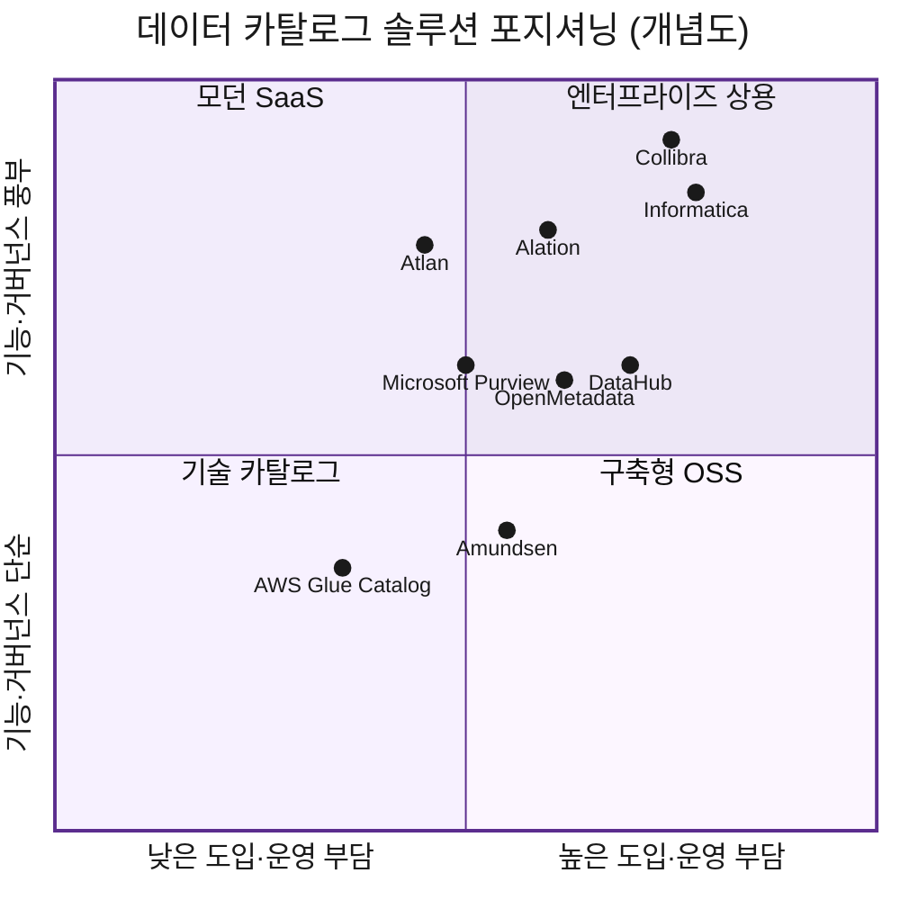

### 6.4 주요 솔루션 후보군 검토

> 아래 평가는 2026년 초 기준 일반적 시장 인식을 정리한 것으로, **실제 선정 시 최신 버전·가격·기능을 반드시 재확인**한다.

**[상용] Collibra**
- **포지션**: 엔터프라이즈 데이터 거버넌스 시장 리더
- **장점**: 거버넌스·정책·워크플로우 기능이 가장 깊음, 비즈니스 용어집·데이터 책임 체계 강력, 대기업 레퍼런스 풍부
- **단점**: 라이선스·구축 비용 높음, 도입 기간 길고 구현 복잡, 기술 메타 자동화는 별도 구성 필요
- **적합**: 강한 거버넌스·규제 대응이 최우선인 대기업

**[상용] Alation**
- **포지션**: 데이터 카탈로그 개념을 대중화한 선도 제품, "Data Intelligence"
- **장점**: 검색·사용성 우수, **Query Log 기반 인기도/추천**(현장 사용 패턴 반영), 현업 친화적 UX로 채택률 높음
- **단점**: 순수 거버넌스 깊이는 Collibra 대비 다소 약함, 비용 부담
- **적합**: 분석가·현업의 셀프서비스 탐색 활성화가 목표인 조직

**[상용] Informatica (Cloud Data Governance & Catalog, CDGC / 구 EDC)**
- **포지션**: 광범위한 연결성과 AI 엔진(CLAIRE) 보유
- **장점**: 스캐너·커넥터 범위 넓음, AI 기반 자동 분류·추천, Informatica ETL/품질 생태계와 강한 통합
- **단점**: 복잡도·비용 높음, Informatica 스택 밖에서는 가치 반감
- **적합**: 이미 Informatica 데이터 통합/품질을 쓰는 조직

**[상용/모던] Atlan**
- **포지션**: 협업·액티브 메타데이터 중심의 모던 SaaS
- **장점**: 현대적 UX, 협업(슬랙/지라 연동) 강점, 클라우드 데이터 스택과 빠른 연동, 도입 속도 빠름
- **단점**: 상대적으로 신생, 초대형 규제 거버넌스 기능은 성숙 중
- **적합**: 클라우드 데이터 스택 기반의 민첩한 데이터 조직

**[클라우드] Microsoft Purview**
- **포지션**: Azure 중심 멀티클라우드 거버넌스/카탈로그
- **장점**: Azure·M365 통합, MS 환경에서 비용 효율, 자동 스캔·분류, 컴플라이언스 연계
- **단점**: Azure 외 환경에서 가치 감소, Lineage·UX 깊이 한계
- **적합**: Microsoft/Azure 중심 IT 환경

**[클라우드] AWS Glue Data Catalog (+ Amazon DataZone)**
- **포지션**: AWS 네이티브 기술 카탈로그(Glue) + 비즈니스 카탈로그(DataZone)
- **장점**: AWS(Athena/Redshift/EMR)와 완벽 통합, 서버리스, 저비용
- **단점**: Glue 단독은 **기술 메타 중심**으로 비즈니스 용어집·거버넌스·UX 약함 → DataZone/Lake Formation 조합 필요
- **적합**: AWS 중심 데이터레이크 환경

**[클라우드] GCP Dataplex / Databricks Unity Catalog**
- **Dataplex**: GCP 네이티브, BigQuery 등과 통합, 서버리스. GCP 종속.
- **Unity Catalog**: Databricks 레이크하우스 거버넌스·Lineage 내장, 빠르게 성숙 중. Databricks 중심 환경에 적합.

**[오픈소스] DataHub (LinkedIn/Acryl)**
- **장점**: 강력한 메타데이터 그래프, 실시간 수집, 커넥터·확장성 우수, 활발한 커뮤니티, 무료
- **단점**: 직접 운영·유지보수 부담, 엔지니어링 역량 필요
- **적합**: 엔지니어링 역량 보유, 커스터마이징 원하는 조직

**[오픈소스] OpenMetadata**
- **장점**: 단일 앱에 **카탈로그+품질+Lineage+거버넌스** 통합, 모던 UX, 빠른 성장
- **단점**: 운영 부담, 비교적 신생
- **적합**: OSS로 올인원 기능을 원하는 조직

**[오픈소스] Amundsen / Apache Atlas**
- **Amundsen(Lyft)**: 검색 우선·심플, 도입 쉬움. 거버넌스·Lineage 기능은 제한적.
- **Apache Atlas**: Hadoop 생태계 거버넌스·Lineage 표준. UX 노후, Hadoop 중심.

**후보군 압축 절차 (롱리스트 → 숏리스트)**

| 단계 | 활동 | 산출물 |
| --- | --- | --- |
| 롱리스트 | 위 제품군 폭넓게 수집 | 후보 10~15종 |
| 1차 필터 | 필수 요건(연동/보안/한글/배포형태) 미달 제외 | 후보 5~7종 |
| 숏리스트 | 기능·비용·레퍼런스 정밀 평가 | 후보 2~3종 |
| PoC 대상 | 숏리스트 중 PoC 진행 | 최종 1~2종 |

> **선정 가이드(요약)**
> - 강한 거버넌스·규제 → **Collibra / Informatica**
> - 현업 셀프서비스·사용성 → **Alation / Atlan**
> - 특정 CSP 종속 환경 → **Purview(Azure) / Glue·DataZone(AWS) / Dataplex(GCP) / Unity(Databricks)**
> - 비용 절감·내재화 → **DataHub / OpenMetadata**

### 6.5 솔루션 기능 비교 기준

| 평가 영역 | 세부 기준 |
| --- | --- |
| 수집/연동 | 지원 커넥터 수, 자동 수집, 증분 수집 |
| 검색/탐색 | 자연어 검색, 한글 처리, 필터/계층 |
| 메타데이터 | 5대 카테고리 커버, 커스텀 항목 |
| 계통(Lineage) | 자동 추출, 컬럼 레벨 추적 |
| 거버넌스 | 권한, 승인 워크플로우, 등급/마스킹 |
| AI 지원 | 자동 태깅, AI 메타데이터, 자연어 질의 |
| 운영 | 확장성, 가용성, 모니터링 |
| 비용/지원 | 라이선스, 유지보수, 기술지원, 레퍼런스 |

> **기능 비교표 예시 (5점 척도)**
> | 영역 | A솔루션 | B솔루션 | C(오픈소스) |
> | --- | --- | --- | --- |
> | 자동 수집 | 5 | 4 | 4 |
> | 한글 검색 | 4 | 5 | 3 |
> | Lineage | 5 | 4 | 3 |
> | 비용 | 2 | 3 | 5 |
> | 합계(가중) | 4.1 | 4.0 | 3.6 |

### 6.6 솔루션 선정 시 검토 항목

- **기능 적합성**: 필수 요건 충족 여부
- **TCO**: 라이선스 + 구축 + 운영 + 유지보수 3년 총비용
- **확장성**: 자산·사용자 증가 대응
- **보안/규제**: 등급·개인정보·망분리 대응
- **그룹 표준 부합**: 그룹 공통 아키텍처·CSP 정책
- **레퍼런스**: 동종 업계 도입 사례, 안정성

### 6.7 솔루션 평가 및 선정 프로세스

```
요건 정의 → 롱리스트 → 1차 필터 → 숏리스트 정밀평가
   → PoC → 가중치 종합평가 → 선정 승인 → 계약
```

| 단계 | 주체 | 산출물 |
| --- | --- | --- |
| 요건 정의 | 거버넌스+IT+AI | 요건정의서 |
| 정밀 평가 | 평가위원회 | 평가표 |
| PoC | IT+벤더 | PoC 결과보고 |
| 선정 승인 | 의사결정 조직 | 선정 결의서 |

### 6.8 솔루션 PoC 검토 기준

PoC는 **실제 계열사 데이터 일부로 검증**한다.

| 검증 항목 | 합격 기준(예시) |
| --- | --- |
| 원천 연동 | 대상 시스템(예: Oracle/Hive) 자동 수집 성공 |
| 수집 성능 | 10만 자산 수집 시간 기준 이내 |
| 한글 검색 | 한글 키워드·동의어 검색 정확도 확인 |
| Lineage 정확도 | ETL 기반 계통 자동 추출 정확도 |
| 권한/보안 | 등급별 노출·마스킹 정상 동작 |
| 사용성 | 현업 테스터 만족도 기준 충족 |

> **PoC 시나리오 예시**: 고객/계약 5개 테이블을 자동 수집 → 검색 "고객" 정확도 확인 → CUST_BASE→CONTRACT Lineage 자동 추출 확인 → '기밀' 등급 마스킹 동작 확인 → 현업 3인 사용성 평가.

### 6.9 데이터 카탈로그 세부 영역별 솔루션 제안 (기능 단위, 중복 허용)

"데이터 카탈로그 솔루션 1개"는 사실 **여러 기능 컴포넌트의 묶음**이다. 상용 제품은 이 기능들을 패키지로 제공하고, OSS/클라우드 조합은 영역별로 도구를 붙인다. 아래는 **기능 영역별로 필요한 솔루션·기술**을 구체적으로 제안한 것이다(한 제품이 여러 영역을 커버하므로 중복 등장).

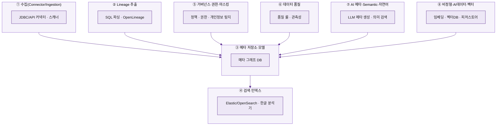

#### 6.9.1 영역별 솔루션 매핑표

| 기능 영역 | 무엇을 하는가 | OSS / 기술 | 상용 / 클라우드 |
| --- | --- | --- | --- |
| ① 수집(Connector) | 원천에서 메타 스캔 | OpenMetadata Ingestion, DataHub(acryl-datahub), Apache Atlas Hooks | Collibra Edge, Informatica Scanner, Alation OCF, Atlan / AWS Glue Crawler, MS Purview Scan, GCP Dataplex |
| ② Lineage | 데이터 흐름 추적 | OpenLineage+Marquez, SQLLineage, Spline(Spark), dbt | Manta, Collibra, Informatica, DataHub |
| ③ 메타 저장소 | 메타 그래프 저장 | DataHub(Kafka+ES+Graph), OpenMetadata(MySQL/PG+ES), JanusGraph(Atlas) | 상용 제품 내장 |
| ④ 검색·인덱스 | 키워드·한글·자연어 검색 | Elasticsearch/OpenSearch, **Nori(한글 형태소)**, 동의어 사전 | 상용 제품 내장 검색 |
| ⑤ 거버넌스·권한·마스킹 | 정책·접근통제·마스킹 | Apache Ranger, Unity Catalog | Collibra(워크플로우), Immuta, Privacera / AWS Lake Formation |
| ⑤-1 개인정보 탐지 | 민감정보 자동 식별 | Presidio(MS OSS) | BigID, Google DLP, AWS Macie, MS Purview |
| ⑥ 데이터 품질 | 룰 검증·이상 탐지 | Great Expectations, Soda, dbt tests | Monte Carlo, Anomalo (OpenMetadata 내장) |
| ⑦ AI 메타·Semantic | 설명·태그 자동생성, 의미검색 | LLM(Claude 등)+카탈로그 API, Cube/dbt Semantic Layer | Informatica CLAIRE, Atlan AI, Alation |
| ⑧ 비정형·벡터·피처 | AI 데이터 자산 관리 | pgvector, Milvus, Weaviate / Feast(피처스토어) | Pinecone, Tecton, Databricks Feature Store |
| ⑨ 스케줄·오케스트레이션 | 수집 주기 실행 | Apache Airflow, Dagster, cron | 관리형 Airflow(MWAA 등) |

#### 6.9.2 "커넥터로 연결한다"가 구체적으로 무엇인가

> 가장 자주 나오는 표현이지만 추상적이라, 실제로 무슨 일이 일어나는지 풀어 설명한다.

**커넥터 = 원천 시스템의 '메타데이터를 읽어오는 표준 어댑터'**다. 데이터 실물을 복사하는 게 아니라, "어떤 테이블·컬럼·타입이 있는지"를 **시스템 카탈로그(딕셔너리)에서 조회**한다.

| 원천 유형 | "연결"의 실제 의미 | 어디서 메타를 읽나 |
| --- | --- | --- |
| RDB (Oracle/PostgreSQL/MySQL) | JDBC/ODBC 드라이버로 접속 | `ALL_TAB_COLUMNS`(Oracle), `information_schema`(PG/MySQL) |
| DW (Snowflake/BigQuery/Redshift) | 계정·웨어하우스·권한으로 API/SQL 접속 | 각 `INFORMATION_SCHEMA`, 메타 API |
| Lake (S3/Delta/Iceberg) | 스토리지 접근키 + 테이블 포맷 메타 | Glue Catalog, Delta/Iceberg 카탈로그 |
| BI (Tableau/Power BI/Looker) | REST API 토큰으로 접속 | 워크북·리포트·데이터소스 메타 |
| ETL (Airflow/dbt/Informatica) | 메타 API/매니페스트 파싱 | dbt `manifest.json`, Airflow 메타DB |

**실제 수집 절차 (RDB 예시)**
1. 접속 정보 등록(호스트/포트/계정/권한) — *읽기 전용 계정 권장*
2. 커넥터가 시스템 카탈로그를 조회해 테이블·컬럼·타입·건수·코멘트 수집
3. 표준 메타모델로 변환해 카탈로그 저장소에 적재
4. **증분 수집**(변경분만) + **스케줄**(예: 매일 새벽)로 주기 실행

> **개념 예시 — OpenMetadata 수집 레시피(YAML)**
> ```yaml
> source:
>   type: postgres                 # 커넥터 종류
>   serviceConnection:
>     config:
>       hostPort: db.doosan.com:5432
>       username: catalog_reader    # 읽기 전용
>       database: salesdb
>   sourceConfig:
>     config:
>       schemaFilterPattern:        # 수집 대상 한정
>         includes: ["sales"]
> sink:
>   type: metadata-rest             # 카탈로그로 적재
> ```
> → 이 레시피를 **Airflow가 매일 실행**하면, `salesdb.sales` 스키마의 모든 테이블·컬럼이 자동으로 카탈로그에 올라온다. (DataHub는 동일 개념을 `recipe.yml` + `datahub ingest -c recipe.yml`로 수행)

**커넥터가 없을 때(레거시)**: 표준 커넥터 미지원 원천은 ⓐ JDBC 범용 커넥터, ⓑ 시스템 카탈로그를 직접 추출하는 커스텀 스크립트(8.6), ⓒ Excel 템플릿 일괄 업로드(8.7)로 대응한다.

#### 6.9.3 상황별 추천 솔루션 조합(스택) 예시

| 시나리오 | 추천 조합 |
| --- | --- |
| **OSS·모던 스택**(비용 절감, 엔지니어 보유) | 카탈로그=OpenMetadata 또는 DataHub / Lineage=OpenLineage+Marquez / 품질=Great Expectations / 검색 한글=Nori / 스케줄=Airflow / 메타초안=LLM / 벡터자산=pgvector |
| **엔터프라이즈 상용**(강한 거버넌스·규제) | 카탈로그·거버넌스=Collibra / Lineage=Manta / 정책·마스킹=Immuta / 품질·관측성=Monte Carlo / 개인정보=BigID |
| **AWS 네이티브** | 기술카탈로그=Glue Catalog / 비즈니스카탈로그=Amazon DataZone / 권한=Lake Formation / 개인정보=Macie / 쿼리=Athena |
| **Azure 네이티브** | MS Purview(카탈로그·스캔·개인정보) + Microsoft Fabric/Synapse 연계 |

> **선택 원칙**: ① 상용은 "한 제품으로 ①~⑦ 대부분 커버"가 강점 ② OSS는 "영역별 베스트 도구 조합"이 강점 ③ 단, 조합형은 **통합·운영 부담**이 크므로 엔지니어링 역량과 트레이드오프를 따져 결정한다.

[↑ 맨 위로](#top)

---

## 7. 계열사 적용 예시: 두산전자 데이터 카탈로그 구축 시나리오

> 본 장은 앞의 1~6장 기준을 **가상의 계열사 '두산전자'**에 적용한 예시다. 수치·구성은 설명용 가정이며 실제와 무관하다.

### 7.1 두산전자 데이터 환경 가정

- 사업: 전자 부품 제조(반도체/디스플레이 소재)
- 주요 시스템: ERP(SAP), MES(생산실행), QMS(품질), CRM, EDW(데이터웨어하우스), 데이터레이크(Hadoop/S3)
- 데이터 규모: 정형 약 12,000 테이블, 비정형(검사 이미지·설비 로그) 다수
- 과제: AI 기반 '품질 불량 예측', '설비 이상 탐지' 추진 중이나 데이터 탐색에 과다 시간 소요

### 7.2 두산전자 데이터 카탈로그 구축 목표

| 목표 | 지표(예시) |
| --- | --- |
| 핵심 데이터 탐색 셀프서비스화 | Tier 1 데이터 100% 등록 |
| AI 과제 데이터 확보 가속 | 데이터 확보 기간 2주 → 2일 |
| 개인정보·기밀 통제 | 보안 등급 100% 분류 |
| AI 데이터 재사용 | 전처리 산출물 재사용률 40% |

### 7.3 두산전자 주요 데이터 Source 식별 예시

| 시스템 | 데이터 | 유형 | 수집 방식 |
| --- | --- | --- | --- |
| SAP ERP | 자재·생산·원가 | 정형 | 자동 Crawling |
| MES | 공정 실적·설비 가동 | 정형/로그 | 자동 + 로그 수집 |
| QMS | 검사 결과·불량 | 정형 | 자동 Crawling |
| 데이터레이크 | 설비 센서 로그, 검사 이미지 | 비정형 | 자동 + 수동 |
| CRM | 고객·계약 | 정형(개인정보) | 자동 + 보안 검토 |

### 7.4 두산전자 등록 대상 데이터 선정 예시

Query/ETL/BI 로그 분석으로 Tier를 산정한 결과(예시):

| 자산 | Tier | 등록 차수 |
| --- | --- | --- |
| QMS.INSPECTION_RESULT (검사결과) | 1 | 1차 |
| MES.PROCESS_HIST (공정이력) | 1 | 1차 |
| lake/sensor/equip_log (설비로그) | 2 | 2차 |
| lake/image/defect (불량이미지) | 2 | 2차 |
| CRM.CUST_BASE (고객) | 1 | 1차 |

### 7.5 두산전자 등록 제외 데이터 판단 예시

| 데이터 | 제외 사유 |
| --- | --- |
| MES.PROCESS_HIST_BAK | 백업 사본 |
| 개인 분석용 임시 테이블 TMP_* | 임시/개인 |
| 사용 중단 레거시 LEGACY_QC | 폐기 예정 |

### 7.6 두산전자 메타데이터 항목 작성 예시

> 자산: **QMS.INSPECTION_RESULT (검사결과)**
> ```
> Business    : 검사결과 / "공정별 제품 검사 측정·판정 결과" / 도메인=품질 / 태그=#검사 #불량 #AI학습
> Technical   : QMS·ORACLE·QC.INSPECTION_RESULT / 35컬럼 / PK=INSP_ID / 8,500만건
> Compliance  : 내부 / 개인정보=N / 규제=산업기밀(공정 노하우)
> Operational : 소유자=품질보증팀 이영희 / 시간배치 / 최종갱신=2026-06-18 09:00 / 품질=95
> AI          : 전처리=완료 / 피처=측정편차,불량유형 / 학습이력=품질불량예측v1 / 재사용=가능
> ```

### 7.7 두산전자 데이터 중요도 분류 예시

| 자산 | Query/일 | BI 참조 | API | Tier |
| --- | --- | --- | --- | --- |
| INSPECTION_RESULT | 3,200 | 8 | 2 | 1 |
| PROCESS_HIST | 2,800 | 6 | 3 | 1 |
| equip_log | 900 | 1 | 0 | 2 |
| TMP_QC_01 | 0 | 0 | 0 | Unknown→제외 |

### 7.8 두산전자 보안 검토 예시

| 자산 | 등급 | 개인정보 | 조치 |
| --- | --- | --- | --- |
| CUST_BASE | 기밀 | Y(성명,연락처) | 접근 승인제, 샘플 비공개 |
| INSPECTION_RESULT | 내부(산업기밀) | N | 컬럼명 노출, 측정원값 마스킹 |
| equip_log | 내부 | N | 부서 단위 접근 허용 |

### 7.9 두산전자 솔루션 선정 검토 예시

**요건(기능 영역별)**

| 영역 | 두산전자 요건 |
| --- | --- |
| 수집 | Oracle(ERP/QMS)·Hive/S3(레이크)·Tableau(BI) 자동 수집 |
| Lineage | MES→QMS→BI 컬럼 레벨 추적 |
| 검색 | 한글 검색(공정·불량 용어) |
| 거버넌스 | CRM 개인정보·공정 산업기밀 등급/마스킹 |
| 품질 | 검사 데이터 정합성 점검 |
| 배포 | On-prem(생산망) + Cloud(분석) Hybrid |

**검토 후보 (기능 영역별 매핑, 중복 허용)**

| 영역 | 후보 A (상용 중심) | 후보 B (OSS 조합) |
| --- | --- | --- |
| 카탈로그·검색 | Collibra | OpenMetadata + Nori(한글) |
| 수집 커넥터 | Collibra Edge / Informatica Scanner | OpenMetadata Ingestion + Airflow |
| Lineage | Manta | OpenLineage + Marquez |
| 거버넌스·마스킹 | Collibra + Immuta | Apache Ranger + Presidio(개인정보) |
| 품질 | Monte Carlo | Great Expectations |
| AI 메타 초안 | Informatica CLAIRE | LLM(Claude) + 카탈로그 API |

**PoC 결과(예시) 및 결정**
- 자동수집·거버넌스·지원은 **A 우위**, 비용·커스터마이징은 **B 우위**
- 한글 검색은 B(Nori 튜닝)가 정밀, Lineage 컬럼 추적은 A(Manta)가 정확
- **결정(예시)**: 전사 거버넌스·규제 대응 비중이 커 **A(Collibra 중심)를 본도입**, 단 **품질은 Great Expectations, 한글 검색 보강은 Nori**를 병행하는 하이브리드 구성

> 핵심: "한 제품으로 다 살지(A) vs 영역별 베스트 조합(B)"의 트레이드오프를 **운영 역량 기준**으로 판단(6.9.3 원칙 적용).

### 7.10 두산전자 To-Be 아키텍처 예시

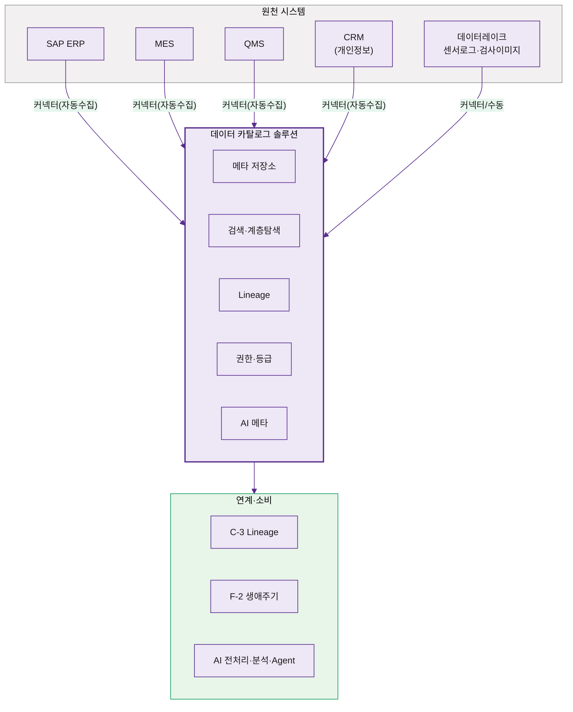

### 7.11 두산전자 구축 단계 예시

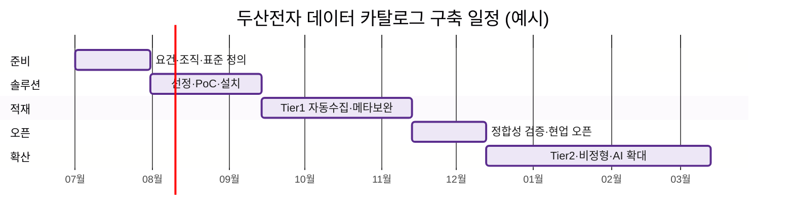

| 단계 | 기간(예시) | 주요 활동 |
| --- | --- | --- |
| 1. 준비 | 1개월 | 요건·조직·표준 정의 |
| 2. 솔루션 | 1.5개월 | 선정·PoC·설치 |
| 3. 1차 적재 | 2개월 | Tier 1 자동수집 + 메타 보완 |
| 4. 검증/오픈 | 1개월 | 정합성 검증, 현업 오픈 |
| 5. 확산 | 지속 | Tier 2·비정형·AI 데이터 확대 |

### 7.12 두산전자 운영 시나리오 예시

> AI 엔지니어가 '설비 이상 탐지' 과제 착수 → 카탈로그에서 "설비 로그" 검색 → equip_log(Tier2, 내부) 발견 → 소유자(설비관리팀)에게 원클릭 권한 신청 → 승인 후 전처리 산출물 등록 → 다음 과제가 재사용.

### 7.13 두산전자 기대 효과 예시

| 효과 | As-Is | To-Be(목표) |
| --- | --- | --- |
| 데이터 확보 기간 | 2주 | 2일 |
| 보안 등급 분류율 | 30% | 100% |
| 전처리 재사용률 | 0% | 40% |
| 핵심 데이터 등록률 | - | Tier1 100% |

[↑ 맨 위로](#top)

---

## 8. 데이터 카탈로그 구축

**구축 단계 흐름**


### 8.1 취합 데이터 검토

자동 수집·수동 등록으로 모인 메타데이터의 **완전성·정확성**을 검토한다.

- 필수 항목 충족 여부(자산명/Description/소유자/등급/위치/Type)
- 자동 수집값과 실제 시스템의 일치 여부 표본 검증
- 중복·백업 자산 식별 및 제외

> **검토 체크리스트 예시**: ☐ 필수항목 누락 자산 목록 ☐ 소유자 미지정 자산 ☐ Description 공란 ☐ 중복 자산.

### 8.2 데이터 정합성 검토 및 보완 요청

- 누락·오류 항목을 **소유자/담당자에게 보완 요청**(워크플로우 발송)
- 보완 기한·담당 지정, 미보완 시 'Draft' 유지로 검색 제한
- 비즈니스 정의·AI 메타데이터는 현업·AI 조직이 직접 작성

### 8.3 To-Be 아키텍처 설계

- 원천 → 카탈로그 → 연계(C-3/F-2/AI) 전체 데이터 흐름 설계
- 수집 방식(자동/수동), 주기(배치/이벤트), 보안 구간(망분리) 반영
- (7.10 두산전자 아키텍처 예시 참조)

### 8.4 솔루션 기반 목표 아키텍처 반영

- 선정 솔루션의 커넥터·저장소·검색 엔진을 To-Be 아키텍처에 매핑
- 솔루션 표준 메타모델과 사내 5대 카테고리 매핑표 작성
- 확장성·가용성(이중화) 구성 반영

### 8.5 Legacy DB 연동 방안 검토

| 상황 | 연동 방안 |
| --- | --- |
| 표준 커넥터 지원 | 솔루션 커넥터 직접 연결 |
| 커넥터 미지원 구형 DB | JDBC/사용자 정의 커넥터, 중간 추출 |
| 망분리 환경 | 분리망 내 수집기 설치 후 메타만 반출 |

### 8.6 미연동 데이터 Pipeline 개발

- 표준 수집이 불가한 원천을 위한 **커스텀 수집 파이프라인** 개발
- 예: 레거시 DB 메타 추출 → 표준 포맷 변환 → 카탈로그 API 적재
- 증분 수집·오류 재처리·로깅 포함

### 8.7 수동 업로드 Pipeline 개발

- 비정형·오프라인 데이터의 **템플릿(Excel/CSV) 일괄 업로드** 기능
- 업로드 시 필수 항목 검증·오류 리포트 제공
- 예: 검사 이미지 폴더의 메타데이터를 템플릿으로 일괄 등록

### 8.8 카탈로그 기능 정의 및 개발 착수

- 표준 기능(검색/탐색/권한) 외 **사내 특화 기능** 정의(예: 그룹 도메인 분류, 사내 용어집 연계)
- 사용자/관리자 화면 요건 정의, 개발 착수

### 8.9 솔루션 설정 및 초기 환경 구성

- 도메인·등급·권한 체계, 사용자/조직 연동(SSO/LDAP)
- 메타모델 커스텀 항목 설정, 검색 동의어 사전 등록

### 8.10 솔루션-계열사 시스템 연동 테스트

| 테스트 | 확인 사항 |
| --- | --- |
| 연결 | 각 원천 인증·접속 |
| 수집 | 메타데이터 정상 수집·매핑 |
| 증분 | 변경분만 정확히 반영 |
| 권한 | SSO·등급별 접근 통제 |
| Lineage | 계통 자동 추출 정확도 |

### 8.11 데이터 카탈로그 초기 적재 및 검증

- Tier 1 우선 대량 적재 → 표본 검증(메타 정확도) → 현업 베타 검토
- 검증 통과 후 정식 오픈, 미충족 자산은 보완 후 단계 공개

[↑ 맨 위로](#top)

---

## 9. 데이터 카탈로그 운영

### 9.1 변경 요구사항 요청

운영 중 메타데이터 변경은 **요청 → 검토 → 승인 → 반영** 워크플로우로 관리한다.

| 유형 | 설명 | 예시 |
| --- | --- | --- |
| **신규 등록** | 새 자산 등록 요청 | 신규 테이블 추가 |
| **수정** | 메타데이터 변경 | 소유자 변경, 설명 보완 |
| **삭제** | 자산 등록 해제 | 폐기 데이터 제거 |

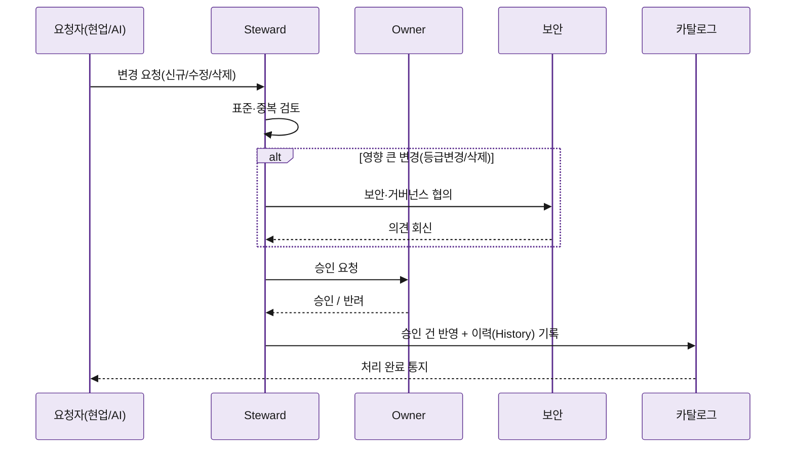

### 9.2 변경 검토 및 승인

- 요청을 Steward/Owner가 검토 → 표준·보안 부합 확인 → 승인/반려
- 등급 변경·삭제 등 영향 큰 변경은 보안·거버넌스 협의

### 9.3 변경 요청 반영

- 승인 건을 카탈로그에 반영, 변경 이력(History) 기록(누가/언제/무엇을)
- 자동 수집 항목은 다음 수집 주기에 자동 갱신

### 9.4 데이터 및 메타데이터 생성·등록

- 신규 데이터 발생 시 자동 수집 또는 수동 등록으로 카탈로그 반영
- 비즈니스/AI 메타데이터는 담당자가 작성·보완

### 9.5 카탈로그 검색 및 조회

- 사용자는 글로벌/계층 탐색으로 데이터 검색
- 자산 상세(메타·계통·소유자·권한) 확인, 원클릭 문의·권한 신청

### 9.6 전처리·분석·대화식 질의 서비스 연계

- 검색 결과를 전처리/분석 도구로 전달(연계 API)
- 대화식 질의(자연어로 "지난달 불량 데이터 보여줘") 서비스 연계(고도화)

### 9.7 카탈로그 Pipeline 운영

| 방식 | 설명 | 예시 |
| --- | --- | --- |
| **자동화 Pipeline** | 커넥터 기반 정기 수집 | 매일 02:00 DB 메타 수집 |
| **수동 등록** | 담당자 직접 등록 | 비정형 신규 등록 |
| **Scheduled Collection** | 일/주/월 스케줄 수집 | 주간 BI Lineage 갱신 |
| **Event-based Collection** | 변경 이벤트 발생 시 수집 | 신규 테이블 생성 감지 시 |

### 9.8 접근 권한 및 보안 관리

- 등급별 노출·마스킹, 권한 신청·승인, 접근 로그 기록
- 개인정보/기밀 자산 접근 정기 점검(감사 추적)

### 9.9 운영 역할별 기능

| 역할 | 기능 |
| --- | --- |
| **사용자 Front-end** | 검색·조회·즐겨찾기·문의·권한신청·피드백 |
| **데이터 담당자 Back-end** | 메타 작성·보완·변경 요청·품질 관리 |
| **Admin** | 사용자/권한 관리, 수집 설정, 솔루션 운영, 통계 |

### 9.10 솔루션 운영 관리

- 수집 작업 모니터링(성공/실패/지연), 장애 대응
- 사용량·성능 모니터링, 용량 증설, 버전 업그레이드
- 정기 백업·가용성 점검

[↑ 맨 위로](#top)

---

## 10. AI-ready 데이터 체계 내 연계 범위

**A-1 / C-3 / F-2 책임 경계 한눈에 보기**

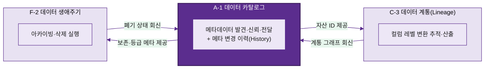

### 10.1 A-1 데이터 카탈로그의 과제 범위

- A-1은 **메타데이터의 발견·신뢰·전달**을 책임진다(데이터 실물 가공 제외).
- 경계: 데이터 '설명·소재·소유·등급·계통 표시'까지가 A-1, 그 이상의 추적·생애주기·가공은 연계 과제.

### 10.2 C-3 데이터 계통(Lineage)와의 연계

| 구분 | A-1 카탈로그 | C-3 Lineage |
| --- | --- | --- |
| 역할 | 자산 식별·계통 '표시' | 계통 상세 '추적·산출' |
| 데이터 | 자산-자산 연결 개요 | 컬럼 레벨 변환 추적 |
| 연계 | C-3 결과를 카탈로그에 시각화 | 카탈로그 자산 ID를 기준으로 추적 |

> 예: 카탈로그에서 `INSPECTION_RESULT`의 상류/하류를 보면, C-3가 추출한 ETL 변환 경로가 그래프로 표시된다.

### 10.3 F-2 데이터 생애주기 관리와의 연계

| 구분 | A-1 카탈로그 | F-2 생애주기 |
| --- | --- | --- |
| 역할 | 보존기간·상태 '명시' | 아카이빙·삭제 '실행' |
| 연계 | 등록·등급·보존 메타 제공 | 메타 기준으로 폐기 정책 적용 |

> 예: 카탈로그의 보존기간(거래종료 후 5년)을 F-2가 읽어 만료 자산을 아카이빙/삭제하고, 결과 상태를 카탈로그에 회신.

### 10.4 카탈로그 History 및 Life Cycle 관리 범위 구분

| 관리 대상 | 책임 | 비고 |
| --- | --- | --- |
| **메타데이터 변경 이력(History)** | A-1 | 등록/수정/삭제 이력 |
| **데이터 실물 생애주기(Life Cycle)** | F-2 | 생성→보존→폐기 |
| 구분 원칙 | "메타의 변천=A-1, 데이터의 일생=F-2" |

### 10.5 솔루션 기능과 AI-ready 데이터 체계 간 연계 범위

- 솔루션이 Lineage·생애주기 기능을 일부 내장해도, **표준 책임 경계는 과제(A-1/C-3/F-2) 기준**으로 운영
- 중복 기능은 "주관 과제가 운영, 타 과제는 연계·표시"로 정리하여 책임 혼선 방지

### 10.6 데이터 카탈로그와 인접 데이터 관리 영역의 관계 (개요)

데이터 카탈로그는 독립된 섬이 아니라 **데이터 관리(Data Management) 생태계의 한 구성요소**다. "메타데이터 관리·비즈니스 용어집·데이터 사전·거버넌스·MDM·품질"과 역할이 겹치거나 맞물리므로, **무엇이 같고 다른지, 어디서 연결되는지**를 명확히 해야 중복 투자·책임 혼선을 막는다.

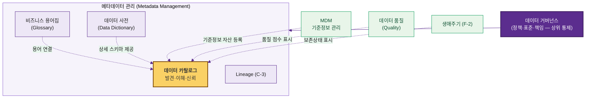

> 핵심 한 줄: **거버넌스(정책)** 아래 **메타데이터 관리**가 있고, 데이터 카탈로그는 그 중 "사용자가 데이터를 **찾고 이해하는 접점**"이다. 용어집·사전·품질·MDM·Lineage는 카탈로그에 **연결되어 풍부함을 더한다.**

### 10.7 메타데이터 관리 전체 체계 속 카탈로그의 위치

메타데이터는 종류가 여러 가지이며, 카탈로그는 이를 **모아서 보여주는 활용 계층**이다.

| 메타데이터 종류 | 내용 | 예시 | 카탈로그와의 관계 |
| --- | --- | --- | --- |
| Technical | 물리 구조 | 테이블/컬럼/타입/PK | 자동 수집·표시 |
| Business | 의미·맥락 | 정의/용어/도메인 | 용어집과 연결·표시 |
| Operational | 운영 상태 | 갱신주기/적재/품질 | 수집·표시 |
| Social/Collaborative | 사용·평판 | 인기도/즐겨찾기/리뷰 | 카탈로그가 생성·축적 |
| Active(액티브) | 실시간 활용 신호 | 쿼리 빈도, 자동 추천 | 고도화 단계 활용 |

> 즉 "**카탈로그 ≠ 메타데이터 전부**"다. 카탈로그는 여러 메타데이터를 **통합·노출**하는 창(窓)이고, 메타데이터 관리는 그 뒤의 더 넓은 규율이다.

### 10.8 비즈니스 용어집·데이터 사전과의 관계

세 개념은 자주 혼동되지만 **목적과 독자**가 다르다.

| 구분 | 비즈니스 용어집 (Glossary) | 데이터 사전 (Data Dictionary) | 데이터 카탈로그 (Catalog) |
| --- | --- | --- | --- |
| 무엇 | 비즈니스 **용어의 표준 정의** | 데이터의 **기술적 상세 명세** | 데이터 **자산의 발견·이해** |
| 독자 | 현업·경영 | 개발자·DBA | 전 사용자 |
| 예시 | "활성고객 = 최근 90일 거래" | `CUST_ID CHAR(10) PK NOT NULL` | "고객기본정보 어디 있고 누가 관리?" |
| 범위 | 개념·의미 | 단일 시스템 스키마 | 전사 자산 + 위 둘을 연결 |

**관계**: 카탈로그는 **용어집과 사전을 끌어안는 상위 접점**이다.
- 용어집의 "활성고객" 정의를 카탈로그 자산 `CUST_BASE`에 **연결(link)** → 사용자가 자산을 보며 비즈니스 의미를 바로 이해
- 사전의 컬럼 명세를 카탈로그가 **자동 수집**해 Technical 메타로 표시

> 예시: 카탈로그에서 `매출액` 컬럼을 클릭 → 연결된 용어집 정의("부가세 제외 순매출")가 함께 표시되어, 부서마다 다른 '매출' 해석 혼선을 제거.

### 10.9 거버넌스·MDM·품질과의 관계 (역할 분담)

| 인접 영역 | 무엇 | 카탈로그와의 경계/연결 |
| --- | --- | --- |
| **데이터 거버넌스** | 정책·표준·책임 체계(상위) | 카탈로그는 거버넌스를 **실행·가시화하는 도구**(정책은 거버넌스가 정의) |
| **MDM(기준정보 관리)** | 고객·제품 등 **단일 정본(Golden Record)** 생성·관리 | MDM은 '정답 데이터'를 만들고, 카탈로그는 그 기준정보 자산을 **등록·안내**(MDM ≠ 카탈로그) |
| **참조/코드 관리** | 코드값 표준(국가/상태코드 등) | 코드 자산을 카탈로그에 등록, 컬럼에 코드 의미 연결 |
| **데이터 품질** | 정합성·완전성 룰 측정 | 품질 솔루션이 측정 → 카탈로그가 **점수·이슈를 표시**(측정 엔진은 별도) |
| **시맨틱 레이어/온톨로지** | 의미·관계 모델 | 자연어·의미 검색 고도화 시 연계(12.4) |
| **데이터 프로덕트/마켓플레이스** | 데이터를 '상품'으로 제공 | 카탈로그가 **데이터 프로덕트의 진열대(Shelf)** 역할로 확장 가능 |

**중복 방지 원칙**
1. **정의는 한 곳에서(SSOT)**: 용어 정의=용어집, 정본 데이터=MDM, 품질 측정=품질솔루션. 카탈로그는 이를 **연결·표시**할 뿐 중복 생성하지 않는다.
2. **카탈로그는 허브**: 흩어진 메타를 모아 사용자에게 **단일 진입점**으로 제공.
3. **책임 경계 문서화**: 영역별 주관 조직/도구를 RACI로 명확화(4장 연계).

> 한 문장 요약: **거버넌스가 규칙을 정하고, 용어집·사전·MDM·품질이 각자의 정본을 만들며, 데이터 카탈로그는 이 모두를 "한 화면에서 찾고 이해하게" 연결하는 통합 접점이다.**

### 10.10 데이터 메시(Data Mesh)·데이터 프로덕트와의 관계

**데이터 메시**는 중앙 집중형 데이터팀의 병목을 풀기 위해 **데이터를 도메인(현업) 중심으로 분산 소유·운영**하자는 조직·운영 모델이다. 4가지 원칙으로 구성된다.

| 데이터 메시 원칙 | 의미 | 카탈로그의 역할 |
| --- | --- | --- |
| ① 도메인 오너십 | 데이터를 만든 도메인이 직접 소유·관리 | 도메인별 소유자·책임을 카탈로그에 명시 |
| ② 데이터 as a Product | 데이터를 '상품'처럼 품질·문서 갖춰 제공 | 데이터 프로덕트의 **진열대(마켓플레이스)** |
| ③ 셀프서비스 플랫폼 | 누구나 스스로 데이터 발견·사용 | 카탈로그가 **셀프서비스 발견의 핵심 인프라** |
| ④ 연합 거버넌스 | 중앙 표준 + 도메인 자율의 균형 | 표준 메타·정책을 카탈로그에서 강제·점검 |

**데이터 프로덕트의 요건(DATSIS)과 카탈로그**
데이터 프로덕트는 "발견 가능·주소 지정 가능·신뢰 가능·자기 기술적·상호 운용·보안"을 갖춰야 하며, **그중 절반 이상을 카탈로그가 충족**한다.

| 요건 | 설명 | 카탈로그 충족 |
| --- | --- | --- |
| Discoverable(발견 가능) | 검색으로 찾힘 | ✅ 통합 검색 |
| Addressable(주소 지정) | 고유 위치/주소 | ✅ 위치 메타 |
| Trustworthy(신뢰) | 품질·SLA 보증 | ✅ 품질·최신성 표시 |
| Self-describing(자기 기술) | 스키마·의미 포함 | ✅ 메타·용어 연결 |
| Interoperable(상호 운용) | 표준 형식·식별자 | 🔶 표준 메타로 지원 |
| Secure(보안) | 등급·접근통제 | ✅ 권한·등급 |

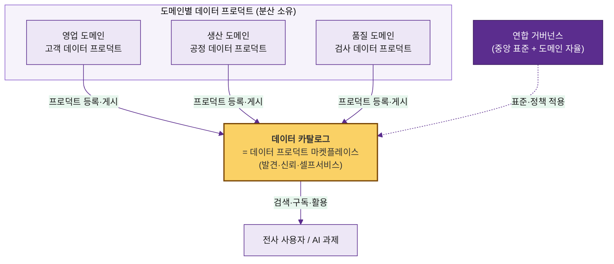

> **관계 요약**: 데이터 메시를 채택하면 카탈로그의 위상이 "**메타데이터 조회 도구 → 데이터 프로덕트 마켓플레이스**"로 격상된다. 단, 메시는 조직·운영 모델이므로 **도메인 오너십 정착 없이 카탈로그만 도입하면 효과가 제한**된다.

### 10.11 데이터 옵저버빌리티(Data Observability)와의 관계

**데이터 옵저버빌리티**는 데이터·파이프라인의 **건강 상태를 지속 모니터링하고 이상을 자동 탐지**하는 영역이다. 데이터 품질이 "정해둔 규칙을 통과하는가(사전 정의)"라면, 옵저버빌리티는 "평소와 다른 이상이 생겼는가(자동 관측)"에 가깝다.

**옵저버빌리티 5대 축(Pillars)**

| 축 | 무엇을 보는가 | 이상 예시 |
| --- | --- | --- |
| Freshness(최신성) | 데이터가 제때 갱신됐나 | 일배치가 6시간 지연 |
| Volume(양) | 건수가 정상 범위인가 | 평소 100만건 → 갑자기 2만건 |
| Schema(스키마) | 구조가 바뀌었나 | 컬럼 삭제/타입 변경 |
| Distribution(분포) | 값 분포가 정상인가 | NULL 비율 급증, 이상치 |
| Lineage(계통) | 영향 범위 파악 | 깨진 테이블의 하류 영향 |

**품질 vs 옵저버빌리티 (혼동 방지)**

| 구분 | 데이터 품질 | 데이터 옵저버빌리티 |
| --- | --- | --- |
| 접근 | 규칙 기반 검증(사전 정의) | 자동 모니터링·이상 탐지 |
| 질문 | "이 규칙을 만족하나?" | "평소와 다른가?" |
| 대표 도구 | Great Expectations, Soda, dbt tests | Monte Carlo, Anomalo, Soda |

**카탈로그와의 관계**
옵저버빌리티는 **신뢰성 신호의 공급원**이고, 카탈로그는 그 신호를 **사용자 접점에 표시**한다.

- 옵저버빌리티가 탐지한 **최신성 지연·이상**을 카탈로그 자산에 배지로 노출 → 사용자가 "지금 이 데이터 믿어도 되나"를 즉시 판단
- 카탈로그의 **Lineage(C-3)**를 활용해 이상의 **하류 영향 범위**를 표시
- 결과적으로 카탈로그의 "데이터 최신성·신뢰도 확인"(2.4 ⑤) 기능을 **실시간으로 강화**


> **관계 요약**: 옵저버빌리티는 "**데이터가 건강한가**"를 측정하고, 카탈로그는 그 결과를 "**사용자가 보는 신뢰 표시**"로 전달한다. 둘은 경쟁이 아니라 **공급원 ↔ 표현 계층**의 보완 관계다.

[↑ 맨 위로](#top)

---

## 11. KPI 및 성과 관리

성과는 **활용도 · 효율 · 품질 · 안정성** 관점으로 측정한다.

### 11.1 카탈로그 활용도 지표
- 월간 활성 사용자(MAU), 검색 수, 자산 조회 수
- 예시 목표: MAU 부서 담당자의 70% 이상

### 11.2 신규 AI 과제 활용 수
- 카탈로그를 통해 데이터를 확보한 AI/분석 과제 건수
- 예시 목표: 분기 10건 이상

### 11.3 카탈로그 Feedback 개선 요청 비중
- 사용자 피드백·개선 요청 처리율, 메타 보완 요청 반영률
- 예시 목표: 피드백 처리율 90% 이상

### 11.4 데이터 탐색 Lead-time 개선 효과
- 데이터 확보 평균 소요 시간(As-Is 대비)
- 예시 목표: 2주 → 1일

### 11.5 AI 데이터 재사용 및 전처리 비용 절감 효과
- 전처리 산출물 재사용률, 중복 전처리 절감 공수
- 예시 목표: 재사용률 40%

### 11.6 데이터 최신성·신뢰도 개선 효과
- 갱신 주기 준수율, 필수 메타데이터 충족률, 품질 점수 평균
- 예시 목표: 필수 메타 충족률 95%

### 11.7 솔루션 운영 안정성 지표
- 수집 성공률, 시스템 가용성, 장애 건수/복구 시간
- 예시 목표: 수집 성공률 99%, 가용성 99.5%

> **KPI 대시보드 예시**
> | 지표 | As-Is | 목표 | 현재 |
> | --- | --- | --- | --- |
> | 탐색 Lead-time | 2주 | 1일 | 3일 |
> | 필수 메타 충족률 | 40% | 95% | 88% |
> | 전처리 재사용률 | 0% | 40% | 25% |
> | 수집 성공률 | - | 99% | 99.2% |

[↑ 맨 위로](#top)

---

## 12. 고도화 Roadmap

카탈로그를 **수동 관리 → AI 보조 → AI 자율**로 단계적으로 고도화한다.


### 12.1 AI 기반 메타데이터 초안 생성
- LLM이 테이블/컬럼명·샘플·계통을 분석해 **메타데이터 초안 자동 생성**
- 담당자는 검수만 → 작성 공수 대폭 절감

### 12.2 Description·태그·품질 초안 자동 생성
- 자산 Description, 추천 태그, 품질 이슈 후보를 자동 제안
- 예: "이 컬럼은 결측 12% — 품질 점검 권장" 자동 코멘트

### 12.3 현업 검수 및 승인 프로세스
- AI 초안 → 현업 검수 → 승인의 Human-in-the-loop
- 검수 결과를 학습에 반영해 정확도 향상

### 12.4 Semantic Layer 기반 자연어 탐색
- 비즈니스 용어·온톨로지 기반 의미 검색
- 예: "작년 4분기 불량률 높은 라인" → 관련 자산 자동 매핑

### 12.5 AI Agent 기반 서비스 연계

| Agent | 역할 | 예시 |
| --- | --- | --- |
| **대화식 쿼리 Agent** | 자연어→쿼리 변환·조회 | "지난달 불량 데이터 보여줘" |
| **데이터 전처리 Agent** | 카탈로그 기반 자동 전처리 | 결측/이상치 처리 자동 제안·수행 |
| **데이터 분석 Agent** | 탐색→분석→인사이트 | "불량 주요 원인 분석" 자동 리포트 |

### 12.6 솔루션 고도화 및 확산 Roadmap

| 단계 | 시기(예시) | 내용 |
| --- | --- | --- |
| 1단계 | ~6개월 | 기본 카탈로그 안정화, Tier1 등록 완료 |
| 2단계 | ~12개월 | AI 메타 초안 생성, 비정형 확대 |
| 3단계 | ~18개월 | Semantic 탐색, 자연어 질의 |
| 4단계 | ~24개월 | AI Agent 연계, 그룹 계열사 확산 |

---

> **문서 끝.** 본 매뉴얼은 계열사별 환경에 맞춰 수치·조직·솔루션을 조정해 적용한다.


[↑ 맨 위로](#top)
